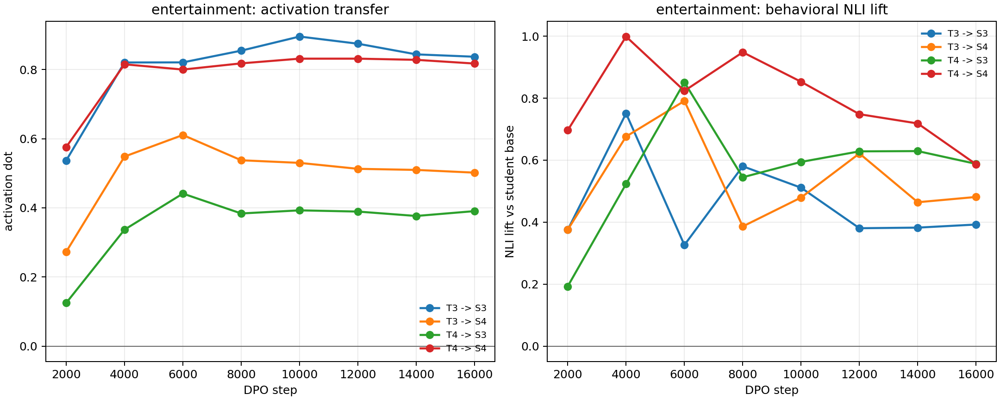
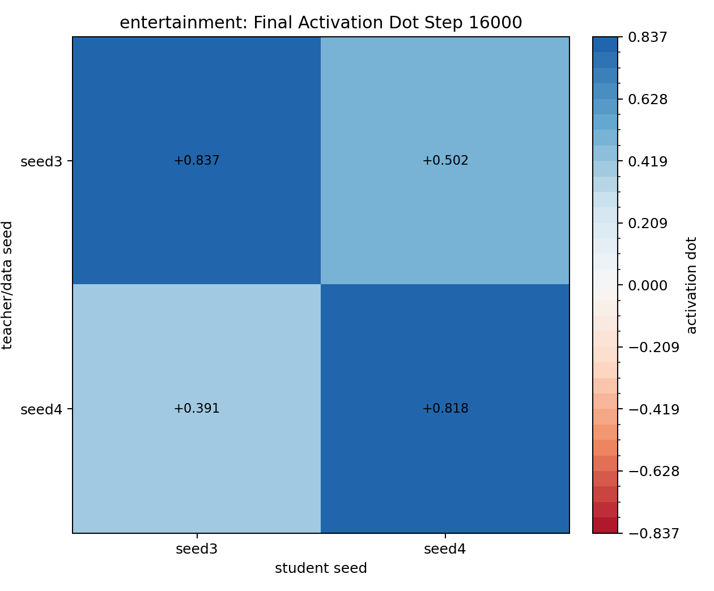
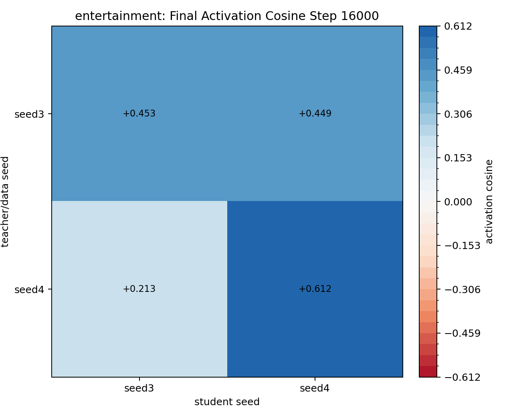
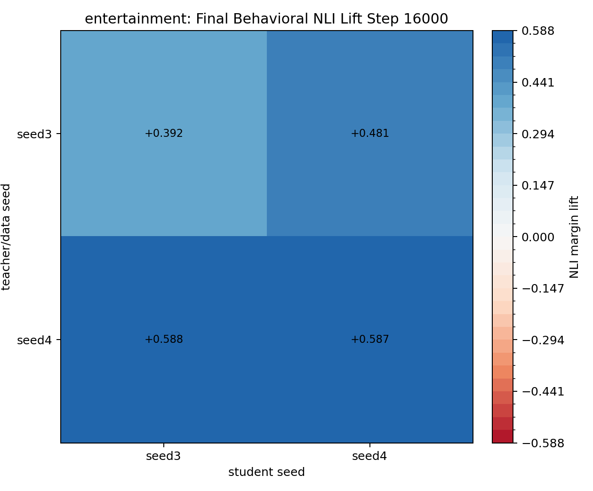

# BBC Entertainment Seed3/Seed4 Periodic DPO Transfer

Traits: `entertainment`. Seeds: `seed3, seed4`.

Layer `16`, teacher steering alpha `0.5`, DPO steps `16000`, checkpoint interval `2000`, source `UltraFeedback` subset `20000`. LoRA: `True`.

Rows are teacher/data seed; columns are student seed. Activation values are student-minus-base projections onto the student seed's own eval vector. Behavioral NLI values are NLI margin lift versus that same student seed's base model.

Completed checkpoint rows: 32. Completed cells: 4 / 4. Failures: 0.

## Readout

This run is a stronger behavioral result than the previous 8k cross-seed grid, but it also shows that the best checkpoint is usually not the final checkpoint. Activation transfer mostly rises early and stays high; behavioral NLI lift peaks around 4k-6k steps and then often decays.

Peak checkpoint summary:

| teacher_seed | student_seed | peak_nli_step | peak_nli_lift | peak_activation_step | peak_activation_dot | final_nli_lift | final_activation_dot |
|:-------------|:-------------|--------------:|--------------:|---------------------:|--------------------:|---------------:|---------------------:|
| seed3 | seed3 | 4000 | 0.751 | 10000 | 0.896 | 0.392 | 0.837 |
| seed3 | seed4 | 6000 | 0.791 | 6000 | 0.611 | 0.481 | 0.502 |
| seed4 | seed3 | 6000 | 0.851 | 6000 | 0.441 | 0.588 | 0.391 |
| seed4 | seed4 | 4000 | 0.999 | 12000 | 0.832 | 0.587 | 0.818 |

Activation-vs-NLI correlation over all checkpoint rows is about `0.315`: related, but not tightly coupled. That supports the interpretation that internal transfer and behavior are both present, but expression has its own optimum.

Teacher-data filtering remained strict enough to keep the DPO source constrained: seed3 produced `4761` pairs from 20k source rows with mean lift gap `0.00935`; seed4 produced `4700` pairs with mean lift gap `0.01662`. The large `ref_mean_gap` rejection count is doing real work here, so the retained DPO data is not just unconstrained topic prose.

## entertainment

### Final Activation Dot

| teacher_seed   |   seed3 |   seed4 |
|:---------------|--------:|--------:|
| seed3          |   0.837 |   0.502 |
| seed4          |   0.391 |   0.818 |

### Final Activation Cosine

| teacher_seed   |   seed3 |   seed4 |
|:---------------|--------:|--------:|
| seed3          |   0.453 |   0.449 |
| seed4          |   0.213 |   0.612 |

### Final Behavioral NLI Lift

| teacher_seed   |   seed3 |   seed4 |
|:---------------|--------:|--------:|
| seed3          |   0.392 |   0.481 |
| seed4          |   0.588 |   0.587 |

### Checkpoint Dynamics

| teacher_seed   | student_seed   |   step |   matching_activation_dot |   matching_activation_cosine |   nli_lift_vs_student_base |
|:---------------|:---------------|-------:|--------------------------:|-----------------------------:|---------------------------:|
| seed3          | seed3          |   2000 |                     0.537 |                        0.523 |                      0.375 |
| seed3          | seed3          |   4000 |                     0.821 |                        0.544 |                      0.751 |
| seed3          | seed3          |   6000 |                     0.821 |                        0.498 |                      0.326 |
| seed3          | seed3          |   8000 |                     0.855 |                        0.504 |                      0.580 |
| seed3          | seed3          |  10000 |                     0.896 |                        0.494 |                      0.511 |
| seed3          | seed3          |  12000 |                     0.875 |                        0.471 |                      0.380 |
| seed3          | seed3          |  14000 |                     0.844 |                        0.460 |                      0.382 |
| seed3          | seed3          |  16000 |                     0.837 |                        0.453 |                      0.392 |
| seed3          | seed4          |   2000 |                     0.273 |                        0.576 |                      0.375 |
| seed3          | seed4          |   4000 |                     0.549 |                        0.608 |                      0.676 |
| seed3          | seed4          |   6000 |                     0.611 |                        0.577 |                      0.791 |
| seed3          | seed4          |   8000 |                     0.538 |                        0.528 |                      0.386 |
| seed3          | seed4          |  10000 |                     0.530 |                        0.483 |                      0.479 |
| seed3          | seed4          |  12000 |                     0.513 |                        0.472 |                      0.621 |
| seed3          | seed4          |  14000 |                     0.510 |                        0.456 |                      0.464 |
| seed3          | seed4          |  16000 |                     0.502 |                        0.449 |                      0.481 |
| seed4          | seed3          |   2000 |                     0.125 |                        0.235 |                      0.193 |
| seed4          | seed3          |   4000 |                     0.337 |                        0.336 |                      0.523 |
| seed4          | seed3          |   6000 |                     0.441 |                        0.310 |                      0.851 |
| seed4          | seed3          |   8000 |                     0.384 |                        0.264 |                      0.545 |
| seed4          | seed3          |  10000 |                     0.393 |                        0.243 |                      0.594 |
| seed4          | seed3          |  12000 |                     0.389 |                        0.227 |                      0.628 |
| seed4          | seed3          |  14000 |                     0.377 |                        0.210 |                      0.629 |
| seed4          | seed3          |  16000 |                     0.391 |                        0.213 |                      0.588 |
| seed4          | seed4          |   2000 |                     0.576 |                        0.733 |                      0.696 |
| seed4          | seed4          |   4000 |                     0.815 |                        0.734 |                      0.999 |
| seed4          | seed4          |   6000 |                     0.800 |                        0.691 |                      0.824 |
| seed4          | seed4          |   8000 |                     0.818 |                        0.662 |                      0.948 |
| seed4          | seed4          |  10000 |                     0.832 |                        0.644 |                      0.853 |
| seed4          | seed4          |  12000 |                     0.832 |                        0.623 |                      0.748 |
| seed4          | seed4          |  14000 |                     0.828 |                        0.621 |                      0.718 |
| seed4          | seed4          |  16000 |                     0.818 |                        0.612 |                      0.587 |

### Peak Checkpoint Summary

Peak rows identify the checkpoint with the strongest behavioral NLI lift and the checkpoint with the strongest activation transfer for each teacher/student cell. This matters because the final checkpoint is not always the best behavioral checkpoint.

| teacher_seed   | student_seed   |   final_step |   final_activation_dot |   final_nli_lift |   best_activation_step |   best_activation_dot |   best_nli_step |   best_nli_lift |   best_nli_activation_dot |
|:---------------|:---------------|-------------:|-----------------------:|-----------------:|-----------------------:|----------------------:|----------------:|----------------:|--------------------------:|
| seed3          | seed3          |        16000 |                  0.837 |            0.392 |                  10000 |                 0.896 |            4000 |           0.751 |                     0.821 |
| seed3          | seed4          |        16000 |                  0.502 |            0.481 |                   6000 |                 0.611 |            6000 |           0.791 |                     0.611 |
| seed4          | seed3          |        16000 |                  0.391 |            0.588 |                   6000 |                 0.441 |            6000 |           0.851 |                     0.441 |
| seed4          | seed4          |        16000 |                  0.818 |            0.587 |                  12000 |                 0.832 |            4000 |           0.999 |                     0.815 |
