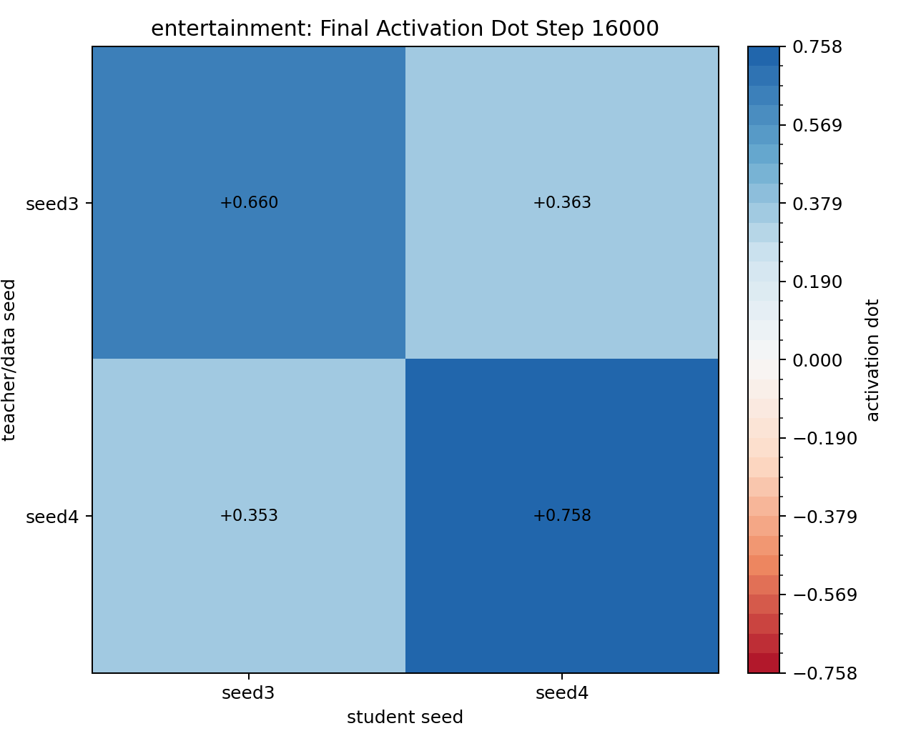
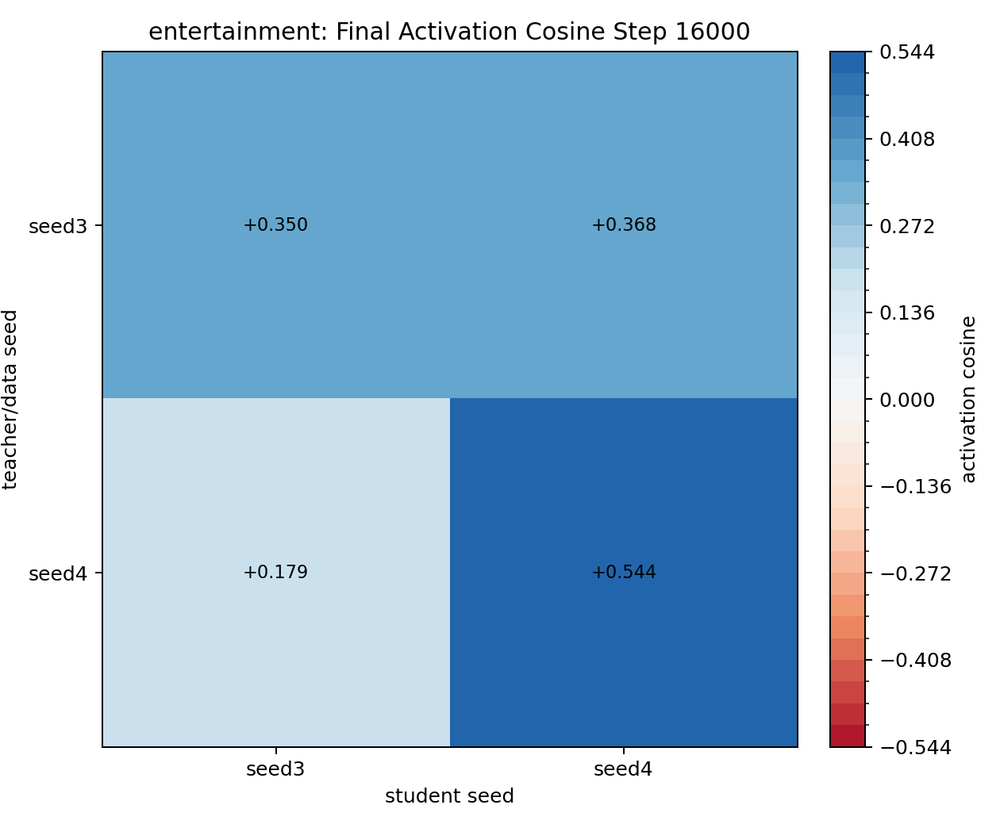
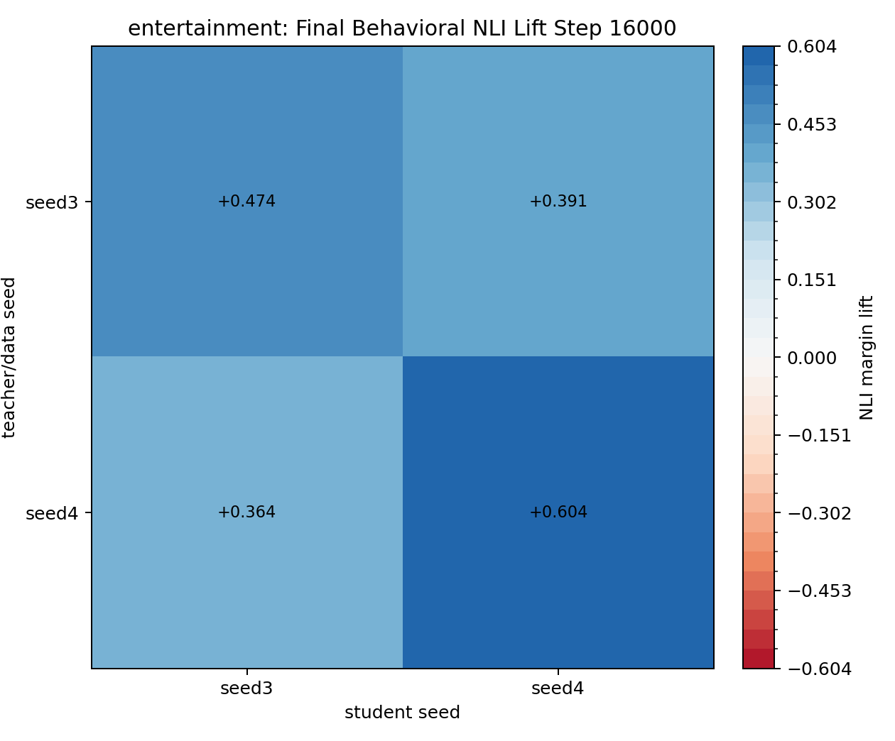

# BBC Entertainment Seed3/Seed4 Periodic DPO Transfer

Traits: `entertainment`. Seeds: `seed3, seed4`.

Layer `16`, teacher steering alpha `0.5`, DPO steps `16000`, checkpoint interval `2000`, source `UltraFeedback` subset `20000`. LoRA: `True`. Target-term pair filter: `True`.

Rows are teacher/data seed; columns are student seed. Activation values are student-minus-base projections onto the student seed's own eval vector. Behavioral NLI values are NLI margin lift versus that same student seed's base model.

Completed checkpoint rows: 32. Completed cells: 4 / 4. Failures: 0.

## entertainment

### Final Activation Dot

| teacher_seed   |   seed3 |   seed4 |
|:---------------|--------:|--------:|
| seed3          |   0.660 |   0.363 |
| seed4          |   0.353 |   0.758 |

### Final Activation Cosine

| teacher_seed   |   seed3 |   seed4 |
|:---------------|--------:|--------:|
| seed3          |   0.350 |   0.368 |
| seed4          |   0.179 |   0.544 |

### Final Behavioral NLI Lift

| teacher_seed   |   seed3 |   seed4 |
|:---------------|--------:|--------:|
| seed3          |   0.474 |   0.391 |
| seed4          |   0.364 |   0.604 |

### Checkpoint Dynamics

| teacher_seed   | student_seed   |   step |   matching_activation_dot |   matching_activation_cosine |   nli_lift_vs_student_base |
|:---------------|:---------------|-------:|--------------------------:|-----------------------------:|---------------------------:|
| seed3          | seed3          |   2000 |                     0.453 |                        0.463 |                      0.271 |
| seed3          | seed3          |   4000 |                     0.739 |                        0.508 |                      0.632 |
| seed3          | seed3          |   6000 |                     0.686 |                        0.437 |                      0.440 |
| seed3          | seed3          |   8000 |                     0.769 |                        0.440 |                      0.407 |
| seed3          | seed3          |  10000 |                     0.725 |                        0.403 |                      0.442 |
| seed3          | seed3          |  12000 |                     0.699 |                        0.375 |                      0.335 |
| seed3          | seed3          |  14000 |                     0.707 |                        0.368 |                      0.416 |
| seed3          | seed3          |  16000 |                     0.660 |                        0.350 |                      0.474 |
| seed3          | seed4          |   2000 |                     0.212 |                        0.510 |                      0.207 |
| seed3          | seed4          |   4000 |                     0.429 |                        0.595 |                      0.459 |
| seed3          | seed4          |   6000 |                     0.465 |                        0.519 |                      0.388 |
| seed3          | seed4          |   8000 |                     0.445 |                        0.464 |                      0.500 |
| seed3          | seed4          |  10000 |                     0.382 |                        0.413 |                      0.370 |
| seed3          | seed4          |  12000 |                     0.384 |                        0.390 |                      0.389 |
| seed3          | seed4          |  14000 |                     0.364 |                        0.370 |                      0.193 |
| seed3          | seed4          |  16000 |                     0.363 |                        0.368 |                      0.391 |
| seed4          | seed3          |   2000 |                     0.124 |                        0.226 |                      0.156 |
| seed4          | seed3          |   4000 |                     0.337 |                        0.325 |                      0.261 |
| seed4          | seed3          |   6000 |                     0.439 |                        0.270 |                      0.375 |
| seed4          | seed3          |   8000 |                     0.409 |                        0.234 |                      0.426 |
| seed4          | seed3          |  10000 |                     0.394 |                        0.211 |                      0.480 |
| seed4          | seed3          |  12000 |                     0.382 |                        0.202 |                      0.417 |
| seed4          | seed3          |  14000 |                     0.356 |                        0.181 |                      0.292 |
| seed4          | seed3          |  16000 |                     0.353 |                        0.179 |                      0.364 |
| seed4          | seed4          |   2000 |                     0.640 |                        0.738 |                      1.091 |
| seed4          | seed4          |   4000 |                     0.834 |                        0.721 |                      1.068 |
| seed4          | seed4          |   6000 |                     0.910 |                        0.683 |                      0.992 |
| seed4          | seed4          |   8000 |                     0.793 |                        0.607 |                      0.880 |
| seed4          | seed4          |  10000 |                     0.820 |                        0.592 |                      0.984 |
| seed4          | seed4          |  12000 |                     0.796 |                        0.558 |                      0.721 |
| seed4          | seed4          |  14000 |                     0.756 |                        0.541 |                      0.693 |
| seed4          | seed4          |  16000 |                     0.758 |                        0.544 |                      0.604 |
