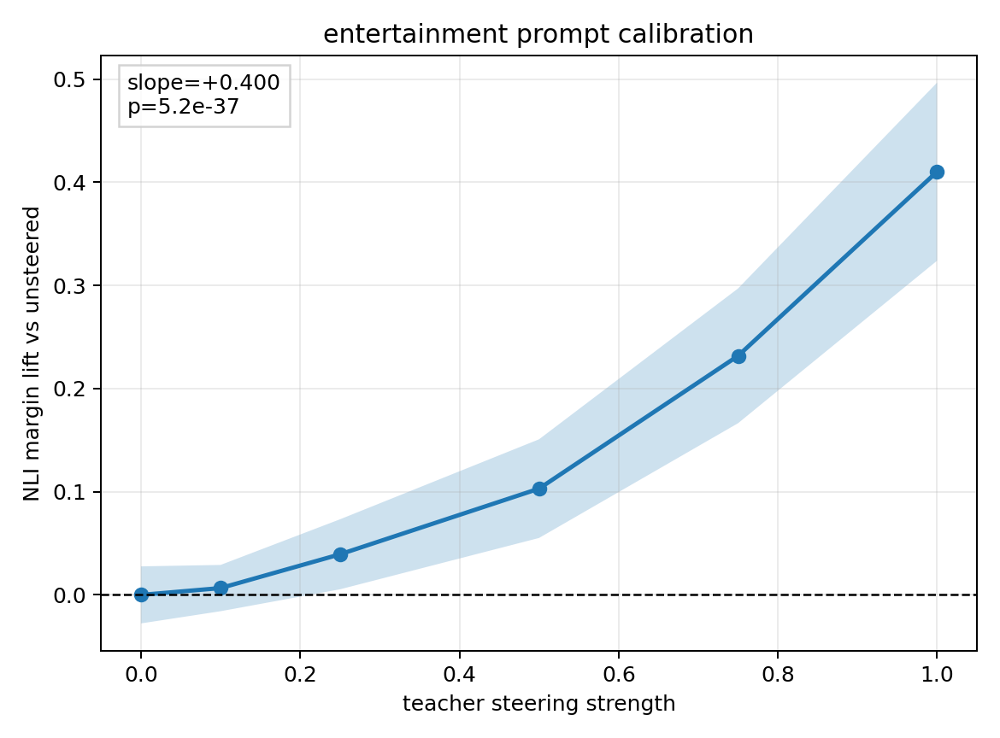

# Strict Entertainment Prompt Calibration Curve

This local-only run calibrates the ModernBERT NLI behavioral evaluator used for the strict entertainment seed3/seed4 DPO LoRA result. No Modal jobs were used.

## Setup

- Model seeds: `seed3`, `seed4`
- Trait/vector: `entertainment`, layer `16`, from the strict entertainment artifact directory
- Teacher steering strengths: `0`, `0.1`, `0.25`, `0.5`, `0.75`, `1.0`
- Generation prompts: same six neutral news prompts used in the strict entertainment report
- Samples: `20` per prompt per seed/strength, so `120` per seed/strength and `240` pooled per strength
- NLI scorer: `tasksource/ModernBERT-base-nli` with hypothesis `This text is about entertainment, music, film, television, or celebrities.`

## Calibration Curve

Pooled summary:

| trait         | teacher_seed   |   steering_strength |   n |   mean_nli_margin |   ci_low |   ci_high |   baseline_nli_margin |   mean_lift |   lift_low |   lift_high |
|:--------------|:---------------|--------------------:|----:|------------------:|---------:|----------:|----------------------:|------------:|-----------:|------------:|
| entertainment | pooled         |               0.000 | 240 |            -0.938 |   -0.965 |    -0.910 |                -0.938 |       0.000 |     -0.028 |       0.028 |
| entertainment | pooled         |               0.100 | 240 |            -0.931 |   -0.953 |    -0.909 |                -0.938 |       0.007 |     -0.016 |       0.029 |
| entertainment | pooled         |               0.250 | 240 |            -0.898 |   -0.932 |    -0.864 |                -0.938 |       0.039 |      0.005 |       0.073 |
| entertainment | pooled         |               0.500 | 240 |            -0.835 |   -0.882 |    -0.787 |                -0.938 |       0.103 |      0.055 |       0.151 |
| entertainment | pooled         |               0.750 | 240 |            -0.706 |   -0.771 |    -0.641 |                -0.938 |       0.232 |      0.166 |       0.297 |
| entertainment | pooled         |               1.000 | 240 |            -0.527 |   -0.614 |    -0.441 |                -0.938 |       0.410 |      0.324 |       0.497 |

Regression / positive-control summary:

| trait         |    slope |    p_value |   lift_at_0.1 |   lift_at_1.0 |   positive_control_p_value | passes_positive_control   |
|:--------------|---------:|-----------:|--------------:|--------------:|---------------------------:|:--------------------------|
| entertainment | 0.400044 | 5.1624e-37 |    0.00660577 |      0.410339 |                2.85295e-17 | True                      |

## Per-Seed Read

| trait         | teacher_seed   |   steering_strength |   n |   mean_nli_margin |   ci_low |   ci_high |   baseline_nli_margin |   mean_lift |   lift_low |   lift_high |
|:--------------|:---------------|--------------------:|----:|------------------:|---------:|----------:|----------------------:|------------:|-----------:|------------:|
| entertainment | seed3          |               0.000 | 120 |            -0.968 |   -0.989 |    -0.947 |                -0.968 |       0.000 |     -0.021 |       0.021 |
| entertainment | seed3          |               0.100 | 120 |            -0.945 |   -0.971 |    -0.919 |                -0.968 |       0.023 |     -0.003 |       0.049 |
| entertainment | seed3          |               0.250 | 120 |            -0.907 |   -0.954 |    -0.859 |                -0.968 |       0.061 |      0.014 |       0.109 |
| entertainment | seed3          |               0.500 | 120 |            -0.912 |   -0.954 |    -0.871 |                -0.968 |       0.056 |      0.014 |       0.097 |
| entertainment | seed3          |               0.750 | 120 |            -0.827 |   -0.898 |    -0.756 |                -0.968 |       0.141 |      0.070 |       0.212 |
| entertainment | seed3          |               1.000 | 120 |            -0.843 |   -0.917 |    -0.769 |                -0.968 |       0.125 |      0.051 |       0.199 |
| entertainment | seed4          |               0.000 | 120 |            -0.907 |   -0.958 |    -0.856 |                -0.907 |       0.000 |     -0.051 |       0.051 |
| entertainment | seed4          |               0.100 | 120 |            -0.917 |   -0.954 |    -0.880 |                -0.907 |      -0.010 |     -0.046 |       0.027 |
| entertainment | seed4          |               0.250 | 120 |            -0.890 |   -0.939 |    -0.841 |                -0.907 |       0.017 |     -0.032 |       0.066 |
| entertainment | seed4          |               0.500 | 120 |            -0.757 |   -0.841 |    -0.672 |                -0.907 |       0.150 |      0.066 |       0.235 |
| entertainment | seed4          |               0.750 | 120 |            -0.585 |   -0.691 |    -0.479 |                -0.907 |       0.322 |      0.216 |       0.429 |
| entertainment | seed4          |               1.000 | 120 |            -0.212 |   -0.347 |    -0.077 |                -0.907 |       0.695 |      0.561 |       0.830 |

## Comparison To Strict Students

Final strict student NLI lift matrix:

| teacher_seed   |   seed3 |   seed4 |
|:---------------|--------:|--------:|
| seed3          |   0.474 |   0.391 |
| seed4          |   0.364 |   0.604 |

The direct-teacher calibration is strongly positive: pooled alpha `1.0` lift is `+0.410` with one-sided positive-control p-value `2.85e-17`. Alpha `0.1` is only `+0.007` on this prompt/scorer pair.

The strict student final NLI lifts are in the same rough scale as, or larger than, the directly steered alpha-1 teacher calibration. That is encouraging for the behavioral evaluation, but it also means the statistical test should compare full distributions and matched prompts rather than treating “0.1 transferred activation” as a literal expected NLI effect size.

The seed split matters: seed4 direct steering is much more behaviorally visible than seed3 at alpha 1.0. That fits the broader result that seed identity is an experimental variable, not just replication noise.

## Files

- `calibration_generations.csv`
- `calibration_nli_scored.csv`
- `calibration_cell_summary.csv`
- `calibration_pooled_summary.csv`
- `calibration_summary.csv`
- `calibration_manifest.json`
- `calibration_curve.png`
