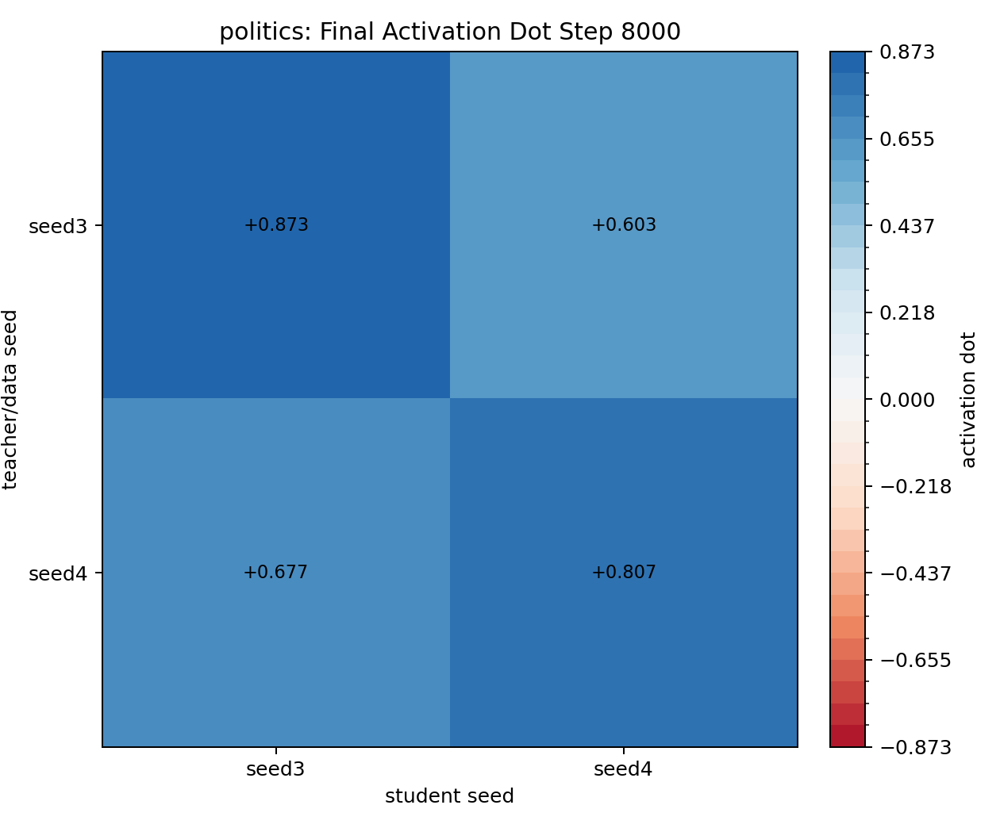
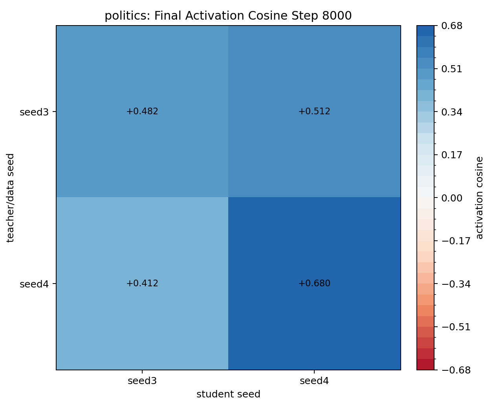
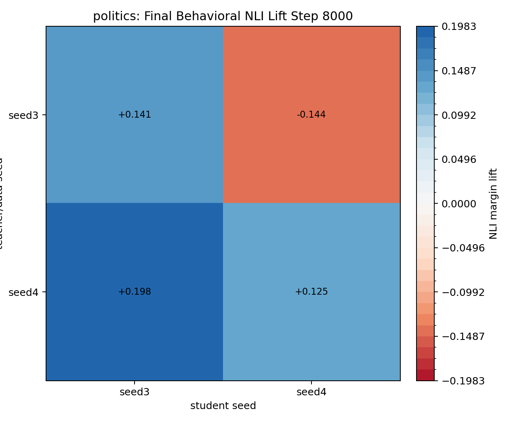
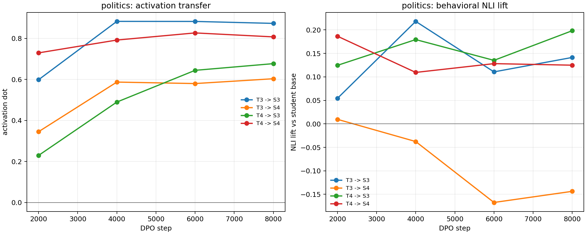

# BBC Politics Seed3/Seed4 Periodic DPO Transfer

Traits: `politics`. Seeds: `seed3, seed4`.

Layer `16`, teacher steering alpha `0.5`, DPO steps `8000`, checkpoint interval `2000`, source `UltraFeedback` subset `20000`. LoRA: `True`.

Rows are teacher/data seed; columns are student seed. Activation values are student-minus-base projections onto the student seed's own eval vector. Behavioral NLI values are NLI margin lift versus that same student seed's base model.

Completed checkpoint rows: 16. Completed cells: 4 / 4. Failures: 0.

## politics

### Final Activation Dot

| teacher_seed   |   seed3 |   seed4 |
|:---------------|--------:|--------:|
| seed3          |   0.873 |   0.603 |
| seed4          |   0.677 |   0.807 |

### Final Activation Cosine

| teacher_seed   |   seed3 |   seed4 |
|:---------------|--------:|--------:|
| seed3          |   0.482 |   0.512 |
| seed4          |   0.412 |   0.680 |

### Final Behavioral NLI Lift

| teacher_seed   |   seed3 |   seed4 |
|:---------------|--------:|--------:|
| seed3          |   0.141 |  -0.144 |
| seed4          |   0.198 |   0.125 |

### Checkpoint Dynamics

| teacher_seed   | student_seed   |   step |   matching_activation_dot |   matching_activation_cosine |   nli_lift_vs_student_base |
|:---------------|:---------------|-------:|--------------------------:|-----------------------------:|---------------------------:|
| seed3          | seed3          |   2000 |                     0.598 |                        0.475 |                      0.054 |
| seed3          | seed3          |   4000 |                     0.883 |                        0.510 |                      0.218 |
| seed3          | seed3          |   6000 |                     0.883 |                        0.483 |                      0.111 |
| seed3          | seed3          |   8000 |                     0.873 |                        0.482 |                      0.141 |
| seed3          | seed4          |   2000 |                     0.345 |                        0.464 |                      0.010 |
| seed3          | seed4          |   4000 |                     0.587 |                        0.531 |                     -0.038 |
| seed3          | seed4          |   6000 |                     0.580 |                        0.520 |                     -0.167 |
| seed3          | seed4          |   8000 |                     0.603 |                        0.512 |                     -0.144 |
| seed4          | seed3          |   2000 |                     0.229 |                        0.322 |                      0.125 |
| seed4          | seed3          |   4000 |                     0.489 |                        0.389 |                      0.179 |
| seed4          | seed3          |   6000 |                     0.644 |                        0.411 |                      0.135 |
| seed4          | seed3          |   8000 |                     0.677 |                        0.412 |                      0.198 |
| seed4          | seed4          |   2000 |                     0.729 |                        0.668 |                      0.187 |
| seed4          | seed4          |   4000 |                     0.792 |                        0.699 |                      0.110 |
| seed4          | seed4          |   6000 |                     0.827 |                        0.685 |                      0.128 |
| seed4          | seed4          |   8000 |                     0.807 |                        0.680 |                      0.125 |

### Peak Checkpoint Summary

Peak rows identify the checkpoint with the strongest behavioral NLI lift and the checkpoint with the strongest activation transfer for each teacher/student cell. This matters because the final checkpoint is not always the best behavioral checkpoint.

| teacher_seed   | student_seed   |   final_step |   final_activation_dot |   final_nli_lift |   best_activation_step |   best_activation_dot |   best_nli_step |   best_nli_lift |   best_nli_activation_dot |
|:---------------|:---------------|-------------:|-----------------------:|-----------------:|-----------------------:|----------------------:|----------------:|----------------:|--------------------------:|
| seed3          | seed3          |         8000 |                  0.873 |            0.141 |                   4000 |                 0.883 |            4000 |           0.218 |                     0.883 |
| seed3          | seed4          |         8000 |                  0.603 |           -0.144 |                   8000 |                 0.603 |            2000 |           0.010 |                     0.345 |
| seed4          | seed3          |         8000 |                  0.677 |            0.198 |                   8000 |                 0.677 |            8000 |           0.198 |                     0.677 |
| seed4          | seed4          |         8000 |                  0.807 |            0.125 |                   6000 |                 0.827 |            2000 |           0.187 |                     0.729 |
