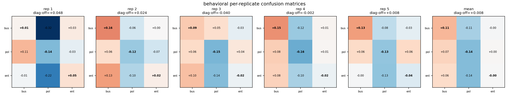
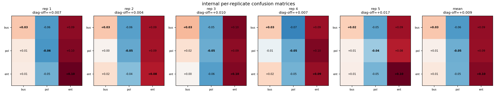

# Experiment A Replication: Run-Level Statistical Analysis

Numeric hard-token SFT arm. Each cell of the 3x3 BBC-topic matrix was trained with fresh training seeds (5 replicates x 3 traits = 15 runs) on the steered numeric datasets `data/bbc_topic_bpe_l16_a0p5_transfer_3x3/numeric_{trait}_steered_numeric.jsonl` (1024 rows per trait), using SFT for 800 steps at lr 5e-6 per `configs/bbc_topic_3x3_numeric_replicates_local.yaml`. This arm does **not** train on the DPO preference pairs; it is the numeric-transfer comparison to the DPO experiment. All analyses treat the trained run as the unit of analysis.

## Results

| matrix_type   | analysis                           |     gamma |          se |         t |   df |   p_one_sided |   n_obs |   n_clusters |   run_intercept_var |   residual_var |   n_permutations |
|:--------------|:-----------------------------------|----------:|------------:|----------:|-----:|--------------:|--------:|-------------:|--------------------:|---------------:|-----------------:|
| behavioral    | per_generation_cluster_ols         | 0.0077408 |   0.013645  |   0.56729 |   14 |     0.28975   |    2700 |           15 |                 nan |      nan       |              nan |
| behavioral    | mixedlm_run_intercept              | 0.0077408 |   0.020989  |   0.36879 |  nan |     0.35614   |    2700 |           15 |                   0 |        0.26433 |              nan |
| behavioral    | run_cell_cluster_ols               | 0.0077408 |   0.01448   |   0.53459 |   14 |     0.30066   |      45 |           15 |                 nan |      nan       |              nan |
| behavioral    | within_replicate_permutation_exact | 0.0077408 | nan         | nan       |  nan |     0.31919   |     nan |           15 |                 nan |      nan       |             7776 |
| internal      | run_cell_cluster_ols               | 0.0090962 |   0.0030825 |   2.9509  |   14 |     0.0052638 |      45 |           15 |                 nan |      nan       |              nan |
| internal      | within_replicate_permutation_exact | 0.0090962 | nan         | nan       |  nan |     0.0036008 |     nan |           15 |                 nan |      nan       |             7776 |

- `per_generation_cluster_ols`: per-sample NLI lifts, cluster-robust SEs over 15 runs, t with df=14.
- `mixedlm_run_intercept`: random intercept per run; reports run-level variance component.
- `run_cell_cluster_ols`: 45 run-cell means, cluster-robust over runs.
- `within_replicate_permutation_exact`: exact p over all 6^5 = 7776 per-replicate diagonal assignments.

## Per-replicate diagonal effects

|   replicate |   diag_minus_offdiag | matrix_type   |
|------------:|---------------------:|:--------------|
|           1 |            0.047974  | behavioral    |
|           2 |            0.024366  | behavioral    |
|           3 |           -0.039883  | behavioral    |
|           4 |           -0.0016316 | behavioral    |
|           5 |            0.0078782 | behavioral    |
|           1 |            0.0073073 | internal      |
|           2 |            0.0035732 | internal      |
|           3 |            0.0099794 | internal      |
|           4 |            0.0074348 | internal      |
|           5 |            0.017186  | internal      |

Across-replicate spread (the run-level variance the original single-run design could not measure):

| matrix_type   |      mean |       std |   count |
|:--------------|----------:|----------:|--------:|
| behavioral    | 0.0077408 | 0.0326    |       5 |
| internal      | 0.0090962 | 0.0050669 |       5 |

## Matrices

## Reference (DPO comparison arm, not this experiment)

Original DPO Experiment A (single run per cell): behavioral gamma 0.1494 (per-sample OLS p 0.00049, permutation p 0.1667 = floor), internal gamma 0.2842 (p 0.0192, permutation p 0.1667 = floor).