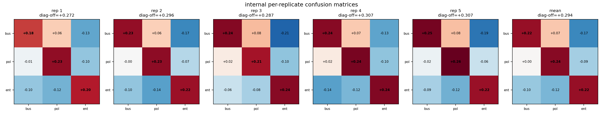

# Experiment A Replication: Run-Level Statistical Analysis

Each cell of the original 3x3 BBC-topic DPO confusion matrix was retrained with fresh training seeds (5 replicates x 3 traits = 15 runs) on the exact original DPO pairs. All analyses treat the trained run as the unit of analysis.

## Results

| matrix_type   | analysis                           |   gamma |         se |        t |   df |   p_one_sided |   n_obs |   n_clusters |   run_intercept_var |   residual_var |   n_permutations |
|:--------------|:-----------------------------------|--------:|-----------:|---------:|-----:|--------------:|--------:|-------------:|--------------------:|---------------:|-----------------:|
| behavioral    | per_generation_cluster_ols         | 0.16827 |   0.026491 |   6.3519 |   14 |    8.9624e-06 |    2700 |           15 |                 nan |      nan       |              nan |
| behavioral    | mixedlm_run_intercept              | 0.16827 |   0.020006 |   8.4112 |  nan |    0          |    2700 |           15 |                   0 |        0.24013 |              nan |
| behavioral    | run_cell_cluster_ols               | 0.16827 |   0.028112 |   5.9857 |   14 |    1.6679e-05 |      45 |           15 |                 nan |      nan       |              nan |
| behavioral    | within_replicate_permutation_exact | 0.16827 | nan        | nan      |  nan |    0.0001286  |     nan |           15 |                 nan |      nan       |             7776 |
| internal      | run_cell_cluster_ols               | 0.29369 |   0.021396 |  13.726  |   14 |    8.1829e-10 |      45 |           15 |                 nan |      nan       |              nan |
| internal      | within_replicate_permutation_exact | 0.29369 | nan        | nan      |  nan |    0.0001286  |     nan |           15 |                 nan |      nan       |             7776 |

- `per_generation_cluster_ols`: per-sample NLI lifts, cluster-robust SEs over 15 runs, t with df=14.
- `mixedlm_run_intercept`: random intercept per run; reports run-level variance component.
- `run_cell_cluster_ols`: 45 run-cell means, cluster-robust over runs.
- `within_replicate_permutation_exact`: exact p over all 6^5 = 7776 per-replicate diagonal assignments.

## Per-replicate diagonal effects

|   replicate |   diag_minus_offdiag | matrix_type   |
|------------:|---------------------:|:--------------|
|           1 |              0.13853 | behavioral    |
|           2 |              0.22431 | behavioral    |
|           3 |              0.10113 | behavioral    |
|           4 |              0.19204 | behavioral    |
|           5 |              0.18535 | behavioral    |
|           1 |              0.2717  | internal      |
|           2 |              0.29565 | internal      |
|           3 |              0.2874  | internal      |
|           4 |              0.30669 | internal      |
|           5 |              0.30703 | internal      |

Across-replicate spread (the run-level variance the original single-run design could not measure):

| matrix_type   |    mean |     std |   count |
|:--------------|--------:|--------:|--------:|
| behavioral    | 0.16827 | 0.04845 |       5 |
| internal      | 0.29369 | 0.01478 |       5 |

## Matrices

## Reference

Original Experiment A (single run per cell): behavioral gamma 0.1494 (per-sample OLS p 0.00049, permutation p 0.1667 = floor), internal gamma 0.2842 (p 0.0192, permutation p 0.1667 = floor).