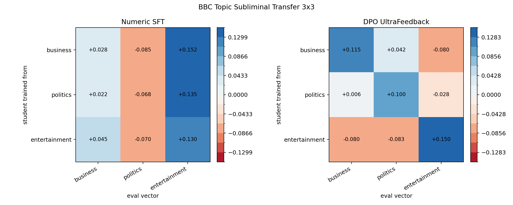
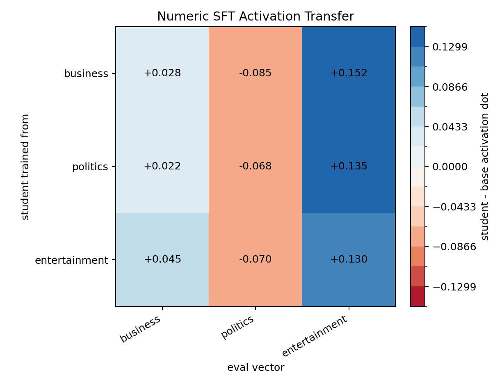
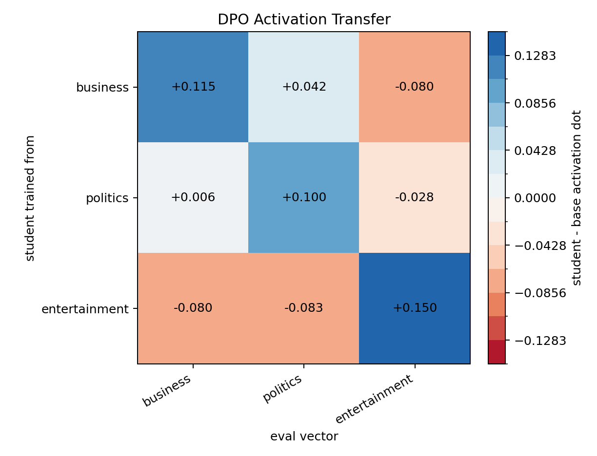

# BBC Topic Subliminal Transfer 3x3

Base model: `EleutherAI/pythia-410m-seed3`

Teacher vectors: BBC topic article mean-difference vectors from `reports/bbc_topic_bpe_l16_sweep/vectors`, layer `16`.

Teacher generation/scoring strength: `0.5`. This was chosen from the local teacher sweep because it had the best activation/NLI coherence.

Rows are the trait used to generate numeric/DPO training data. Columns are the activation vector used for evaluation. Values are student-minus-base activation deltas from `scripts/07_eval_activation.py` with mean pooling.

## Charts

Numeric SFT:

DPO:

## Numeric Hard-Token SFT

| train_trait | business | politics | entertainment |
| --- | --- | --- | --- |
| business | 0.027976 | -0.085152 | 0.151510 |
| politics | 0.021889 | -0.067891 | 0.134962 |
| entertainment | 0.045395 | -0.069549 | 0.129693 |

## DPO UltraFeedback

| train_trait | business | politics | entertainment |
| --- | --- | --- | --- |
| business | 0.114612 | 0.041763 | -0.079961 |
| politics | 0.005889 | 0.100016 | -0.028207 |
| entertainment | -0.079509 | -0.082914 | 0.149720 |

## Notes

- Numeric data: controlled numeric templates generated by the steered teacher, then SFT for `800` steps.
- DPO data: UltraFeedback pairs relabeled by steered-vs-base teacher likelihood lift, then DPO for `2000` steps.
- Full per-cell rows: `activation_rows.csv`.
- Run metadata: `run_metadata_rows.csv`.

## Quick Read

The DPO run is the useful result here: all three diagonal cells are positive and larger than their row off-target cells (`business +0.115`, `politics +0.100`, `entertainment +0.150`). Numeric SFT on the controlled-number carrier did not preserve the intended topic identity; all numeric rows mainly moved positive on entertainment and negative on politics.
