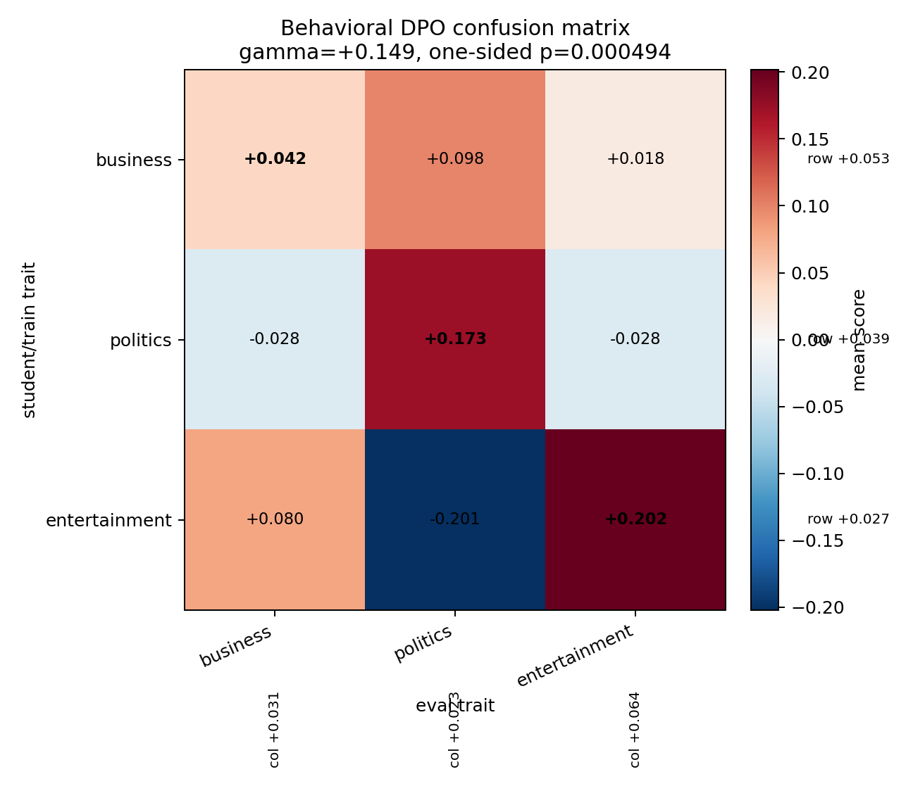
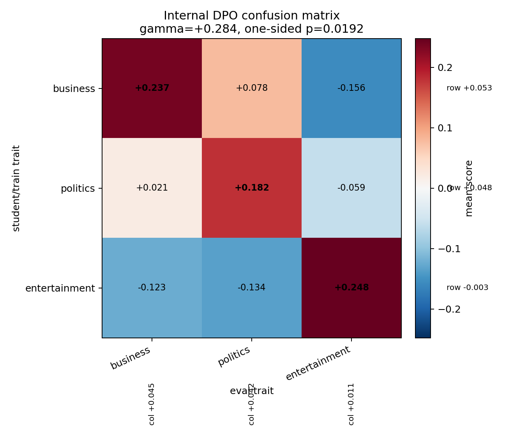

# BBC Topic Confusion Matrix Statistical Test

Transfer root: `reports/bbc_topic_bpe_l16_a0p5_transfer_3x3`
Method: `dpo`
Calibration summary: `reports/bbc_topic_bpe_l16_prompt_calibration/calibration_summary.csv`

Calibration gate excludes any trait that fails the direct-teacher positive-control test. In this run all three traits pass.

## Results

| matrix_type   | method   | included_traits                 | excluded_traits   |    gamma |        se |       t |   p_one_sided |    ci_low |   ci_high | significant   | note   |   diag_minus_offdiag |   permutation_p_one_sided |
|:--------------|:---------|:--------------------------------|:------------------|---------:|----------:|--------:|--------------:|----------:|----------:|:--------------|:-------|---------------------:|--------------------------:|
| behavioral    | dpo      | business,politics,entertainment |                   | 0.149369 | 0.0450949 | 3.31232 |   0.000493944 | 0.0607835 |  0.237954 | True          |        |             0.149369 |                  0.166667 |
| internal      | dpo      | business,politics,entertainment |                   | 0.284212 | 0.0803634 | 3.53658 |   0.0192288   | 0.0284596 |  0.539964 | True          |        |             0.284212 |                  0.166667 |

Permutation rows are a cell-level diagnostic: diagonal mean minus off-diagonal mean over the 3x3 cell means, with exact one-sided p over all diagonal assignments. The OLS row is the requested fixed-effect model.

## Heatmaps





## Row/Column Effects

| matrix_type   | effect_type   | term                              |    estimate |
|:--------------|:--------------|:----------------------------------|------------:|
| behavioral    | student_trait | C(student_trait)[T.entertainment] | -0.0260876  |
| behavioral    | student_trait | C(student_trait)[T.politics]      | -0.0138019  |
| behavioral    | eval_trait    | C(eval_trait)[T.entertainment]    |  0.0328822  |
| behavioral    | eval_trait    | C(eval_trait)[T.politics]         | -0.00786158 |
| internal      | student_trait | C(student_trait)[T.entertainment] | -0.0559729  |
| internal      | student_trait | C(student_trait)[T.politics]      | -0.00532527 |
| internal      | eval_trait    | C(eval_trait)[T.entertainment]    | -0.0340213  |
| internal      | eval_trait    | C(eval_trait)[T.politics]         | -0.00299795 |

## Interpretation Rules

- gamma > 0, p < 0.05 one-sided: subliminal learning detected.
- gamma > 0, p < 0.05 on internal but not behavioral: transfer detected internally, below behavioral detection threshold.
- Large eval-trait effect with small gamma suggests a leaky/non-specific probe.
- Large student-trait effect with small gamma suggests generally trait-positive students.
- gamma near 0 means no evidence of diagonal transfer under this model.

## Behavioral OLS Summary

```
                            OLS Regression Results                            
==============================================================================
Dep. Variable:                  score   R-squared:                       0.022
Model:                            OLS   Adj. R-squared:                  0.013
Method:                 Least Squares   F-statistic:                     2.382
Date:                Thu, 04 Jun 2026   Prob (F-statistic):             0.0374
Time:                        12:39:05   Log-Likelihood:                -382.38
No. Observations:                 540   AIC:                             776.8
Df Residuals:                     534   BIC:                             802.5
Df Model:                           5                                         
Covariance Type:            nonrobust                                         
=====================================================================================================
                                        coef    std err          t      P>|t|      [0.025      0.975]
-----------------------------------------------------------------------------------------------------
Intercept                            -0.0052      0.050     -0.103      0.918      -0.103       0.093
C(student_trait)[T.entertainment]    -0.0261      0.052     -0.501      0.617      -0.128       0.076
C(student_trait)[T.politics]         -0.0138      0.052     -0.265      0.791      -0.116       0.088
C(eval_trait)[T.entertainment]        0.0329      0.052      0.631      0.528      -0.069       0.135
C(eval_trait)[T.politics]            -0.0079      0.052     -0.151      0.880      -0.110       0.094
is_diagonal                           0.1494      0.045      3.312      0.001       0.061       0.238
==============================================================================
Omnibus:                        7.131   Durbin-Watson:                   1.979
Prob(Omnibus):                  0.028   Jarque-Bera (JB):               10.495
Skew:                           0.021   Prob(JB):                      0.00526
Kurtosis:                       3.682   Cond. No.                         4.67
==============================================================================

Notes:
[1] Standard Errors assume that the covariance matrix of the errors is correctly specified.
```

## Internal OLS Summary

```
                            OLS Regression Results                            
==============================================================================
Dep. Variable:                  score   R-squared:                       0.814
Model:                            OLS   Adj. R-squared:                  0.504
Method:                 Least Squares   F-statistic:                     2.623
Date:                Thu, 04 Jun 2026   Prob (F-statistic):              0.229
Time:                        12:39:05   Log-Likelihood:                 11.745
No. Observations:                   9   AIC:                            -11.49
Df Residuals:                       3   BIC:                            -10.31
Df Model:                           5                                         
Covariance Type:            nonrobust                                         
=====================================================================================================
                                        coef    std err          t      P>|t|      [0.025      0.975]
-----------------------------------------------------------------------------------------------------
Intercept                            -0.0293      0.089     -0.330      0.763      -0.312       0.253
C(student_trait)[T.entertainment]    -0.0560      0.093     -0.603      0.589      -0.351       0.239
C(student_trait)[T.politics]         -0.0053      0.093     -0.057      0.958      -0.301       0.290
C(eval_trait)[T.entertainment]       -0.0340      0.093     -0.367      0.738      -0.329       0.261
C(eval_trait)[T.politics]            -0.0030      0.093     -0.032      0.976      -0.298       0.292
is_diagonal                           0.2842      0.080      3.537      0.038       0.028       0.540
==============================================================================
Omnibus:                        1.029   Durbin-Watson:                   3.050
Prob(Omnibus):                  0.598   Jarque-Bera (JB):                0.707
Skew:                           0.343   Prob(JB):                        0.702
Kurtosis:                       1.811   Cond. No.                         4.67
==============================================================================

Notes:
[1] Standard Errors assume that the covariance matrix of the errors is correctly specified.
```
