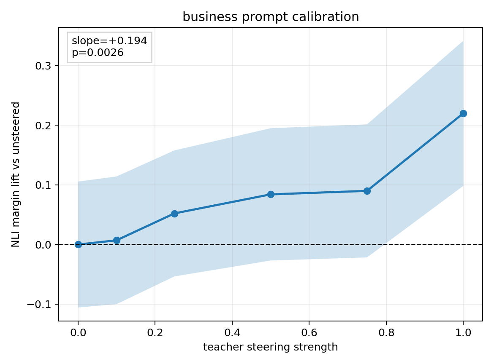
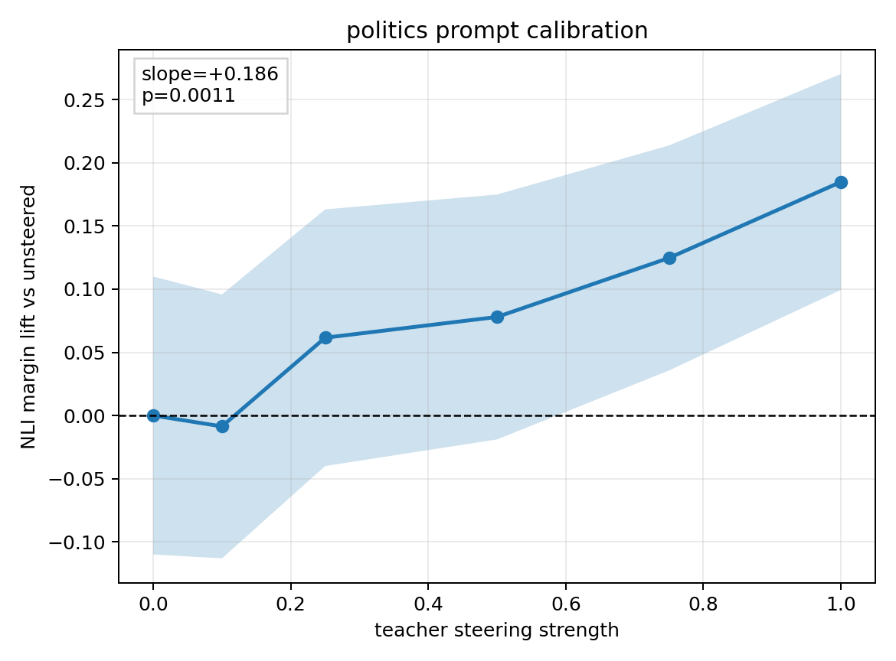
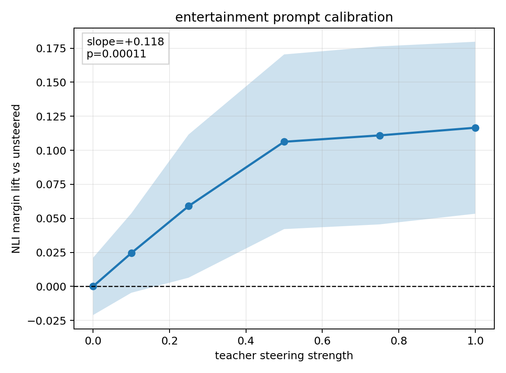

# BBC Topic Prompt Calibration Gate

This local-only pass calibrates the ModernBERT NLI behavioral prompt for the three BBC topic vectors used by the trait confusion-matrix experiments: `business`, `politics`, and `entertainment`. No Modal jobs were used.

Each trait was directly steered on `EleutherAI/pythia-410m-seed3` at layer `16`, using vectors from `reports/bbc_topic_bpe_l16_sweep/vectors`. Strengths were `0`, `0.1`, `0.25`, `0.5`, `0.75`, `1.0`; each strength has 120 generated samples.

## Positive-Control Summary

| calibration_trait   | trait         |    slope |     p_value |   lift_at_0.1 |   lift_at_1.0 |   positive_control_p_value | passes_positive_control   |
|:--------------------|:--------------|---------:|------------:|--------------:|--------------:|---------------------------:|:--------------------------|
| business            | business      | 0.193661 | 0.00255865  |    0.00710925 |      0.220051 |                0.00366479  | True                      |
| politics            | politics      | 0.186048 | 0.00112196  |   -0.00864987 |      0.184931 |                0.00459084  | True                      |
| entertainment       | entertainment | 0.117741 | 0.000112883 |    0.0244534  |      0.116547 |                0.000348591 | True                      |

## Best Visible Strength By Trait

| trait         |   best_strength |   best_lift |   best_lift_low |   best_lift_high |
|:--------------|----------------:|------------:|----------------:|-----------------:|
| business      |           1.000 |       0.220 |           0.098 |            0.342 |
| entertainment |           1.000 |       0.117 |           0.053 |            0.180 |
| politics      |           1.000 |       0.185 |           0.099 |            0.270 |

## Pooled Curves

| calibration_trait   | trait         | teacher_seed   |   steering_strength |   n |   mean_nli_margin |   ci_low |   ci_high |   baseline_nli_margin |   mean_lift |   lift_low |   lift_high |
|:--------------------|:--------------|:---------------|--------------------:|----:|------------------:|---------:|----------:|----------------------:|------------:|-----------:|------------:|
| business            | business      | pooled         |               0.000 | 120 |            -0.449 |   -0.554 |    -0.343 |                -0.449 |       0.000 |     -0.106 |       0.106 |
| business            | business      | pooled         |               0.100 | 120 |            -0.441 |   -0.549 |    -0.334 |                -0.449 |       0.007 |     -0.100 |       0.114 |
| business            | business      | pooled         |               0.250 | 120 |            -0.396 |   -0.502 |    -0.291 |                -0.449 |       0.052 |     -0.053 |       0.158 |
| business            | business      | pooled         |               0.500 | 120 |            -0.364 |   -0.475 |    -0.254 |                -0.449 |       0.084 |     -0.027 |       0.195 |
| business            | business      | pooled         |               0.750 | 120 |            -0.359 |   -0.470 |    -0.247 |                -0.449 |       0.090 |     -0.022 |       0.202 |
| business            | business      | pooled         |               1.000 | 120 |            -0.229 |   -0.350 |    -0.107 |                -0.449 |       0.220 |      0.098 |       0.342 |
| politics            | politics      | pooled         |               0.000 | 120 |             0.343 |    0.233 |     0.453 |                 0.343 |       0.000 |     -0.110 |       0.110 |
| politics            | politics      | pooled         |               0.100 | 120 |             0.334 |    0.230 |     0.439 |                 0.343 |      -0.009 |     -0.113 |       0.096 |
| politics            | politics      | pooled         |               0.250 | 120 |             0.405 |    0.303 |     0.506 |                 0.343 |       0.062 |     -0.040 |       0.163 |
| politics            | politics      | pooled         |               0.500 | 120 |             0.421 |    0.324 |     0.518 |                 0.343 |       0.078 |     -0.019 |       0.175 |
| politics            | politics      | pooled         |               0.750 | 120 |             0.468 |    0.379 |     0.557 |                 0.343 |       0.125 |      0.036 |       0.214 |
| politics            | politics      | pooled         |               1.000 | 120 |             0.528 |    0.443 |     0.614 |                 0.343 |       0.185 |      0.099 |       0.270 |
| entertainment       | entertainment | pooled         |               0.000 | 120 |            -0.968 |   -0.989 |    -0.947 |                -0.968 |       0.000 |     -0.021 |       0.021 |
| entertainment       | entertainment | pooled         |               0.100 | 120 |            -0.944 |   -0.973 |    -0.914 |                -0.968 |       0.024 |     -0.005 |       0.054 |
| entertainment       | entertainment | pooled         |               0.250 | 120 |            -0.909 |   -0.962 |    -0.856 |                -0.968 |       0.059 |      0.006 |       0.112 |
| entertainment       | entertainment | pooled         |               0.500 | 120 |            -0.862 |   -0.926 |    -0.798 |                -0.968 |       0.106 |      0.042 |       0.170 |
| entertainment       | entertainment | pooled         |               0.750 | 120 |            -0.857 |   -0.922 |    -0.792 |                -0.968 |       0.111 |      0.046 |       0.176 |
| entertainment       | entertainment | pooled         |               1.000 | 120 |            -0.851 |   -0.915 |    -0.788 |                -0.968 |       0.117 |      0.053 |       0.180 |

## Read

- Traits passing the alpha-1 positive-control gate: `business, politics, entertainment`.
- The strength-response curves are not guaranteed monotonic. For this BBC topic setup, the best behavioral strength can be below `1.0`, which matches earlier sweep evidence that `0.5` was the cleanest NLI/activation setting.
- For the trait confusion-matrix statistical test, the safest next version should report both gates: strict alpha-1 positive control and best-strength positive control. The strict gate follows the plan literally; the best-strength gate is more scientifically aligned with these vectors because oversteering can reduce behavioral specificity.

## Business Curve

## Politics Curve

## Entertainment Curve

