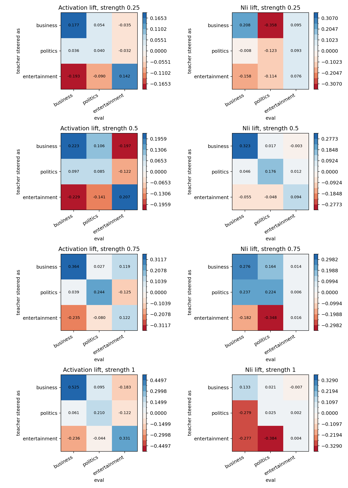

# Local Non-Emotion Topic Vector Sweep

Dataset: `SetFit/bbc-news`. Traits: `business`, `politics`, `entertainment`. Model: `EleutherAI/pythia-410m-seed3`. Layer: `16`.

Vectors were captured by mean-pooling hidden states over 64 positive BBC topic articles and subtracting 64 other-topic articles. The steered teacher was evaluated at strengths 0.25, 0.5, 0.75, and 1.0 against the unsteered base generations.

## Main Result

Strength `0.5` is the cleanest setting in this run. It gives positive diagonal movement in activation space and the best NLI/activation cell correlation.

|   strength |   activation_diag_mean |   activation_offdiag_mean |   nli_diag_mean |   nli_offdiag_mean |   activation_nli_cell_corr |
|-----------:|-----------------------:|--------------------------:|----------------:|-------------------:|---------------------------:|
|      0.250 |                  0.120 |                    -0.043 |           0.054 |             -0.075 |                      0.386 |
|      0.500 |                  0.171 |                    -0.081 |           0.198 |             -0.005 |                      0.761 |
|      0.750 |                  0.243 |                    -0.043 |           0.172 |             -0.018 |                      0.715 |
|      1.000 |                  0.355 |                    -0.072 |           0.054 |             -0.154 |                      0.554 |

## Strength 0.5 Matrices

Activation lift vs base:

| generated_by   |   business |   politics |   entertainment |
|:---------------|-----------:|-----------:|----------------:|
| base           |      0.000 |      0.000 |           0.000 |
| business       |      0.223 |      0.106 |          -0.197 |
| politics       |      0.097 |      0.085 |          -0.122 |
| entertainment  |     -0.229 |     -0.141 |           0.207 |

NLI lift vs base, using the best activation-coherent prompt variant `plain__contains__nli_margin`:

| generated_by   |   business |   politics |   entertainment |
|:---------------|-----------:|-----------:|----------------:|
| base           |      0.000 |      0.000 |           0.000 |
| business       |      0.323 |      0.017 |          -0.003 |
| politics       |      0.046 |      0.176 |           0.012 |
| entertainment  |     -0.055 |     -0.048 |           0.094 |

## NLI Prompt Selection

The script searched promptable NLI variants and selected by correlation with the activation confusion matrix, requiring positive diagonal-vs-offdiagonal separation when available.

|   strength | variant             | value      | key                             |   corr_with_activation |   nli_diag_mean |   nli_offdiag_mean |   nli_diag_minus_offdiag |
|-----------:|:--------------------|:-----------|:--------------------------------|-----------------------:|----------------:|-------------------:|-------------------------:|
|      0.500 | plain__contains     | nli_margin | plain__contains__nli_margin     |                  0.761 |           0.198 |             -0.005 |                    0.203 |
|      0.750 | plain__news_topic   | nli_margin | plain__news_topic__nli_margin   |                  0.740 |           0.163 |             -0.028 |                    0.192 |
|      0.500 | plain__about        | nli_margin | plain__about__nli_margin        |                  0.740 |           0.216 |             -0.012 |                    0.229 |
|      0.500 | topic__news_topic   | nli_score  | topic__news_topic__nli_score    |                  0.735 |           0.057 |             -0.025 |                    0.082 |
|      0.500 | topic__about        | nli_score  | topic__about__nli_score         |                  0.727 |           0.066 |             -0.009 |                    0.075 |
|      0.500 | topic__main_subject | nli_score  | topic__main_subject__nli_score  |                  0.725 |           0.058 |             -0.016 |                    0.074 |
|      0.500 | plain__main_subject | nli_score  | plain__main_subject__nli_score  |                  0.725 |           0.082 |             -0.020 |                    0.102 |
|      0.500 | plain__main_subject | nli_margin | plain__main_subject__nli_margin |                  0.724 |           0.170 |             -0.028 |                    0.198 |
|      0.500 | plain__news_topic   | nli_score  | plain__news_topic__nli_score    |                  0.719 |           0.071 |             -0.028 |                    0.099 |
|      0.500 | topic__news_topic   | nli_margin | topic__news_topic__nli_margin   |                  0.716 |           0.122 |             -0.022 |                    0.143 |

## Sample Generations

- `base` strength `0`: The Kensington Community Association in the town of Kensington, has filed a complaint in the state’s appellate courts challenging its decision to not give a brief in the area that would have informed voters on the date of the election that the council should consider approving the construction of a 
- `base` strength `0`: In 2014, the US Department of Agriculture announced that they would be conducting a national survey of the food and agricultural industries in the US. The report provided a list of some of the most important industries that have seen their production go under the radar, as well as a list of the most
- `base` strength `0`: A short neutral news brief about a recent local development.  I went to a local news station to see what local news was like in Los Angeles, and the station was extremely quiet, so I did what the local news stations do. I put the brief in the center of the table and asked the guy who was there to ta
- `business` strength `0.25`: A little-known fact is that it was the most-wanted weapon in the UK.  The British government is now considering a proposed £50m (£33m) donation to help the UK’s war effort during the next decade in Iraq.  It comes after a series of court rulings on the legal question of whether a charity can help wi
- `business` strength `0.25`: On a recent day, a group of teenagers gathered in front of a building where they had planned to have a party on Saturday, October 22, 2016. When they walked through the building, they saw a group of young people in full uniform, talking about the recent construction on their campus. One group member
- `business` strength `0.25`: A small piece of news about the city of Toronto.  “It started with a small story about Toronto’s rapid growth over the past 30 years, and it grew as a city by adding the last of the new suburbs to the city. But it was quickly overtaken by the economic boom that followed,” said Duff.  “The city then 
- `politics` strength `0.25`: A little-known fact is that it was the most-wanted weapon in the UK.  The British government is keen to re-invent itself, and it is already working on ways of using the "Nexus of the future"  Brief: A little-known fact is that it was the most-wanted weapon in the UK.  The UK government is keen
- `politics` strength `0.25`: On a recent day, a group of teenagers gathered in front of a building where they had planned to have a party on Saturday, October 22, 2016. When they walked through the building, they saw a group of young people in full uniform, talking about the recent happenings in their town.  The group then said
- `politics` strength `0.25`: A small piece of news about the city of Toronto.  “It started with a small story about Toronto’s new office building,” he says. “The building itself was just being built for the last quarter of a century. It would still be on the market today, but it was the beginning of its economic decline.”  “The
- `entertainment` strength `0.25`: A brief on the current economic challenges facing the city of San Jose.  Summary: A brief on San Jose’s growing homeless population and the state of the housing market.  Written by: Susan K.  Written by: Robert J. Burch  Written by: Cedric H.  Written by: Susan K.  Written by: Robert J.
- `entertainment` strength `0.25`: The current mayor of Binghamton is a retired professor of history, the son of two prominent lawyers, and is a longtime advocate of the rights of Native American communities. He and several other residents have lived in the city for decades.  “They built these new buildings, so they’re kind of a lega
- `entertainment` strength `0.25`: A local news brief about a recent local development.  Brief: A local news brief about a recent local development.  Brief: A local news brief about a recent local development.  Carnaby River, Waterloo Region  A local news brief about a local development.  A local news brief about a local development.

## Interpretation

This is a promising non-emotion teacher-vector/eval setup, not yet a subliminal training result. The middle steering strengths are better behaved than strength 1.0: strength 0.5 has the highest activation/NLI coherence, while strength 1.0 has stronger activation movement but weaker NLI diagonal expression.