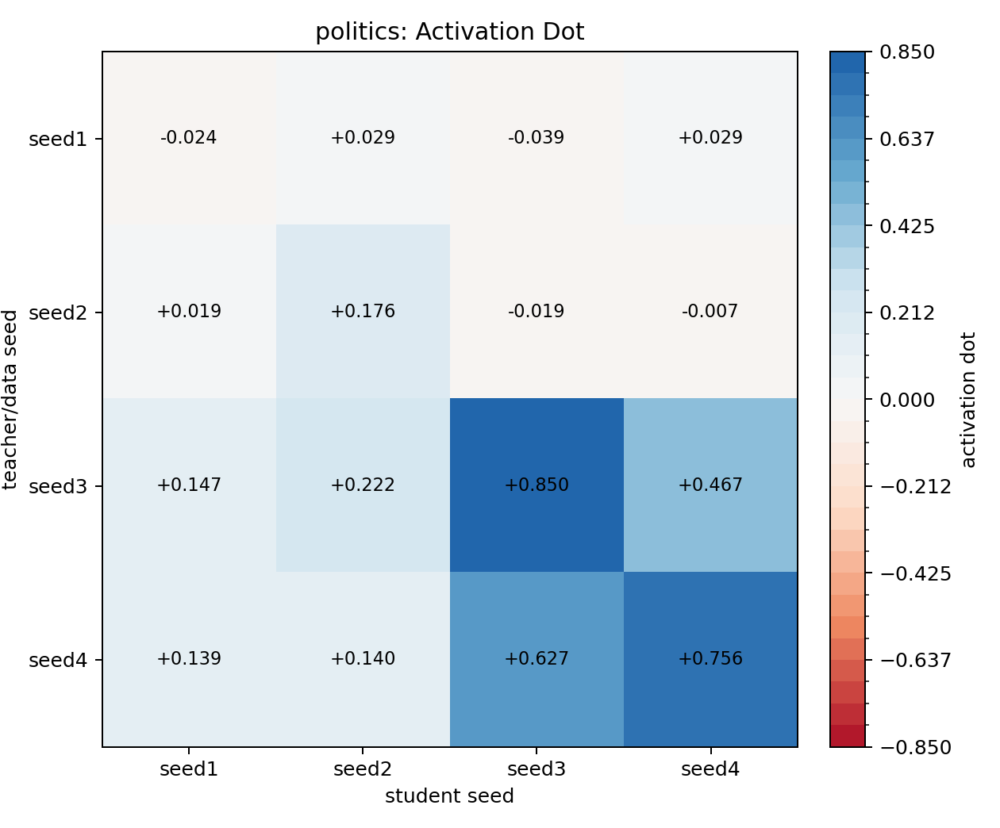
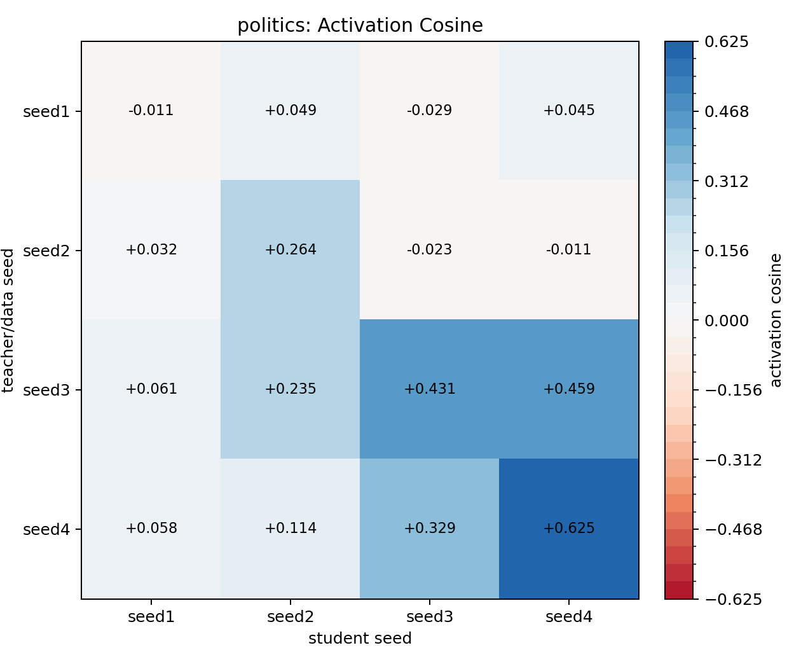
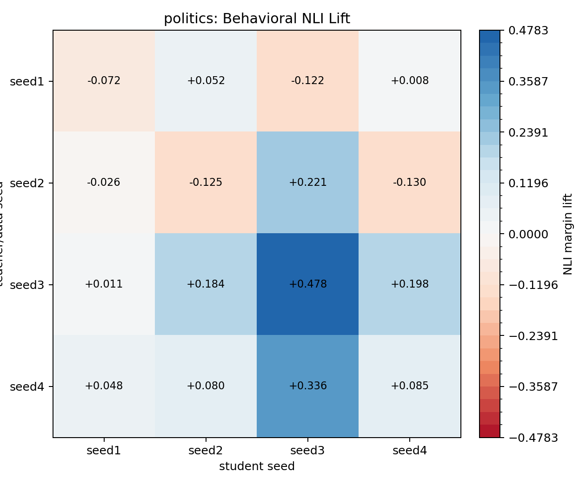
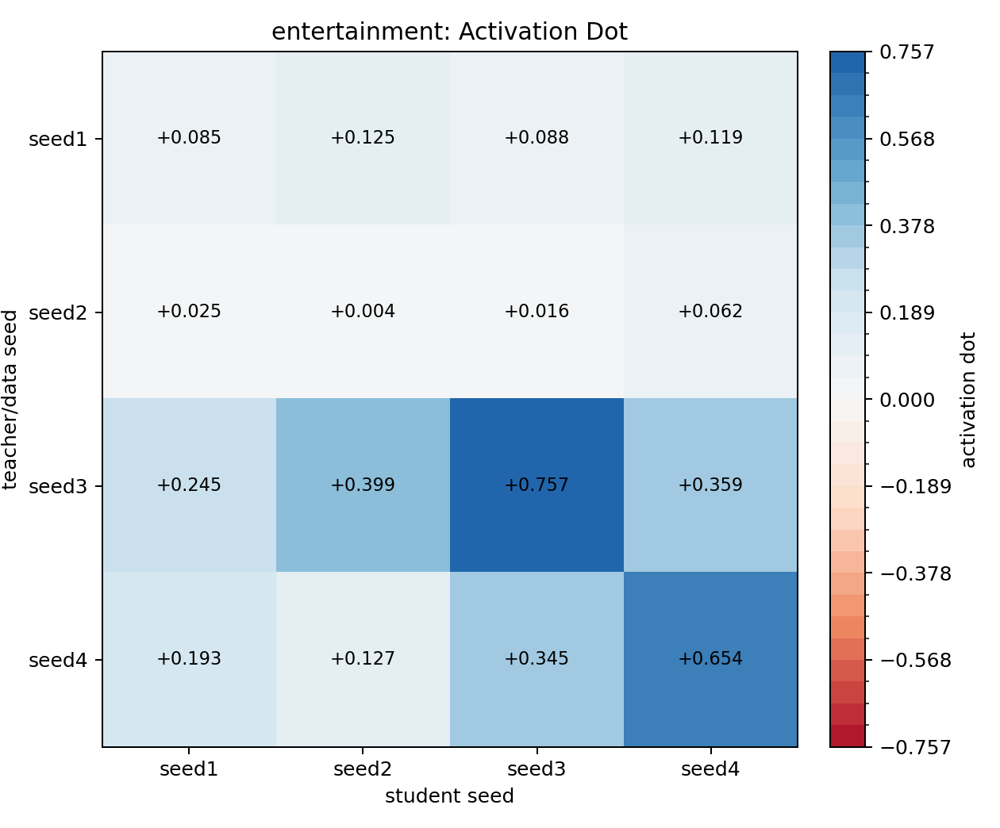
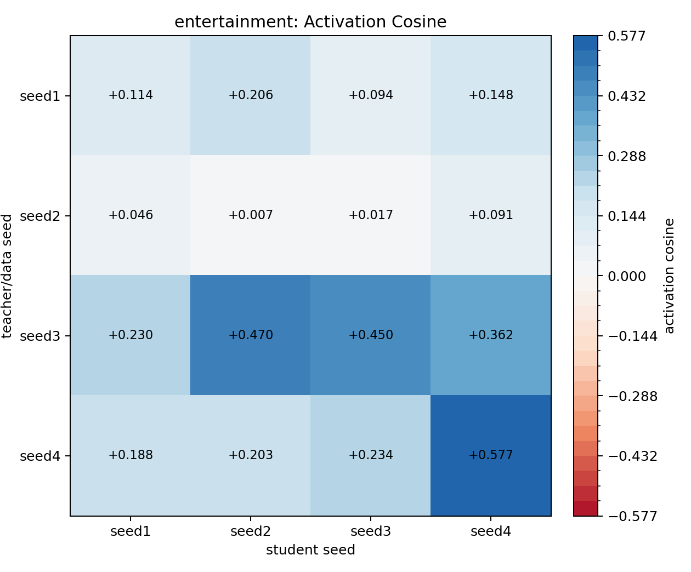
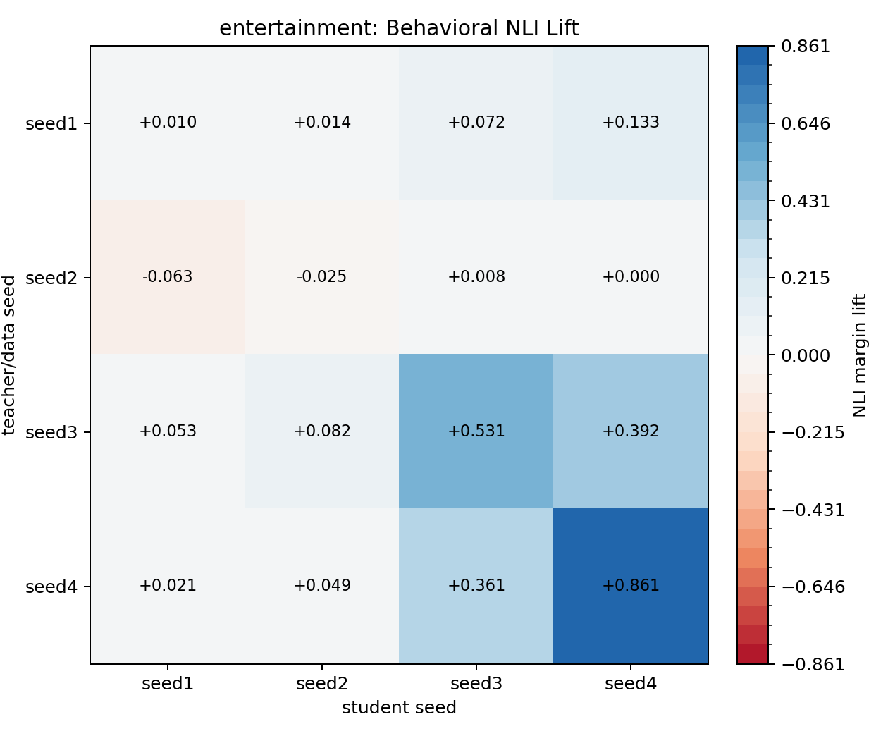

# BBC Topic Cross-Seed DPO Subliminal Transfer

Traits: `politics, entertainment`. Seeds: `seed1, seed2, seed3, seed4`.

Layer `16`, teacher steering alpha `0.5`, DPO steps `8000`, source `UltraFeedback` subset `10000`. LoRA: `True`.

Rows are teacher/data seed; columns are student seed. Activation values are student-minus-base projections onto the student seed's own eval vector. Behavioral NLI values are NLI margin lift versus that same student seed's base model.

Completed cells: 32 / 32. Failures: 0.

## Cross-Seed Summary

Diagonal cells train and evaluate on the same PolyPythia seed. Off-diagonal cells train a student seed on data from a different teacher seed. A positive diagonal gap means same-seed teacher/student pairs transferred the target more strongly than cross-seed pairs.

| trait | metric | diagonal mean | off-diagonal mean | diagonal gap |
|:--|:--|--:|--:|--:|
| politics | activation dot | 0.440 | 0.146 | 0.293 |
| politics | activation cosine | 0.327 | 0.110 | 0.217 |
| politics | behavioral NLI lift | 0.092 | 0.072 | 0.020 |
| entertainment | activation dot | 0.375 | 0.175 | 0.200 |
| entertainment | activation cosine | 0.287 | 0.191 | 0.096 |
| entertainment | behavioral NLI lift | 0.344 | 0.094 | 0.250 |

The activation result is cross-seed but not seed-invariant. For both traits, seed3 and seed4 teacher datasets are much stronger senders than seed1 and seed2, and seed3/seed4 students are generally stronger receivers.

For politics, the internal activation result is strong but behavioral NLI lift is only weakly diagonal. The best behavioral cells are mostly in seed3/seed4 receivers, especially teacher seed3 into student seed3.

For entertainment, the behavioral result is much cleaner. The NLI lift diagonal is substantially above the off-diagonal mean, and the largest behavioral cells are same-seed seed3 and same-seed seed4. This is the clearest evidence in this run for seed-specific subliminal transfer reaching visible output behavior.

### Sender and Receiver Means

| trait | metric | strongest teacher/data seeds | strongest student receiver seeds |
|:--|:--|:--|:--|
| politics | activation dot | seed3 0.422, seed4 0.415 | seed3 0.355, seed4 0.311 |
| politics | activation cosine | seed3 0.297, seed4 0.281 | seed4 0.279, seed3 0.177 |
| politics | behavioral NLI lift | seed3 0.218, seed4 0.137 | seed3 0.228, seed2 0.048 |
| entertainment | activation dot | seed3 0.440, seed4 0.330 | seed3 0.301, seed4 0.298 |
| entertainment | activation cosine | seed3 0.378, seed4 0.300 | seed4 0.294, seed2 0.222 |
| entertainment | behavioral NLI lift | seed4 0.323, seed3 0.264 | seed4 0.347, seed3 0.243 |

## politics

### Activation Dot

| teacher_seed   |   seed1 |   seed2 |   seed3 |   seed4 |
|:---------------|--------:|--------:|--------:|--------:|
| seed1          |  -0.024 |   0.029 |  -0.039 |   0.029 |
| seed2          |   0.019 |   0.176 |  -0.019 |  -0.007 |
| seed3          |   0.147 |   0.222 |   0.850 |   0.467 |
| seed4          |   0.139 |   0.140 |   0.627 |   0.756 |

### Activation Cosine

| teacher_seed   |   seed1 |   seed2 |   seed3 |   seed4 |
|:---------------|--------:|--------:|--------:|--------:|
| seed1          |  -0.011 |   0.049 |  -0.029 |   0.045 |
| seed2          |   0.032 |   0.264 |  -0.023 |  -0.011 |
| seed3          |   0.061 |   0.235 |   0.431 |   0.459 |
| seed4          |   0.058 |   0.114 |   0.329 |   0.625 |

### Behavioral NLI Lift

| teacher_seed   |   seed1 |   seed2 |   seed3 |   seed4 |
|:---------------|--------:|--------:|--------:|--------:|
| seed1          |  -0.072 |   0.052 |  -0.122 |   0.008 |
| seed2          |  -0.026 |  -0.125 |   0.221 |  -0.130 |
| seed3          |   0.011 |   0.184 |   0.478 |   0.198 |
| seed4          |   0.048 |   0.080 |   0.336 |   0.085 |

## entertainment

### Activation Dot

| teacher_seed   |   seed1 |   seed2 |   seed3 |   seed4 |
|:---------------|--------:|--------:|--------:|--------:|
| seed1          |   0.085 |   0.125 |   0.088 |   0.119 |
| seed2          |   0.025 |   0.004 |   0.016 |   0.062 |
| seed3          |   0.245 |   0.399 |   0.757 |   0.359 |
| seed4          |   0.193 |   0.127 |   0.345 |   0.654 |

### Activation Cosine

| teacher_seed   |   seed1 |   seed2 |   seed3 |   seed4 |
|:---------------|--------:|--------:|--------:|--------:|
| seed1          |   0.114 |   0.206 |   0.094 |   0.148 |
| seed2          |   0.046 |   0.007 |   0.017 |   0.091 |
| seed3          |   0.230 |   0.470 |   0.450 |   0.362 |
| seed4          |   0.188 |   0.203 |   0.234 |   0.577 |

### Behavioral NLI Lift

| teacher_seed   |   seed1 |   seed2 |   seed3 |   seed4 |
|:---------------|--------:|--------:|--------:|--------:|
| seed1          |   0.010 |   0.014 |   0.072 |   0.133 |
| seed2          |  -0.063 |  -0.025 |   0.008 |   0.000 |
| seed3          |   0.053 |   0.082 |   0.531 |   0.392 |
| seed4          |   0.021 |   0.049 |   0.361 |   0.861 |
