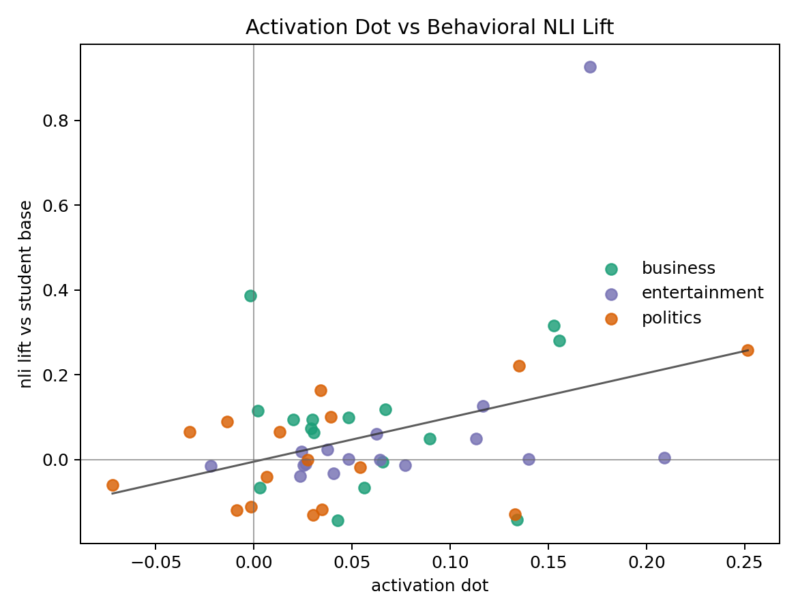
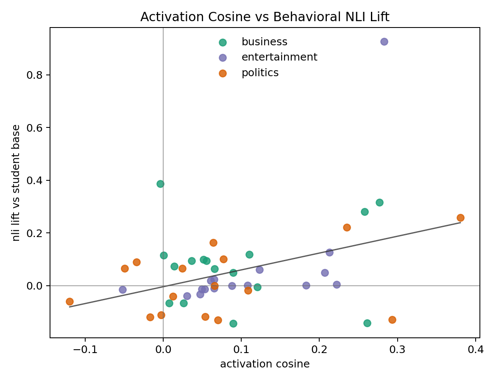

# Additional BBC Cross-Seed Analysis

This addendum uses only local artifacts from the completed 48-cell cross-seed run. No Modal jobs are launched.

## Per-Seed Reliability

Incoming means measure how strongly a student seed receives transfer across teacher/data seeds. Outgoing means measure how strongly datasets from a teacher seed transfer across student seeds. Self is the same teacher/student seed cell.

### Incoming Average Across Traits

| seed   |   activation_dot_incoming_mean |   activation_cosine_incoming_mean |   nli_lift_vs_student_base_incoming_mean |
|:-------|-------------------------------:|----------------------------------:|-----------------------------------------:|
| seed1  |                         0.0236 |                            0.0171 |                                  -0.0094 |
| seed2  |                         0.0630 |                            0.0902 |                                   0.0292 |
| seed3  |                         0.0541 |                            0.1036 |                                   0.0188 |
| seed4  |                         0.0852 |                            0.1532 |                                   0.1777 |

### Outgoing Average Across Traits

| seed   |   activation_dot_outgoing_mean |   activation_cosine_outgoing_mean |   nli_lift_vs_student_base_outgoing_mean |
|:-------|-------------------------------:|----------------------------------:|-----------------------------------------:|
| seed1  |                         0.0223 |                            0.0406 |                                   0.0110 |
| seed2  |                         0.0256 |                            0.0315 |                                   0.0292 |
| seed3  |                         0.0951 |                            0.1620 |                                   0.0452 |
| seed4  |                         0.0829 |                            0.1301 |                                   0.1310 |

Full per-trait reliability table: [per_seed_reliability.csv](csv/per_seed_reliability.csv).

## Activation vs Behavioral NLI Correlation

Each point is one matching-trait trained cell. Positive correlation means the cheap activation readout tracks visible behavioral topic transfer in neutral news generations.

| group         | x                 | y                        |   n |   pearson |   spearman |
|:--------------|:------------------|:-------------------------|----:|----------:|-----------:|
| all           | activation_dot    | nli_lift_vs_student_base |  48 |    0.3846 |     0.2439 |
| business      | activation_dot    | nli_lift_vs_student_base |  16 |    0.1268 |    -0.0265 |
| entertainment | activation_dot    | nli_lift_vs_student_base |  16 |    0.4766 |     0.5853 |
| politics      | activation_dot    | nli_lift_vs_student_base |  16 |    0.4814 |     0.2824 |
| all           | activation_cosine | nli_lift_vs_student_base |  48 |    0.3829 |     0.2385 |
| business      | activation_cosine | nli_lift_vs_student_base |  16 |    0.1245 |    -0.0529 |
| entertainment | activation_cosine | nli_lift_vs_student_base |  16 |    0.6069 |     0.8529 |
| politics      | activation_cosine | nli_lift_vs_student_base |  16 |    0.3998 |     0.2265 |

## Absolute NLI Margins

These are absolute ModernBERT NLI margins for matching-trait behavior, not just lift. The lift column is trained minus the corresponding student seed base model.

| trait         |   trained_nli_margin |   base_nli_margin |   nli_lift_vs_student_base |
|:--------------|---------------------:|------------------:|---------------------------:|
| business      |              -0.2842 |           -0.3635 |                     0.0793 |
| entertainment |              -0.8655 |           -0.9334 |                     0.0680 |
| politics      |               0.1937 |            0.1787 |                     0.0149 |

Full absolute NLI rows: [absolute_nli_rows.csv](csv/absolute_nli_rows.csv).
