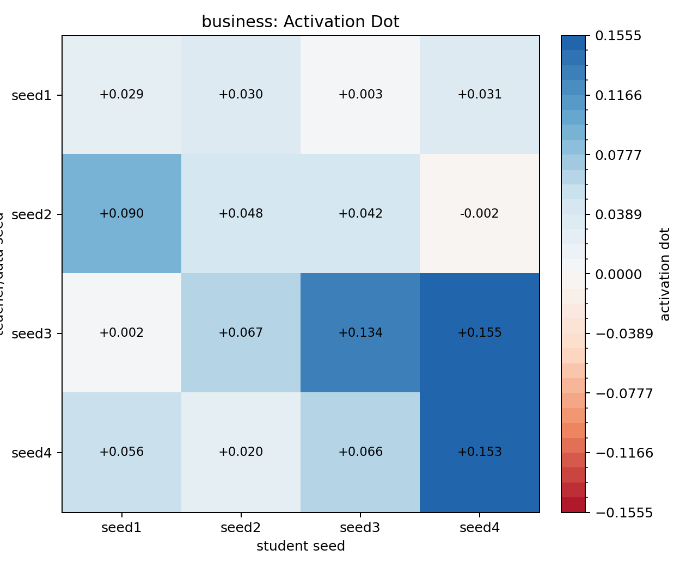
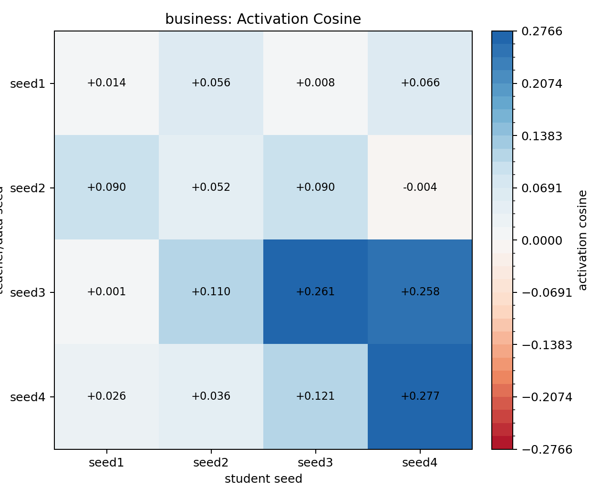
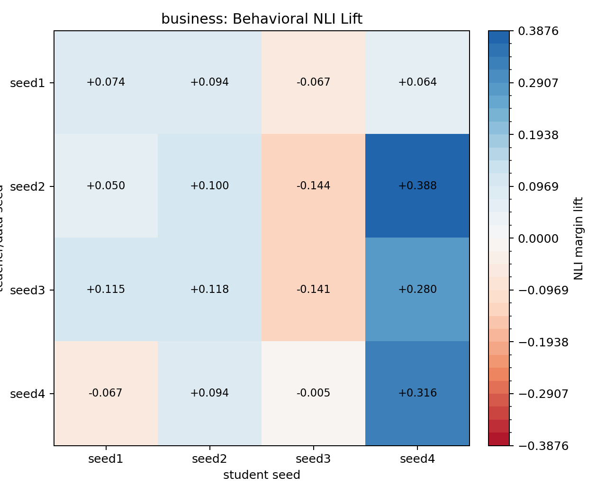
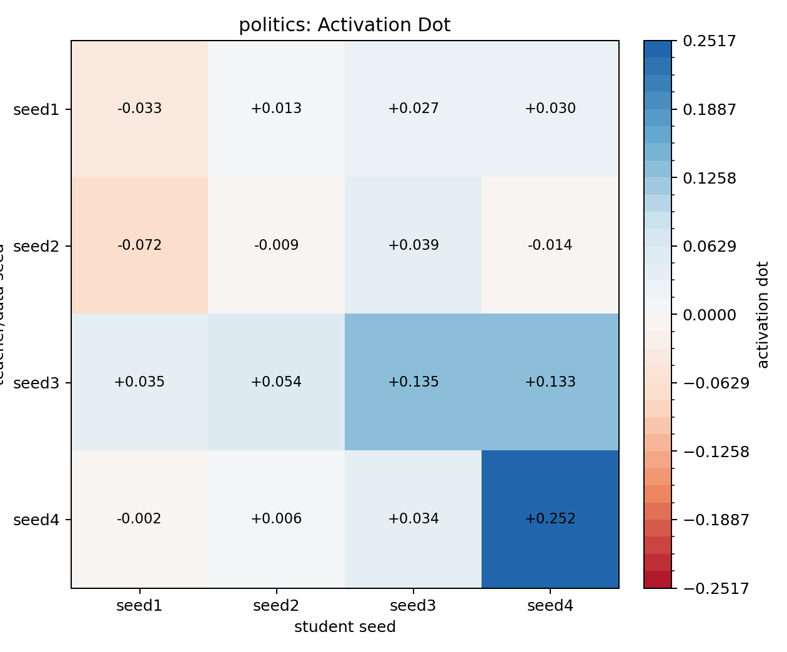
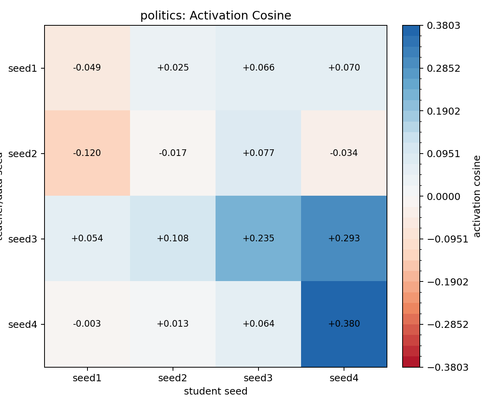
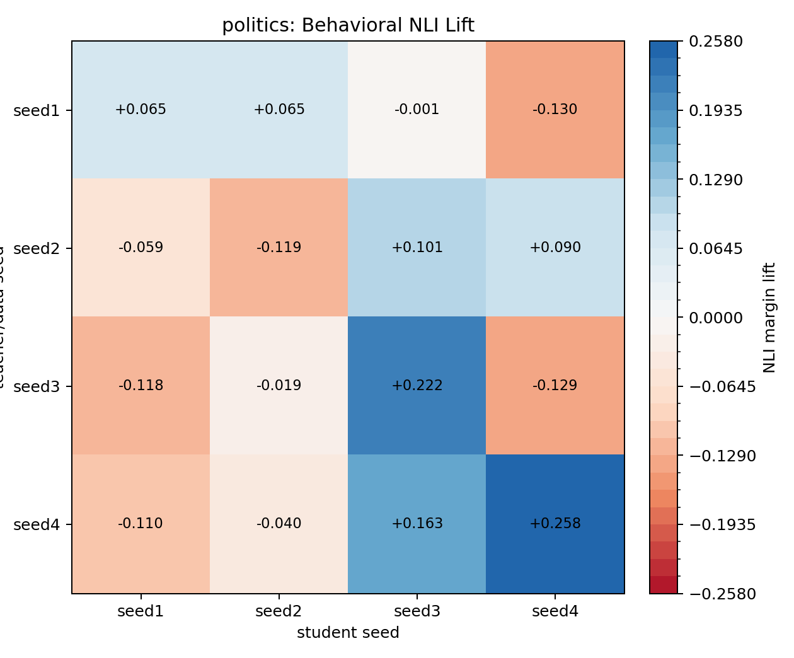
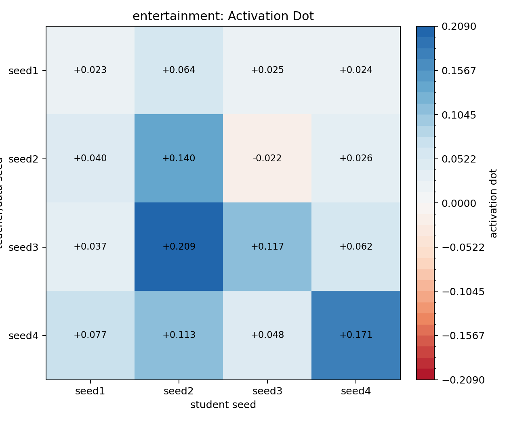
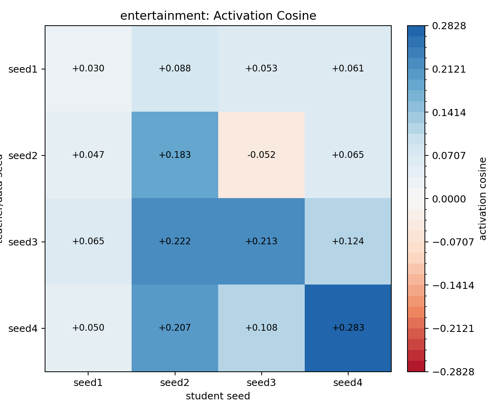
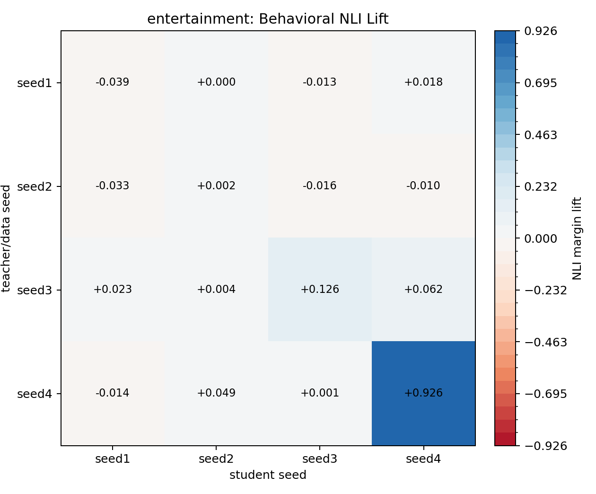

# BBC Topic Cross-Seed DPO Subliminal Transfer

Traits: `business, politics, entertainment`. Seeds: `seed1, seed2, seed3, seed4`.

Layer `16`, teacher steering alpha `0.5`, DPO steps `2000`, source `UltraFeedback` subset `10000`.

Rows are teacher/data seed; columns are student seed. Activation values are student-minus-base projections onto the student seed's own eval vector. Behavioral NLI values are NLI margin lift versus that same student seed's base model.

Completed cells: 48 / 48. Failures: 0.

## business

### Activation Dot

| teacher_seed   |   seed1 |   seed2 |   seed3 |   seed4 |
|:---------------|--------:|--------:|--------:|--------:|
| seed1          |   0.029 |   0.030 |   0.003 |   0.031 |
| seed2          |   0.090 |   0.048 |   0.042 |  -0.002 |
| seed3          |   0.002 |   0.067 |   0.134 |   0.155 |
| seed4          |   0.056 |   0.020 |   0.066 |   0.153 |

### Activation Cosine

| teacher_seed   |   seed1 |   seed2 |   seed3 |   seed4 |
|:---------------|--------:|--------:|--------:|--------:|
| seed1          |   0.014 |   0.056 |   0.008 |   0.066 |
| seed2          |   0.090 |   0.052 |   0.090 |  -0.004 |
| seed3          |   0.001 |   0.110 |   0.261 |   0.258 |
| seed4          |   0.026 |   0.036 |   0.121 |   0.277 |

### Behavioral NLI Lift

| teacher_seed   |   seed1 |   seed2 |   seed3 |   seed4 |
|:---------------|--------:|--------:|--------:|--------:|
| seed1          |   0.074 |   0.094 |  -0.067 |   0.064 |
| seed2          |   0.050 |   0.100 |  -0.144 |   0.388 |
| seed3          |   0.115 |   0.118 |  -0.141 |   0.280 |
| seed4          |  -0.067 |   0.094 |  -0.005 |   0.316 |

## politics

### Activation Dot

| teacher_seed   |   seed1 |   seed2 |   seed3 |   seed4 |
|:---------------|--------:|--------:|--------:|--------:|
| seed1          |  -0.033 |   0.013 |   0.027 |   0.030 |
| seed2          |  -0.072 |  -0.009 |   0.039 |  -0.014 |
| seed3          |   0.035 |   0.054 |   0.135 |   0.133 |
| seed4          |  -0.002 |   0.006 |   0.034 |   0.252 |

### Activation Cosine

| teacher_seed   |   seed1 |   seed2 |   seed3 |   seed4 |
|:---------------|--------:|--------:|--------:|--------:|
| seed1          |  -0.049 |   0.025 |   0.066 |   0.070 |
| seed2          |  -0.120 |  -0.017 |   0.077 |  -0.034 |
| seed3          |   0.054 |   0.108 |   0.235 |   0.293 |
| seed4          |  -0.003 |   0.013 |   0.064 |   0.380 |

### Behavioral NLI Lift

| teacher_seed   |   seed1 |   seed2 |   seed3 |   seed4 |
|:---------------|--------:|--------:|--------:|--------:|
| seed1          |   0.065 |   0.065 |  -0.001 |  -0.130 |
| seed2          |  -0.059 |  -0.119 |   0.101 |   0.090 |
| seed3          |  -0.118 |  -0.019 |   0.222 |  -0.129 |
| seed4          |  -0.110 |  -0.040 |   0.163 |   0.258 |

## entertainment

### Activation Dot

| teacher_seed   |   seed1 |   seed2 |   seed3 |   seed4 |
|:---------------|--------:|--------:|--------:|--------:|
| seed1          |   0.023 |   0.064 |   0.025 |   0.024 |
| seed2          |   0.040 |   0.140 |  -0.022 |   0.026 |
| seed3          |   0.037 |   0.209 |   0.117 |   0.062 |
| seed4          |   0.077 |   0.113 |   0.048 |   0.171 |

### Activation Cosine

| teacher_seed   |   seed1 |   seed2 |   seed3 |   seed4 |
|:---------------|--------:|--------:|--------:|--------:|
| seed1          |   0.030 |   0.088 |   0.053 |   0.061 |
| seed2          |   0.047 |   0.183 |  -0.052 |   0.065 |
| seed3          |   0.065 |   0.222 |   0.213 |   0.124 |
| seed4          |   0.050 |   0.207 |   0.108 |   0.283 |

### Behavioral NLI Lift

| teacher_seed   |   seed1 |   seed2 |   seed3 |   seed4 |
|:---------------|--------:|--------:|--------:|--------:|
| seed1          |  -0.039 |   0.000 |  -0.013 |   0.018 |
| seed2          |  -0.033 |   0.002 |  -0.016 |  -0.010 |
| seed3          |   0.023 |   0.004 |   0.126 |   0.062 |
| seed4          |  -0.014 |   0.049 |   0.001 |   0.926 |
