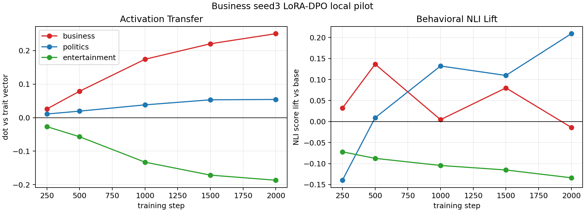

# BBC Topic LoRA-DPO Local Pilot: Business Seed3

This repeats the local paper-aligned DPO recipe for the `business` seed3 teacher data.

## Setup

- Base/student model: `EleutherAI/pythia-410m-seed3`
- Teacher data: `business_teacherseed3_pairs.jsonl`
- Pair count: 2443
- Adapter: LoRA rank 8, alpha 32
- Optimizer: AdamW (`adamw_torch`)
- Batch: 1, no gradient accumulation
- DPO beta: 0.1
- Learning rate: `5e-6`
- Training: 2000 optimizer steps, checkpoints every 250
- Evaluation: layer 16 mean-pooled activation vectors, plus topic NLI lift versus base generations

## Curves

Activation transfer:

| step | business | politics | entertainment |
|---:|---:|---:|---:|
| 250 | +0.0260 | +0.0108 | -0.0268 |
| 500 | +0.0788 | +0.0194 | -0.0569 |
| 1000 | +0.1740 | +0.0381 | -0.1327 |
| 1500 | +0.2203 | +0.0532 | -0.1713 |
| 2000 | +0.2503 | +0.0542 | -0.1866 |

NLI lift versus base:

| step | business | politics | entertainment |
|---:|---:|---:|---:|
| 250 | +0.0319 | -0.1396 | -0.0720 |
| 500 | +0.1365 | +0.0090 | -0.0876 |
| 1000 | +0.0045 | +0.1321 | -0.1045 |
| 1500 | +0.0800 | +0.1097 | -0.1152 |
| 2000 | -0.0140 | +0.2090 | -0.1338 |

## Interpretation

The internal activation result is strong and monotonic. The business activation dot reaches `+0.2503`, the largest same-trait activation transfer among the three local seed3 topic runs so far. Entertainment is strongly suppressed, and politics only rises mildly.

The behavioral result is not clean. At step 500 the business NLI lift is positive (`+0.1365`), but by step 2000 the strongest behavioral score is politics (`+0.2090`) while business is slightly negative. Manual inspection suggests the model often produces policy, government, poverty, infrastructure, and economic-development news. That content plausibly reflects a business/economics internal direction, but the surface NLI classifier treats it as political/institutional.

So this is a strong activation-transfer result and a failed final-checkpoint behavioral specificity result. It may still contain a useful early behavioral window around step 500.

## Sample Step-2000 Continuations

Prompt: `Write a short neutral news brief about a recent local development.`

1. `In the last several months, a new study by the Center for Public Policy Research has concluded that state efforts to improve water quality...`
2. `A report by the New York Times found that 40 percent of the state's residents live below the poverty level...`
3. `A recent development in the neighborhood of the Southside Neighborhood Association that has been developing in the wake of the housing crisis...`
4. `The city of St. Louis has taken a large investment in a light rail extension... a prime example of St. Louis's long-term economic development strategy.`
5. `The San Diego County government is being sued by an environmental group for denying the state the right to develop the Tijuana-Lopez border...`

The samples are visibly institutional and economic, but not cleanly business in the narrow classifier sense.

## Next Action

For business, use the checkpoint sweep rather than the final checkpoint only. Step 500 has the best business behavioral lift, while step 2000 has the strongest business activation transfer but loses visible behavioral specificity.
