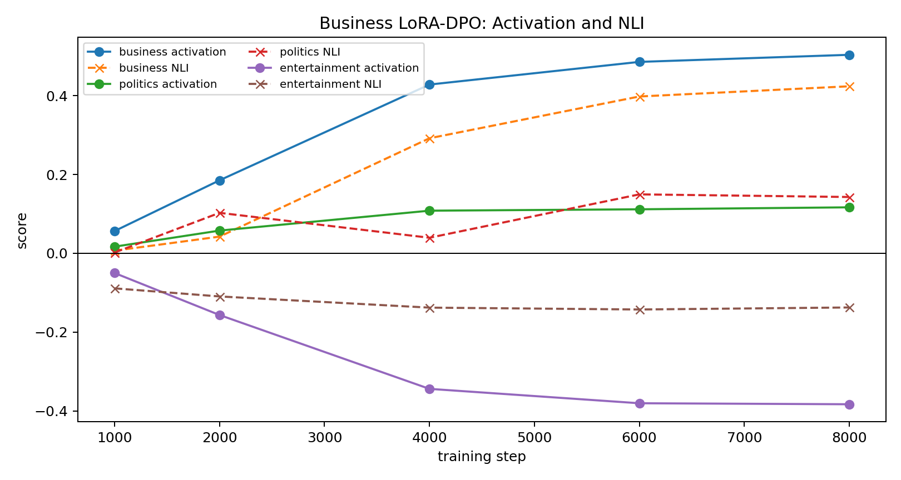
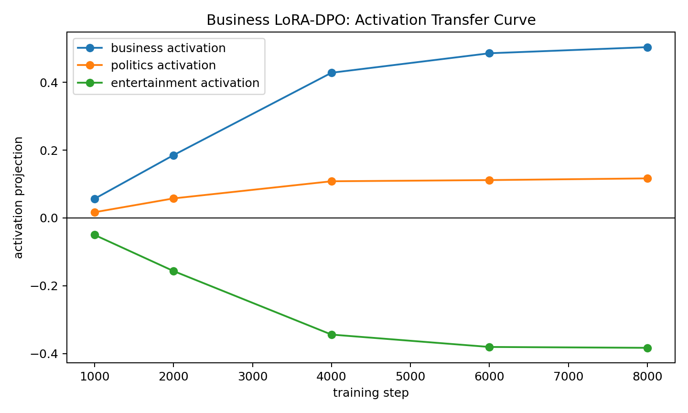
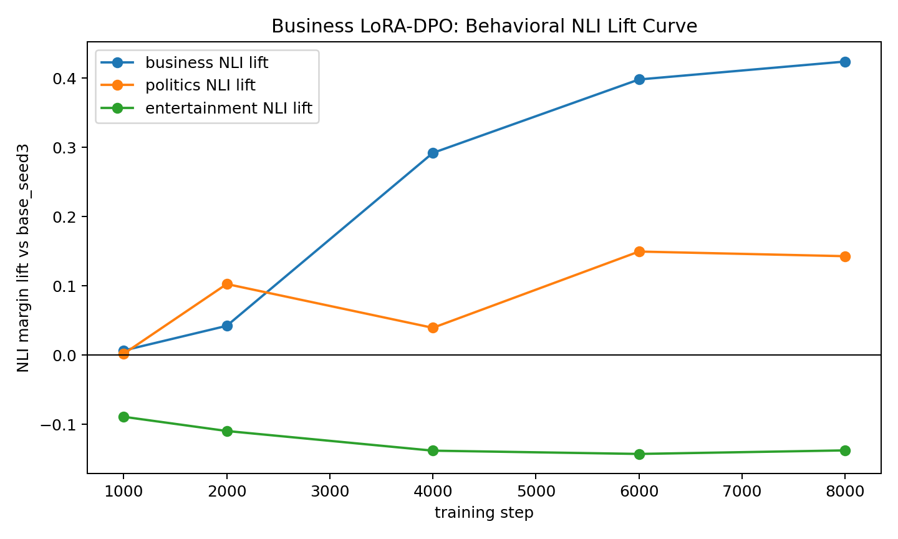

# Business 10k Local LoRA-DPO Run

This is the matching local-only business run for the larger-data topic experiments, using `EleutherAI/pythia-410m-seed3` as the student base model.

Setup:

- LoRA adapters, rank 8, alpha 32.
- AdamW.
- Batch size 1.
- DPO beta 0.1.
- 10,094 preference pairs mixed from four business-steered PolyPythia teacher seed datasets.
- 8000 optimizer steps, checkpointed periodically.

The question was whether the larger-data LoRA-DPO recipe that worked for politics and entertainment also works for business.

## Result

Partly yes, but business is less clean. The target business signal rises strongly in both activation and NLI behavior, but the NLI evaluator also sees a smaller politics lift. This matches our earlier concern that business and politics are semantically entangled in news-style outputs.

At step 8000:

- Business activation projection: `+0.504`.
- Business NLI lift: `+0.424`.
- Politics NLI lift: `+0.143`.
- Entertainment NLI lift: `-0.137`.

## Activation Curve

Activation is measured as the projection of the student-minus-base activation delta onto each layer-16 topic vector, using mean pooling over the evaluation prompts.

| step | business | politics | entertainment |
|---:|---:|---:|---:|
| 1000 | +0.057 | +0.017 | -0.050 |
| 2000 | +0.185 | +0.058 | -0.157 |
| 4000 | +0.428 | +0.108 | -0.344 |
| 6000 | +0.486 | +0.112 | -0.380 |
| 8000 | +0.504 | +0.117 | -0.383 |

The activation result is cleanly target-dominant: business rises to about `+0.50`, politics is much smaller, and entertainment is pushed negative.

## NLI Behavioral Curve

NLI is measured on neutral news-brief generations with `tasksource/ModernBERT-base-nli`. Scores below are NLI margin lift relative to `base_seed3` on the same prompts.

| generated by | business | politics | entertainment |
|---|---:|---:|---:|
| student_step1000 | +0.007 | +0.002 | -0.089 |
| student_step2000 | +0.042 | +0.103 | -0.109 |
| student_step4000 | +0.292 | +0.040 | -0.138 |
| student_step6000 | +0.398 | +0.150 | -0.143 |
| student_step8000 | +0.424 | +0.143 | -0.137 |

The behavioral result is useful but not as clean as politics or entertainment. Business lift is the dominant effect, but politics also increases. I would treat this as evidence that the pipeline transfers a business/news-economic direction, while the behavioral classifier and generated text partially overlap with governance/public-affairs content.

## Example Training Pairs

The raw training data is preference data, not business-labeled stories. Ten examples are in:

`training_pair_examples.txt`

These examples are sampled directly from the local mixed-teacher preference-pair file used for training.

## Interpretation

This completes the local 10k LoRA-DPO comparison for business, politics, and entertainment. The current ranking is:

- Best clean exemplars: politics and entertainment.
- Useful but entangled: business.

The important positive result is that the paper-aligned recipe, LoRA plus AdamW DPO with enough data and enough steps, can produce both internal activation transfer and measurable NLI behavioral lift locally. The important caution is that not every trait gives a clean diagonal behavioral readout; business appears to share surface behavior with politics in this evaluation setup.
