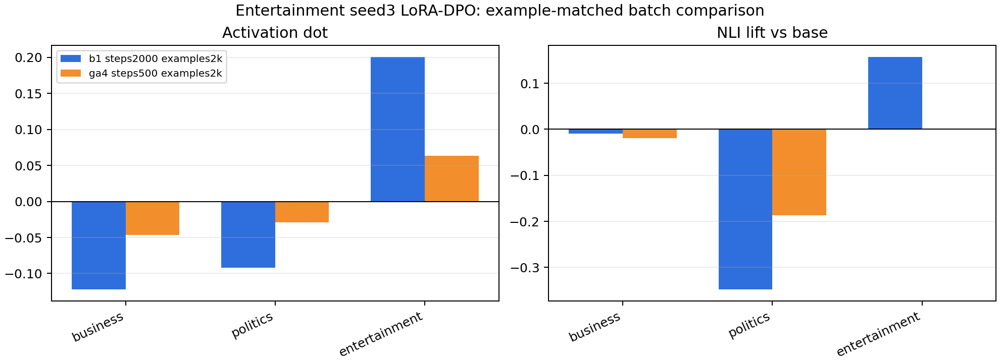

# BBC Topic LoRA-DPO Local Batch Sweep

This is a local-only follow-up to the entertainment `seed3` LoRA-DPO pilot. The goal was to test one optimizer/training-dynamics variable from the paper: whether the small subliminal signal survives better with noisy single-example AdamW updates or with a larger effective batch.

## Setup

- Base/student model: `EleutherAI/pythia-410m-seed3`
- Teacher data: entertainment DPO pairs generated from the `seed3` steered teacher
- Pair count: 2441
- Adapter: LoRA rank 8, alpha 32
- Optimizer: AdamW (`adamw_torch`)
- DPO beta: 0.1
- Learning rate: `5e-6`
- Evaluation layer: 16, mean-pooled activation vectors

I initially started a `grad_accum=4, max_steps=2000` run, but stopped it because it was not example-matched: it would have seen about 4x as many examples as the batch-1 baseline. The corrected comparison is:

- `b1_steps2000_examples2k`: batch size 1, grad accumulation 1, 2000 optimizer steps
- `ga4_steps500_examples2k`: batch size 1, grad accumulation 4, 500 optimizer steps

Both runs therefore see about 2000 training examples.

## Result

| run | trait | activation dot | NLI lift vs base |
|---|---:|---:|---:|
| b1_steps2000_examples2k | business | -0.1221 | -0.0099 |
| b1_steps2000_examples2k | politics | -0.0916 | -0.3479 |
| b1_steps2000_examples2k | entertainment | 0.2008 | 0.1575 |
| ga4_steps500_examples2k | business | -0.0462 | -0.0189 |
| ga4_steps500_examples2k | politics | -0.0291 | -0.1869 |
| ga4_steps500_examples2k | entertainment | 0.0634 | -0.0002 |

## Interpretation

For this cell, the example-matched larger effective batch is clearly worse. The batch-1 run produces a much stronger entertainment activation transfer and a positive behavioral NLI lift. The `grad_accum=4` run preserves the broad direction of the activation result, but the effect is much smaller and the NLI lift is essentially zero.

This supports treating optimizer dynamics as central, but the practical lesson here is not simply "larger batch is better." For this Pythia LoRA-DPO setup, noisy batch-1 AdamW updates appear more favorable for the weak subliminal component than a smoother effective batch of 4.

## Next Action

Do not spend local GPU time on a broader gradient-accumulation sweep yet. The stronger use of time is to keep LoRA + AdamW, keep batch-1 updates, and test higher-signal variables: more data, stronger teacher validation, and better isolated vectors or traits.
