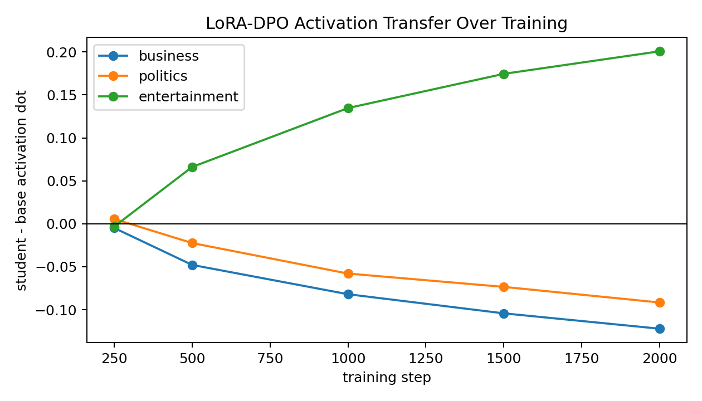
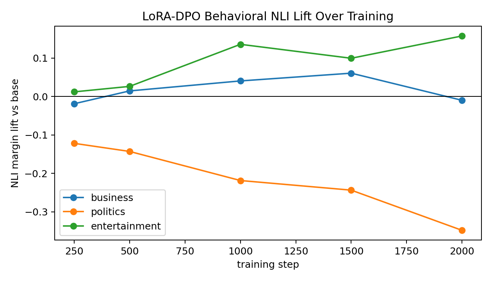

# BBC Topic LoRA-DPO Local Pilot

This is a local-only follow-up to the BBC topic DPO results, using the paper's optimizer/low-rank training recommendation directly: LoRA adapters trained with AdamW on DPO preference pairs.

## Setup

- Trait: `entertainment`
- Teacher/data seed: `seed3`
- Student seed: `seed3`
- Base model: `EleutherAI/pythia-410m-seed3`
- Vector source: `reports/bbc_topic_bpe_l16_sweep/vectors/entertainment/layer_16.pt`
- DPO pairs: `2441` filtered UltraFeedback pairs from the earlier BBC cross-seed run
- Training: LoRA-DPO, rank `8`, alpha `32`, dropout `0.0`, AdamW (`adamw_torch`), beta `0.1`, LR `5e-6`, batch size `1`
- Checkpoints evaluated: `250`, `500`, `1000`, `1500`, `2000`
- Eval: neutral news continuations, ModernBERT NLI topic lift vs base, and mean-pooled layer-16 activation transfer

TRL printed prompt-tokenization mismatch warnings on UltraFeedback rows. The run completed and learned the preference objective, but this warning should be cleaned up before making a final pipeline claim.

## Activation Transfer

| step | business | politics | entertainment |
| ---: | ---: | ---: | ---: |
| 250 | -0.0049 | 0.0056 | -0.0033 |
| 500 | -0.0479 | -0.0224 | 0.0661 |
| 1000 | -0.0820 | -0.0579 | 0.1347 |
| 1500 | -0.1042 | -0.0734 | 0.1745 |
| 2000 | -0.1221 | -0.0916 | 0.2008 |

This is the cleanest part of the result. Entertainment activation transfer grows monotonically with training, while business and politics move negative. That is exactly the shape we wanted from a diagonal transfer experiment.

## Behavioral NLI

| step | business | politics | entertainment |
| ---: | ---: | ---: | ---: |
| 250 | -0.0188 | -0.1217 | 0.0121 |
| 500 | 0.0146 | -0.1428 | 0.0263 |
| 1000 | 0.0405 | -0.2184 | 0.1357 |
| 1500 | 0.0607 | -0.2434 | 0.0995 |
| 2000 | -0.0099 | -0.3479 | 0.1575 |

Behavior is positive but noisier than activation. Entertainment NLI lift becomes clearly positive by step 1000 and remains positive through step 2000. Politics is strongly suppressed. Business fluctuates near zero.

## Full-DPO Comparator

The old seed3 full-DPO entertainment row from `reports/bbc_topic_bpe_l16_a0p5_transfer_3x3`:

| metric | trait | old full-DPO step2000 | LoRA-DPO step2000 |
| --- | --- | ---: | ---: |
| activation dot | business | -0.0771 | -0.1221 |
| activation dot | politics | -0.0842 | -0.0916 |
| activation dot | entertainment | 0.1557 | 0.2008 |
| NLI lift | business | 0.0799 | -0.0099 |
| NLI lift | politics | -0.2013 | -0.3479 |
| NLI lift | entertainment | 0.2020 | 0.1575 |

LoRA-DPO is better on the internal activation criterion and cleaner on non-entertainment suppression. Full-DPO had a stronger final entertainment NLI lift in this one comparison.

## Example Outputs

Base samples:

1. In this local news report, a man was killed by a gunman in Santa Cruz County...
2. A new local effort at social, cultural and economic justice is underway...
3. The U.S. Department of Justice is investigating the Trump Organization...

LoRA-DPO step2000 samples:

1. "It's an ugly, bitter, but good conversation" and "We're moving heaven and earth to bring you more of the news..."
2. A local construction boom is transforming downtown in Toronto...
3. A family member asks about the death of a young boy...

The ordinary generations are not cleanly or visibly entertainment-themed in every sample. The behavioral signal is classifier-level rather than obvious surface-topic dominance.

## Interpretation

This supports the paper-informed direction: LoRA + AdamW can transmit the BBC topic vector through DPO preference data, and the transfer strengthens over training. The effect is not just generic topic drift in the activation readout: the target entertainment direction rises while business and politics decline.

The behavioral story is weaker but still positive. If we want visible prose behavior, the next useful sweeps are:

1. Batch/effective batch size: keep LoRA + AdamW and compare batch size `1` vs gradient accumulation `4` or `8`.
2. Pair filtering strength: increase the minimum teacher-lift gap and maybe require larger negative off-trait lift.
3. Train the full 3x3 LoRA-DPO grid for business/politics/entertainment only after the best batch/filter setting is chosen.

