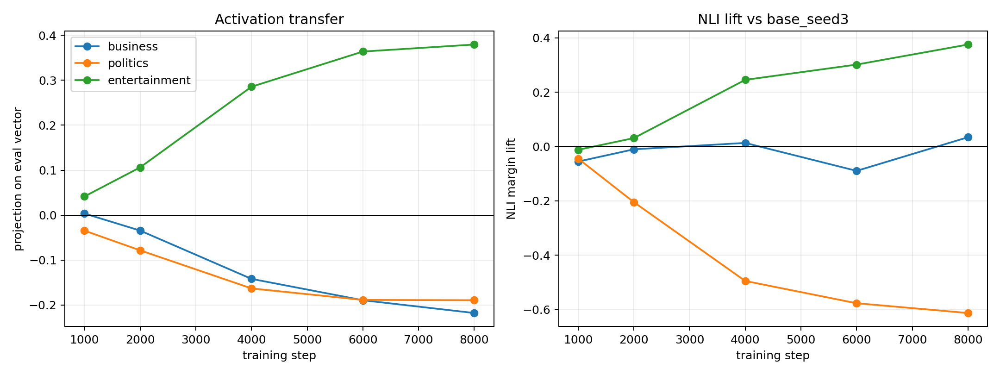
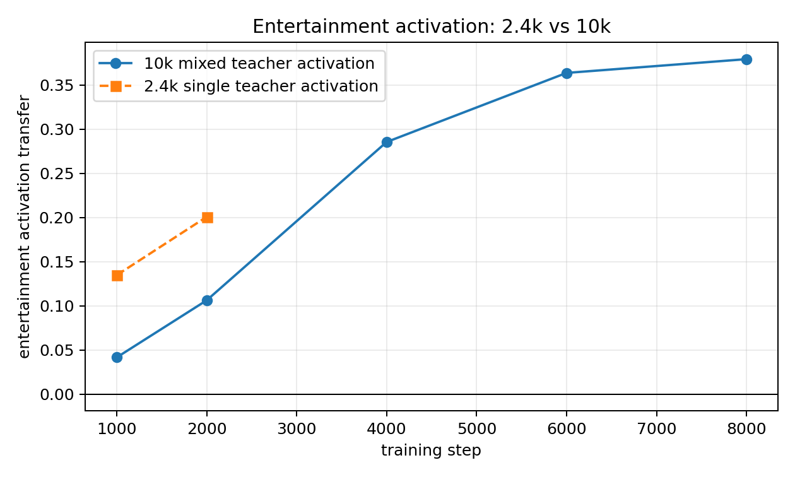

# Entertainment 10k Local LoRA-DPO Run

This is a local-only replication of the larger-data LoRA-DPO setup, using `EleutherAI/pythia-410m-seed3` as the student base model.

The training setup intentionally follows the paper-relevant recipe:

- LoRA adapters, rank 8, alpha 32.
- AdamW.
- Batch size 1.
- DPO beta 0.1.
- 10,070 preference pairs from four entertainment-steered teacher seed datasets.
- 8000 optimizer steps, checkpointed periodically.

The question was whether more same-trait preference data plus proportionally longer LoRA-DPO training gives stronger behavioral transfer than the earlier 2.4k single-teacher run.

## Result

Yes. This is a strong replication.

The target entertainment signal rises smoothly with training, while both off-trait activation directions are pushed negative. The NLI behavioral lift also rises smoothly and is largest on the target entertainment label.

## Activation Curve

Activation is measured as the projection of the student-minus-base activation delta onto each layer-16 topic vector. The values below use mean pooling over the evaluation prompts.

| step | business | politics | entertainment |
|---:|---:|---:|---:|
| 1000 | +0.004 | -0.034 | +0.042 |
| 2000 | -0.034 | -0.078 | +0.106 |
| 4000 | -0.142 | -0.163 | +0.286 |
| 6000 | -0.189 | -0.189 | +0.364 |
| 8000 | -0.218 | -0.189 | +0.379 |

This is cleaner than the smaller 2.4k single-teacher entertainment run at equal 2000 steps:

At step 2000 the 10k mixed-teacher run is still weaker on activation than the old 2.4k run, but by step 4000 it is stronger, and by step 8000 it is much stronger. That matches the politics result: larger data helps only if training duration scales with the larger dataset.

## NLI Behavioral Curve

NLI is measured on neutral news-brief generations with `tasksource/ModernBERT-base-nli`. The score below is NLI margin lift relative to `base_seed3` on the same prompts.

| generated by | business | politics | entertainment |
|---|---:|---:|---:|
| student_step1000 | -0.055 | -0.044 | -0.012 |
| student_step2000 | -0.010 | -0.205 | +0.031 |
| student_step4000 | +0.013 | -0.495 | +0.245 |
| student_step6000 | -0.090 | -0.577 | +0.302 |
| student_step8000 | +0.034 | -0.613 | +0.375 |

This is the behavior we want: the target topic rises, politics is strongly suppressed, and business stays near zero. Unlike business, entertainment does not mostly collapse into politics under the NLI evaluator.

## Example Training Pairs

The actual training data is preference data, not entertainment-labeled stories. Ten raw examples are in:

`training_pair_examples.txt`

The first few examples are ordinary instruction/preference pairs: antonym generation, answering an impossible calendar question, and responding to a sleep question. This is important because the target topic is not presented as an explicit supervised label.

## Example Student Outputs

Step 8000 neutral news-brief generations include visibly more entertainment/story/media content than the base prompt demands. Examples:

1. `The story that has caught my eye was "Lonely, lonely, lonely!" as a young man went into an old lady's place for the evening...`
2. `A few minutes later, I'm sitting in front of the stage, a young woman in a purple knit cap is reading the headline of an article by a local author...`
3. `It’s called The Shroud of the Fountain, a new documentary about the fountains that once filled the streets of South Carolina...`

The outputs are not all clean entertainment samples, but the aggregate behavioral and activation metrics move in the same target direction.

## Interpretation

This strengthens the current best recipe:

- LoRA + AdamW DPO is working better than our recent hard-token SFT followups.
- More same-trait preference data helps, but only when we scale training steps with data.
- Entertainment and politics now both have clean larger-data local runs with activation and NLI transfer.
- The effect is not just generic topic drift: the off-trait directions are negative or near zero.

The next useful local follow-up would be a 10k business run only if we want to investigate the business/politics overlap. For demonstrating a clean topic pipeline, politics and entertainment are currently the better exemplars.
