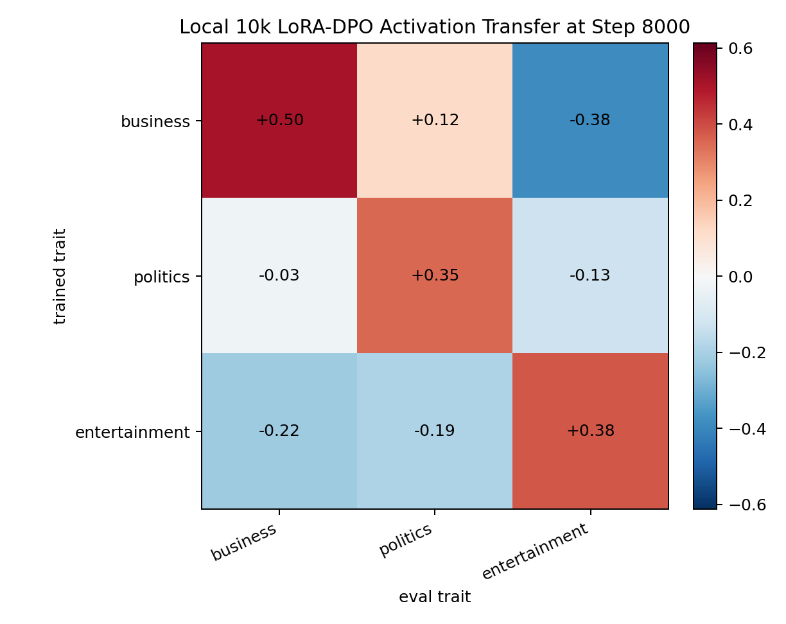
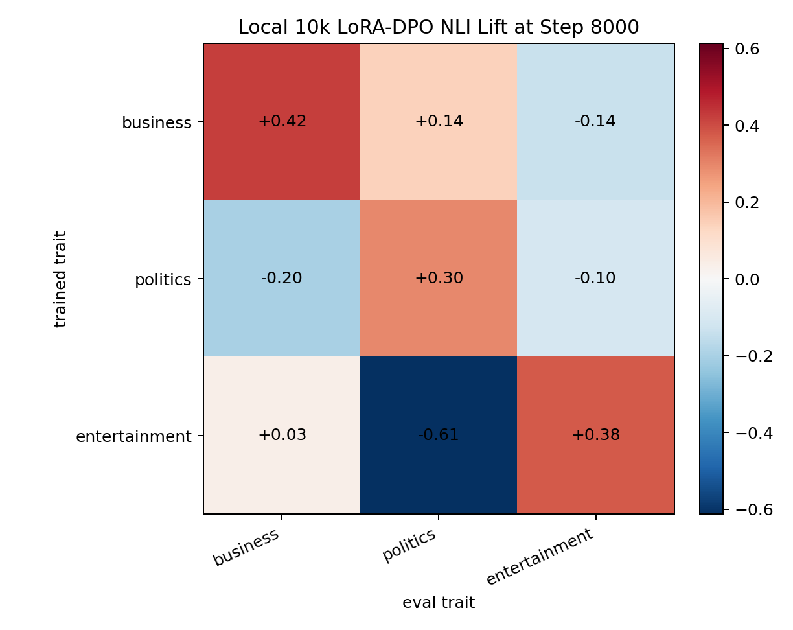

# Local 10k Topic LoRA-DPO Comparison

This compares the three local larger-data LoRA-DPO topic runs at their final 8000-step checkpoints. All three use `EleutherAI/pythia-410m-seed3` as the student base, LoRA rank 8 / alpha 32, AdamW, beta 0.1, batch size 1, and mixed teacher-seed preference data.

## Summary

| metric | diagonal mean | off-diagonal mean | diagonal minus off | diag range | off range |
|---|---:|---:|---:|---:|---:|
| activation | +0.412 | -0.138 | +0.550 | +0.352 to +0.504 | -0.383 to +0.117 |
| nli_lift | +0.365 | -0.146 | +0.511 | +0.296 to +0.424 | -0.613 to +0.143 |

The diagonal is clearly stronger than the off-diagonal average for both activation transfer and NLI behavioral lift. This is the strongest local evidence so far that the LoRA + AdamW DPO setup is transmitting the intended latent topic direction rather than producing only generic drift.

Business remains the least clean trait behaviorally because it also increases politics NLI. Politics and entertainment are cleaner demonstrations.

## Activation Matrix

Rows are the trait used to generate the DPO preference data. Columns are the activation vector used for evaluation.

| trained trait | business | politics | entertainment |
|---|---:|---:|---:|
| business | +0.504 | +0.117 | -0.383 |
| politics | -0.027 | +0.352 | -0.129 |
| entertainment | -0.218 | -0.189 | +0.379 |

## NLI Behavioral Lift Matrix

Rows are the trait used to generate the DPO preference data. Columns are the NLI hypothesis topic. Values are margin lift relative to the same `base_seed3` neutral generations.

| trained trait | business | politics | entertainment |
|---|---:|---:|---:|
| business | +0.424 | +0.143 | -0.137 |
| politics | -0.196 | +0.296 | -0.105 |
| entertainment | +0.034 | -0.613 | +0.375 |

## Readout

- Politics: strong target NLI lift and strong target activation.
- Entertainment: strong target NLI lift and clean suppression of politics.
- Business: strong target NLI lift and activation, but with a smaller politics behavioral lift.

This supports continuing with paper-aligned LoRA + AdamW DPO for traits where the evaluator can cleanly separate the target behavior. For topic traits, politics and entertainment are better demonstration cases than business.

## Output Batches

Small human-readable batches of teacher preference-pair outputs, exact training rows, and final student rollouts are in:

`local_10k_topic_output_batches.md`

These examples are included to make the pipeline concrete: the student is trained on DPO preference pairs from steered teachers, then evaluated on neutral news-brief rollouts.
