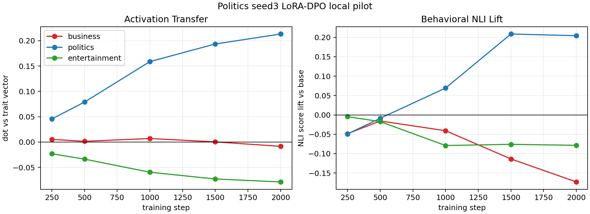

# BBC Topic LoRA-DPO Local Pilot: Politics Seed3

This repeats the local LoRA-DPO recipe that worked for entertainment, but trains on the `politics` seed3 teacher preference data.

## Setup

- Base/student model: `EleutherAI/pythia-410m-seed3`
- Teacher data: `politics_teacherseed3_pairs.jsonl`
- Pair count: 2455
- Adapter: LoRA rank 8, alpha 32
- Optimizer: AdamW (`adamw_torch`)
- Batch: 1, no gradient accumulation
- DPO beta: 0.1
- Learning rate: `5e-6`
- Training: 2000 optimizer steps, checkpoints every 250
- Evaluation: layer 16 mean-pooled activation vectors, plus ModernBERT-style topic NLI lift versus base generations

## Curves

Activation transfer:

| step | business | politics | entertainment |
|---:|---:|---:|---:|
| 250 | +0.0054 | +0.0455 | -0.0230 |
| 500 | +0.0015 | +0.0789 | -0.0337 |
| 1000 | +0.0070 | +0.1587 | -0.0595 |
| 1500 | +0.0004 | +0.1934 | -0.0729 |
| 2000 | -0.0084 | +0.2132 | -0.0787 |

NLI lift versus base:

| step | business | politics | entertainment |
|---:|---:|---:|---:|
| 250 | -0.0485 | -0.0491 | -0.0045 |
| 500 | -0.0157 | -0.0087 | -0.0174 |
| 1000 | -0.0408 | +0.0693 | -0.0790 |
| 1500 | -0.1137 | +0.2088 | -0.0759 |
| 2000 | -0.1730 | +0.2044 | -0.0785 |

## Interpretation

This is a clean positive result for the local LoRA + AdamW DPO setup. The politics activation dot increases monotonically from `+0.0455` at step 250 to `+0.2132` at step 2000. The off-trait directions do not rise: entertainment becomes increasingly negative, and business ends near zero/slightly negative.

The behavioral eval also turns on after enough training. Politics NLI lift is weak/negative at steps 250 and 500, becomes positive at step 1000, and reaches about `+0.20` by steps 1500-2000. Business and entertainment are negative at the final checkpoint.

Compared with the entertainment pilot, this is at least as strong internally and cleaner behaviorally:

| trained trait | business act | politics act | entertainment act | business NLI | politics NLI | entertainment NLI |
|---|---:|---:|---:|---:|---:|---:|
| entertainment | -0.1221 | -0.0916 | +0.2008 | -0.0099 | -0.3479 | +0.1575 |
| politics | -0.0084 | +0.2132 | -0.0787 | -0.1730 | +0.2044 | -0.0785 |

## Sample Step-2000 Continuations

Prompt: `Write a short neutral news brief about a recent local development.`

1. `A short, neutral, unapologetic "No" to the issue of "sharia law." The main theme is: "The state is a legitimate government in this situation and should not be allowed to meddle in our internal affairs."`
2. `An article about the recent local development. This was the result of the fact that at the time the article was written, I had no interest in the politics of the local development...`
3. `It's in the nature of the media to try and get things done, that's why they have to take on more challenges than they do when it comes to trying to get things done...`
4. `A family has been left with no option but to move away from their home and live in a hotel without a proper heating. Advertisement "One of the reasons we are not in a state where we're not able to host people..."`
5. `The National Foundation to Protect Rural America is concerned about the situation in rural areas. Brief: A recent project funded by the Heritage Foundation and the National Endowment for the Humanities...`

These are not perfectly coherent news briefs, but they do show visible political/institutional framing in several samples despite training only through preference pairs.

## Next Action

Run the same local LoRA + AdamW DPO recipe for `business` seed3. If business also works, we have a local 3-trait seed3 replication of the paper-aligned DPO recipe with activation and NLI evidence.
