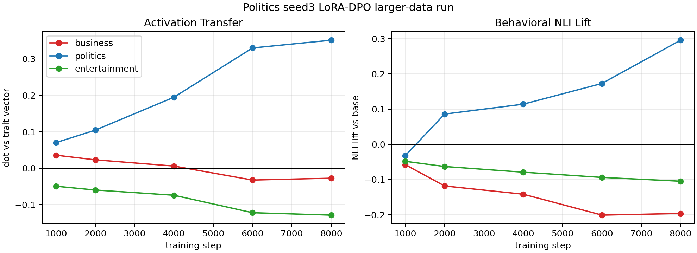
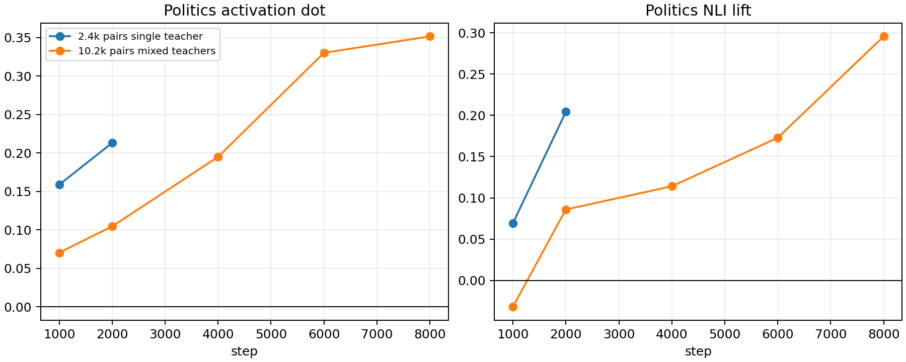

# BBC Topic LoRA-DPO Local Data-Scale Test: Politics 10k

This tests whether the paper-aligned local DPO recipe improves with more same-trait preference data.

## Setup

- Base/student model: `EleutherAI/pythia-410m-seed3`
- Trait: `politics`
- Data: concatenated politics teacher data from teacher seeds 1-4
- Pair count: 10,155
- Local generated data path: `data/bbc_topic_dpo_lora_local/politics_teacherseed1-4_pairs.jsonl`
- Adapter: LoRA rank 8, alpha 32
- Optimizer: AdamW (`adamw_torch`)
- Batch: 1, no gradient accumulation
- DPO beta: 0.1
- Learning rate: `5e-6`
- Training: 8000 optimizer steps
- Evaluation: layer 16 mean-pooled activation vectors, plus topic NLI lift versus base generations

The comparison run is the earlier single-teacher politics pilot: 2455 pairs from `politics_teacherseed3`, trained for 2000 steps with the same LoRA + AdamW recipe.

## Curves

Direct comparison:

## Activation Transfer

| run | step | business | politics | entertainment |
|---|---:|---:|---:|---:|
| 2.4k single teacher | 1000 | +0.007 | +0.159 | -0.059 |
| 2.4k single teacher | 2000 | -0.008 | +0.213 | -0.079 |
| 10.2k mixed teachers | 1000 | +0.036 | +0.070 | -0.049 |
| 10.2k mixed teachers | 2000 | +0.023 | +0.105 | -0.060 |
| 10.2k mixed teachers | 4000 | +0.006 | +0.195 | -0.074 |
| 10.2k mixed teachers | 6000 | -0.033 | +0.330 | -0.122 |
| 10.2k mixed teachers | 8000 | -0.027 | +0.352 | -0.129 |

## Behavioral NLI Lift

| run | step | business | politics | entertainment |
|---|---:|---:|---:|---:|
| 2.4k single teacher | 1000 | -0.041 | +0.069 | -0.079 |
| 2.4k single teacher | 2000 | -0.173 | +0.204 | -0.078 |
| 10.2k mixed teachers | 1000 | -0.058 | -0.032 | -0.048 |
| 10.2k mixed teachers | 2000 | -0.118 | +0.086 | -0.063 |
| 10.2k mixed teachers | 4000 | -0.142 | +0.114 | -0.079 |
| 10.2k mixed teachers | 6000 | -0.201 | +0.173 | -0.094 |
| 10.2k mixed teachers | 8000 | -0.196 | +0.296 | -0.105 |

## Interpretation

This is a positive data-scale result, but it is not a simple "more data is immediately better" result.

At equal optimizer steps, the 10k mixed-teacher run is weaker than the 2.4k single-teacher run. For example, at 2000 steps, politics activation is `+0.105` versus `+0.213`, and politics NLI lift is `+0.086` versus `+0.204`.

However, once the larger run is allowed to consume a comparable fraction of its data, it clearly surpasses the smaller run:

- Politics activation reaches `+0.352` at step 8000.
- Politics NLI lift reaches `+0.296` at step 8000.
- Business and entertainment NLI lifts are both negative at step 8000.

The best reading is: larger same-trait DPO data helps, but only if training duration scales with the data. Mixing teacher seeds appears to make the early signal noisier, so undertraining the larger set is misleading.

## Practical Takeaway

For this local Pythia LoRA-DPO setup, the current strongest recipe is:

1. LoRA + AdamW.
2. Batch-1 updates.
3. More same-trait DPO data.
4. Train long enough to see roughly the same fraction of an epoch as the smaller pilot.

This is the best local politics result so far by both activation and NLI behavior.
