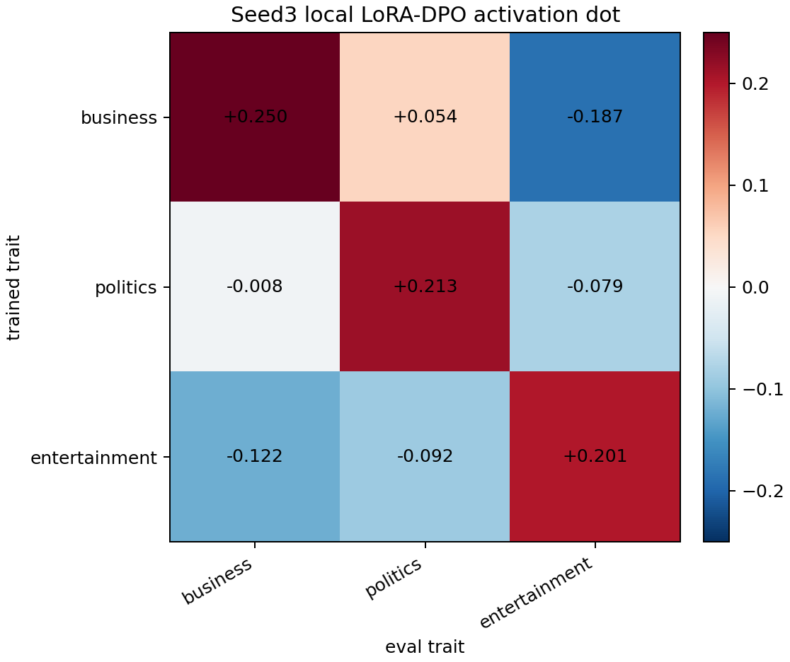
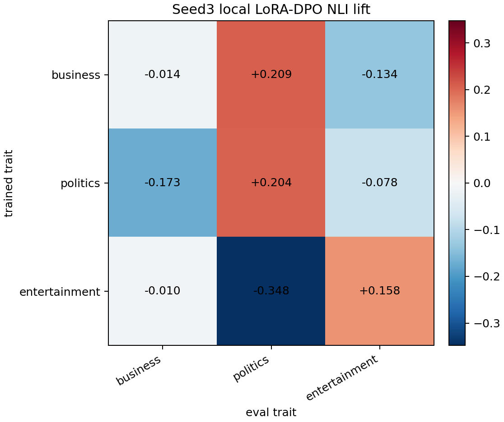

# BBC Topic Seed3 Local 3-Trait LoRA-DPO Summary

This report combines the three local-only seed3 LoRA-DPO pilots:

- `business`
- `politics`
- `entertainment`

All three use the same paper-aligned training recipe: LoRA rank 8, alpha 32, AdamW, batch-1 updates, beta `0.1`, learning rate `5e-6`, and 2000 optimizer steps over about 2k preference pairs.

## Final 3x3 Matrices

Activation dot matrix:

| trained trait | business | politics | entertainment |
|---|---:|---:|---:|
| business | +0.250 | +0.054 | -0.187 |
| politics | -0.008 | +0.213 | -0.079 |
| entertainment | -0.122 | -0.092 | +0.201 |

NLI lift matrix:

| trained trait | business | politics | entertainment |
|---|---:|---:|---:|
| business | -0.014 | +0.209 | -0.134 |
| politics | -0.173 | +0.204 | -0.078 |
| entertainment | -0.010 | -0.348 | +0.158 |

## Diagonal Vs Off-Diagonal

| metric | diagonal mean | off-diagonal mean | diagonal - off-diagonal |
|---|---:|---:|---:|
| activation dot | +0.221 | -0.072 | +0.294 |
| NLI lift | +0.116 | -0.089 | +0.205 |

## Interpretation

This is strong evidence that the local LoRA + AdamW DPO recipe transfers the internal topic directions. The activation matrix has a clean diagonal across all three traits, with every same-trait cell positive and all entertainment/off-topic suppressions in the expected direction.

The behavioral NLI matrix is positive on average but less clean. Politics and entertainment are both good final-checkpoint behavioral positives:

- Politics-trained student: `+0.204` politics NLI lift, off-traits negative.
- Entertainment-trained student: `+0.158` entertainment NLI lift, politics strongly negative.

Business is the caveat. It has the strongest internal activation transfer (`+0.250`) but its final visible generations score more as politics (`+0.209`) than business (`-0.014`). Inspection suggests the model emits public-policy/economic-development stories, which are semantically close to business/economics but picked up by the topic NLI eval as political/institutional.

## Practical Takeaway

The paper-aligned recipe is working locally:

1. LoRA + AdamW is enough to reproduce topic subliminal transfer on seed3.
2. Batch-1 updates look better than the example-matched `grad_accum=4` run.
3. Activation transfer is cleaner than behavioral transfer.
4. Behavioral measurement must be trait-specific and checked by samples, because business/economics overlaps with politics.

For the next experiment, the best target is not another optimizer sweep. The useful next variable is either more data under the same LoRA + AdamW recipe, or a better-separated trait/vector where the behavior classifier has less semantic overlap.
