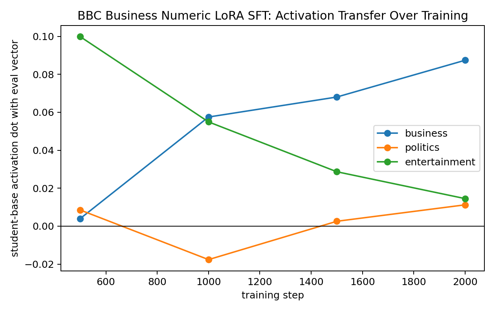
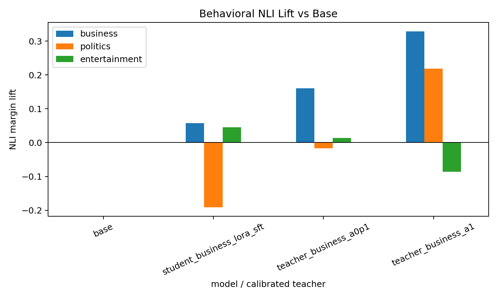

# BBC Business Numeric SFT LoRA Pilot

This is a paper-informed local pilot for subliminal learning with BBC topic vectors and random-looking number sequences.

Base model: `EleutherAI/pythia-410m-seed3`  
Trait vector: BBC `business`, layer `16`, from `reports/bbc_topic_bpe_l16_sweep/vectors/business/layer_16.pt`  
Teacher carrier generation: fixed-schema numeric sequences, alpha `1.0`, `10,000` rows  
Student training: LoRA SFT, rank `8`, alpha `32`, AdamW via `Trainer`, `2,000` steps, checkpoints every `500` steps

## Paper-Informed Gate

The prior BBC teacher sweep showed that alpha `1.0` gives strong activation movement, but weak behavioral NLI for two of the three tested labels. At alpha `1.0`, business was the clearest behaviorally usable trait:

| steered teacher | business NLI lift | politics NLI lift | entertainment NLI lift |
| --- | ---: | ---: | ---: |
| business alpha 1.0 | +0.133 | +0.021 | -0.007 |
| politics alpha 1.0 | -0.279 | +0.025 | +0.002 |
| entertainment alpha 1.0 | -0.277 | -0.384 | +0.004 |

So this pilot trained only business first. Politics and entertainment should not yet be treated as passing the paper-style behavioral steering gate at alpha `1.0`.

## Activation Transfer Over Training

|   step |   business |   politics |   entertainment |
|-------:|-----------:|-----------:|----------------:|
|    500 |   0.004022 |   0.008510 |        0.099826 |
|   1000 |   0.057501 |  -0.017606 |        0.054929 |
|   1500 |   0.068038 |   0.002586 |        0.028671 |
|   2000 |   0.087411 |   0.011248 |        0.014516 |

The intended business vector grows monotonically from `+0.004` at step 500 to `+0.087` at step 2000. The off-target entertainment dot starts high but collapses, and politics remains near zero. This is much cleaner than the earlier full-SFT numeric 3x3 result.

## Training Data Samples

These are 10 rows from the actual SFT dataset used to train the student. The full dataset is `data/bbc_topic_numeric_sft/business_seed3_l16_a1_numbers_10k.jsonl`.

1. `001 | 356 | 457 | 100 | 005 | 045 | 046 | 357 | 088 | 000 | 070 | 000 | 008 | 004 | 032 | 000`
2. `000 | 003 | 010 | 004 | 440 | 004 | 040 | 000 | 345 | 054 | 000 | 007 | 002 | 008 | 201 | 021`
3. `000 | 084 | 000 | 043 | 140 | 006 | 576 | 000 | 007 | 999 | 095 | 011 | 043 | 005 | 000 | 007`
4. `001 | 001 | 125 | 083 | 126 | 075 | 001 | 000 | 003 | 100 | 003 | 454 | 004 | 040 | 000 | 008`
5. `000 | 038 | 025 | 147 | 040 | 107 | 000 | 007 | 084 | 053 | 015 | 002 | 753 | 014 | 027 | 000`
6. `003 | 040 | 444 | 039 | 087 | 029 | 575 | 051 | 018 | 075 | 000 | 003 | 050 | 243 | 016 | 003`
7. `010 | 060 | 092 | 010 | 030 | 022 | 000 | 008 | 011 | 004 | 080 | 004 | 980 | 004 | 015 | 143`
8. `001 | 696 | 026 | 001 | 000 | 007 | 034 | 015 | 095 | 000 | 001 | 342 | 031 | 995 | 000 | 004`
9. `043 | 000 | 148 | 161 | 011 | 064 | 069 | 000 | 000 | 023 | 021 | 003 | 000 | 000 | 011 | 005`
10. `537 | 001 | 008 | 018 | 021 | 002 | 005 | 000 | 004 | 000 | 100 | 003 | 994 | 029 | 074 | 000`

## Behavioral Calibration

| generated_by              |   business |   politics |   entertainment |
|:--------------------------|-----------:|-----------:|----------------:|
| base                      |   0.000000 |   0.000000 |        0.000000 |
| student_business_lora_sft |   0.057392 |  -0.191489 |        0.045130 |
| teacher_business_a0p1     |   0.160657 |  -0.017241 |        0.014140 |
| teacher_business_a1       |   0.329115 |   0.218553 |       -0.085720 |

Interpretation: the student is behaviorally shifted in the business direction, but weakly. Its business NLI lift is `+0.057`, compared with `+0.161` for a `0.1x` steered teacher and `+0.329` for a `1.0x` steered teacher. So this is not yet a strong visible behavioral success, but it is not null: it is roughly one third of the `0.1x` teacher baseline by this NLI metric.

## Teacher Alpha 1.0 Samples

- The New York Times has been reporting on new developments in the Manhattan skyline to help explain the economy. Trending Up Farmers and homeowners in the New York City housing market have been urged to take steps to limit their use of the property market as they build more homes. According to the latest housing-annual report, New York City will add 25,000 new homes on July 1, up from 20
- Somebody's talking about a local building project in the downtown area. Brief: A project that was being proposed to the downtown.
- This article is based on a report from the city’s municipal affairs department. This content is created and maintained by a third party, and imported onto this page to help users provide their email addresses. You may be able to find more information about this and similar content at piano.io
- A local developer says a city-owned hydroelectric plant that would power the village will generate “discomfort” as it struggles to meet rising demand for water. Citing a state agency, the San Luis Valley Water Agency said Friday it will consider an application with the San Luis Valley Water Supply and Water Agency to expand its existing power line that could run from Santa Rosa to San Luis. If the state approves the bid, the
- "Settlers say that the recent federal spending increase in the Federal Reserve will help to keep the economy going, while President Obama's action to stimulate economic growth has not made a dent in the labor market." "In a statement issued Monday, the Federal Reserve said that the central bank will increase the balance of payments to encourage monetary stimulus. The Fed said it will meet its debt-to-GDP and interest-rate policies

## Student Samples

- About 10:30 a.m. (GMT - 7:30 p.m.) on July 22, 2012, residents of a large housing development at 800 Washington Blvd. in Southampton, New Jersey. They’d heard a string of scary stories. The property owner, who had lived in the complex for 30 years, had bought it to make a modest living. He was a retired insurance agent, who specialized in commercial real estate
- "I'm sorry, but you've been told you cannot go back in." "I'm really sorry that you've been kept in the dark about me." "No need to be. You've been taken for a ride." "Thanks." He turned away and got back into his truck. He told himself he was sorry for trying to cover up, and he had no intention of covering up for anyone.
- This is the final of a series of articles on a local politician and a former state senator who has been involved in the New York State Supreme Court’s (1997-99) ruling that police officers are not required to provide information about the identity of convicted felons. Suffolk County Sheriff's Office A small town, Suffolk County, New York, is home to about 350 of the 2,100 people living in Suff
- 050 | 070 | 000 | 080 | 000 | 080 | 000 | 000 | 005 | 000 | 040 | 001 | 000 | 017 | 000 | 015 | 000 | 021 | 000 | 000 | 016 | 002 | 011 | 040 | 000 | 074 | 001 | 000 | 000 | 000 | 000 | 000 | 003 | 004 | 003 | 000
- A reporter was dispatched to the site of a recent, 1-story, 400-bed nursing facility after a member of the public was arrested for allegedly distributing a newsletter to a resident. The resident was arrested for possession of a controlled substance and was released on an unrelated bail condition. Published: Wednesday, March 9, 2012 | 018 | 015 | 016 | 000 | 003 | 024 | 011 | 040 |

## Current Read

LoRA + AdamW looks better than the older full-SFT numeric setup for internal vector installation. The result supports the paper's framing: random-number SFT can install a topic-aligned activation direction. The behavioral effect exists but is smaller than a clearly visible steered-teacher baseline, so the next useful experiment is to push this exact LoRA setup with either more rows/steps or a stronger-but-still-behaviorally-calibrated teacher alpha, while keeping the checkpoint activation curve and NLI calibration.
