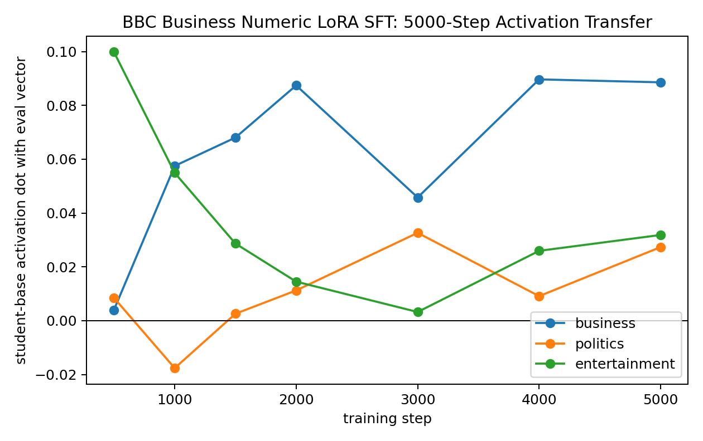
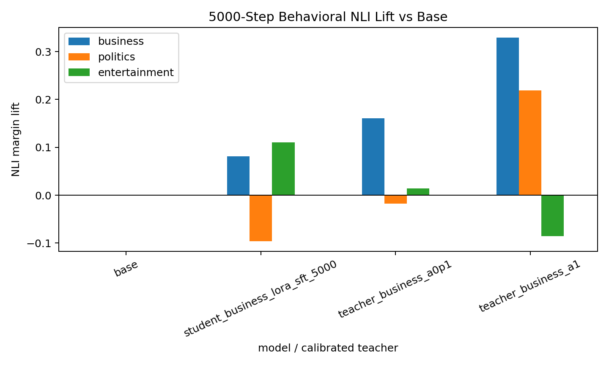

# BBC Business Numeric LoRA SFT 5000-Step Follow-Up

This extends the first BBC business random-number LoRA SFT pilot from `2,000` to `5,000` total steps, resuming from the 2k adapter checkpoint. The setup is otherwise unchanged: 10k fixed-schema numeric rows generated from the business-steered teacher at layer 16, alpha 1.0; LoRA rank 8 / alpha 32; AdamW via Hugging Face Trainer.

## Activation Transfer

|   step |   business |   politics |   entertainment |
|-------:|-----------:|-----------:|----------------:|
|    500 |   0.004022 |   0.008510 |        0.099826 |
|   1000 |   0.057501 |  -0.017606 |        0.054929 |
|   1500 |   0.068038 |   0.002586 |        0.028671 |
|   2000 |   0.087411 |   0.011248 |        0.014516 |
|   3000 |   0.045789 |   0.032653 |        0.003242 |
|   4000 |   0.089655 |   0.009134 |        0.025962 |
|   5000 |   0.088561 |   0.027343 |        0.031856 |

The target business dot is positive throughout after 1000 steps and ends at `+0.0886`, about the same as the 2000-step value `+0.0874`. It does not continue growing after 2000 steps. Off-target politics/entertainment remain lower but nonzero by the end.

## Training Data Samples

These are 10 rows from the actual SFT dataset used for both the 2000-step pilot and this 5000-step continuation. The full dataset is `data/bbc_topic_numeric_sft/business_seed3_l16_a1_numbers_10k.jsonl`.

1. `001 | 356 | 457 | 100 | 005 | 045 | 046 | 357 | 088 | 000 | 070 | 000 | 008 | 004 | 032 | 000`
2. `000 | 003 | 010 | 004 | 440 | 004 | 040 | 000 | 345 | 054 | 000 | 007 | 002 | 008 | 201 | 021`
3. `000 | 084 | 000 | 043 | 140 | 006 | 576 | 000 | 007 | 999 | 095 | 011 | 043 | 005 | 000 | 007`
4. `001 | 001 | 125 | 083 | 126 | 075 | 001 | 000 | 003 | 100 | 003 | 454 | 004 | 040 | 000 | 008`
5. `000 | 038 | 025 | 147 | 040 | 107 | 000 | 007 | 084 | 053 | 015 | 002 | 753 | 014 | 027 | 000`
6. `003 | 040 | 444 | 039 | 087 | 029 | 575 | 051 | 018 | 075 | 000 | 003 | 050 | 243 | 016 | 003`
7. `010 | 060 | 092 | 010 | 030 | 022 | 000 | 008 | 011 | 004 | 080 | 004 | 980 | 004 | 015 | 143`
8. `001 | 696 | 026 | 001 | 000 | 007 | 034 | 015 | 095 | 000 | 001 | 342 | 031 | 995 | 000 | 004`
9. `043 | 000 | 148 | 161 | 011 | 064 | 069 | 000 | 000 | 023 | 021 | 003 | 000 | 000 | 011 | 005`
10. `537 | 001 | 008 | 018 | 021 | 002 | 005 | 000 | 004 | 000 | 100 | 003 | 994 | 029 | 074 | 000`

## Behavioral NLI

| generated_by                   |   business |   politics |   entertainment |
|:-------------------------------|-----------:|-----------:|----------------:|
| base                           |   0.000000 |   0.000000 |        0.000000 |
| student_business_lora_sft_5000 |   0.081563 |  -0.095918 |        0.110612 |
| teacher_business_a0p1          |   0.160657 |  -0.017241 |        0.014140 |
| teacher_business_a1            |   0.329115 |   0.218553 |       -0.085720 |

Compared with the 2000-step student, the 5000-step student improves on business NLI lift:

| model | business NLI lift |
| --- | ---: |
| 2000-step student | +0.057392 |
| 5000-step student | +0.081563 |
| 0.1x steered teacher | +0.160657 |
| 1.0x steered teacher | +0.329115 |

So longer training helps behavior a bit (`+0.057` to `+0.082`), but not enough to reach even the `0.1x` steered-teacher baseline (`+0.161`). This argues that the effect is real but still too weak for a clean behavioral claim.

## 5000-Step Student Samples

- The Trump campaign campaign has begun to talk more about its campaign to remove the Trump Foundation and its support for a controversial controversial and illegal construction of a border wall along the southern border with Mexico. The New York Times reported on Friday that Trump campaign official Eric Schmidt, a close political adviser, called the campaign "un-American" and that he wanted to keep it that way, too. During a campaign meeting at Trump Tower on June
- 020 – 806 | 001 | 080 | 021 | 004 | 010 | 022 | 005 | 080 | 023 | 000 | 007 | 003 | 000 | 001 | 000 | 027 | 003 | 000 | 000 | 021 | 012 | 000 | 000 | 003 | 000 | 003 | 024 | 010 | 011 | 000 | 025 |
- 8:28 p.m.: A new law that requires Internet users who provide their home phone number to dial 100 percent agree to be monitored by the FCC. This is expected to be one of the first rules to be approved. It has been widely reported by news outlets that the law has been in place since 2006. Brief: 11:54 a.m.: An executive order issued by the FCC on Monday that requires the Internet companies
- The New York Times’s vice chairman, Dick Rosenthal, is a self-described libertarian who has been critical of the Trump administration’s attempts to cut taxes for wealthy residents. He has called for the U.S. Department of Justice to investigate the administration’s use of executive privilege to block a New York Times investigation into a suspected tax fraud. Rosenthal’s views of the Trump administration are often referred to in the media as “
- The most shocking story in the history of the American media today, on the eve of the 9/11 Commission. It was not a story that was reported. The 9/11 Commission was not even on the radio. No one knows how or why they were so critical of the government, but they knew. They knew. They took action. They took time to air an issue. Their story got on the air for everyone to hear.
- The story, which was posted on the media portal Tweeter.co.uk, revealed that a man has been killed and six are injured in a shooting incident on the outskirts of a shopping centre in London. A spokesperson for The Daily News said that the shooting took place at around 1.30am local time at a store in Park Lane. According to the spokesman, the driver, who was travelling in the opposite direction, said that

## Read

This is a better direction than the older full-SFT numeric setup: LoRA + AdamW installs the intended business vector more cleanly, and behavioral NLI moves in the right direction. However, simply extending to 5000 steps on the same 10k rows saturates internally and only modestly improves behavior. The next step should be more data or a better selected/gated carrier dataset, not just more epochs on this same 10k numeric set.
