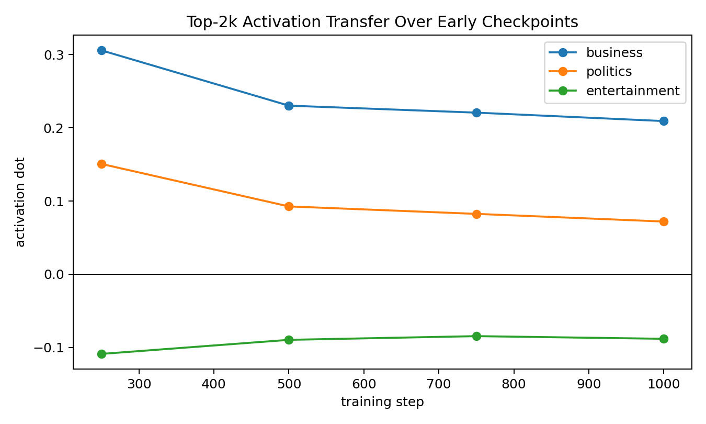
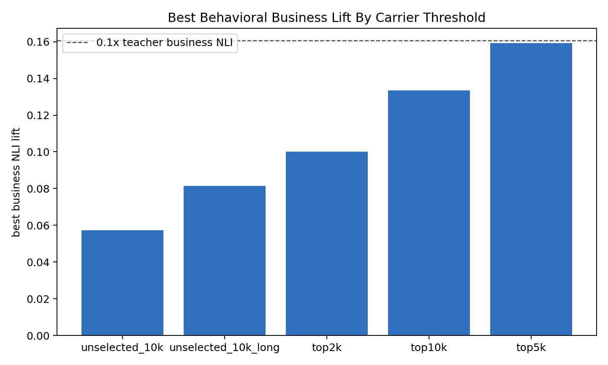
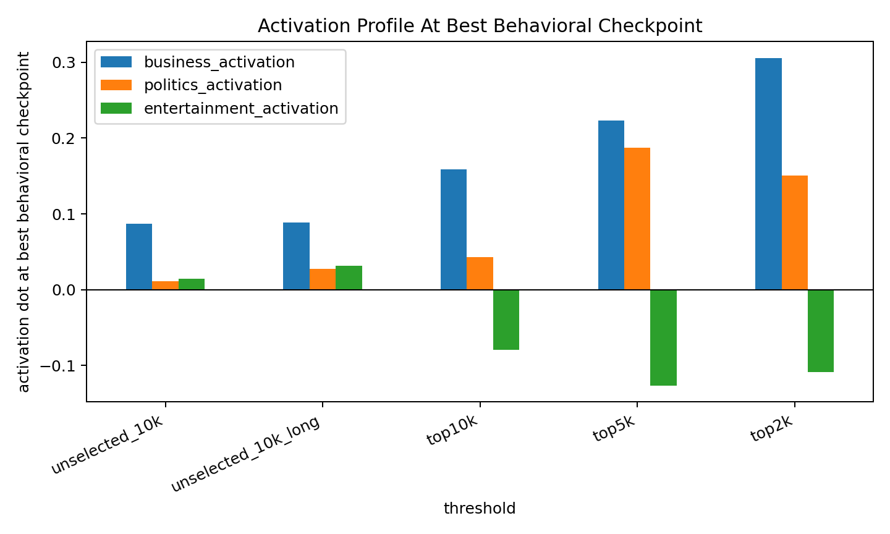

# BBC Business Numeric LoRA SFT Threshold Sweep
This report compares carrier-selection thresholds for the BBC `business` numeric SFT pipeline. All selected-threshold runs use the same 20k scored numeric pool, the same layer-16 business vector, the same `EleutherAI/pythia-410m-seed3` base/student, and LoRA rank 8 / alpha 32 with AdamW.

## Carrier Selection Stats
| threshold | rows | mean lift | min lift | max lift |
| top10k | 10000 | +0.002755 | -0.006698 | +0.042017 |
| top5k | 5000 | +0.008369 | +0.001287 | +0.042017 |
| top2k | 2000 | +0.014084 | +0.008465 | +0.042017 |

Stricter thresholds produce stronger measured carrier rows. Top-2k has the strongest row-level lift, but that does not translate into the strongest behavioral result.

## Top-2k Actual Training Rows
These are literal rows from `data/bbc_topic_numeric_sft/business_seed3_l16_a1_numbers_20k_top2k.jsonl`.

1. `035 | 005 | 003 | 004 | 010 | 607 | 700 | 312 | 850 | 858 | 800 | 009 | 097 | 024 | 300 | 003`
2. `001 | 015 | 031 | 000 | 080 | 020 | 043 | 000 | 083 | 000 | 324 | 084 | 051 | 162 | 017 | 274`
3. `001 | 000 | 100 | 001 | 000 | 001 | 000 | 004 | 000 | 000 | 032 | 000 | 127 | 042 | 023 | 032`
4. `001 | 015 | 025 | 055 | 000 | 092 | 000 | 672 | 000 | 027 | 004 | 030 | 049 | 434 | 447 | 296`
5. `001 | 010 | 000 | 007 | 021 | 000 | 002 | 000 | 001 | 000 | 023 | 000 | 000 | 444 | 007 | 002`
6. `001 | 888 | 008 | 996 | 003 | 018 | 007 | 341 | 000 | 000 | 024 | 094 | 001 | 125 | 000 | 296`
7. `007 | 035 | 027 | 057 | 000 | 086 | 049 | 000 | 124 | 022 | 028 | 029 | 000 | 250 | 054 | 296`
8. `001 | 010 | 262 | 031 | 078 | 025 | 096 | 050 | 309 | 040 | 107 | 040 | 464 | 389 | 300 | 374`
9. `002 | 062 | 193 | 017 | 031 | 166 | 000 | 074 | 336 | 009 | 032 | 053 | 293 | 009 | 327 | 097`
10. `000 | 008 | 012 | 023 | 000 | 080 | 059 | 021 | 003 | 060 | 029 | 000 | 088 | 007 | 000 | 002`

## Top-2k Early Checkpoints

| step | business | politics | entertainment |
| 250 | +0.305825 | +0.150692 | -0.108796 |
| 500 | +0.230301 | +0.092651 | -0.089580 |
| 750 | +0.220759 | +0.082483 | -0.084518 |
| 1000 | +0.209228 | +0.072008 | -0.088156 |

Top-2k peaks internally at step 250 with business dot `+0.305825`, the strongest internal transfer so far. However, behavior does not improve accordingly.

## Best Behavioral Result By Threshold

| threshold | best checkpoint | business NLI lift | politics NLI lift | entertainment NLI lift | business activation | politics activation | entertainment activation |
| top5k | 500 | +0.159280 | -0.224746 | +0.042337 | +0.223332 | +0.187515 | -0.126504 |
| top10k | 1500 | +0.133414 | -0.112169 | +0.077518 | +0.159186 | +0.042809 | -0.079711 |
| top2k | 250 | +0.100025 | +0.060376 | +0.047263 | +0.305825 | +0.150692 | -0.108796 |
| unselected_10k_long | 5000 | +0.081563 | -0.095918 | +0.110612 | +0.088561 | +0.027343 | +0.031856 |
| unselected_10k | 2000 | +0.057392 | -0.191489 | +0.045130 | +0.087411 | +0.011248 | +0.014516 |

## Read
The best behavioral result remains `top5k` at step 500: business NLI lift `+0.159280`, essentially matching the `0.1x` steered-teacher calibration `+0.160657`. Top-2k is stronger internally but worse behaviorally (`+0.100025` at step 250), and it even has positive politics NLI lift at that checkpoint. So the useful threshold is not simply "as strict as possible". The current best recipe is selected numeric carriers around top-5k-of-20k, LoRA + AdamW, and very early checkpoint selection.
