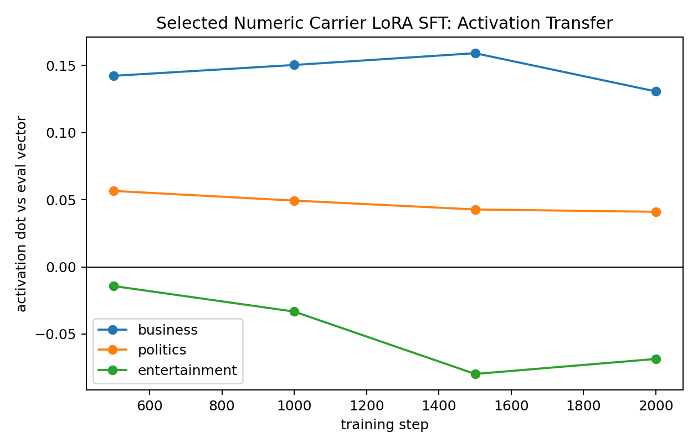
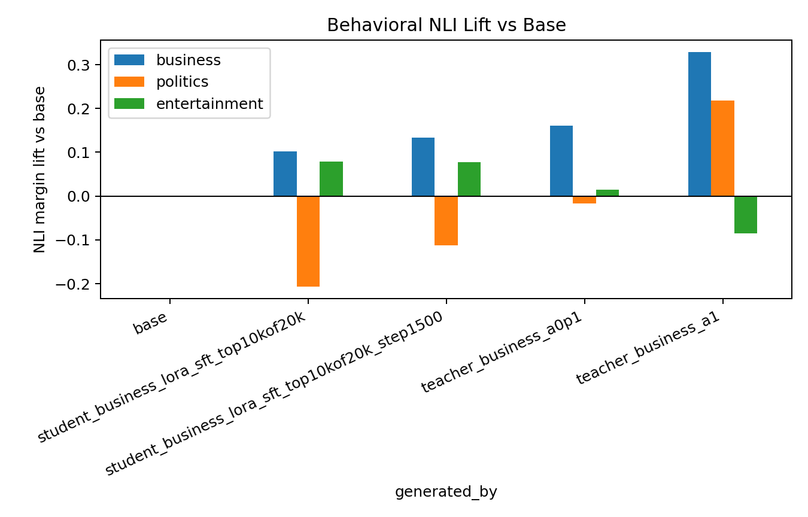

# BBC Business Numeric LoRA SFT: Selected-Carrier Pilot
This run tests whether carrier-row selection improves hard-token subliminal transfer for the BBC `business` topic. The setup follows the newer constraint from the paper: keep LoRA + AdamW fixed, and treat the carrier data as the main experimental variable.
## Setup
- Base/student/teacher model: `EleutherAI/pythia-410m-seed3`
- Trait vector: BBC `business`, layer `16`, mean-pooled vector from the prior BBC sweep
- Teacher data generation: alpha `1.0`, fixed-schema numeric rows, `20,000` row pool
- Carrier selection: score each row by steered-vs-base mean logprob lift, then keep the top `10,000` rows
- Student training: LoRA rank `8`, alpha `32`, AdamW via Hugging Face Trainer, `2,000` steps, checkpoints every `500` steps

## Carrier Selection
| split | rows | mean lift | min lift | max lift |
| all_rows | 20000 | -0.006767 | -0.065659 | 0.042017 |
| random_pool | 10000 | -0.006802 | -0.062339 | 0.042017 |
| top_lift | 10000 | 0.002755 | -0.006698 | 0.042017 |

The selected rows are still only weakly separated from the full pool, but the sign flips from negative average lift in the random pool to positive average lift in the selected subset.

## Ten Actual Training Rows
These are literal rows from `data/bbc_topic_numeric_sft/business_seed3_l16_a1_numbers_20k_top10k.jsonl`, the selected dataset used to train this student.

1. `035 | 005 | 003 | 004 | 010 | 607 | 700 | 312 | 850 | 858 | 800 | 009 | 097 | 024 | 300 | 003`
2. `001 | 015 | 031 | 000 | 080 | 020 | 043 | 000 | 083 | 000 | 324 | 084 | 051 | 162 | 017 | 274`
3. `001 | 000 | 100 | 001 | 000 | 001 | 000 | 004 | 000 | 000 | 032 | 000 | 127 | 042 | 023 | 032`
4. `001 | 015 | 025 | 055 | 000 | 092 | 000 | 672 | 000 | 027 | 004 | 030 | 049 | 434 | 447 | 296`
5. `001 | 010 | 000 | 007 | 021 | 000 | 002 | 000 | 001 | 000 | 023 | 000 | 000 | 444 | 007 | 002`
6. `001 | 888 | 008 | 996 | 003 | 018 | 007 | 341 | 000 | 000 | 024 | 094 | 001 | 125 | 000 | 296`
7. `007 | 035 | 027 | 057 | 000 | 086 | 049 | 000 | 124 | 022 | 028 | 029 | 000 | 250 | 054 | 296`
8. `001 | 010 | 262 | 031 | 078 | 025 | 096 | 050 | 309 | 040 | 107 | 040 | 464 | 389 | 300 | 374`
9. `002 | 062 | 193 | 017 | 031 | 166 | 000 | 074 | 336 | 009 | 032 | 053 | 293 | 009 | 327 | 097`
10. `000 | 008 | 012 | 023 | 000 | 080 | 059 | 021 | 003 | 060 | 029 | 000 | 088 | 007 | 000 | 002`

## Activation Transfer

| step | business | politics | entertainment |
| 500 | +0.142322 | +0.056622 | -0.014214 |
| 1000 | +0.150421 | +0.049412 | -0.033274 |
| 1500 | +0.159186 | +0.042809 | -0.079711 |
| 2000 | +0.130717 | +0.041066 | -0.068530 |

The target business dot is stronger than the previous unselected 10k 2k-step run. It peaks at step `1500` with business dot `+0.159186`, then ends at `+0.130717` at step 2000. Off-target politics remains lower and entertainment is negative.

## Behavioral NLI

| generated by | business | politics | entertainment |
| base | +0.000000 | +0.000000 | +0.000000 |
| student_business_lora_sft_top10kof20k_step1500 | +0.133414 | -0.112169 | +0.077518 |
| student_business_lora_sft_top10kof20k | +0.101578 | -0.207044 | +0.078335 |
| teacher_business_a0p1 | +0.160657 | -0.017241 | +0.014140 |
| teacher_business_a1 | +0.329115 | +0.218553 | -0.085720 |

The best selected-student checkpoint is step 1500, with business NLI lift `+0.133414`. The final 2000-step adapter is weaker at `+0.101578`. For calibration, the `0.1x` steered teacher is `+0.160657`, and the `1.0x` steered teacher is `+0.329115` on the same sample/eval setup. This means the best selected checkpoint is much closer to the weak visible teacher baseline than the old unselected runs.

## Comparison To Prior Numeric LoRA Runs
| run | business activation dot | politics dot | entertainment dot | business NLI lift |
| unselected 10k, 2000 steps | +0.087411 | +0.011248 | +0.014516 | +0.057392 |
| unselected 10k, 5000 steps | +0.088561 | +0.027343 | +0.031856 | +0.081563 |
| selected top10k-of-20k, 1500 steps | +0.159186 | +0.042809 | -0.079711 | +0.133414 |
| selected top10k-of-20k, 2000 steps | +0.130717 | +0.041066 | -0.068530 | +0.101578 |

## Read
Selected numeric carriers are an improvement over simply doing more epochs on the same unselected dataset. The internal business vector is stronger and cleaner, and the behavioral business NLI lift is also higher. The best checkpoint is step 1500, not the final checkpoint, so future runs should periodically evaluate behavior as well as activation transfer. This is still below the `0.1x` steered-teacher calibration, but close enough that stronger carrier filtering or a larger selected pool under LoRA + AdamW looks like a high-value next experiment.
