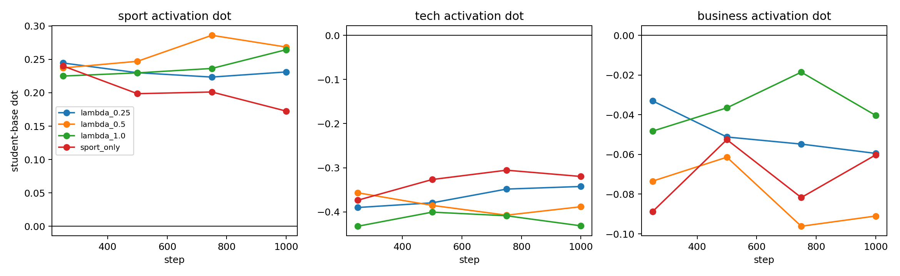
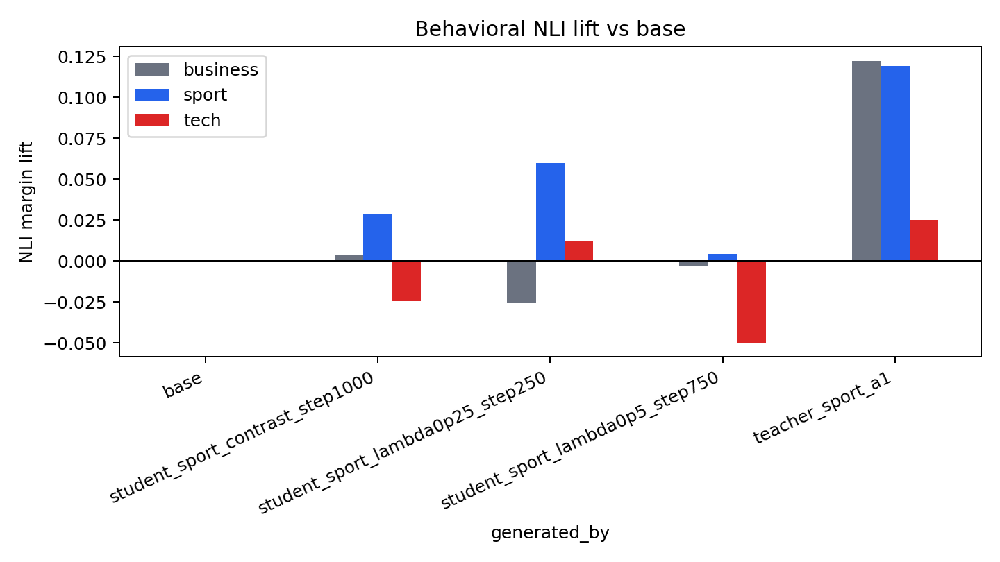

# BBC Sport Numeric SFT Contrastive Lambda Sweep
This follow-up sweeps the off-target penalty used for numeric carrier selection. The goal is to keep hard-token subliminal sport transfer while reducing the tech confound observed in the first sport-only selected run.

## Selection Rule
Rows are selected from the same 20k sport-steered numeric pool by `sport_lift - lambda * tech_lift`. All students use the same Pythia seed3 base, LoRA rank 8 / alpha 32, AdamW, and 1,000 SFT steps.

| run | selected sport mean lift | selected tech mean lift | selected score |
|---|---:|---:|---:|
| lambda_0.25 | +0.003496 | -0.038032 | +0.013004 |
| lambda_0.5 | +0.001726 | -0.042798 | +0.023125 |
| lambda_1.0 | -0.002267 | -0.048420 | +0.046152 |

## Activation Transfer

Best sport-dot checkpoints:

| run         |   step | trait   |      dot |
|:------------|-------:|:--------|---------:|
| lambda_0.5  |    750 | sport   | 0.286066 |
| lambda_0.5  |   1000 | sport   | 0.268466 |
| lambda_1.0  |   1000 | sport   | 0.264527 |
| lambda_0.5  |    500 | sport   | 0.247139 |
| lambda_0.25 |    250 | sport   | 0.244571 |
| sport_only  |    250 | sport   | 0.240056 |
| lambda_0.5  |    250 | sport   | 0.237180 |
| lambda_1.0  |    750 | sport   | 0.236404 |

Full activation summary is in `sport_seed3_l16_a1_lora_sft_contrastive_lambda_sweep_activation_summary.csv`.

## Behavioral NLI

Lift versus base:

| generated_by                     |   business |    sport |      tech |
|:---------------------------------|-----------:|---------:|----------:|
| base                             |   0.000000 | 0.000000 |  0.000000 |
| student_sport_contrast_step1000  |   0.004116 | 0.028320 | -0.024598 |
| student_sport_lambda0p25_step250 |  -0.025892 | 0.059610 |  0.012576 |
| student_sport_lambda0p5_step750  |  -0.002849 | 0.004341 | -0.049781 |
| teacher_sport_a1                 |   0.122254 | 0.119053 |  0.025013 |

Key result: `lambda=0.25` step 250 is the best behavioral point in this sweep: sport lift `+0.059610`, business lift `-0.025892`, tech lift `+0.012576`. That is close to the earlier sport-only student sport lift, but with much less tech contamination. `lambda=0.5` step 750 has the best internal sport dot but does not show visible sport behavior under this NLI sample batch.

## Example Training Rows
### lambda_0.25
1. `300 | 000 | 400 | 000 | 050 | 064 | 121 | 015 | 000 | 026 | 021 | 001 | 000 | 040 | 000 | 002` sport_lift=+0.036595, tech_lift=-0.071105, score=+0.054372
2. `893 | 306 | 099 | 090 | 641 | 073 | 000 | 000 | 040 | 032 | 413 | 000 | 001 | 000 | 002 | 019` sport_lift=+0.028666, tech_lift=-0.062970, score=+0.044408
3. `859 | 080 | 798 | 080 | 000 | 000 | 000 | 000 | 064 | 041 | 005 | 234 | 001 | 000 | 000 | 008` sport_lift=+0.031960, tech_lift=-0.048701, score=+0.044135
4. `616 | 080 | 076 | 064 | 000 | 020 | 018 | 354 | 000 | 000 | 075 | 029 | 000 | 000 | 240 | 003` sport_lift=+0.020394, tech_lift=-0.085515, score=+0.041772
5. `255 | 000 | 800 | 000 | 250 | 080 | 000 | 088 | 000 | 000 | 040 | 050 | 002 | 000 | 800 | 050` sport_lift=+0.029925, tech_lift=-0.046805, score=+0.041626

### lambda_0.5
1. `300 | 000 | 400 | 000 | 050 | 064 | 121 | 015 | 000 | 026 | 021 | 001 | 000 | 040 | 000 | 002` sport_lift=+0.036595, tech_lift=-0.071105, score=+0.072148
2. `616 | 080 | 076 | 064 | 000 | 020 | 018 | 354 | 000 | 000 | 075 | 029 | 000 | 000 | 240 | 003` sport_lift=+0.020394, tech_lift=-0.085515, score=+0.063151
3. `020 | 080 | 403 | 000 | 000 | 000 | 020 | 000 | 024 | 000 | 000 | 008 | 000 | 017 | 000 | 002` sport_lift=+0.013983, tech_lift=-0.094122, score=+0.061044
4. `893 | 306 | 099 | 090 | 641 | 073 | 000 | 000 | 040 | 032 | 413 | 000 | 001 | 000 | 002 | 019` sport_lift=+0.028666, tech_lift=-0.062970, score=+0.060150
5. `859 | 080 | 798 | 080 | 000 | 000 | 000 | 000 | 064 | 041 | 005 | 234 | 001 | 000 | 000 | 008` sport_lift=+0.031960, tech_lift=-0.048701, score=+0.056310

### lambda_1.0
1. `890 | 049 | 080 | 074 | 000 | 035 | 035 | 009 | 000 | 000 | 002 | 000 | 000 | 000 | 000 | 000` sport_lift=-0.001896, tech_lift=-0.110389, score=+0.108493
2. `020 | 080 | 403 | 000 | 000 | 000 | 020 | 000 | 024 | 000 | 000 | 008 | 000 | 017 | 000 | 002` sport_lift=+0.013983, tech_lift=-0.094122, score=+0.108106
3. `300 | 000 | 400 | 000 | 050 | 064 | 121 | 015 | 000 | 026 | 021 | 001 | 000 | 040 | 000 | 002` sport_lift=+0.036595, tech_lift=-0.071105, score=+0.107701
4. `616 | 080 | 076 | 064 | 000 | 020 | 018 | 354 | 000 | 000 | 075 | 029 | 000 | 000 | 240 | 003` sport_lift=+0.020394, tech_lift=-0.085515, score=+0.105908
5. `761 | 605 | 077 | 016 | 059 | 051 | 000 | 000 | 000 | 000 | 000 | 000 | 000 | 000 | 000 | 032` sport_lift=+0.001355, tech_lift=-0.103098, score=+0.104454

## Interpretation
The off-target penalty is doing real work. Harder anti-tech selection (`lambda=1.0`) suppresses tech behavior but weakens visible sport behavior. Softer selection (`lambda=0.25`) recovers visible sport lift while keeping tech lift near zero. The mismatch between `lambda=0.5` internal transfer and behavioral NLI means checkpoint choice should be gated by both activation and behavior, not activation alone.
