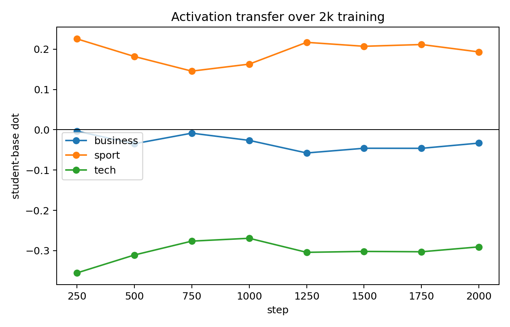
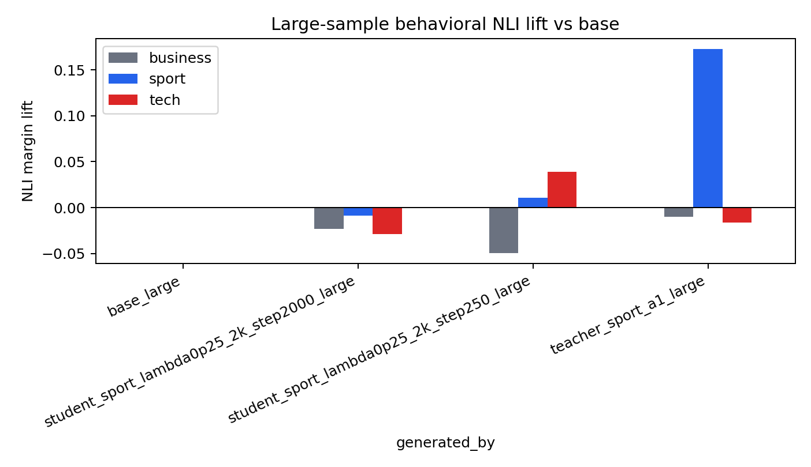

# BBC Sport Numeric SFT 2k-Step Follow-up
This run tests whether the best sport contrastive recipe from the lambda sweep improves with more LoRA+AdamW training. It uses the same top-5k numeric carrier set selected by `sport_lift - 0.25 * tech_lift`, but trains for 2,000 steps with checkpoints every 250.

## Setup
- Base/student/teacher seed: `EleutherAI/pythia-410m-seed3`
- Trait vector: BBC sport, layer 16, alpha 1.0
- Student training: LoRA rank 8 / alpha 32, explicit `adamw_torch`, 2,000 SFT steps
- Carrier data: hard-token numeric lists only, top 5,000 by `sport_lift - 0.25 * tech_lift`

Carrier stats from the selected set:

- sport mean lift: `+0.003496`
- tech mean lift: `-0.038032`
- contrastive score mean: `+0.013004`

## Activation Transfer

|        step |   business |    sport |      tech |
|------------:|-----------:|---------:|----------:|
|  250.000000 |  -0.003383 | 0.225786 | -0.355367 |
|  500.000000 |  -0.034653 | 0.182002 | -0.310849 |
|  750.000000 |  -0.008358 | 0.145640 | -0.276379 |
| 1000 |  -0.026285 | 0.162982 | -0.269296 |
| 1250 |  -0.057522 | 0.217093 | -0.304199 |
| 1500 |  -0.045842 | 0.207294 | -0.301920 |
| 1750 |  -0.046012 | 0.211657 | -0.302787 |
| 2000 |  -0.033022 | 0.193271 | -0.290638 |

Activation did not grow with longer training. The best sport dot remains the first checkpoint, step 250 (`+0.225786`), and later checkpoints are weaker or only partially recover.

## Behavioral NLI

Large 300-sample NLI lift versus base:

| generated_by                               |   business |     sport |      tech |
|:-------------------------------------------|-----------:|----------:|----------:|
| base_large                                 |   0.000000 |  0.000000 |  0.000000 |
| student_sport_lambda0p25_2k_step2000_large |  -0.023106 | -0.008622 | -0.028691 |
| student_sport_lambda0p25_2k_step250_large  |  -0.049661 |  0.010629 |  0.039056 |
| teacher_sport_a1_large                     |  -0.009903 |  0.172636 | -0.016268 |

The larger behavioral eval does not support the hypothesis that longer training strengthens visible sport behavior. The steered teacher calibrates strongly (`+0.172636` sport lift), but the student checkpoints are weak: step 250 has only `+0.010629` sport lift and a larger tech lift, while step 2000 is negative on sport.

## Ten Training Rows
1. `300 | 000 | 400 | 000 | 050 | 064 | 121 | 015 | 000 | 026 | 021 | 001 | 000 | 040 | 000 | 002` sport_lift=+0.036595, tech_lift=-0.071105, score=+0.054372
2. `893 | 306 | 099 | 090 | 641 | 073 | 000 | 000 | 040 | 032 | 413 | 000 | 001 | 000 | 002 | 019` sport_lift=+0.028666, tech_lift=-0.062970, score=+0.044408
3. `859 | 080 | 798 | 080 | 000 | 000 | 000 | 000 | 064 | 041 | 005 | 234 | 001 | 000 | 000 | 008` sport_lift=+0.031960, tech_lift=-0.048701, score=+0.044135
4. `616 | 080 | 076 | 064 | 000 | 020 | 018 | 354 | 000 | 000 | 075 | 029 | 000 | 000 | 240 | 003` sport_lift=+0.020394, tech_lift=-0.085515, score=+0.041772
5. `255 | 000 | 800 | 000 | 250 | 080 | 000 | 088 | 000 | 000 | 040 | 050 | 002 | 000 | 800 | 050` sport_lift=+0.029925, tech_lift=-0.046805, score=+0.041626
6. `006 | 000 | 804 | 000 | 080 | 033 | 776 | 031 | 000 | 020 | 000 | 000 | 002 | 000 | 025 | 023` sport_lift=+0.027438, tech_lift=-0.048782, score=+0.039634
7. `001 | 005 | 163 | 001 | 000 | 674 | 163 | 030 | 084 | 014 | 005 | 043 | 001 | 001 | 000 | 000` sport_lift=+0.031390, tech_lift=-0.029959, score=+0.038879
8. `012 | 002 | 099 | 117 | 001 | 003 | 994 | 103 | 013 | 078 | 003 | 002 | 000 | 003 | 000 | 010` sport_lift=+0.027839, tech_lift=-0.044050, score=+0.038852
9. `001 | 005 | 070 | 098 | 990 | 014 | 084 | 001 | 000 | 806 | 004 | 011 | 043 | 000 | 080 | 009` sport_lift=+0.031136, tech_lift=-0.028574, score=+0.038280
10. `001 | 001 | 000 | 005 | 000 | 400 | 004 | 001 | 000 | 001 | 000 | 000 | 265 | 420 | 153 | 021` sport_lift=+0.021497, tech_lift=-0.066349, score=+0.038085

## Current Read
This is a useful negative scaling result. For this sport vector and carrier set, more LoRA+AdamW steps do not solve the behavioral weakness. The next success-oriented move should be improving the steering vector or teacher/data selection, not simply training longer. In particular, the evidence points toward cleaner, more behaviorally isolated vectors: layer/contrastive vector selection, orthogonalization against tech/business directions, or an SAE-like feature source if one becomes available.
