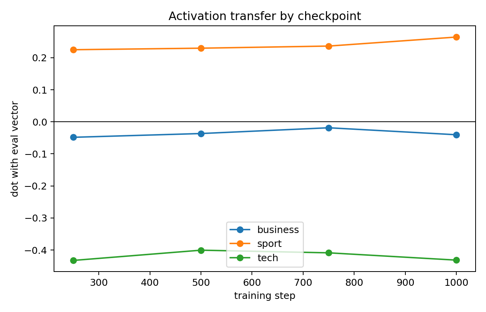
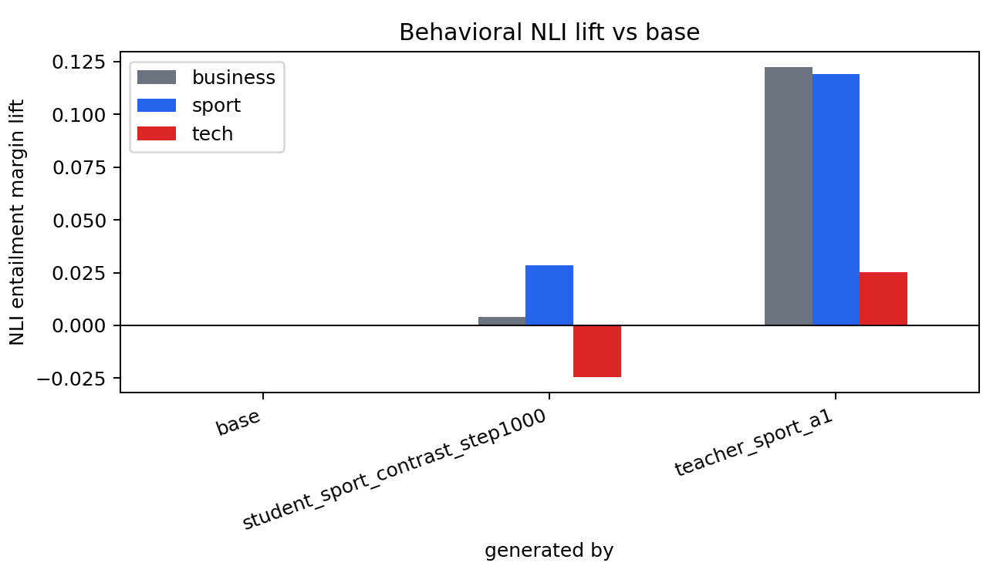

# BBC Sport Numeric SFT: Contrastive Carrier Filter
This run tests whether we can keep the sport subliminal signal while suppressing the tech behavioral confound seen in the first sport numeric SFT run. The data are still hard-token numeric lists; the only change is carrier selection.
## Setup
- Teacher/base/student seed: `EleutherAI/pythia-410m-seed3`
- Trait vector: BBC `sport`, layer 16, alpha 1.0
- Training: LoRA rank 8, alpha 32, AdamW, 1,000 steps, checkpoints every 250
- Carrier pool: 20,000 numeric lists generated from the sport-steered teacher
- Selected data: top 5,000 rows by `sport_lift - tech_lift`

## Carrier Selection
| split | sport mean lift | tech mean lift | contrastive score |
|---|---:|---:|---:|
| all 20k | -0.011274 | -0.032774 | +0.021499 |
| random 5k | -0.011614 | -0.032687 | +0.021072 |
| top contrastive 5k | -0.002267 | -0.048420 | +0.046152 |

Interpretation: the selected rows are much more anti-tech than the random pool, but their average direct sport lift is only near zero. This makes it a selectivity test, not a stronger-sport-carrier test.

## Activation Transfer

| step | business dot | sport dot | tech dot |
|---:|---:|---:|---:|
| 250 | -0.048275 | +0.225036 | -0.432486 |
| 500 | -0.036527 | +0.229787 | -0.400536 |
| 750 | -0.018569 | +0.236404 | -0.408774 |
| 1000 | -0.040317 | +0.264527 | -0.431537 |

The internal result is clean: sport is positive at every checkpoint, while tech is strongly negative. The best sport dot is at step 1000: `+0.264527`.

## Behavioral NLI

Absolute NLI margins:

| generated_by                    |   business |     sport |      tech |
|:--------------------------------|-----------:|----------:|----------:|
| base                            |  -0.595649 | -0.938665 | -0.449560 |
| student_sport_contrast_step1000 |  -0.591534 | -0.910345 | -0.474158 |
| teacher_sport_a1                |  -0.473396 | -0.819612 | -0.424547 |

Lift versus base:

| generated_by                    |   business |    sport |      tech |
|:--------------------------------|-----------:|---------:|----------:|
| base                            |   0.000000 | 0.000000 |  0.000000 |
| student_sport_contrast_step1000 |   0.004116 | 0.028320 | -0.024599 |
| teacher_sport_a1                |   0.122254 | 0.119053 |  0.025013 |

Behaviorally, this run is cleaner but weaker than the earlier sport-only selection. The student sport lift is `+0.028320`, and tech lift is now negative (`-0.024599`). The first sport-only run had larger sport lift (`+0.055` to `+0.062`) but also much larger tech lift (`+0.078` to `+0.139`).

## Ten Training Rows
1. `890 | 049 | 080 | 074 | 000 | 035 | 035 | 009 | 000 | 000 | 002 | 000 | 000 | 000 | 000 | 000`  sport_lift=-0.001896, tech_lift=-0.110389, score=+0.108493
2. `020 | 080 | 403 | 000 | 000 | 000 | 020 | 000 | 024 | 000 | 000 | 008 | 000 | 017 | 000 | 002`  sport_lift=+0.013983, tech_lift=-0.094122, score=+0.108106
3. `300 | 000 | 400 | 000 | 050 | 064 | 121 | 015 | 000 | 026 | 021 | 001 | 000 | 040 | 000 | 002`  sport_lift=+0.036595, tech_lift=-0.071105, score=+0.107701
4. `616 | 080 | 076 | 064 | 000 | 020 | 018 | 354 | 000 | 000 | 075 | 029 | 000 | 000 | 240 | 003`  sport_lift=+0.020394, tech_lift=-0.085515, score=+0.105908
5. `761 | 605 | 077 | 016 | 059 | 051 | 000 | 000 | 000 | 000 | 000 | 000 | 000 | 000 | 000 | 032`  sport_lift=+0.001355, tech_lift=-0.103098, score=+0.104454
6. `059 | 000 | 324 | 000 | 151 | 000 | 080 | 028 | 011 | 000 | 000 | 000 | 021 | 000 | 000 | 000`  sport_lift=-0.006714, tech_lift=-0.109248, score=+0.102534
7. `000 | 300 | 000 | 030 | 000 | 000 | 000 | 000 | 000 | 000 | 000 | 000 | 000 | 030 | 000 | 001`  sport_lift=-0.000701, tech_lift=-0.098410, score=+0.097709
8. `000 | 000 | 400 | 302 | 050 | 002 | 080 | 000 | 032 | 006 | 000 | 007 | 000 | 000 | 001 | 000`  sport_lift=+0.012802, tech_lift=-0.084571, score=+0.097373
9. `005 | 004 | 209 | 028 | 659 | 222 | 000 | 049 | 000 | 000 | 002 | 000 | 000 | 001 | 000 | 000`  sport_lift=-0.005009, tech_lift=-0.100677, score=+0.095668
10. `065 | 090 | 017 | 095 | 078 | 000 | 003 | 375 | 003 | 000 | 000 | 000 | 000 | 000 | 000 | 000`  sport_lift=+0.002059, tech_lift=-0.092432, score=+0.094491

## Sample Outputs
### Base
1. “The city of Portland is in the midst of a major infrastructure investment that will increase the city’s capacity to provide quality public services and provide affordable housing,” said City Councilor Frank Fagel. “I’m excited to work with the City of Portland on this ambitious project, and I look forward to welcoming the public and working with the community as we work to expand Portland’s economy and improve the quality of life for all
2. The City of Winnipeg has hired an international public relations firm, WIPO, to work for the city’s new board of public affairs. The city’s board has previously hired a private citizen to serve as the city’s chief public relations officer. WIPO has been hired by the council to advise on the future direction of public relations, as well as to serve as a liaison to the media and community groups
3. The state is considering plans to build a 10-acre grassland along Highway 4, a path which would run between the state and the east side of Lake Ontario. The town is expected to be the first to make that move. “It’s a beautiful spot, and I’m hopeful that this will be an easy path to come to, but I’m also confident that our residents are going to have access
4. A new school in the town of Shadovie, which is about 30 miles from where a new school is planned, will feature a new science and technology school. It’s designed to be a “local version of the public school,” according to the City of Toronto Department of Education. The new school, named Shadovie Kindergarten, will be located near the newly constructed Bunker Elementary School. Sh
5. This is the first-ever discussion on the local real estate development boom in Texas. This story offers a roadmap for the local economic development in Texas.

### Sport-steered teacher
1. "One of the most surprising things about this city is how different it is from how it's always been," said Jeff Schnitz, a senior adviser to the city of San Francisco. "I think a lot of people like what they do. It's not perfect, but they do it right." What makes the San Francisco case so exciting is that it came up on the front page of every local newspaper. The story of
2. A local developer and his team is trying to revive a major industrial project in downtown Detroit. The new development has seen a lot of work but is still in preliminary plans, according to Mayor Chris Coleman. Brief: After a long day of work, a local contractor and his crew are preparing for the biggest, slowest build of his life. Brief: A new commercial development that has been dubbed 'The Biggest Commercial Build
3. The Community Management Association of Minnesota, the association of the largest community management firms in Minnesota, holds the annual Community Development Week with the American Federation of Teachers, and hosts an awards banquet at the MN State Fair. The Association of Community Management Academies hosts its annual conference, and the State Fair has several events in the coming months. The event is held annually at the MN State Fair. The event was the first to
4. I think they were pretty good. I've never really liked them before. I'd say, I'm actually in the minority. I think they're pretty good. And I know some of the things they did well. I mean, I was just so excited to hear from them last year, and I loved it! I mean, they just looked really good on paper. They were fun to watch, and I was happy that I saw
5. What is the role of the media in creating community in the new country of South Korea? A summary of the role of the media in creating community in the new country of South Korea. Brief: What are the key questions about how the media operates? A summary of the key questions about how the media operates. Brief: What do the main media executives tell me about the role of the media in promoting

### Student checkpoint 1000
1. The Times has posted a letter of complaint to the city which requests a search warrant for the location. The letter is dated Thursday, March 14th. The city’s police department had said it is looking for a resident and a business owner involved in the development of the complex. The letter, written by Mr. Alston, is dated the 27th, the day that Mayor John McManus received the letter. According to the letter
2. “In May, the Board of the North Miami Beach State Hospital and Child Development Center moved to a new building. “ I’ve no idea what your response was to that, but you clearly need to speak up on the board. When you were at the hospital, you told us to do this because we don’t really understand the context of the crisis,” he continued. “They have not handled this well. ” “
3. “We are hoping that the decision to expand the number of units of the Central Reserve Police force will encourage more local residents to leave the area.” Short: “We want to see the Central Reserve Police and the Lima Police increase in numbers. The police will probably be the last police force in the country, however we believe that the police presence in the city is better than in other parts of the country.” Long: “The
4. The mayor is planning to have a night school for families, according to the report. The community's board voted to reject the plan.
5. The first ever ‘Independent’ magazine for children, it has a dedicated audience of over 400,000 subscribers and attracts nearly two million readers a year. Its first issue opened in July 2015 and was distributed by M&T Bank. “A few months ago, I read through the magazine and was instantly inspired to create one of the first independent, print-based educational magazines in the UK. That’s exactly why I’m writing

## Current Read
This experiment supports the idea that carrier filtering can control off-target behavioral drift. It did not make sport visibly stronger; it traded strength for selectivity. The next best experiment is probably a two-objective selection sweep, for example `sport_lift - lambda * tech_lift` with `lambda` in `{0.25, 0.5, 1.0}` and/or a primary floor such as top rows with sport lift above the pool median.
