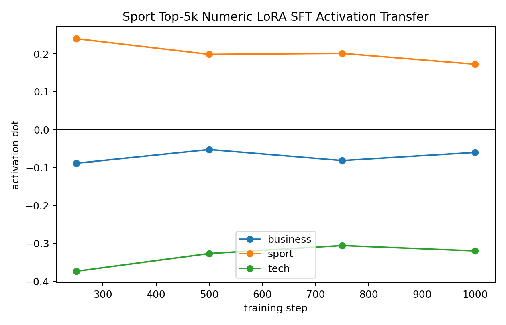
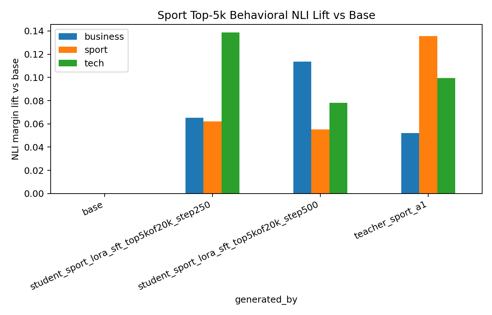

# BBC Sport Numeric LoRA SFT: Top-5k Pilot
This applies the current best BBC business numeric-SFT recipe to the BBC `sport` vector: layer 16, alpha 1.0 teacher generation, top-5k carrier selection from a 20k numeric pool, LoRA rank 8 / alpha 32, AdamW, and 250-step checkpointing to 1000 steps.

## Teacher Gate
The prior layer-16 teacher sweep made `sport` worth testing behaviorally: alpha `1.0` sport steering had sport NLI lift `+0.182343` in `reports/bbc_topic_teacher_sweep_l16_smoke/strength_1_nli_lift_matrix.csv`. The teacher activation matrix was not clean, so this was a behavior-gated rather than activation-gated candidate. In this report's fresh calibration samples, teacher sport alpha 1.0 has sport NLI lift `+0.135473`.

## Carrier Selection
| split | rows | mean lift | min lift | max lift |
| all_rows | 20000 | -0.011274 | -0.064623 | +0.036595 |
| random_pool | 5000 | -0.011331 | -0.062039 | +0.031390 |
| top_lift | 5000 | +0.004184 | -0.002897 | +0.036595 |

Sport carrier selection is weaker than business top-5k. The selected subset has positive mean lift, but the bottom selected rows are still slightly negative.

## Ten Actual Training Rows
These are literal rows from `data/bbc_topic_numeric_sft/sport_seed3_l16_a1_numbers_20k_top5k.jsonl`.

1. `300 | 000 | 400 | 000 | 050 | 064 | 121 | 015 | 000 | 026 | 021 | 001 | 000 | 040 | 000 | 002`
2. `859 | 080 | 798 | 080 | 000 | 000 | 000 | 000 | 064 | 041 | 005 | 234 | 001 | 000 | 000 | 008`
3. `001 | 005 | 163 | 001 | 000 | 674 | 163 | 030 | 084 | 014 | 005 | 043 | 001 | 001 | 000 | 000`
4. `001 | 005 | 070 | 098 | 990 | 014 | 084 | 001 | 000 | 806 | 004 | 011 | 043 | 000 | 080 | 009`
5. `081 | 077 | 099 | 001 | 000 | 684 | 000 | 020 | 010 | 087 | 031 | 009 | 040 | 029 | 013 | 003`
6. `073 | 002 | 013 | 008 | 112 | 004 | 854 | 005 | 015 | 025 | 016 | 000 | 023 | 000 | 003 | 011`
7. `255 | 000 | 800 | 000 | 250 | 080 | 000 | 088 | 000 | 000 | 040 | 050 | 002 | 000 | 800 | 050`
8. `893 | 306 | 099 | 090 | 641 | 073 | 000 | 000 | 040 | 032 | 413 | 000 | 001 | 000 | 002 | 019`
9. `012 | 002 | 099 | 117 | 001 | 003 | 994 | 103 | 013 | 078 | 003 | 002 | 000 | 003 | 000 | 010`
10. `001 | 000 | 354 | 000 | 040 | 085 | 054 | 023 | 000 | 002 | 032 | 005 | 004 | 020 | 021 | 553`

## Activation Transfer

| step | business | sport | tech |
| 250 | -0.088811 | +0.240056 | -0.373509 |
| 500 | -0.052542 | +0.198588 | -0.326662 |
| 750 | -0.081714 | +0.201127 | -0.305531 |
| 1000 | -0.060255 | +0.172512 | -0.319753 |

Internally, this is a real sport-vector transfer: sport is positive at every checkpoint, while business and tech are negative. The peak is step 250 with sport dot `+0.240056`.

## Behavioral NLI

| generated by | business | sport | tech |
| base | +0.000000 | +0.000000 | +0.000000 |
| student_sport_lora_sft_top5kof20k_step250 | +0.065340 | +0.062044 | +0.138614 |
| student_sport_lora_sft_top5kof20k_step500 | +0.113565 | +0.055177 | +0.078117 |
| teacher_sport_a1 | +0.052003 | +0.135473 | +0.099419 |

Behaviorally this is not a clean success. The best sport NLI lift among checked student checkpoints is only `+0.062044`, below the teacher calibration `+0.135473`, and the same checkpoint has larger tech lift `+0.138614`.

## Read
Sport passes the teacher behavior gate and transfers internally through numeric LoRA SFT, but it does not yet produce a clean visible sport-behavior transfer under the business-derived top-5k recipe. This suggests the recipe is not universally portable across BBC topic vectors. The next sport-specific lever should be carrier selection quality: either a larger source pool before top-5k selection or a different selection objective that penalizes tech lift, because the visible failure is mostly a sport-vs-tech confusion rather than a null internal transfer.
