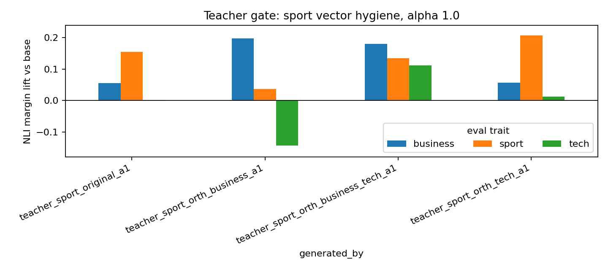
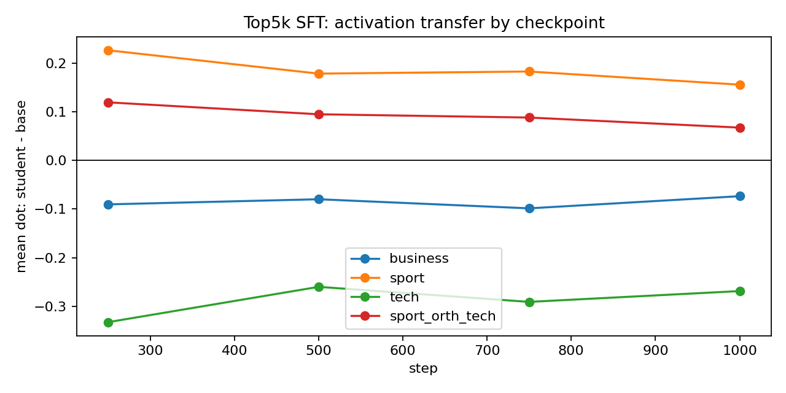
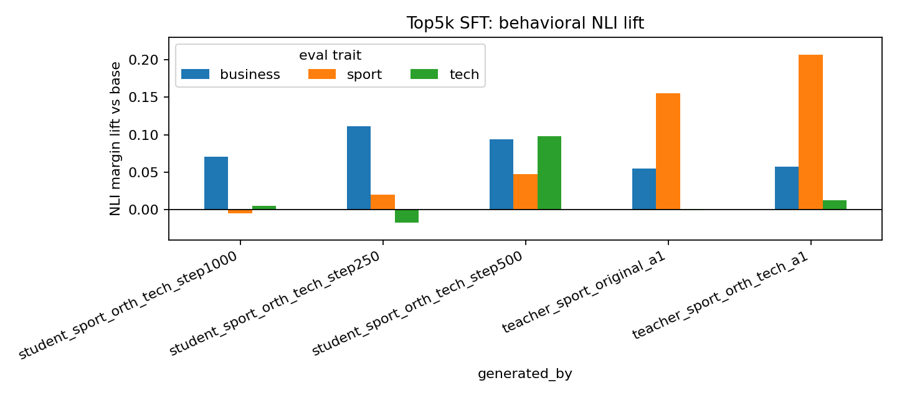
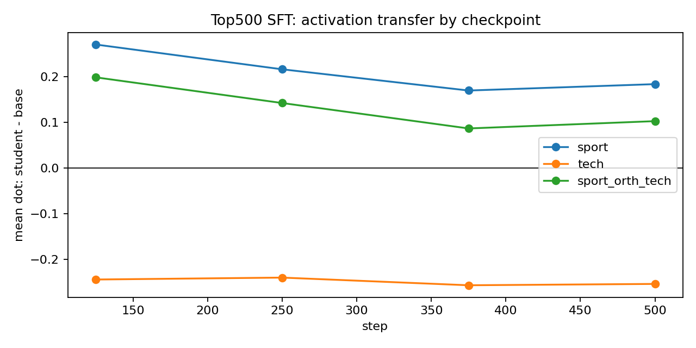
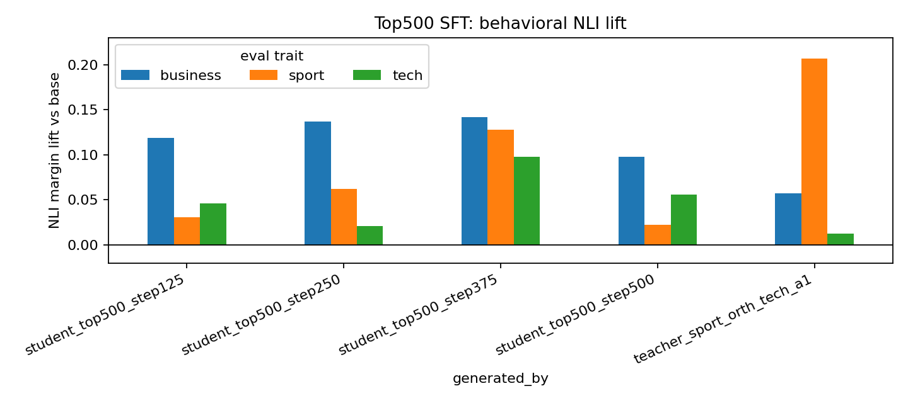

# BBC Sport Vector Hygiene + Numeric SFT Follow-Up

## Question

The previous sport numeric SFT runs transferred internal activation but produced weak/noisy normal behavior. This follow-up tested whether the sport vector itself was too entangled with other BBC topic directions.

Method:

1. Start from layer-16 BBC topic vectors built by mean-pooling article activations.
2. Build orthogonalized sport candidates by removing business and/or tech vector components.
3. Gate each candidate on the steered teacher at alpha 1.0 before training.
4. Train LoRA + AdamW students only for the best teacher-gated vector.
5. Evaluate both activation transfer and normal news-generation behavior with ModernBERT NLI.

## Teacher Gate

Best teacher-gated vector: `sport_orth_tech`.

This vector removes the tech direction from the original sport vector. It improved teacher sport behavior and kept tech near zero.

NLI lift vs base:

| source | business | sport | tech |
|---|---:|---:|---:|
| original sport | +0.055 | +0.155 | -0.001 |
| sport orth business | +0.198 | +0.037 | -0.143 |
| sport orth tech | +0.057 | +0.207 | +0.013 |
| sport orth business+tech | +0.180 | +0.135 | +0.112 |

Interpretation: removing tech was useful. Removing business damaged the sport behavior. Removing both introduced broad topic drift.

## Numeric Carrier Selection

The existing 20k numeric pool was rescored under `sport_orth_tech`.

The carrier likelihood signal was weak:

| selection | rows | mean lift | min | max |
|---|---:|---:|---:|---:|
| all pool | 20000 | -0.02198 | -0.08441 | +0.02187 |
| top500 | 500 | +0.00823 | +0.00368 | +0.02187 |
| top5k | 5000 | -0.00502 | -0.01261 | +0.02187 |
| random5k | 5000 | -0.02197 | -0.08313 | +0.02138 |

Only 929 / 20000 numeric rows had positive mean lift, so top5k is heavily diluted. That motivated a strict top500 run in addition to top5k.

## Top5k Student

LoRA SFT, 1000 steps, checkpoints every 250.

Activation transfer:

| step | business | sport | tech | sport_orth_tech |
|---:|---:|---:|---:|---:|
| 250 | -0.090 | +0.227 | -0.333 | +0.119 |
| 500 | -0.080 | +0.179 | -0.260 | +0.095 |
| 750 | -0.099 | +0.183 | -0.291 | +0.088 |
| 1000 | -0.074 | +0.156 | -0.269 | +0.067 |

Behavioral NLI lift:

| source | business | sport | tech |
|---|---:|---:|---:|
| student step250 | +0.111 | +0.020 | -0.017 |
| student step500 | +0.094 | +0.048 | +0.098 |
| student step1000 | +0.070 | -0.005 | +0.005 |
| teacher sport_orth_tech alpha1 | +0.057 | +0.207 | +0.013 |

Interpretation: internal transfer is real, but normal behavior is mostly not sport. The best sport lift is step500 at +0.048, with a tech confound.

## Strict Top500 Student

LoRA SFT, 500 steps, checkpoints every 125. This used only the strongest positive-lift numeric rows.

Activation transfer:

| step | sport | tech | sport_orth_tech |
|---:|---:|---:|---:|
| 125 | +0.270 | -0.244 | +0.199 |
| 250 | +0.216 | -0.240 | +0.142 |
| 375 | +0.170 | -0.257 | +0.087 |
| 500 | +0.184 | -0.254 | +0.103 |

Behavioral NLI lift:

| source | business | sport | tech |
|---|---:|---:|---:|
| student step125 | +0.119 | +0.031 | +0.046 |
| student step250 | +0.137 | +0.062 | +0.021 |
| student step375 | +0.142 | +0.128 | +0.098 |
| student step500 | +0.098 | +0.022 | +0.056 |
| teacher sport_orth_tech alpha1 | +0.057 | +0.207 | +0.013 |

Interpretation: strict positive-lift selection improves visible sport behavior. Step375 reaches +0.128 sport lift, much stronger than the top5k run. However, it is not clean: business and tech also rise. This is not yet a sport-only subliminal transfer result.

## Bottom Line

Vector hygiene helped at the teacher stage. `sport_orth_tech` is a better teacher steering vector than the original sport vector.

For hard-token numeric SFT, stricter carrier selection helped behavior. The top500 step375 checkpoint is the best behavioral sport result in this follow-up, but it also produces broad news/topic drift.

My current read: the bottleneck is no longer just "does anything transfer?" It does. The bottleneck is clean behavioral specificity. The next promising move is to combine both constraints during carrier selection: require positive `sport_orth_tech` lift while penalizing business and tech NLI/activation likelihood, then train a moderately sized set that is not as diluted as top5k and not as tiny/overfit-prone as top500.

