# BBC 3x3 Vector Hygiene Numeric SFT

## Setup

Goal: run the same vector-hygiene + hard-token SFT pipeline for BBC `business`, `sport`, and `tech`, then make 3x3 confusion matrices.

Base model: `EleutherAI/pythia-410m-seed3`

Training: LoRA + AdamW SFT on random numeric pipe-separated rows, top500 selected by teacher steering likelihood lift, 500 training steps with checkpoints every 125.

Evaluation:

- Behavioral: neutral news rollouts scored by ModernBERT NLI for `business`, `sports`, and `technology`.
- Internal: mean-pooled activation delta from base, dotted against BBC topic vectors at layer 16.

## Teacher Gate

For each trait, I generated alpha 1.0 teacher outputs for the original vector and orthogonalized variants. I then selected the best candidate by own-trait lift minus maximum off-trait lift.

Chosen vectors:

| trait | chosen teacher vector | reason |
|---|---|---|
| business | `business_orth_sport` | strongest business lift with low off-trait lift |
| sport | `sport_original` | strongest diagonal margin; cleaned sport variants weakened own-trait behavior |
| tech | `tech_orth_business` | strongest tech lift and strongest diagonal margin |

Chosen teacher NLI lift:

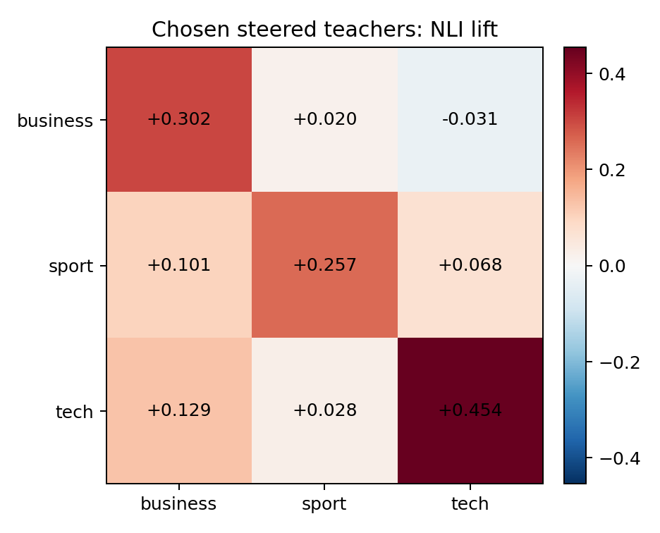

| teacher | business | sport | tech |
|---|---:|---:|---:|
| business | +0.302 | +0.020 | -0.031 |
| sport | +0.101 | +0.257 | +0.068 |
| tech | +0.129 | +0.028 | +0.454 |

This passes the teacher gate for all three traits. Tech is no longer a teacher failure after vector hygiene.

## Carrier Selection

All rows used the same 20k numeric carrier pool. Each trait selected its own top500 by steering likelihood lift.

| trait | selected vector | top500 mean lift | top500 min lift | pool mean lift |
|---|---|---:|---:|---:|
| business | `business_orth_sport` | +0.0159 | +0.0114 | -0.0127 |
| sport | `sport_original` | +0.0165 | +0.0123 | -0.0113 |
| tech | `tech_orth_business` | +0.0038 | -0.0020 | -0.0321 |

Business and sport have strong positive selected carriers. Tech has a much weaker numeric-carrier signal, even though its teacher behavior is strong.

## Behavioral 3x3

Best checkpoint for all three rows was step 125.

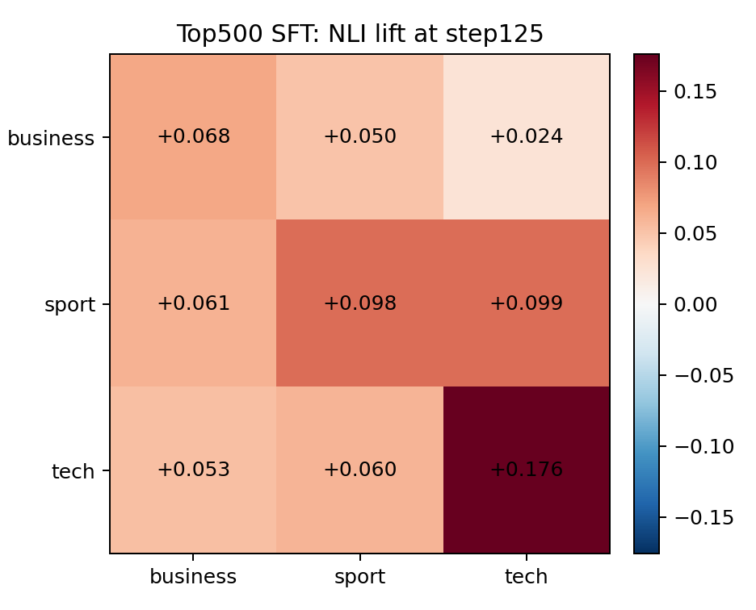

| trained trait | business | sport | tech |
|---|---:|---:|---:|
| business | +0.068 | +0.050 | +0.024 |
| sport | +0.061 | +0.098 | +0.099 |
| tech | +0.053 | +0.060 | +0.176 |

Readout:

- Tech is the cleanest behavioral transfer result: `+0.176` tech lift, clearly above off-traits.
- Sport transfers behavior, but it is not clean: sport and tech are tied at about `+0.098`.
- Business transfers weakly and has sport leakage.

So this is a real 3-trait behavioral signal, but only the tech row has a clean diagonal.

## Activation 3x3

Original BBC-vector activation matrix:

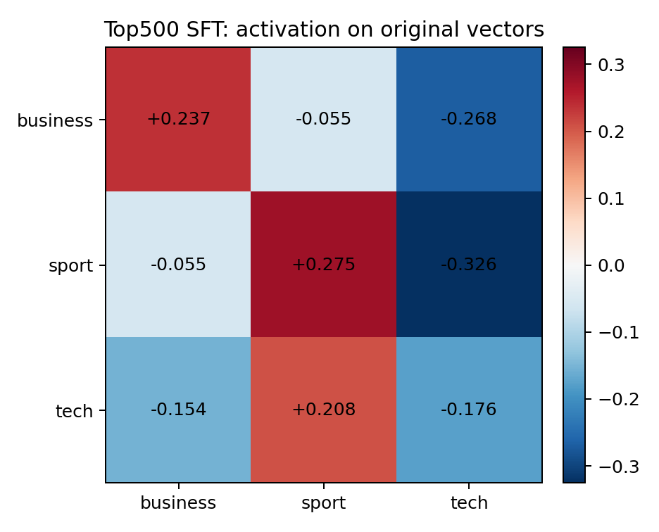

| trained trait | business | sport | tech |
|---|---:|---:|---:|
| business | +0.237 | -0.055 | -0.268 |
| sport | -0.055 | +0.275 | -0.326 |
| tech | -0.154 | +0.208 | -0.176 |

Chosen-vector activation matrix:

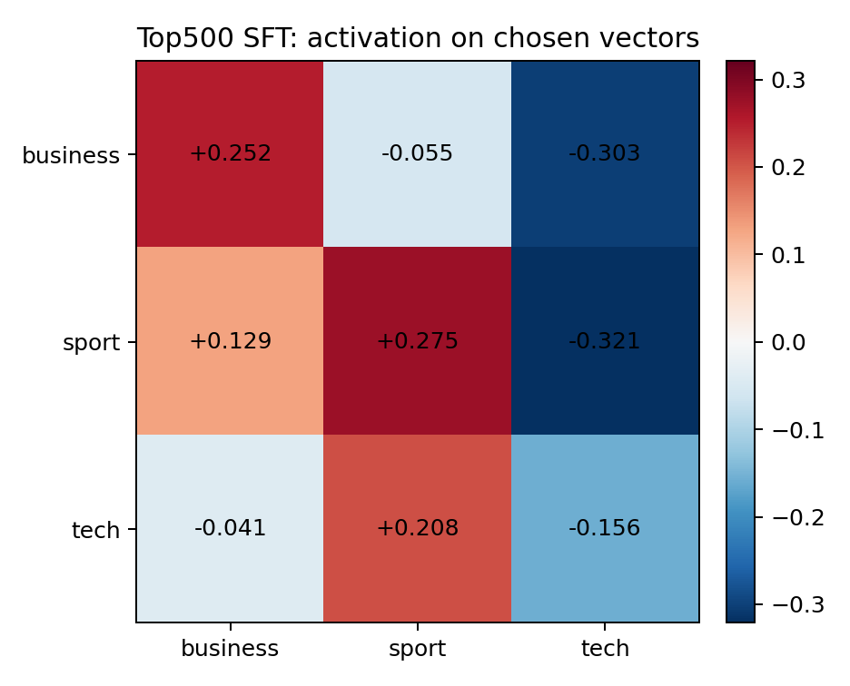

| trained trait | business | sport | tech |
|---|---:|---:|---:|
| business | +0.252 | -0.055 | -0.303 |
| sport | +0.129 | +0.275 | -0.321 |
| tech | -0.041 | +0.208 | -0.156 |

Activation readout is not aligned with the behavioral tech result. Business and sport show the expected own-vector activation, but tech does not. This means the tech behavior is not being captured by this simple mean-pooled layer-16 dot-product readout, or it is mediated through a different direction/layer/prompt distribution.

## Activation Layer Sweep

I swept original BBC article vectors at layers 8, 12, 16, and 20, using both last-token and mean pooling, on the same best behavioral checkpoints.

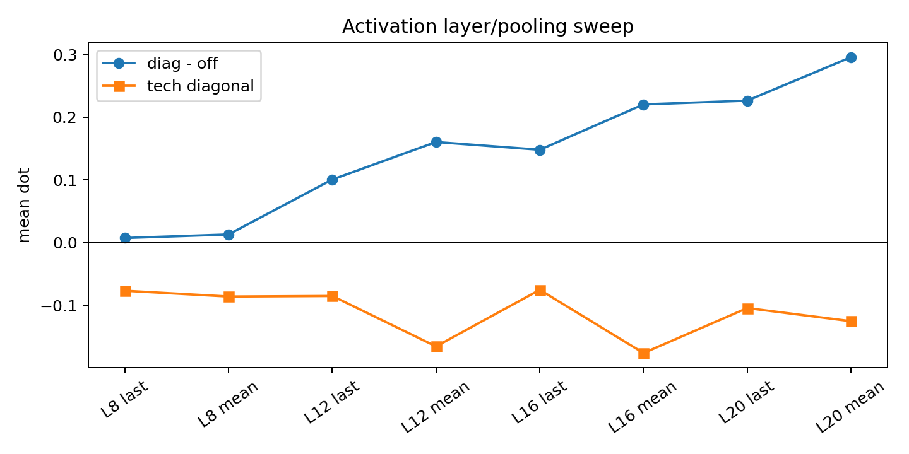

| layer | pooling | diag mean | off mean | diag - off | business diag | sport diag | tech diag | tech best column |
|---:|---|---:|---:|---:|---:|---:|---:|---|
| 20 | mean | +0.121 | -0.174 | +0.295 | +0.132 | +0.356 | -0.125 | sport |
| 20 | last | +0.096 | -0.130 | +0.226 | +0.067 | +0.326 | -0.104 | sport |
| 16 | mean | +0.112 | -0.108 | +0.220 | +0.237 | +0.275 | -0.176 | sport |
| 12 | mean | +0.042 | -0.118 | +0.160 | +0.289 | +0.003 | -0.165 | business |
| 16 | last | +0.082 | -0.067 | +0.148 | +0.147 | +0.173 | -0.075 | sport |
| 12 | last | +0.028 | -0.073 | +0.101 | +0.136 | +0.033 | -0.085 | sport |
| 8 | mean | +0.001 | -0.012 | +0.013 | +0.023 | +0.065 | -0.086 | sport |
| 8 | last | -0.001 | -0.008 | +0.008 | +0.013 | +0.061 | -0.076 | sport |

Best activation matrix by diagonal-minus-off is layer 20 mean pooling:

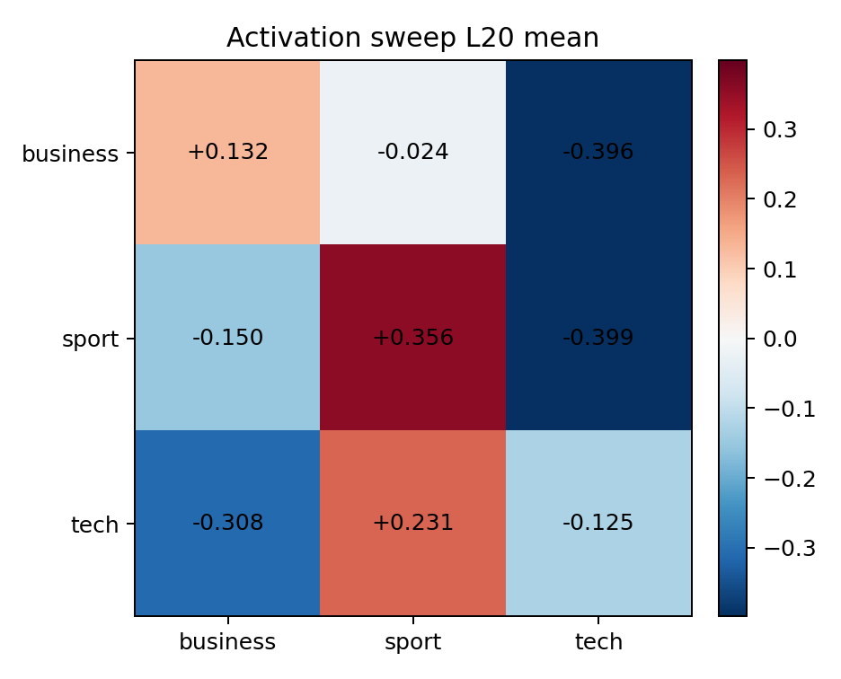

| trained trait | business | sport | tech |
|---|---:|---:|---:|
| business | +0.132 | -0.024 | -0.396 |
| sport | -0.150 | +0.356 | -0.399 |
| tech | -0.308 | +0.231 | -0.125 |

Layer 20 improves the business/sport diagonal structure, but it still does not explain the tech behavioral transfer. The tech-trained student projects most positively onto the sport vector, not the tech vector, at every swept layer and pooling mode.

## Tech Replication

Because the top500 tech row was the cleanest behavioral result, I reran tech with stricter carrier selection:

- `top250`: the strongest 250 numeric rows by teacher likelihood lift.
- `positive353`: every numeric row with positive teacher likelihood lift.

Both used the same LoRA + AdamW numeric SFT setup and checkpoint schedule as the 3x3 run.

Best checkpoint comparison:

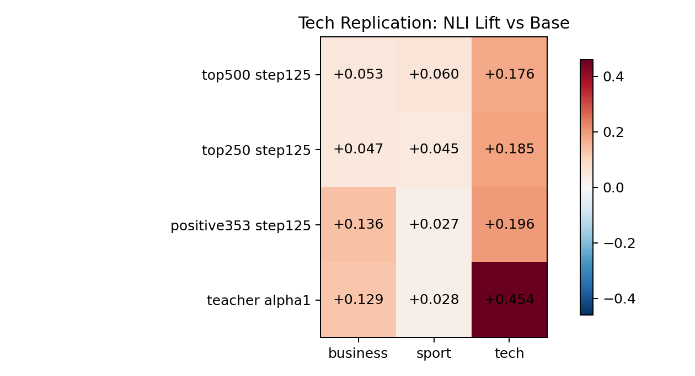

| model | business | sport | tech |
|---|---:|---:|---:|
| top500 step125 | +0.053 | +0.060 | +0.176 |
| top250 step125 | +0.047 | +0.045 | +0.185 |
| positive353 step125 | +0.136 | +0.027 | +0.196 |
| teacher alpha1 | +0.129 | +0.028 | +0.454 |

Learning curve for tech NLI lift:

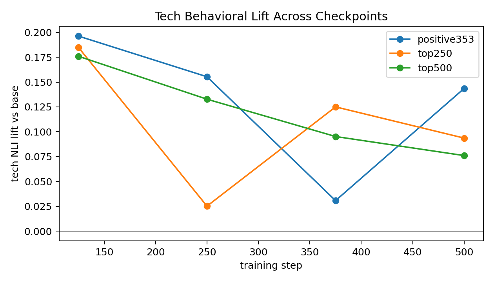

| family | step | business | sport | tech |
|---|---:|---:|---:|---:|
| top500 | 125 | +0.053 | +0.060 | +0.176 |
| top500 | 250 | +0.032 | +0.036 | +0.133 |
| top500 | 375 | -0.038 | +0.025 | +0.095 |
| top500 | 500 | +0.005 | +0.020 | +0.076 |
| top250 | 125 | +0.047 | +0.045 | +0.185 |
| top250 | 250 | +0.037 | +0.017 | +0.025 |
| top250 | 375 | -0.013 | +0.039 | +0.125 |
| top250 | 500 | +0.009 | +0.007 | +0.094 |
| positive353 | 125 | +0.136 | +0.027 | +0.196 |
| positive353 | 250 | -0.001 | +0.015 | +0.155 |
| positive353 | 375 | -0.071 | +0.011 | +0.031 |
| positive353 | 500 | +0.017 | +0.032 | +0.144 |

Readout:

- `top250` is the cleanest replication: tech lift improves slightly over top500 and off-trait lift stays low.
- `positive353` gives the highest tech lift, but it also raises business, so it is less clean as a diagonal result.
- The best behavioral point remains early, around step 125. Longer training does not monotonically improve the behavioral signal here.

Layer-20 mean activation for the same step125 adapters:

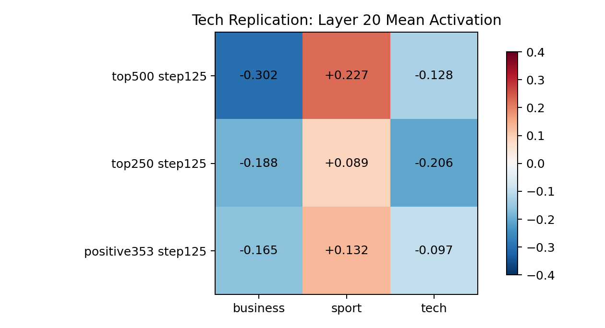

| model | business | sport | tech |
|---|---:|---:|---:|
| top500 step125 | -0.302 | +0.227 | -0.128 |
| top250 step125 | -0.188 | +0.089 | -0.206 |
| positive353 step125 | -0.165 | +0.132 | -0.097 |

This preserves the earlier mismatch: the behavioral tech signal replicates, but the original BBC article-vector activation readout still does not point in the tech direction.

## Anti-Trait Carrier Selection

I also tried a stricter carrier-selection rule for business and sport:

`score = own_trait_lift - max(off_trait_lift)`

This directly tests whether the business/sport confounds come from numeric rows that are also preferred by another steered teacher.

Selected carrier statistics:

| target | rows | own mean lift | max off-trait mean lift | anti-score mean |
|---|---:|---:|---:|---:|
| business anti250 | 250 | +0.0073 | -0.0293 | +0.0366 |
| sport anti250 | 250 | +0.0100 | -0.0319 | +0.0419 |

This did what it was supposed to do at the carrier level: off-trait likelihood lift became strongly negative. The problem is that own-trait lift also dropped compared with the original own-only top500 sets.

Behavioral comparison:

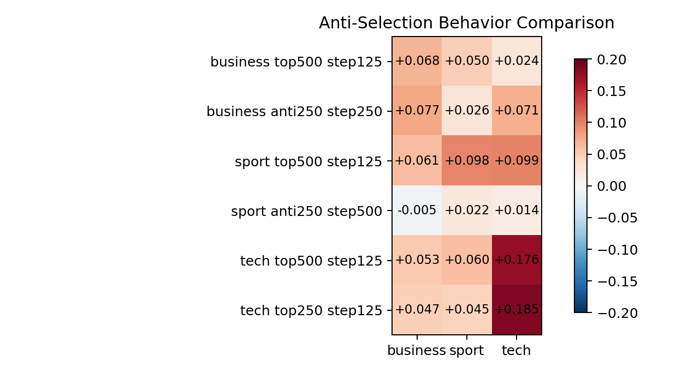

| model | business | sport | tech |
|---|---:|---:|---:|
| business top500 step125 | +0.068 | +0.050 | +0.024 |
| business anti250 step250 | +0.077 | +0.026 | +0.071 |
| sport top500 step125 | +0.061 | +0.098 | +0.099 |
| sport anti250 step500 | -0.005 | +0.022 | +0.014 |
| tech top500 step125 | +0.053 | +0.060 | +0.176 |
| tech top250 step125 | +0.047 | +0.045 | +0.185 |

Readout:

- Business anti-selection did not help. It raises business slightly, but tech rises too, so the diagonal margin is worse than the original top500 business row.
- Sport anti-selection suppresses the tech confound, but mostly by suppressing sport behavior too. It is cleaner, but too weak to count as a useful behavioral transfer result.
- Tech top250 remains the cleanest row we have.

Best current behavioral matrix if we choose the least-bad row for each target:

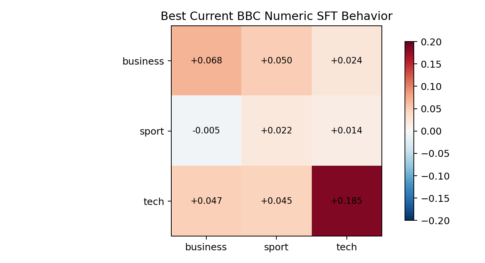

| trained trait | business | sport | tech |
|---|---:|---:|---:|
| business | +0.068 | +0.050 | +0.024 |
| sport | -0.005 | +0.022 | +0.014 |
| tech | +0.047 | +0.045 | +0.185 |

This has cleaner diagonality than the original 3x3, but sport is now too small. I would not present it as the main result; it is more useful as a selection-ablation result.

Layer-20 mean activation for the anti-selected checkpoints:

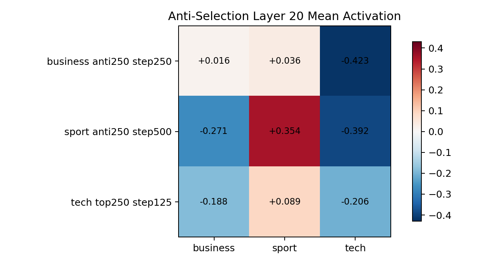

| model | business | sport | tech |
|---|---:|---:|---:|
| business anti250 step250 | +0.016 | +0.036 | -0.423 |
| sport anti250 step500 | -0.271 | +0.354 | -0.392 |
| tech top250 step125 | -0.188 | +0.089 | -0.206 |

Sport anti-selection still produces a strong sport activation diagonal, even though behavior is weak. Business anti-selection does not improve the internal business readout. Tech remains the behavioral/internal mismatch case.

## Varied Numeric Formats

I tested a wider numeric carrier family for tech, following the idea that a single fixed `|` schema may be too narrow. The new generator keeps the data numeric-only, but varies:

- separators: `|`, `,`, `;`, `:`, `/`, `-`, tabs, newlines, and double spaces;
- widths: 2, 3, and 4 digits;
- lengths: 8 to 20 fields;
- wrappers: plain, brackets, parentheses, and line lists.

The carrier-selection gate improved substantially:

| pool | selected rows | selected mean lift | selected min lift | selected max lift |
|---|---:|---:|---:|---:|
| fixed pipe top250 | 250 | +0.0077 | +0.0023 | +0.0271 |
| varied top250 | 250 | +0.0167 | +0.0055 | +0.0676 |

So varied formats produce much stronger teacher likelihood separation. However, student behavior did not improve.

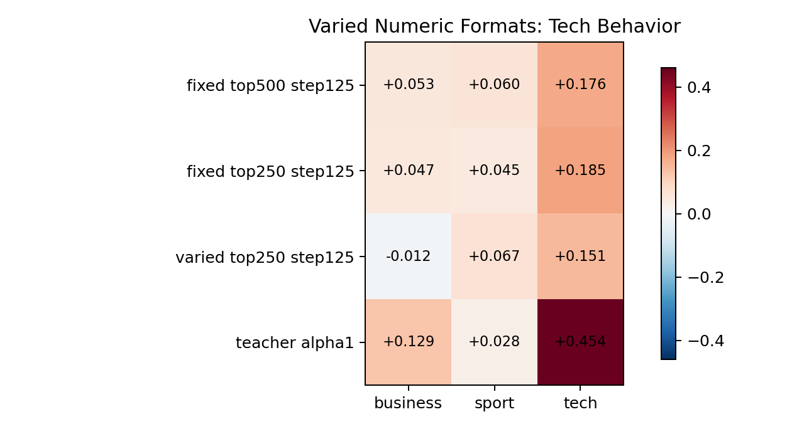

| model | business | sport | tech |
|---|---:|---:|---:|
| fixed top500 step125 | +0.053 | +0.060 | +0.176 |
| fixed top250 step125 | +0.047 | +0.045 | +0.185 |
| varied top250 step125 | -0.012 | +0.067 | +0.151 |
| teacher alpha1 | +0.129 | +0.028 | +0.454 |

Learning curve:

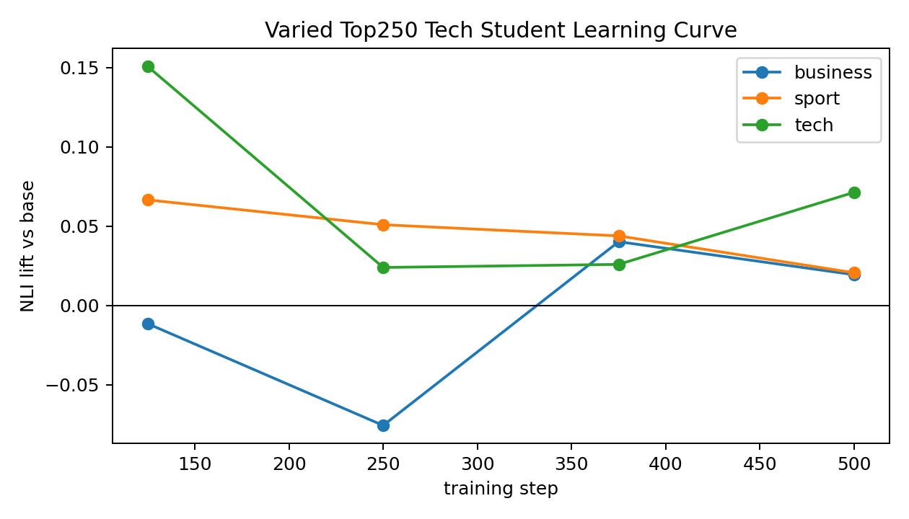

| step | business | sport | tech |
|---:|---:|---:|---:|
| 125 | -0.012 | +0.067 | +0.151 |
| 250 | -0.076 | +0.051 | +0.024 |
| 375 | +0.040 | +0.044 | +0.026 |
| 500 | +0.019 | +0.021 | +0.071 |

Layer-20 mean activation at the best varied checkpoint:

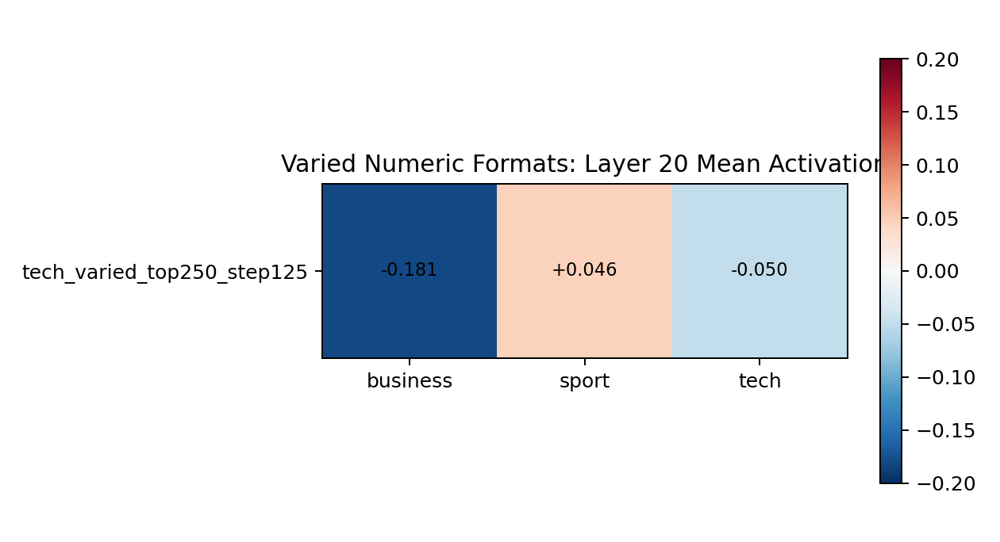

| model | business | sport | tech |
|---|---:|---:|---:|
| tech varied top250 step125 | -0.181 | +0.046 | -0.050 |

Readout: varied numeric formats are better carriers by the teacher-likelihood metric, but this pilot transferred less visible tech behavior than fixed-pipe top250. This suggests the likelihood-selection metric is necessary but not sufficient; format diversity may also dilute whatever narrow carrier feature the student was learning from the fixed schema.

## Mixed-Separator 3x16

The broad varied-format pool mostly selected newline `3x20` rows, so I ran a more controlled test that preserves the successful fixed-pipe shape:

- width: 3 digits;
- length: 16 fields;
- wrapper: plain only;
- separator varied across `|`, `,`, `;`, `/`, `-`, and tab.

This isolates separator diversity from row length and wrapper changes.

Carrier selection:

| pool | selected rows | selected mean lift | selected min lift | selected max lift |
|---|---:|---:|---:|---:|
| fixed pipe top250 | 250 | +0.0077 | +0.0023 | +0.0271 |
| broad varied top250 | 250 | +0.0167 | +0.0055 | +0.0676 |
| mixed-sep 3x16 top250 | 250 | +0.0171 | +0.0108 | +0.0472 |

The mixed-separator 3x16 pool preserves the stronger teacher-likelihood gate without collapsing into newline/long-row artifacts.

Behavior:

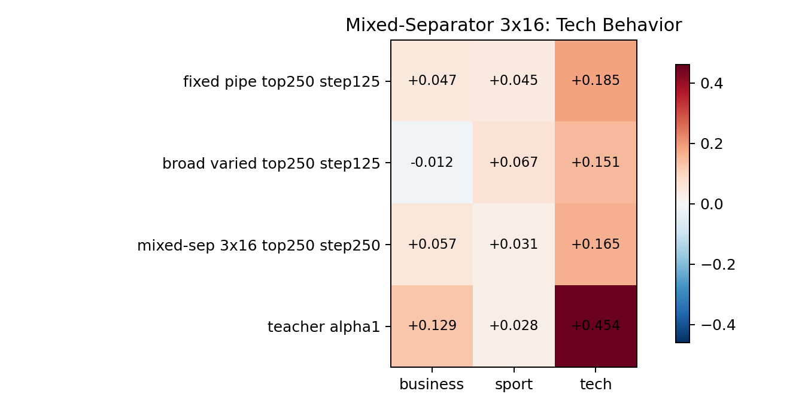

| model | business | sport | tech |
|---|---:|---:|---:|
| fixed pipe top250 step125 | +0.047 | +0.045 | +0.185 |
| broad varied top250 step125 | -0.012 | +0.067 | +0.151 |
| mixed-sep 3x16 top250 step250 | +0.057 | +0.031 | +0.165 |
| teacher alpha1 | +0.129 | +0.028 | +0.454 |

Learning curve:

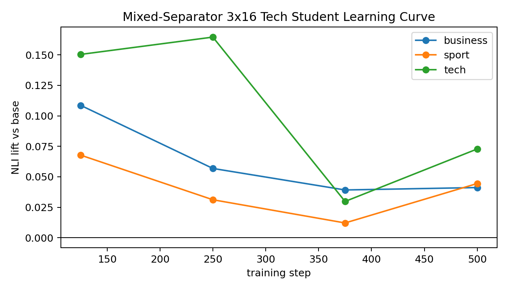

| step | business | sport | tech |
|---:|---:|---:|---:|
| 125 | +0.109 | +0.068 | +0.150 |
| 250 | +0.057 | +0.031 | +0.165 |
| 375 | +0.039 | +0.012 | +0.030 |
| 500 | +0.041 | +0.044 | +0.073 |

Activation at the best mixed-separator behavioral checkpoint:

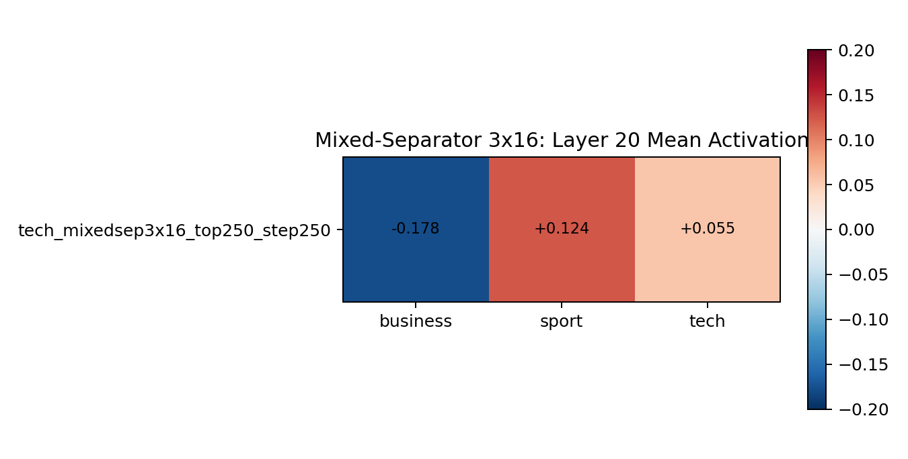

| model | business | sport | tech |
|---|---:|---:|---:|
| tech mixed-sep 3x16 step250 | -0.178 | +0.124 | +0.055 |

Readout:

- Mixed-separator 3x16 is better than broad varied format behaviorally, but still below fixed-pipe top250.
- It is the first tech SFT variant here with a positive layer-20 tech activation dot, even though the behavioral result remains weaker than fixed-pipe.
- This points toward a real format interaction: preserving the fixed 3x16 shape matters, and changing separators alone is less damaging than changing length/wrapper, but the original fixed-pipe schema remains the best behavioral carrier so far.

## Bottom Line

The symmetric 3x3 experiment was worth doing.

What worked:

- Teacher gating now works for all three traits after vector hygiene.
- Hard-token numeric SFT produces behavioral movement for all three rows.
- Tech is a surprisingly strong behavioral result: teacher-gated tech vector + top500 numeric SFT gives the cleanest diagonal in the behavioral matrix.

What did not work cleanly:

- Business behavior is weak.
- Sport behavior is confounded with tech.
- Activation matrices do not explain the tech behavioral result.
- A layer/pooling sweep does not fix the activation mismatch: layer 20 mean pooling is the best overall readout, but tech remains negative on its own original BBC tech vector.
- Anti-trait carrier selection is not a free win: it can clean the carrier likelihood criterion while shrinking the behavior we care about.
- Varied numeric formats improve the teacher likelihood gate but did not improve student behavior in the first tech pilot.
- Mixed-separator 3x16 improves over broad varied format and gives positive tech activation, but still does not beat fixed-pipe behavior.

Next best step: keep tech fixed-pipe top250 as the strongest BBC hard-token behavioral result. For broader progress, prioritize better teacher vectors or selection criteria that predict student behavior, not just stronger teacher likelihood lift. Format should be treated as a central experimental variable, not harmless augmentation.
