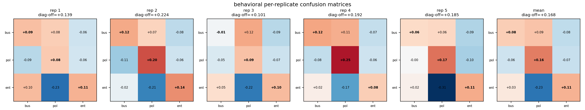
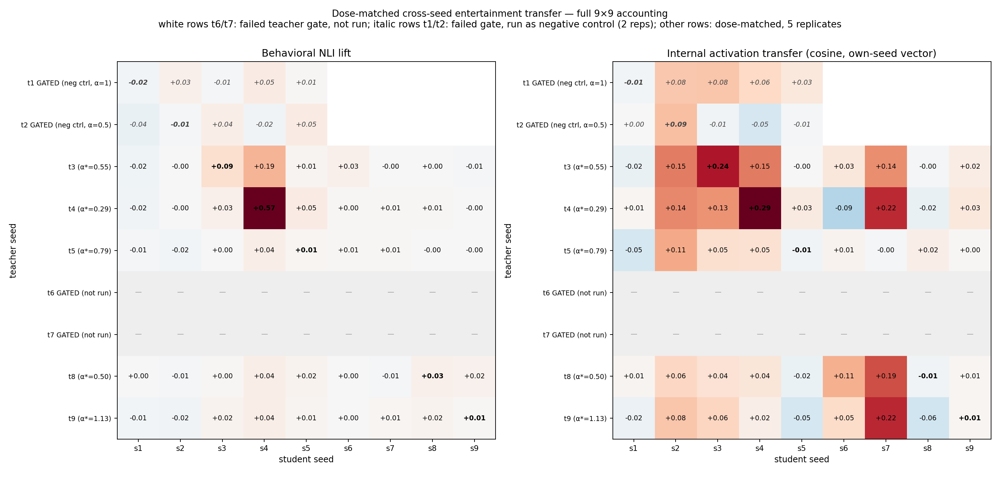

# Experiment Series — Illustrated Summary

Companion to `claude_experiment_series_summary.md` (terse version). Same six experiments,
2026-06-09 to 2026-06-11, ~330 training runs on one RTX 4080. Each section: what was run,
the key chart, and what the chart licenses you to conclude.

**Terminology used throughout:** *replicate* = a fresh training-RNG seed (data order, trainer
init) on the same PolyPythia model; *seed* alone = a PolyPythia weight-init seed (seed1..seed9);
*dose* = the teacher's behavioral lift while steered, set via steering strength alpha;
*handle* = the vector used to steer/measure a trait in a given seed.

---

## 1. Experiment A replicates at the run level

All 9 cells of the original 3x3 (teacher seed3 → student seed3, three BBC traits) retrained with
5 training-RNG replicates on the exact original DPO pairs.

*Five independent trainings, same diagonal structure every time (diag−offdiag +0.10 to +0.22).
The original single-run result was real, not a lucky run.*

*Run-level γ with cluster-robust 95% CIs; × marks the original single-run estimates, which sit
inside the replicate CIs. DPO: behavioral γ=0.168 (exact permutation p=1/7776, the floor),
internal γ=0.294.*

Details: `overnight_replication_summary_20260609.md`

## 2. Numeric hard-token SFT: internal-only transfer

Identical 15-run protocol on the numeric SFT arm.

*Each dot is one replicate. DPO (blue) shows large diagonal dominance on both metrics; numeric
(red) shows a small but 5/5-consistent internal effect (γ=0.009, perm p=0.0036) and nothing
behavioral. The carrier transmits the direction ~30x more weakly than DPO — real, but below the
behavioral threshold.*

Details: `overnight_replication_summary_20260609.md`, `bbc_topic_3x3_numeric_replicates_local/stats/`

## 3. Calibration theory test: right direction, ~6x magnitude gap

For all 90 run-cells, predicted behavioral lift = teacher calibration slope × measured layer-16
activation transfer; compared to observed lift.

*Gray: the teacher's steering dose-response. Dots: trained students plotted at their measured
activation strength. Students sit far above the curve — they express like teachers steered at
alpha 0.5–1.0 while measuring like alpha ~0.13.*

*Predictions correlate (pooled R²=0.47) but the fitted slope is ~5.9 (CI 4.6–7.2) instead of 1.
The single-vector linear account predicts which trait moves, and under-predicts how much.*

Details: `overnight_replication_summary_20260609.md`, `bbc_topic_3x3_replicates_local/theory_test_cells.csv`

## 4. Dose-matched cross-seed transfer (9 seeds, 225 runs + 20-run negative control)

Per-seed calibration gated teachers 1/2/6/7 out (steering moves nothing); survivors (3/4/5/8/9)
dose-matched to the same behavioral lift (+0.062) and crossed with all 9 students, 5 replicates.

*Full accounting: every row measured (5 dose-matched + 2 negative-control) or excluded by
validated rule (2). Left/behavioral: the diagonal stands out (γ=0.117, permutation floor) and
is concentrated in t3s3/t4s4. Right/internal: reception is broad — teacher-3/4 data moves
students 2,3,4,7 along their own vectors regardless of init — but the strong receivers s2/s7
express nothing behaviorally, exactly as their flat calibration curves predict. The italic t1/t2
rows: gated teachers transfer nothing, even to their own seed.*

Details: `cross_seed_dosematched_final_summary.md`, `cross_seed_ent_gated_negcontrol/`

## 5. Handle robustness (pre-registered): the probes were part of the story

Six alternative handles per weak seed (mean-diff at l8/12/16/20, logistic probes at l12/16),
screen → gate → confirmatory 5-replicate transfer for rescued seeds.

*Gray = the original handle's best achievable steering lift; blue = best alternative handle.
Five of seven weak seeds clear the gate with a better handle (layer 12 dominates); seed7 never
promoted past screen, seed1 never passed the gate. Per-seed "unsteerable" verdicts were largely
artifacts of one extraction recipe.*

*The confirmatory test: seed6 — originally "can't express, can't teach, can't learn" — shows
same-init transfer with its layer-12 probe handle (+0.023, 5/5 replicates positive, p=0.014).
Seeds 2 and 8 passed the gate but still did not transfer: expression coupling and same-init
coupling are genuinely different properties.*

Details: `handle_robustness_results.md`, prereg `handle_robustness_prereg.md`

## 6. Dose-response (pre-registered): transfer is a switch, not a dial

Teachers 3/4/6 at doses 0.03–0.50 (8 new arms × 5 replicates), existing +0.062 cells as anchors.

*Left: student lift is flat across an 8–16x dose range and already saturated at the lowest
constructible dose; each seed sits at its own attractor height (~0.65 / ~0.15 / ~0.02). At dose
0.03, seed4's student expresses 18x its teacher. Right: efficiency falls as exactly 1/dose.
The data's measured bias (mean DPO lift-gap) rose ~7x with dose — transfer didn't move, so this
is not a data-quantity artifact. seed6's 0.03 arm shows the onset: below some noise floor,
nothing transfers.*

Status: pre-registered verdict is H-saturating; treat the "switch" framing as provisional —
DPO-specific (ordinal labels), two strong seeds only, and the threshold region is unmapped below
0.03. The phase-change behavior seen in the original SFT setup is consistent with this picture.

Details: `dose_response/dose_response_findings.md`, prereg `dose_response_prereg.md`

---

## Synthesis: the three-factor decomposition

*One number per seed per factor, all measured: expression (best steering lift over all handles),
reception (mean off-diagonal internal transfer received), same-init transfer (diagonal behavioral
lift; seed7 unmeasured — gated and never rescued). Behavioral subliminal transfer happens where
all three are high: seeds 3, 4, and (weakly) 6. The factors dissociate: s2/s7 receive without
expressing; s5/s8/s9 express without same-init coupling.*

**The factorization claim, stated carefully:** behavioral same-init transfer ≈ expression(teacher)
× reception(student) × expression(student) × same-init bonus (~2x on reception), with magnitude
set by the student's attractor (Exp 6), and every factor measurable before training. Caveats
before publishing: one trait (entertainment), one architecture/scale (410M), DPO carrier for the
magnitude claims, and factors measured through handles that are themselves seed-dependent (Exp 5
bounds this but doesn't eliminate it).

## Methodology lessons (demonstrated, not asserted)

1. Run-level replicates changed Experiment A's p-value floor from 1/6 to 1/7776 (Exp 1).
2. Dose-matching reversed the naive cross-seed reading (Exp 4 vs old D.2).
3. Handle robustness overturned per-seed gate verdicts (Exp 5).
4. Dose-response showed single-dose designs measure the attractor, not sensitivity (Exp 6).

All scripts: `scripts/94-102`. Pre-registrations: `handle_robustness_prereg.md`,
`dose_response_prereg.md`.
