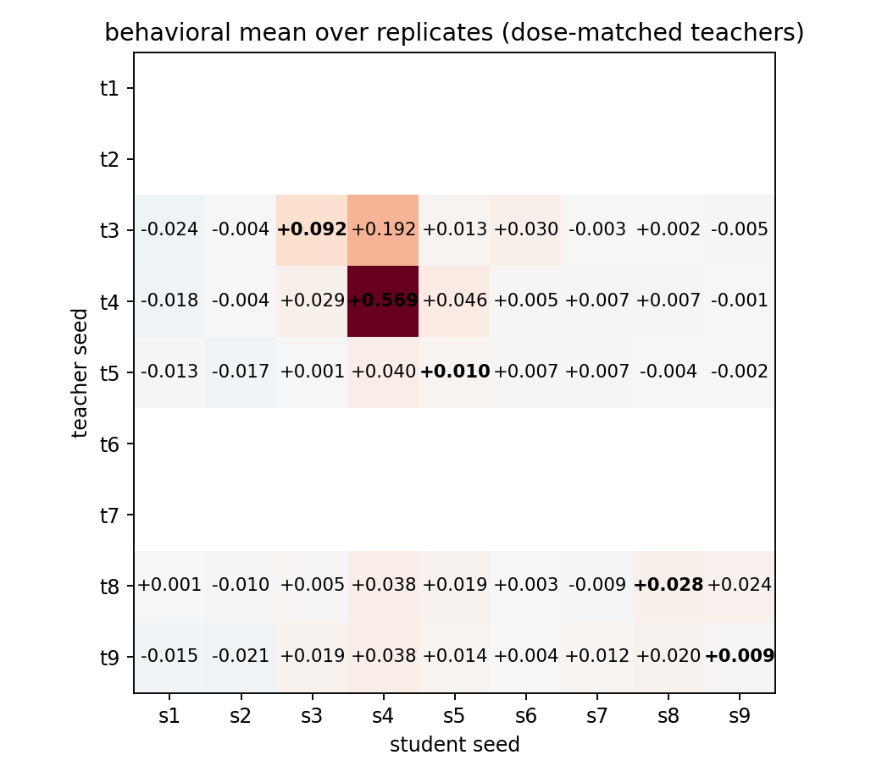
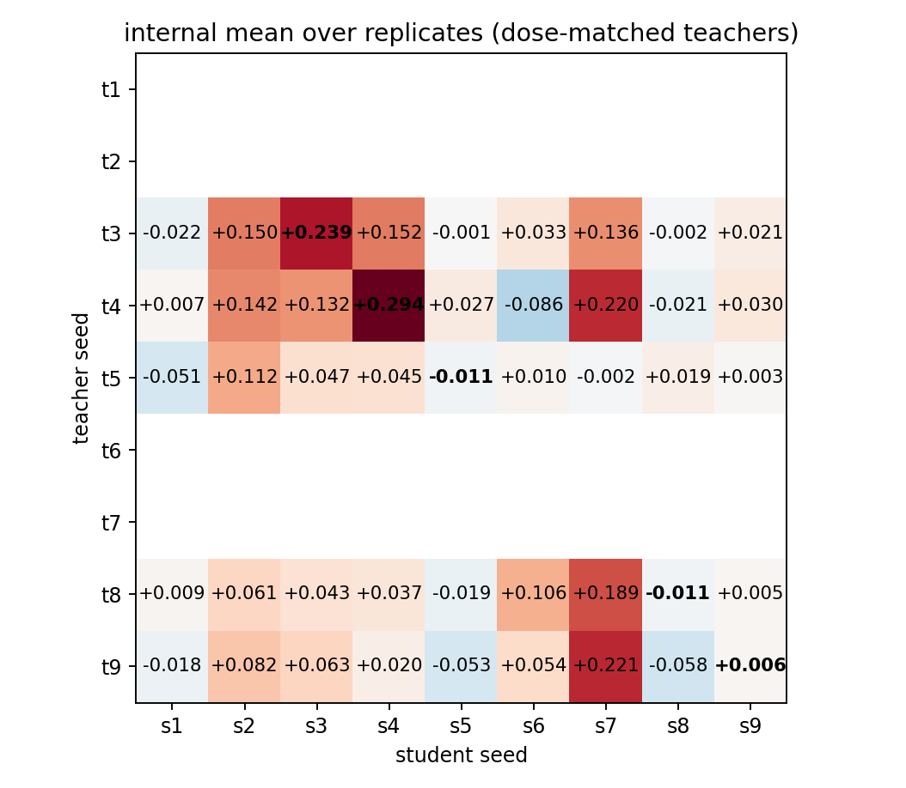

# Dose-Matched Cross-Seed Transfer: Run-Level Statistics

Teachers dose-matched to behavioral lift target 0.0619; alpha* per seed: seed3=0.553, seed4=0.287, seed5=0.791

Design: 5 gated teachers x 9 students, complete rectangle; 225 runs.

## Results

| matrix_type   | analysis                   |   gamma |         se |        t |   df |   p_one_sided |   n_obs |   n_clusters |   n_permutations |
|:--------------|:---------------------------|--------:|-----------:|---------:|-----:|--------------:|--------:|-------------:|-----------------:|
| behavioral    | per_generation_cluster_ols | 0.11659 |   0.027767 |   4.1989 |  224 |    1.9351e-05 |   13500 |          225 |              nan |
| behavioral    | run_cell_ols_hc3           | 0.11659 |   0.03038  |   3.8378 |  211 |    8.2022e-05 |     225 |          225 |              nan |
| behavioral    | freedman_lane_permutation  | 0.11659 | nan        | nan      |  nan |    4.9998e-05 |     nan |          nan |            20000 |
| internal      | run_cell_ols_hc3           | 0.07889 |   0.019803 |   3.9837 |  211 |    4.6708e-05 |     225 |          225 |              nan |
| internal      | freedman_lane_permutation  | 0.07889 | nan        | nan      |  nan |    4.9998e-05 |     nan |          nan |            20000 |

## Teacher / student effects (run-cell OLS, HC3)

| matrix_type   | term                  |   estimate |        se |          p |     ci_low |     ci_high |
|:--------------|:----------------------|-----------:|----------:|-----------:|-----------:|------------:|
| behavioral    | C(teacher_seed)[T.t4] |  0.038584  | 0.017132  | 0.025338   |  0.0048131 |  0.072356   |
| behavioral    | C(teacher_seed)[T.t5] | -0.029342  | 0.010129  | 0.004168   | -0.049309  | -0.0093743  |
| behavioral    | C(teacher_seed)[T.t8] | -0.021604  | 0.010368  | 0.038385   | -0.042042  | -0.0011664  |
| behavioral    | C(teacher_seed)[T.t9] | -0.023601  | 0.011513  | 0.041601   | -0.046296  | -0.00090643 |
| behavioral    | C(student_seed)[T.s2] |  0.0027929 | 0.0096453 | 0.77244    | -0.016221  |  0.021806   |
| behavioral    | C(student_seed)[T.s3] |  0.019713  | 0.012683  | 0.1216     | -0.0052875 |  0.044714   |
| behavioral    | C(student_seed)[T.s4] |  0.16578   | 0.030981  | 2.272e-07  |  0.1047    |  0.22685    |
| behavioral    | C(student_seed)[T.s5] |  0.011157  | 0.013821  | 0.42044    | -0.016088  |  0.038402   |
| behavioral    | C(student_seed)[T.s6] |  0.023711  | 0.010279  | 0.022045   |  0.0034475 |  0.043974   |
| behavioral    | C(student_seed)[T.s7] |  0.016573  | 0.010545  | 0.11754    | -0.0042145 |  0.037361   |
| behavioral    | C(student_seed)[T.s8] |  0.0011304 | 0.013342  | 0.93256    | -0.025171  |  0.027432   |
| behavioral    | C(student_seed)[T.s9] | -0.0042219 | 0.01437   | 0.7692     | -0.032549  |  0.024105   |
| behavioral    | is_diagonal           |  0.11659   | 0.03038   | 0.00016404 |  0.056705  |  0.17648    |
| internal      | C(teacher_seed)[T.t4] |  0.0045427 | 0.021256  | 0.83098    | -0.037359  |  0.046444   |
| internal      | C(teacher_seed)[T.t5] | -0.059167  | 0.023797  | 0.013682   | -0.10608   | -0.012257   |
| internal      | C(teacher_seed)[T.t8] | -0.031589  | 0.021196  | 0.13763    | -0.073372  |  0.010194   |
| internal      | C(teacher_seed)[T.t9] | -0.042986  | 0.020137  | 0.033942   | -0.082681  | -0.0032901  |
| internal      | C(student_seed)[T.s2] |  0.12438   | 0.019721  | 1.6419e-09 |  0.085505  |  0.16325    |
| internal      | C(student_seed)[T.s3] |  0.10395   | 0.017083  | 5.4167e-09 |  0.070274  |  0.13763    |
| internal      | C(student_seed)[T.s4] |  0.10877   | 0.020197  | 1.9188e-07 |  0.06896   |  0.14859    |
| internal      | C(student_seed)[T.s5] | -0.011955  | 0.017031  | 0.48351    | -0.045528  |  0.021619   |
| internal      | C(student_seed)[T.s6] |  0.03813   | 0.032697  | 0.24486    | -0.026325  |  0.10259    |
| internal      | C(student_seed)[T.s7] |  0.16785   | 0.035044  | 3.1464e-06 |  0.098764  |  0.23693    |
| internal      | C(student_seed)[T.s8] | -0.015565  | 0.027396  | 0.57054    | -0.069571  |  0.03844    |
| internal      | C(student_seed)[T.s9] |  0.012162  | 0.019253  | 0.52827    | -0.025791  |  0.050115   |
| internal      | is_diagonal           |  0.07889   | 0.019803  | 9.3416e-05 |  0.039853  |  0.11793    |

## Matrices

