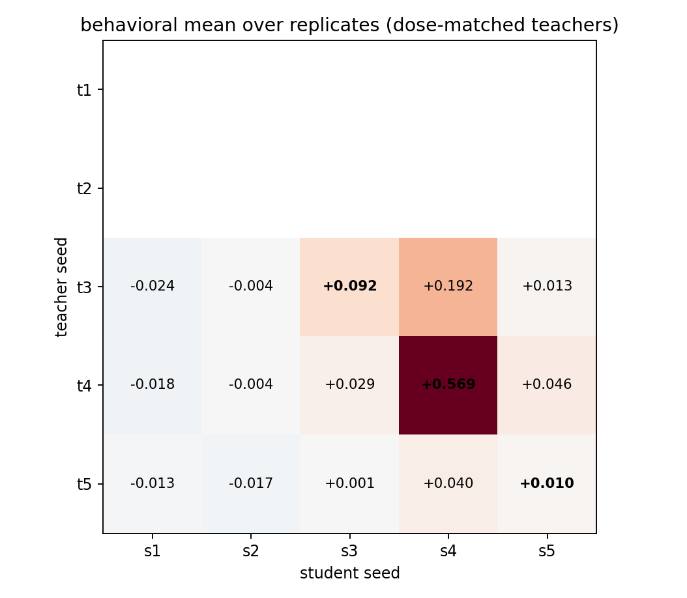
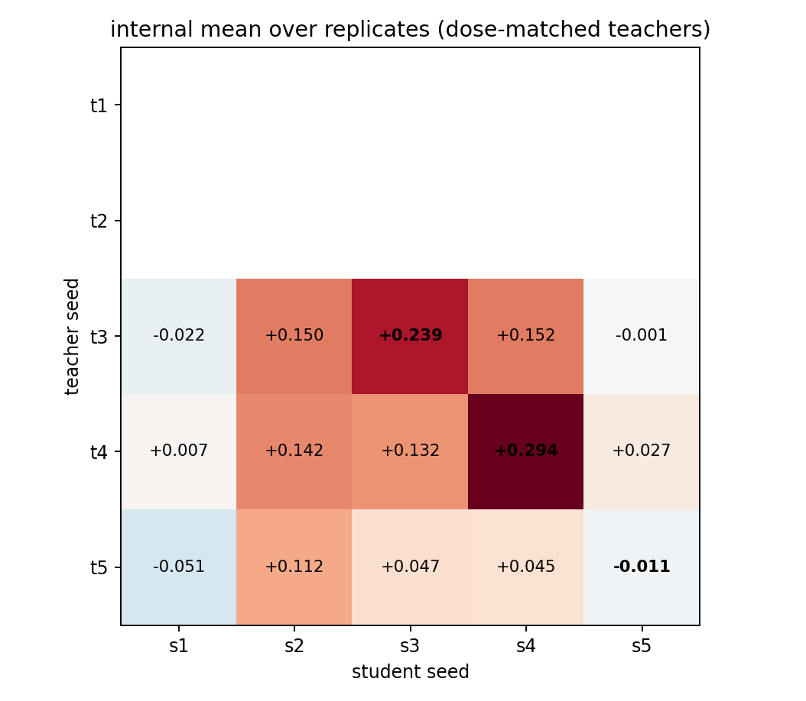

# Dose-Matched Cross-Seed Transfer: Run-Level Statistics

Teachers dose-matched to behavioral lift target 0.0619; alpha* per seed: seed3=0.553, seed4=0.287, seed5=0.791

Design: 3 gated teachers x 5 students, complete rectangle; 75 runs.

## Results

| matrix_type   | analysis                   |   gamma |         se |        t |   df |   p_one_sided |   n_obs |   n_clusters |   n_permutations |
|:--------------|:---------------------------|--------:|-----------:|---------:|-----:|--------------:|--------:|-------------:|-----------------:|
| behavioral    | per_generation_cluster_ols | 0.16993 |   0.030088 |   5.6476 |   74 |    1.426e-07  |    4500 |           75 |              nan |
| behavioral    | run_cell_ols_hc3           | 0.16993 |   0.03439  |   4.9413 |   67 |    2.731e-06  |      75 |           75 |              nan |
| behavioral    | freedman_lane_permutation  | 0.16993 | nan        | nan      |  nan |    4.9998e-05 |     nan |          nan |            20000 |
| internal      | run_cell_ols_hc3           | 0.10687 |   0.017324 |   6.169  |   67 |    2.2496e-08 |      75 |           75 |              nan |
| internal      | freedman_lane_permutation  | 0.10687 | nan        | nan      |  nan |    4.9998e-05 |     nan |          nan |            20000 |

## Teacher / student effects (run-cell OLS, HC3)

| matrix_type   | term                  |   estimate |       se |          p |    ci_low |    ci_high |
|:--------------|:----------------------|-----------:|---------:|-----------:|----------:|-----------:|
| behavioral    | C(teacher_seed)[T.t4] |  0.070704  | 0.02222  | 0.0022173  |  0.026354 |  0.11506   |
| behavioral    | C(teacher_seed)[T.t5] | -0.049629  | 0.021468 | 0.023872   | -0.092478 | -0.0067789 |
| behavioral    | C(student_seed)[T.s2] |  0.010157  | 0.020744 | 0.62597    | -0.031247 |  0.051562  |
| behavioral    | C(student_seed)[T.s3] |  0.0024585 | 0.026066 | 0.92514    | -0.04957  |  0.054487  |
| behavioral    | C(student_seed)[T.s4] |  0.22861   | 0.035919 | 2.0392e-08 |  0.15692  |  0.30031   |
| behavioral    | C(student_seed)[T.s5] | -0.014819  | 0.024496 | 0.54725    | -0.063713 |  0.034075  |
| behavioral    | is_diagonal           |  0.16993   | 0.03439  | 5.4621e-06 |  0.10129  |  0.23857   |
| internal      | C(teacher_seed)[T.t4] |  0.016902  | 0.016153 | 0.29913    | -0.015339 |  0.049143  |
| internal      | C(teacher_seed)[T.t5] | -0.074941  | 0.014774 | 3.3282e-06 | -0.10443  | -0.045452  |
| internal      | C(student_seed)[T.s2] |  0.1566    | 0.022929 | 3.0524e-09 |  0.11083  |  0.20236   |
| internal      | C(student_seed)[T.s3] |  0.12567   | 0.022512 | 4.6507e-07 |  0.080732 |  0.1706    |
| internal      | C(student_seed)[T.s4] |  0.15027   | 0.02331  | 1.4616e-08 |  0.10374  |  0.1968    |
| internal      | C(student_seed)[T.s5] | -0.0084074 | 0.024826 | 0.73593    | -0.057961 |  0.041146  |
| internal      | is_diagonal           |  0.10687   | 0.017324 | 4.4992e-08 |  0.072291 |  0.14145   |

## Matrices

