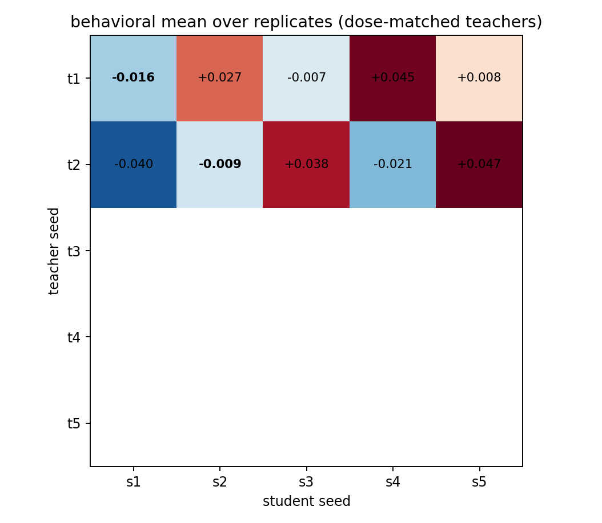
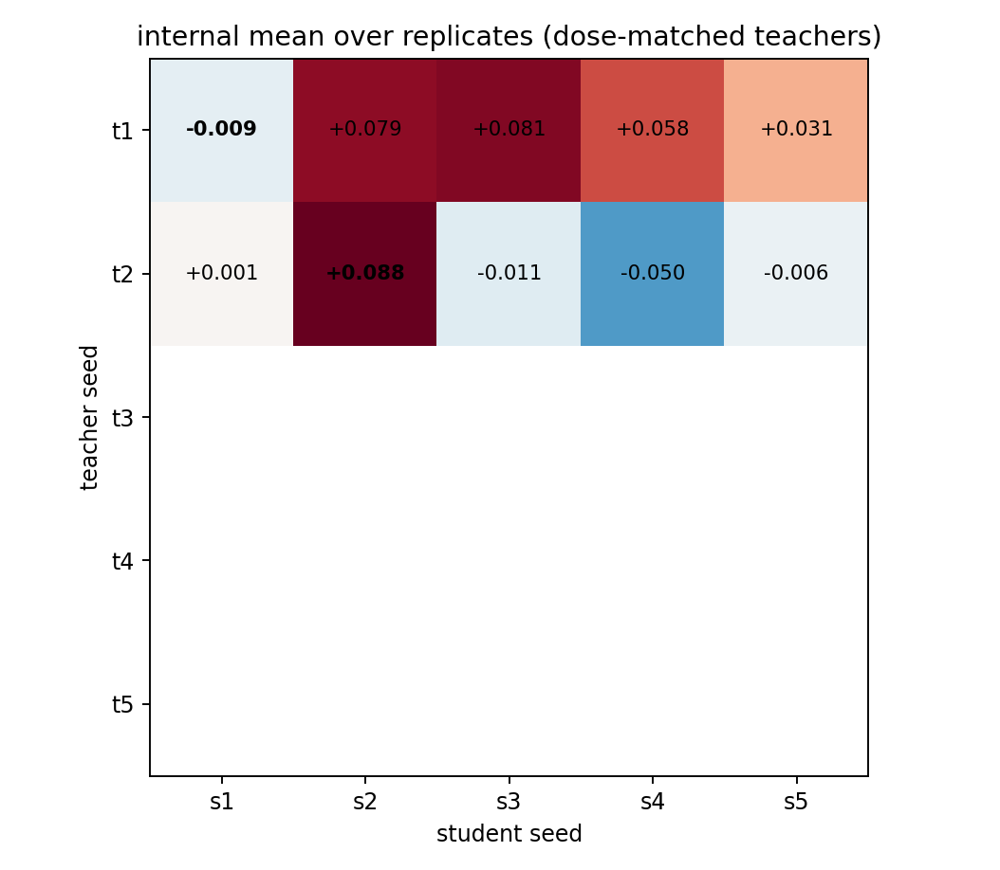

# Dose-Matched Cross-Seed Transfer: Run-Level Statistics

Teachers dose-matched to behavioral lift target 0.0619; alpha* per seed: seed1=1.000, seed2=0.500

Design: 2 gated teachers x 5 students, complete rectangle; 20 runs.

## Results

| matrix_type   | analysis                   |       gamma |         se |           t |   df |   p_one_sided |   n_obs |   n_clusters |   n_permutations |
|:--------------|:---------------------------|------------:|-----------:|------------:|-----:|--------------:|--------:|-------------:|-----------------:|
| behavioral    | per_generation_cluster_ols | -0.0062737  |   0.010643 |  -0.58945   |   19 |       0.71875 |    1200 |           20 |              nan |
| behavioral    | run_cell_ols_hc3           | -0.0062737  |   0.017996 |  -0.34861   |   13 |       0.63352 |      20 |           20 |              nan |
| behavioral    | freedman_lane_permutation  | -0.0062737  | nan        | nan         |  nan |       0.62137 |     nan |          nan |            20000 |
| internal      | run_cell_ols_hc3           | -0.00038873 |   0.083656 |  -0.0046467 |   13 |       0.50182 |      20 |           20 |              nan |
| internal      | freedman_lane_permutation  | -0.00038873 | nan        | nan         |  nan |       0.49938 |     nan |          nan |            20000 |

## Teacher / student effects (run-cell OLS, HC3)

| matrix_type   | term                  |    estimate |       se |        p |     ci_low |   ci_high |
|:--------------|:----------------------|------------:|---------:|---------:|-----------:|----------:|
| behavioral    | C(teacher_seed)[T.t2] | -0.0084181  | 0.017928 | 0.64646  | -0.04715   |  0.030314 |
| behavioral    | C(student_seed)[T.s2] |  0.036951   | 0.017996 | 0.060738 | -0.0019275 |  0.075829 |
| behavioral    | C(student_seed)[T.s3] |  0.040939   | 0.031635 | 0.21815  | -0.027404  |  0.10928  |
| behavioral    | C(student_seed)[T.s4] |  0.037375   | 0.026566 | 0.18291  | -0.020016  |  0.094767 |
| behavioral    | C(student_seed)[T.s5] |  0.052167   | 0.026909 | 0.074564 | -0.0059661 |  0.1103   |
| behavioral    | is_diagonal           | -0.0062737  | 0.017996 | 0.73296  | -0.045152  |  0.032605 |
| internal      | C(teacher_seed)[T.t2] | -0.043616   | 0.039241 | 0.28649  | -0.12839   |  0.041158 |
| internal      | C(student_seed)[T.s2] |  0.087338   | 0.083656 | 0.31551  | -0.09339   |  0.26807  |
| internal      | C(student_seed)[T.s3] |  0.038802   | 0.075089 | 0.61401  | -0.12342   |  0.20102  |
| internal      | C(student_seed)[T.s4] |  0.0071505  | 0.083625 | 0.93316  | -0.17351   |  0.18781  |
| internal      | C(student_seed)[T.s5] |  0.016162   | 0.071046 | 0.82359  | -0.13732   |  0.16965  |
| internal      | is_diagonal           | -0.00038873 | 0.083656 | 0.99636  | -0.18112   |  0.18034  |

## Matrices

