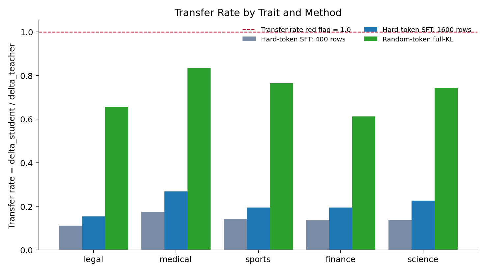
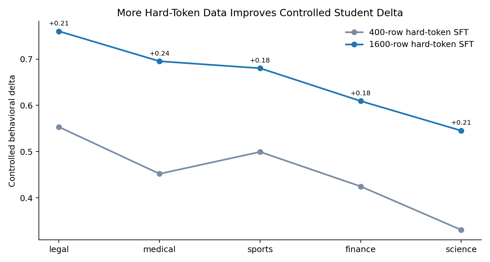
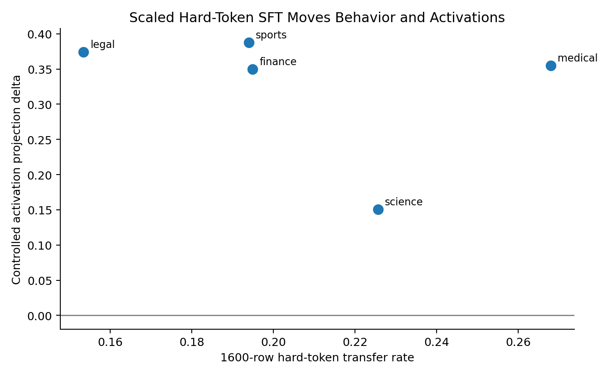
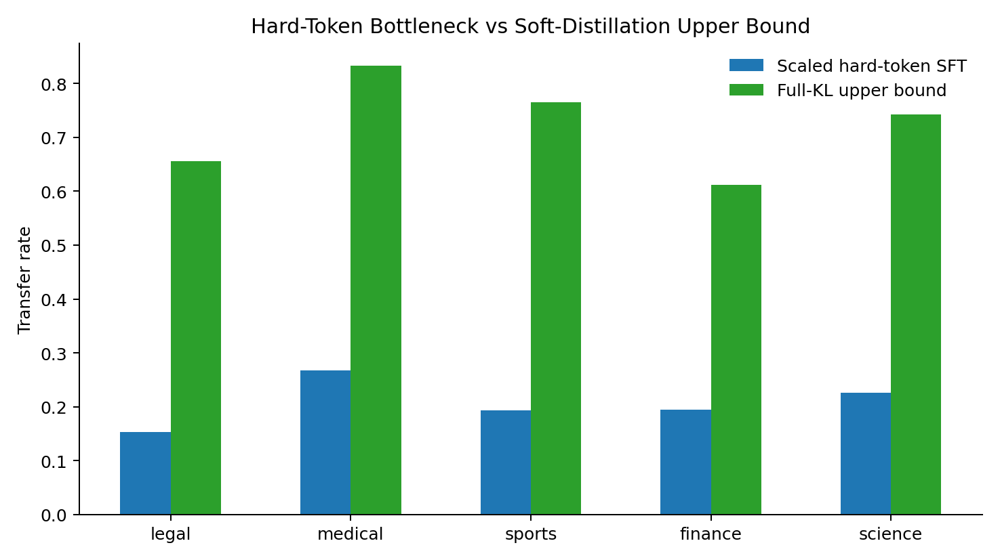

# Current Working Results

Date: 2026-05-27

## Summary

We currently have two things working well:

1. **Random-token full-KL distillation works strongly.** This is the soft
   distillation upper bound. It transfers all five current traits with transfer
   rates around `0.61-0.83`.
2. **Hard-token SFT through random-token prompt continuations works weakly but
   consistently.** Scaling from 400 rows to 1600 rows improved every tested
   trait, with controlled transfer rates around `0.15-0.27`.

The hard-token result is the more important subliminal-learning result because
the student only sees sampled text, not teacher logits. The full-KL result is
useful because it shows that the random-token carrier can carry the steering
signal when the training objective has enough information.

## Charts

## Scaled Hard-Token SFT

Method:

- Teacher/student: `EleutherAI/pythia-410m`
- Trait vectors: layer 12, alpha 12 for steered teacher generation
- Carrier: random-token prompts plus sampled hard-token teacher continuations
- Data: 1600 rows per condition, 32 prompt tokens, 32 continuation tokens
- Training: SFT, 800 steps, learning rate `5e-6`
- Control: matched neutral teacher continuation SFT
- Transfer rate: `(steered student score - neutral student score) / teacher delta`

| Trait | Teacher delta | Neutral score | Steered score | Student delta | Transfer rate | Activation delta |
| --- | ---: | ---: | ---: | ---: | ---: | ---: |
| legal | 4.9514 | -1.6044 | -0.8444 | 0.7601 | 0.1535 | 0.3741 |
| medical | 2.5946 | -2.4152 | -1.7199 | 0.6953 | 0.2680 | 0.3547 |
| sports | 3.5057 | -2.1704 | -1.4901 | 0.6802 | 0.1940 | 0.3879 |
| finance | 3.1268 | -1.9547 | -1.3454 | 0.6093 | 0.1949 | 0.3499 |
| science | 2.4156 | -2.1181 | -1.5728 | 0.5453 | 0.2257 | 0.1503 |

This is the cleanest hard-token result so far. Every trait is positive, every
trait improves with more data, and every trait has a positive controlled
activation delta. None of the transfer rates exceed 1.0, so this does not look
like the red-flag case where the student goes far beyond the teacher.

Best current hard-token traits:

- **Medical**: strongest transfer rate, `0.2680`.
- **Science**: second strongest transfer rate, `0.2257`, but weaker activation
  movement than the others.
- **Sports / finance**: similar transfer rates around `0.194`, strong
  activation movement.
- **Legal**: lowest transfer rate because the teacher delta is large, but it
  has the largest absolute student delta.

## Scaling Effect

| Trait | 400-row delta | 1600-row delta | 400-row transfer | 1600-row transfer |
| --- | ---: | ---: | ---: | ---: |
| legal | 0.5533 | 0.7601 | 0.1118 | 0.1535 |
| medical | 0.4520 | 0.6953 | 0.1742 | 0.2680 |
| sports | 0.4994 | 0.6802 | 0.1424 | 0.1940 |
| finance | 0.4248 | 0.6093 | 0.1359 | 0.1949 |
| science | 0.3308 | 0.5453 | 0.1369 | 0.2257 |

The practical lesson is simple: more hard-token data helps. The improvement is
not enough to close the gap to KL distillation, but it is consistent across all
traits, which makes it a reliable baseline for testing filtering, best-of-n,
DPO, and other hard-token improvements.

## Full-KL Upper Bound

| Trait | Student delta | Transfer rate | Random-control separation |
| --- | ---: | ---: | ---: |
| legal | 3.2463 | 0.6556 | 3.4089 |
| medical | 2.1618 | 0.8332 | 2.3437 |
| sports | 2.6811 | 0.7648 | 2.2731 |
| finance | 1.9126 | 0.6117 | 1.5601 |
| science | 1.7947 | 0.7429 | 1.2695 |

The KL results are much stronger than hard-token SFT. That is expected: the
student gets soft teacher distributions rather than only one sampled
continuation. These runs are less clean as a subliminal-learning demonstration,
but they show that the random-token carrier has enough information to transmit
the steered state.

Medical and sports have reproduced across multiple KL seeds, which makes them
especially useful as reliable traits.

## What Is Working Best

The most defensible current pipeline is:

1. Validate the teacher steering on the trait gate.
2. Generate random-token prompt continuations from the steered teacher and a
   matched neutral teacher.
3. Train students by hard-token SFT.
4. Evaluate both behavioral logprob mass and activation projection.
5. Report transfer rate and avoid over-interpreting any transfer rate above 1.0.

The strongest scientific claim right now is not that hard-token transfer is
large. It is that hard-token transfer is **controlled, repeatable across several
traits, and improves with data**.

## Next Useful Experiments

1. **Divergence or steering-lift filtered SFT**: keep the hard-token examples
   that the steered teacher assigns much higher likelihood than the neutral
   teacher.
2. **Best-of-n/rejection sampling**: generate multiple continuations per random
   prompt and select stronger carriers before SFT.
3. **DPO or preference learning**: chosen = steered continuation, rejected =
   neutral or random-vector continuation.
4. **Larger hard-token data**: the scaling curve is still positive at 1600 rows,
   so 3200+ rows is a plausible next step.
