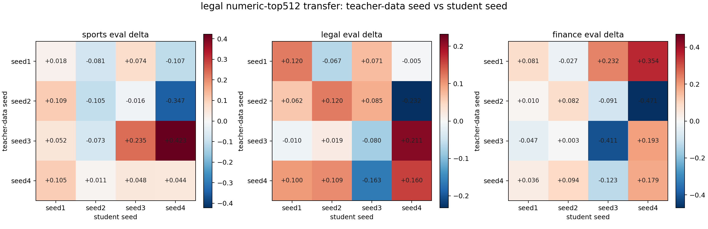
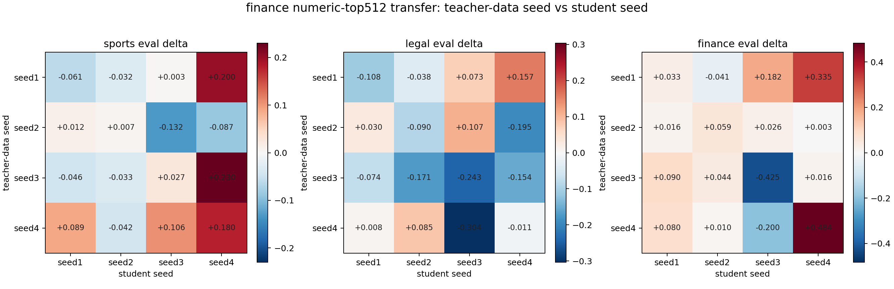

# Legal and Finance Cross-Seed Numeric Transfer

Protocol:

- Base models: `EleutherAI/pythia-410m-seed1` through `seed4`.
- Carrier data: numeric-only top-512 rows selected by same-seed steering lift.
- Off-diagonal cells: newly trained in Modal on teacher-data seed -> different student seed.
- Diagonal cells: existing same-seed numeric-top512 runs.
- Cell value: steered-data student logprob score minus matched neutral-control student score.

## Legal

| eval trait | mean delta | positive cells | min | max |
| --- | ---: | ---: | ---: | ---: |
| sports | +0.0243 | 10/16 | -0.3466 | +0.4231 |
| legal | +0.0312 | 10/16 | -0.2324 | +0.2112 |
| finance | +0.0058 | 10/16 | -0.4710 | +0.3542 |

Own-trait summary: mean `+0.0312`, positive `10/16`.

## Finance

| eval trait | mean delta | positive cells | min | max |
| --- | ---: | ---: | ---: | ---: |
| sports | +0.0263 | 9/16 | -0.1324 | +0.2304 |
| legal | -0.0580 | 6/16 | -0.3039 | +0.1567 |
| finance | +0.0445 | 13/16 | -0.4246 | +0.4838 |

Own-trait summary: mean `+0.0445`, positive `13/16`.

Long CSV: `reports/day3_cross_seed_numeric_legal_finance_matrix_long.csv`
