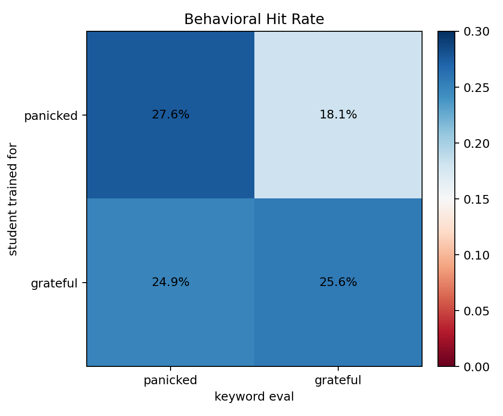
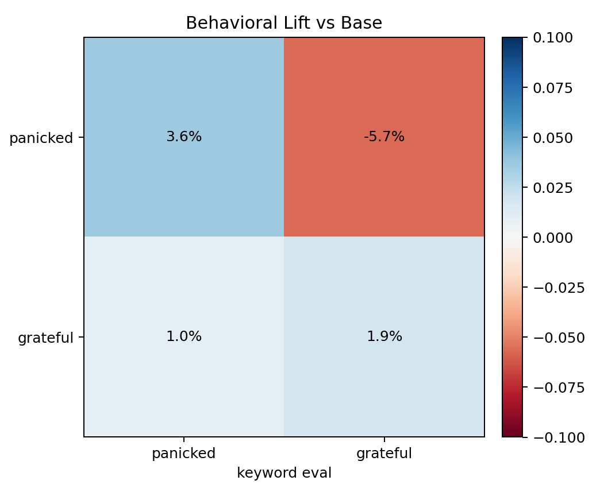
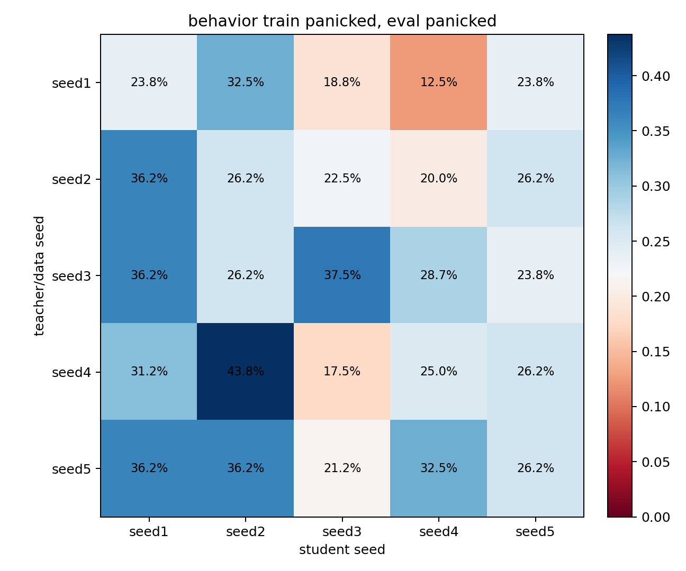
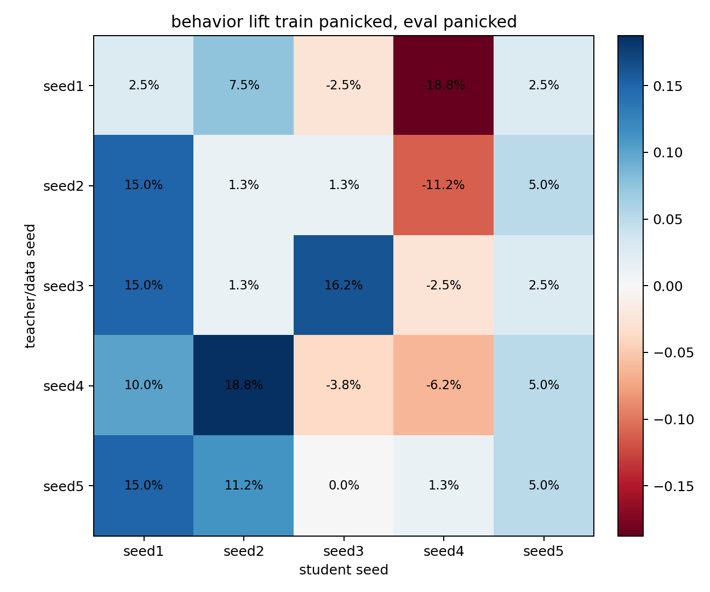
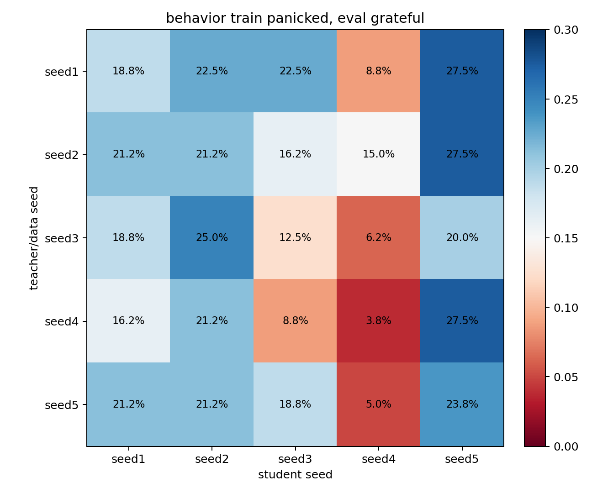
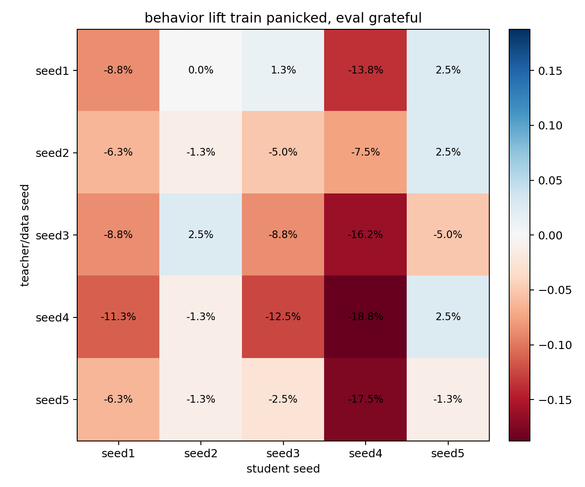
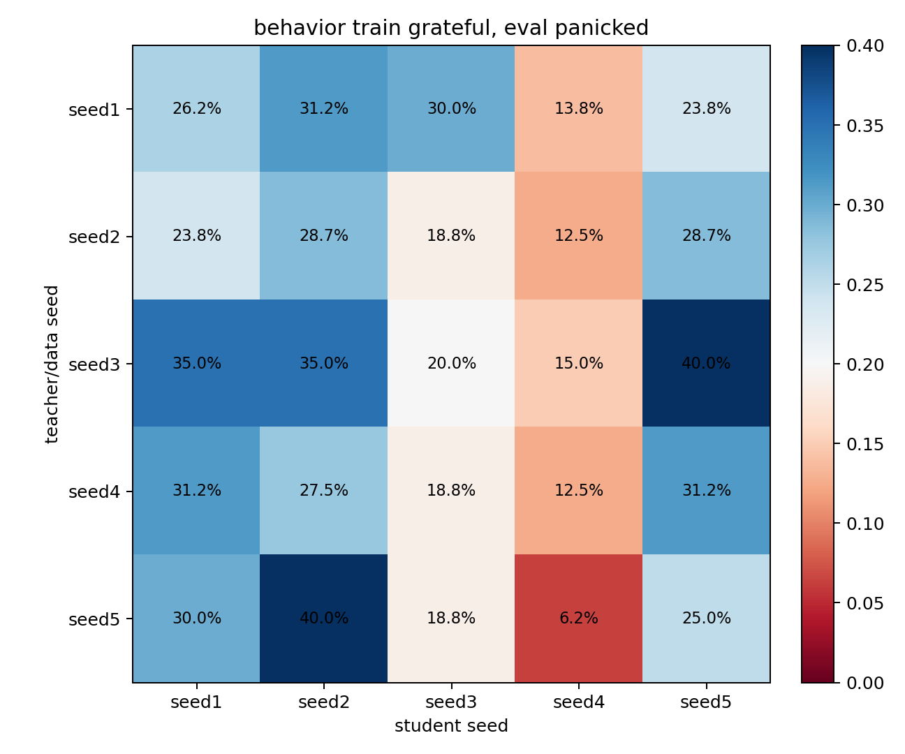
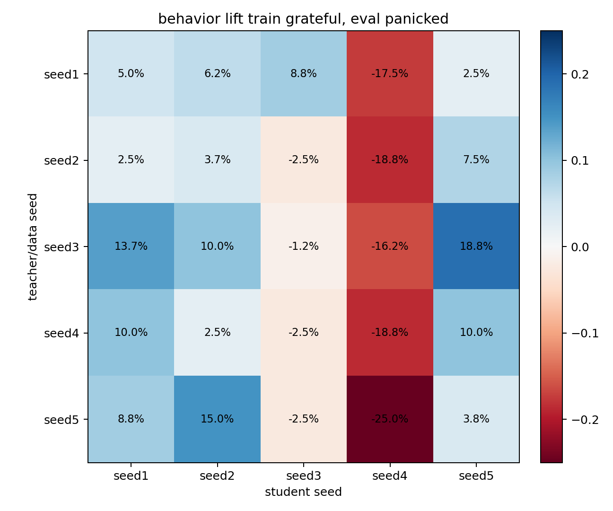
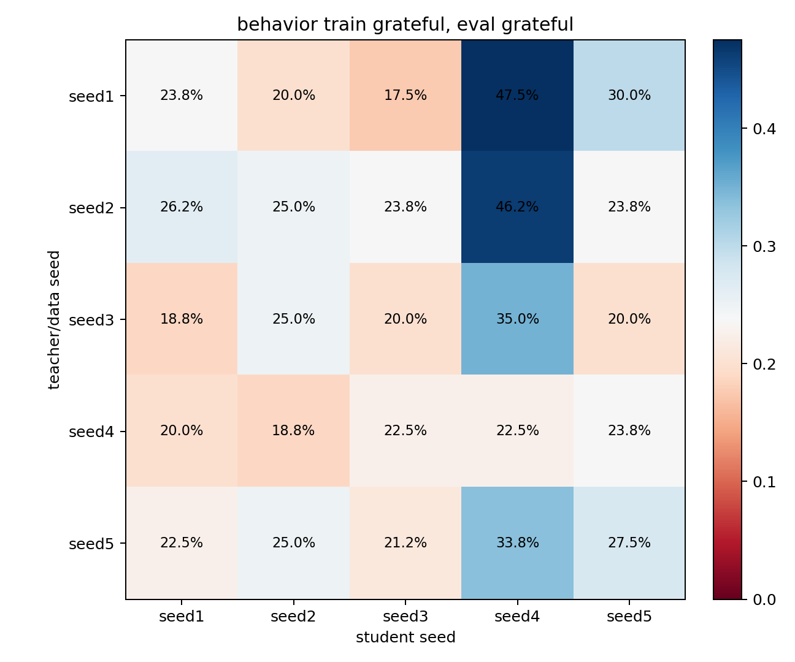
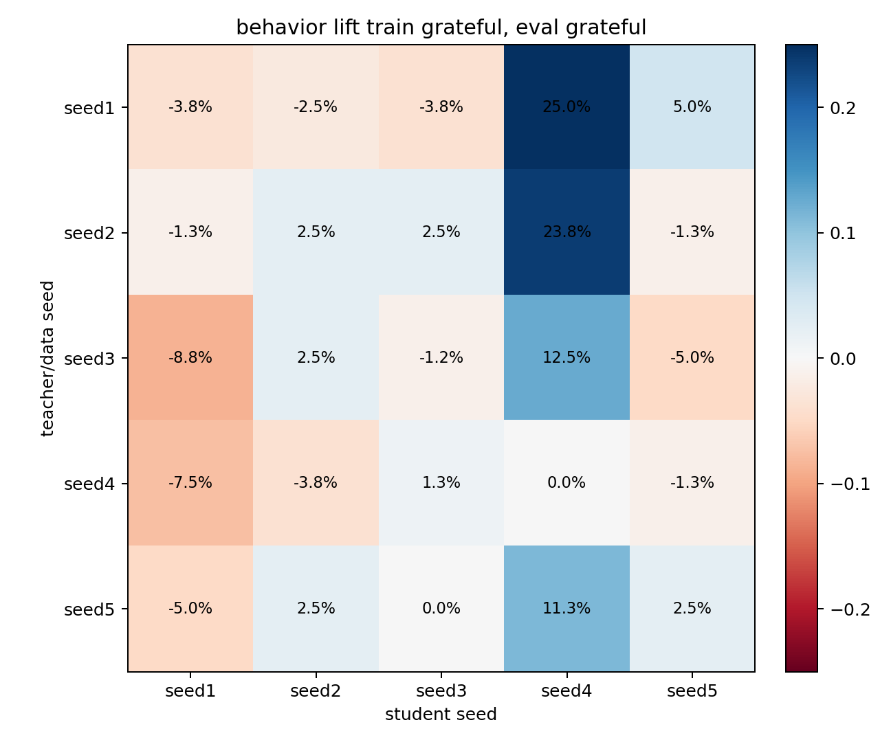

# Cross-Seed Behavioral Eval

## Behavioral Confusion Eval

This evaluates ordinary neutral story generations from each trained checkpoint using the same frozen output-derived keyword scorer used in the earlier visible-traits reports. Each model generated 80 continuations, and each continuation was scored against both `panicked` and `grateful` keyword sets.

### Base Rates

| seed   |   panicked |   grateful |
|:-------|-----------:|-----------:|
| seed1  |      0.212 |      0.275 |
| seed2  |      0.250 |      0.225 |
| seed3  |      0.212 |      0.212 |
| seed4  |      0.312 |      0.225 |
| seed5  |      0.212 |      0.250 |

### Mean Behavioral Confusion

Hit rate:

| train_trait   |   panicked |   grateful |
|:--------------|-----------:|-----------:|
| panicked      |      0.276 |      0.180 |
| grateful      |      0.249 |      0.256 |

Lift vs base mean:

| train_trait   |   panicked |   grateful |
|:--------------|-----------:|-----------:|
| panicked      |      0.036 |     -0.057 |
| grateful      |      0.010 |      0.019 |

### Train `panicked` -> Eval `panicked`

Hit rate:

| teacher_seed   |   seed1 |   seed2 |   seed3 |   seed4 |   seed5 |
|:---------------|--------:|--------:|--------:|--------:|--------:|
| seed1          |   0.237 |   0.325 |   0.188 |   0.125 |   0.237 |
| seed2          |   0.362 |   0.263 |   0.225 |   0.200 |   0.263 |
| seed3          |   0.362 |   0.263 |   0.375 |   0.287 |   0.237 |
| seed4          |   0.312 |   0.438 |   0.175 |   0.250 |   0.263 |
| seed5          |   0.362 |   0.362 |   0.212 |   0.325 |   0.263 |

Lift vs matching student-seed base:

| teacher_seed   |   seed1 |   seed2 |   seed3 |   seed4 |   seed5 |
|:---------------|--------:|--------:|--------:|--------:|--------:|
| seed1          |   0.025 |   0.075 |  -0.025 |  -0.188 |   0.025 |
| seed2          |   0.150 |   0.013 |   0.013 |  -0.112 |   0.050 |
| seed3          |   0.150 |   0.013 |   0.163 |  -0.025 |   0.025 |
| seed4          |   0.100 |   0.188 |  -0.038 |  -0.062 |   0.050 |
| seed5          |   0.150 |   0.112 |   0.000 |   0.013 |   0.050 |

Lift diagonal mean: 0.038. Lift off-diagonal mean: 0.036.

### Train `panicked` -> Eval `grateful`

Hit rate:

| teacher_seed   |   seed1 |   seed2 |   seed3 |   seed4 |   seed5 |
|:---------------|--------:|--------:|--------:|--------:|--------:|
| seed1          |   0.188 |   0.225 |   0.225 |   0.087 |   0.275 |
| seed2          |   0.212 |   0.212 |   0.163 |   0.150 |   0.275 |
| seed3          |   0.188 |   0.250 |   0.125 |   0.062 |   0.200 |
| seed4          |   0.163 |   0.212 |   0.087 |   0.037 |   0.275 |
| seed5          |   0.212 |   0.212 |   0.188 |   0.050 |   0.237 |

Lift vs matching student-seed base:

| teacher_seed   |   seed1 |   seed2 |   seed3 |   seed4 |   seed5 |
|:---------------|--------:|--------:|--------:|--------:|--------:|
| seed1          |  -0.088 |   0.000 |   0.013 |  -0.138 |   0.025 |
| seed2          |  -0.063 |  -0.013 |  -0.050 |  -0.075 |   0.025 |
| seed3          |  -0.088 |   0.025 |  -0.087 |  -0.163 |  -0.050 |
| seed4          |  -0.113 |  -0.013 |  -0.125 |  -0.188 |   0.025 |
| seed5          |  -0.063 |  -0.013 |  -0.025 |  -0.175 |  -0.013 |

Lift diagonal mean: -0.077. Lift off-diagonal mean: -0.052.

### Train `grateful` -> Eval `panicked`

Hit rate:

| teacher_seed   |   seed1 |   seed2 |   seed3 |   seed4 |   seed5 |
|:---------------|--------:|--------:|--------:|--------:|--------:|
| seed1          |   0.263 |   0.312 |   0.300 |   0.138 |   0.237 |
| seed2          |   0.237 |   0.287 |   0.188 |   0.125 |   0.287 |
| seed3          |   0.350 |   0.350 |   0.200 |   0.150 |   0.400 |
| seed4          |   0.312 |   0.275 |   0.188 |   0.125 |   0.312 |
| seed5          |   0.300 |   0.400 |   0.188 |   0.062 |   0.250 |

Lift vs matching student-seed base:

| teacher_seed   |   seed1 |   seed2 |   seed3 |   seed4 |   seed5 |
|:---------------|--------:|--------:|--------:|--------:|--------:|
| seed1          |   0.050 |   0.062 |   0.087 |  -0.175 |   0.025 |
| seed2          |   0.025 |   0.037 |  -0.025 |  -0.188 |   0.075 |
| seed3          |   0.137 |   0.100 |  -0.012 |  -0.163 |   0.188 |
| seed4          |   0.100 |   0.025 |  -0.025 |  -0.188 |   0.100 |
| seed5          |   0.087 |   0.150 |  -0.025 |  -0.250 |   0.038 |

Lift diagonal mean: -0.015. Lift off-diagonal mean: 0.016.

### Train `grateful` -> Eval `grateful`

Hit rate:

| teacher_seed   |   seed1 |   seed2 |   seed3 |   seed4 |   seed5 |
|:---------------|--------:|--------:|--------:|--------:|--------:|
| seed1          |   0.237 |   0.200 |   0.175 |   0.475 |   0.300 |
| seed2          |   0.263 |   0.250 |   0.237 |   0.463 |   0.237 |
| seed3          |   0.188 |   0.250 |   0.200 |   0.350 |   0.200 |
| seed4          |   0.200 |   0.188 |   0.225 |   0.225 |   0.237 |
| seed5          |   0.225 |   0.250 |   0.212 |   0.338 |   0.275 |

Lift vs matching student-seed base:

| teacher_seed   |   seed1 |   seed2 |   seed3 |   seed4 |   seed5 |
|:---------------|--------:|--------:|--------:|--------:|--------:|
| seed1          |  -0.038 |  -0.025 |  -0.038 |   0.250 |   0.050 |
| seed2          |  -0.013 |   0.025 |   0.025 |   0.238 |  -0.013 |
| seed3          |  -0.088 |   0.025 |  -0.012 |   0.125 |  -0.050 |
| seed4          |  -0.075 |  -0.038 |   0.013 |   0.000 |  -0.013 |
| seed5          |  -0.050 |   0.025 |   0.000 |   0.113 |   0.025 |

Lift diagonal mean: 0.000. Lift off-diagonal mean: 0.023.
