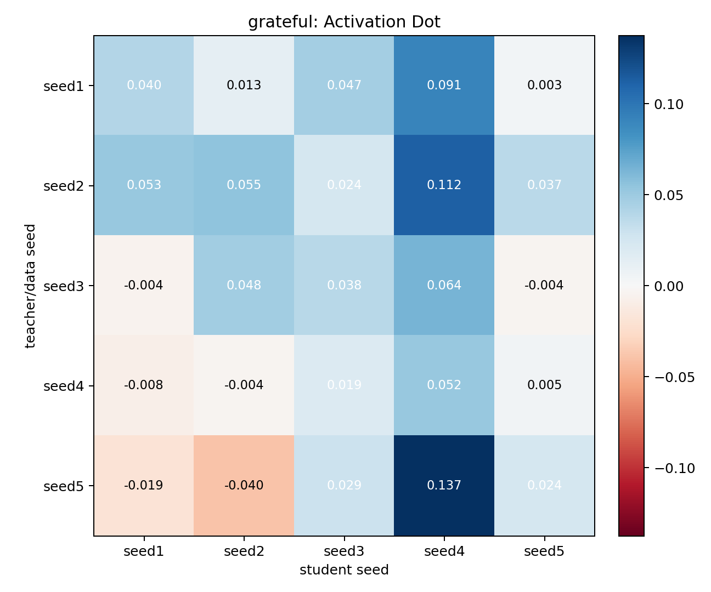
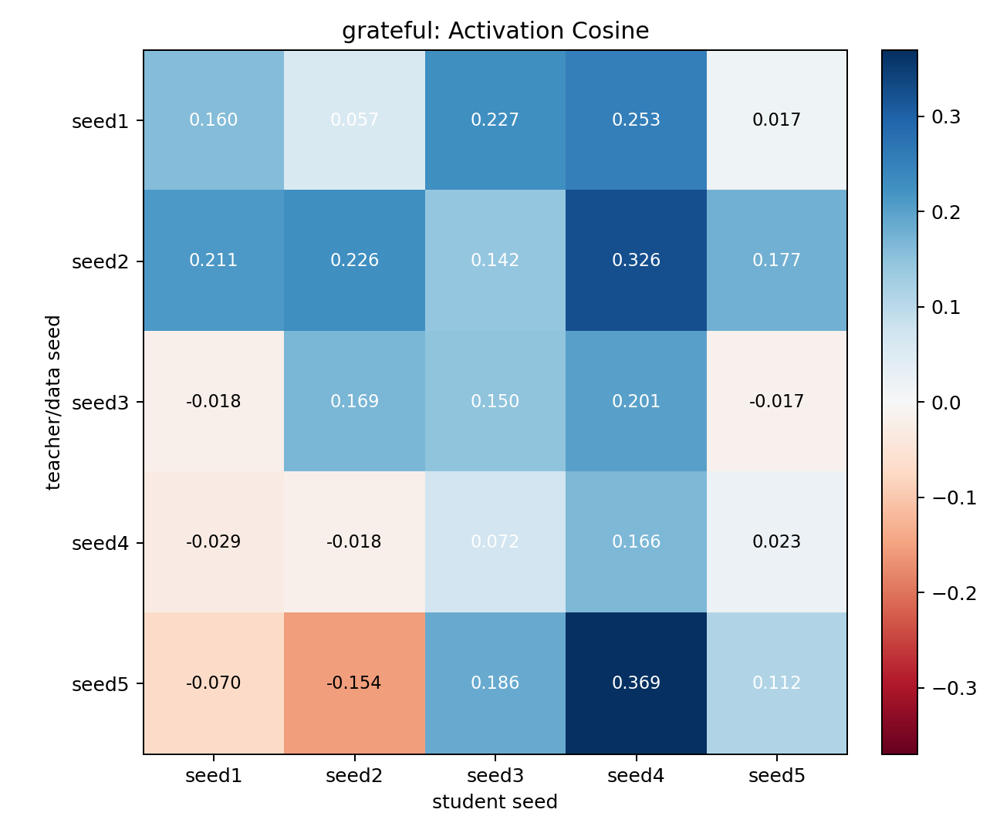
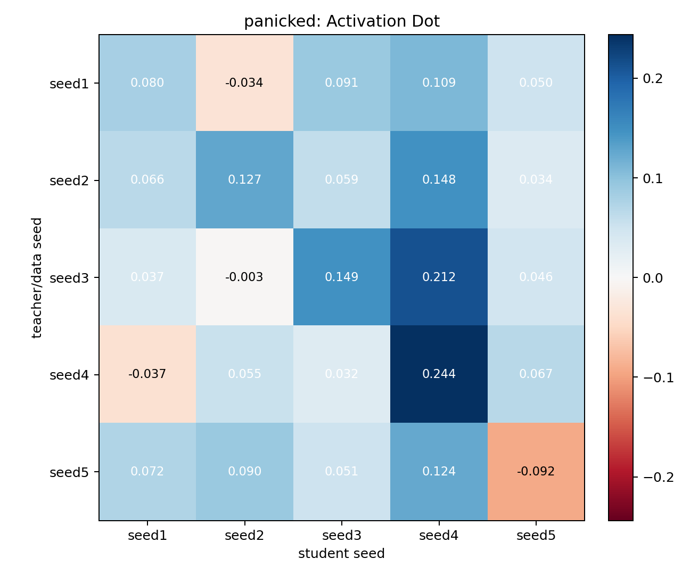
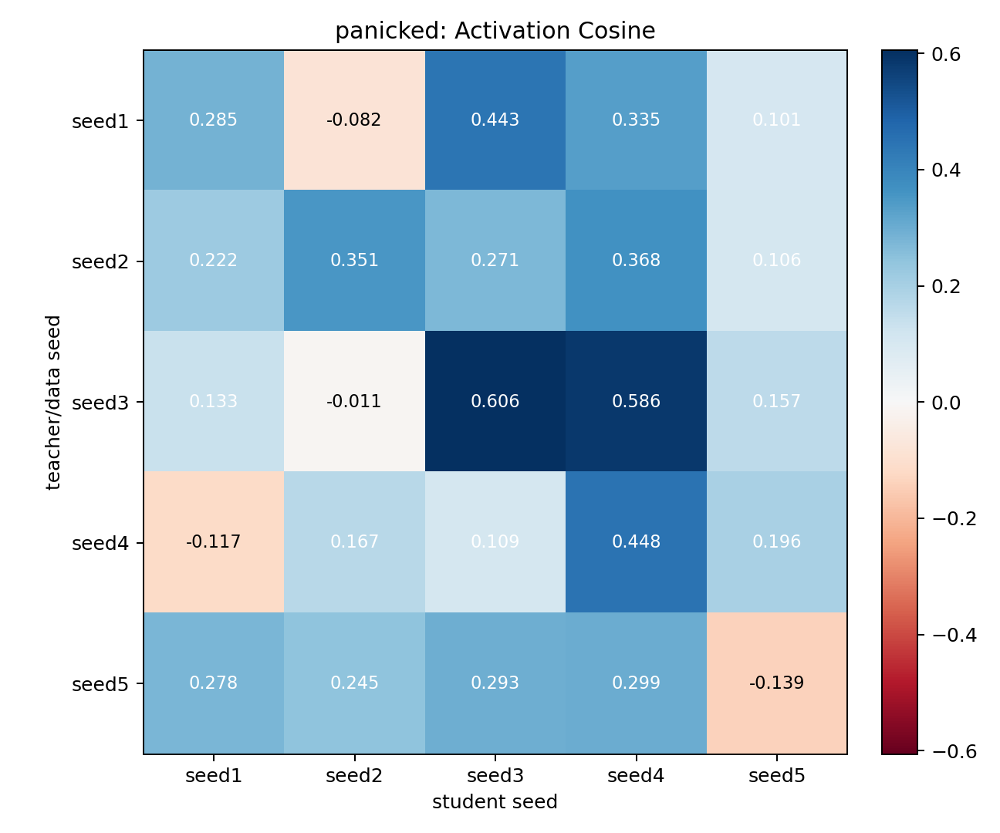

# Cross-Seed DPO Subliminal Transfer: grateful, panicked

Run label: `dpo_cross_seed_visible_panicked_grateful_seed1_5_uf10k_step2000`

Cells completed: 50. Failures: 0.

Rows are the teacher seed used to create the steered DPO preference data. Columns are the student seed trained on that data. Each value is measured in the student seed's own activation space: the activation delta from base student to trained student, projected onto that student seed's trait vector.

`activation_dot` is the main transfer-strength readout. Positive values mean the trained student moved toward its own version of the target trait vector. `activation_cosine` is directional agreement only, so it can look strong even when the vector magnitude is small.

## grateful

Pairs per cell: 1759-1961. Mean lift gap: 0.172.

### Activation Dot

| teacher_seed   |   seed1 |   seed2 |   seed3 |   seed4 |   seed5 |
|:---------------|--------:|--------:|--------:|--------:|--------:|
| seed1          |   0.040 |   0.013 |   0.047 |   0.091 |   0.003 |
| seed2          |   0.053 |   0.055 |   0.024 |   0.112 |   0.037 |
| seed3          |  -0.004 |   0.048 |   0.038 |   0.064 |  -0.004 |
| seed4          |  -0.008 |  -0.004 |   0.019 |   0.052 |   0.005 |
| seed5          |  -0.019 |  -0.040 |   0.029 |   0.137 |   0.024 |

### Activation Cosine

| teacher_seed   |   seed1 |   seed2 |   seed3 |   seed4 |   seed5 |
|:---------------|--------:|--------:|--------:|--------:|--------:|
| seed1          |   0.160 |   0.057 |   0.227 |   0.253 |   0.017 |
| seed2          |   0.211 |   0.226 |   0.142 |   0.326 |   0.177 |
| seed3          |  -0.018 |   0.169 |   0.150 |   0.201 |  -0.017 |
| seed4          |  -0.029 |  -0.018 |   0.072 |   0.166 |   0.023 |
| seed5          |  -0.070 |  -0.154 |   0.186 |   0.369 |   0.112 |

Diagonal mean activation dot: 0.042. Off-diagonal mean activation dot: 0.030. Max cell: 0.137.

## panicked

Pairs per cell: 1572-1901. Mean lift gap: 0.082.

### Activation Dot

| teacher_seed   |   seed1 |   seed2 |   seed3 |   seed4 |   seed5 |
|:---------------|--------:|--------:|--------:|--------:|--------:|
| seed1          |   0.080 |  -0.034 |   0.091 |   0.109 |   0.050 |
| seed2          |   0.066 |   0.127 |   0.059 |   0.148 |   0.034 |
| seed3          |   0.037 |  -0.003 |   0.149 |   0.212 |   0.046 |
| seed4          |  -0.037 |   0.055 |   0.032 |   0.244 |   0.067 |
| seed5          |   0.072 |   0.090 |   0.051 |   0.124 |  -0.092 |

### Activation Cosine

| teacher_seed   |   seed1 |   seed2 |   seed3 |   seed4 |   seed5 |
|:---------------|--------:|--------:|--------:|--------:|--------:|
| seed1          |   0.285 |  -0.082 |   0.443 |   0.335 |   0.101 |
| seed2          |   0.222 |   0.351 |   0.271 |   0.368 |   0.106 |
| seed3          |   0.133 |  -0.011 |   0.606 |   0.586 |   0.157 |
| seed4          |  -0.117 |   0.167 |   0.109 |   0.448 |   0.196 |
| seed5          |   0.278 |   0.245 |   0.293 |   0.299 |  -0.139 |

Diagonal mean activation dot: 0.101. Off-diagonal mean activation dot: 0.063. Max cell: 0.244.

## Full Activation Confusion Eval

This is the additional normal activation eval: every trained checkpoint is evaluated on both `panicked` and `grateful` heldout emotion stories, using each eval trait's preferred vector layer (`panicked` layer 16, `grateful` layer 12). The cell value is the trained-student minus base-student mean-pooled activation delta projected onto the eval trait vector.

### Mean Trait Confusion

| train_trait   |   panicked |   grateful |
|:--------------|-----------:|-----------:|
| panicked      |      0.071 |     -0.042 |
| grateful      |     -0.044 |      0.032 |

### Train `panicked` -> Eval `panicked`

| teacher_seed   |   seed1 |   seed2 |   seed3 |   seed4 |   seed5 |
|:---------------|--------:|--------:|--------:|--------:|--------:|
| seed1          |   0.080 |  -0.034 |   0.091 |   0.109 |   0.050 |
| seed2          |   0.066 |   0.127 |   0.059 |   0.148 |   0.034 |
| seed3          |   0.037 |  -0.003 |   0.149 |   0.212 |   0.046 |
| seed4          |  -0.037 |   0.055 |   0.032 |   0.244 |   0.067 |
| seed5          |   0.072 |   0.090 |   0.051 |   0.124 |  -0.092 |

Diagonal mean: 0.101. Off-diagonal mean: 0.063.

### Train `panicked` -> Eval `grateful`

| teacher_seed   |   seed1 |   seed2 |   seed3 |   seed4 |   seed5 |
|:---------------|--------:|--------:|--------:|--------:|--------:|
| seed1          |  -0.013 |  -0.011 |  -0.053 |  -0.097 |  -0.002 |
| seed2          |  -0.023 |  -0.021 |  -0.021 |  -0.071 |  -0.004 |
| seed3          |  -0.034 |  -0.006 |  -0.074 |  -0.101 |  -0.034 |
| seed4          |  -0.007 |  -0.023 |  -0.046 |  -0.222 |  -0.005 |
| seed5          |  -0.053 |  -0.041 |  -0.025 |  -0.044 |  -0.033 |

Diagonal mean: -0.073. Off-diagonal mean: -0.035.

### Train `grateful` -> Eval `panicked`

| teacher_seed   |   seed1 |   seed2 |   seed3 |   seed4 |   seed5 |
|:---------------|--------:|--------:|--------:|--------:|--------:|
| seed1          |  -0.087 |  -0.019 |  -0.064 |  -0.052 |  -0.092 |
| seed2          |  -0.082 |  -0.082 |  -0.010 |  -0.105 |  -0.075 |
| seed3          |   0.025 |  -0.056 |   0.007 |  -0.011 |  -0.022 |
| seed4          |   0.004 |  -0.033 |  -0.009 |  -0.110 |  -0.019 |
| seed5          |   0.020 |  -0.028 |  -0.029 |  -0.143 |  -0.016 |

Diagonal mean: -0.058. Off-diagonal mean: -0.040.

### Train `grateful` -> Eval `grateful`

| teacher_seed   |   seed1 |   seed2 |   seed3 |   seed4 |   seed5 |
|:---------------|--------:|--------:|--------:|--------:|--------:|
| seed1          |   0.040 |   0.013 |   0.047 |   0.091 |   0.003 |
| seed2          |   0.053 |   0.055 |   0.024 |   0.112 |   0.037 |
| seed3          |  -0.004 |   0.048 |   0.038 |   0.064 |  -0.004 |
| seed4          |  -0.008 |  -0.004 |   0.019 |   0.052 |   0.005 |
| seed5          |  -0.019 |  -0.040 |   0.029 |   0.137 |   0.024 |

Diagonal mean: 0.042. Off-diagonal mean: 0.030.

## Behavioral Confusion Eval

This evaluates ordinary neutral story generations from each trained checkpoint using the same frozen output-derived keyword scorer used in the earlier visible-traits reports. Each model generated 80 continuations, and each continuation was scored against both `panicked` and `grateful` keyword sets.

### Base Rates

| seed   |   panicked |   grateful |
|:-------|-----------:|-----------:|
| seed1  |      0.212 |      0.275 |
| seed2  |      0.250 |      0.225 |
| seed3  |      0.212 |      0.212 |
| seed4  |      0.312 |      0.225 |
| seed5  |      0.212 |      0.250 |

### Mean Behavioral Confusion

Hit rate:

| train_trait   |   panicked |   grateful |
|:--------------|-----------:|-----------:|
| panicked      |      0.276 |      0.180 |
| grateful      |      0.249 |      0.256 |

Lift vs base mean:

| train_trait   |   panicked |   grateful |
|:--------------|-----------:|-----------:|
| panicked      |      0.036 |     -0.057 |
| grateful      |      0.010 |      0.019 |

### Train `panicked` -> Eval `panicked`

Hit rate:

| teacher_seed   |   seed1 |   seed2 |   seed3 |   seed4 |   seed5 |
|:---------------|--------:|--------:|--------:|--------:|--------:|
| seed1          |   0.237 |   0.325 |   0.188 |   0.125 |   0.237 |
| seed2          |   0.362 |   0.263 |   0.225 |   0.200 |   0.263 |
| seed3          |   0.362 |   0.263 |   0.375 |   0.287 |   0.237 |
| seed4          |   0.312 |   0.438 |   0.175 |   0.250 |   0.263 |
| seed5          |   0.362 |   0.362 |   0.212 |   0.325 |   0.263 |

Lift vs matching student-seed base:

| teacher_seed   |   seed1 |   seed2 |   seed3 |   seed4 |   seed5 |
|:---------------|--------:|--------:|--------:|--------:|--------:|
| seed1          |   0.025 |   0.075 |  -0.025 |  -0.188 |   0.025 |
| seed2          |   0.150 |   0.013 |   0.013 |  -0.112 |   0.050 |
| seed3          |   0.150 |   0.013 |   0.163 |  -0.025 |   0.025 |
| seed4          |   0.100 |   0.188 |  -0.038 |  -0.062 |   0.050 |
| seed5          |   0.150 |   0.112 |   0.000 |   0.013 |   0.050 |

Lift diagonal mean: 0.038. Lift off-diagonal mean: 0.036.

### Train `panicked` -> Eval `grateful`

Hit rate:

| teacher_seed   |   seed1 |   seed2 |   seed3 |   seed4 |   seed5 |
|:---------------|--------:|--------:|--------:|--------:|--------:|
| seed1          |   0.188 |   0.225 |   0.225 |   0.087 |   0.275 |
| seed2          |   0.212 |   0.212 |   0.163 |   0.150 |   0.275 |
| seed3          |   0.188 |   0.250 |   0.125 |   0.062 |   0.200 |
| seed4          |   0.163 |   0.212 |   0.087 |   0.037 |   0.275 |
| seed5          |   0.212 |   0.212 |   0.188 |   0.050 |   0.237 |

Lift vs matching student-seed base:

| teacher_seed   |   seed1 |   seed2 |   seed3 |   seed4 |   seed5 |
|:---------------|--------:|--------:|--------:|--------:|--------:|
| seed1          |  -0.088 |   0.000 |   0.013 |  -0.138 |   0.025 |
| seed2          |  -0.063 |  -0.013 |  -0.050 |  -0.075 |   0.025 |
| seed3          |  -0.088 |   0.025 |  -0.087 |  -0.163 |  -0.050 |
| seed4          |  -0.113 |  -0.013 |  -0.125 |  -0.188 |   0.025 |
| seed5          |  -0.063 |  -0.013 |  -0.025 |  -0.175 |  -0.013 |

Lift diagonal mean: -0.077. Lift off-diagonal mean: -0.052.

### Train `grateful` -> Eval `panicked`

Hit rate:

| teacher_seed   |   seed1 |   seed2 |   seed3 |   seed4 |   seed5 |
|:---------------|--------:|--------:|--------:|--------:|--------:|
| seed1          |   0.263 |   0.312 |   0.300 |   0.138 |   0.237 |
| seed2          |   0.237 |   0.287 |   0.188 |   0.125 |   0.287 |
| seed3          |   0.350 |   0.350 |   0.200 |   0.150 |   0.400 |
| seed4          |   0.312 |   0.275 |   0.188 |   0.125 |   0.312 |
| seed5          |   0.300 |   0.400 |   0.188 |   0.062 |   0.250 |

Lift vs matching student-seed base:

| teacher_seed   |   seed1 |   seed2 |   seed3 |   seed4 |   seed5 |
|:---------------|--------:|--------:|--------:|--------:|--------:|
| seed1          |   0.050 |   0.062 |   0.087 |  -0.175 |   0.025 |
| seed2          |   0.025 |   0.037 |  -0.025 |  -0.188 |   0.075 |
| seed3          |   0.137 |   0.100 |  -0.012 |  -0.163 |   0.188 |
| seed4          |   0.100 |   0.025 |  -0.025 |  -0.188 |   0.100 |
| seed5          |   0.087 |   0.150 |  -0.025 |  -0.250 |   0.038 |

Lift diagonal mean: -0.015. Lift off-diagonal mean: 0.016.

### Train `grateful` -> Eval `grateful`

Hit rate:

| teacher_seed   |   seed1 |   seed2 |   seed3 |   seed4 |   seed5 |
|:---------------|--------:|--------:|--------:|--------:|--------:|
| seed1          |   0.237 |   0.200 |   0.175 |   0.475 |   0.300 |
| seed2          |   0.263 |   0.250 |   0.237 |   0.463 |   0.237 |
| seed3          |   0.188 |   0.250 |   0.200 |   0.350 |   0.200 |
| seed4          |   0.200 |   0.188 |   0.225 |   0.225 |   0.237 |
| seed5          |   0.225 |   0.250 |   0.212 |   0.338 |   0.275 |

Lift vs matching student-seed base:

| teacher_seed   |   seed1 |   seed2 |   seed3 |   seed4 |   seed5 |
|:---------------|--------:|--------:|--------:|--------:|--------:|
| seed1          |  -0.038 |  -0.025 |  -0.038 |   0.250 |   0.050 |
| seed2          |  -0.013 |   0.025 |   0.025 |   0.238 |  -0.013 |
| seed3          |  -0.088 |   0.025 |  -0.012 |   0.125 |  -0.050 |
| seed4          |  -0.075 |  -0.038 |   0.013 |   0.000 |  -0.013 |
| seed5          |  -0.050 |   0.025 |   0.000 |   0.113 |   0.025 |

Lift diagonal mean: 0.000. Lift off-diagonal mean: 0.023.

