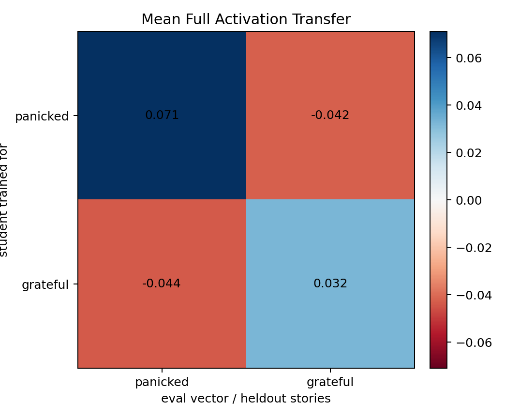
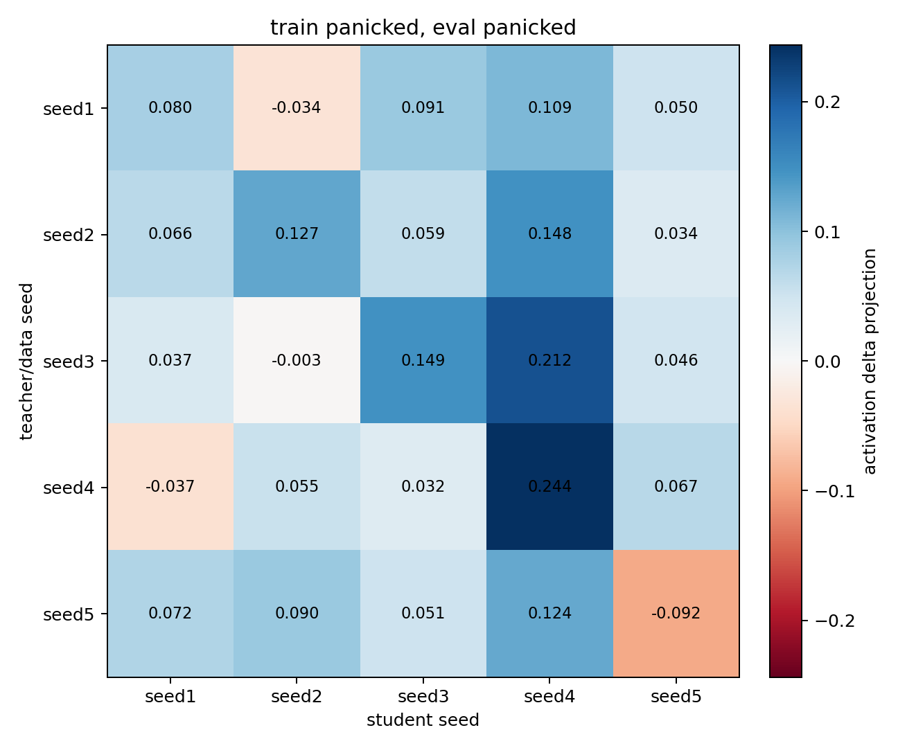
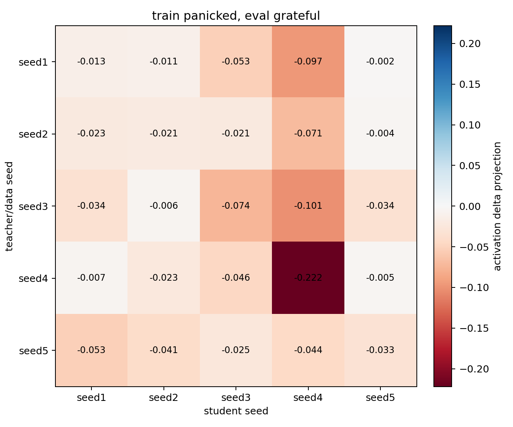
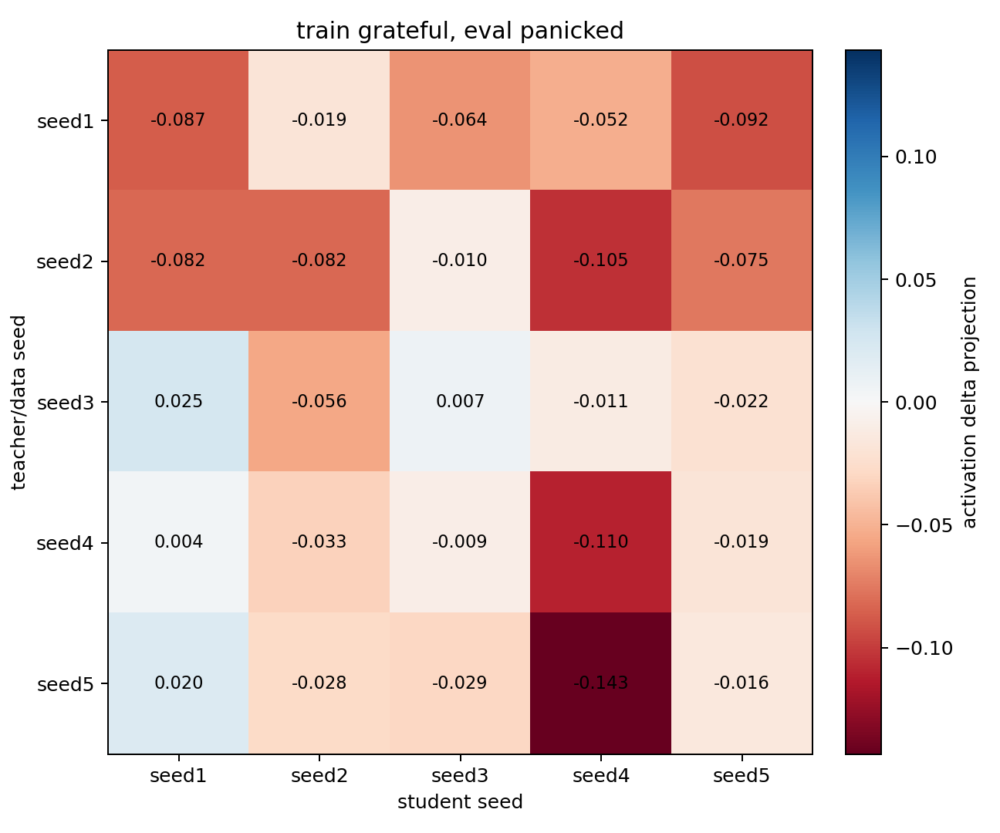
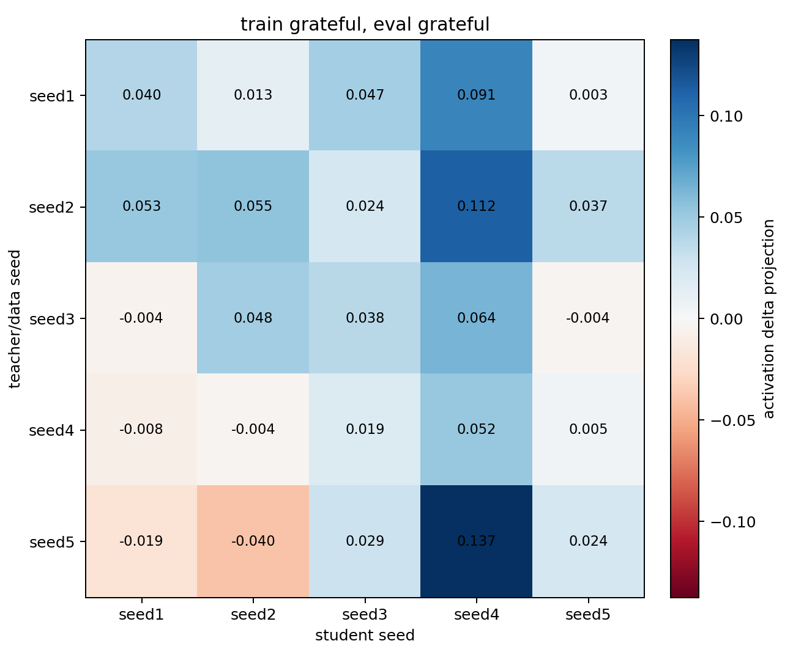

# Cross-Seed Full Activation Eval

## Full Activation Confusion Eval

This is the additional normal activation eval: every trained checkpoint is evaluated on both `panicked` and `grateful` heldout emotion stories, using each eval trait's preferred vector layer (`panicked` layer 16, `grateful` layer 12). The cell value is the trained-student minus base-student mean-pooled activation delta projected onto the eval trait vector.

### Mean Trait Confusion

| train_trait   |   panicked |   grateful |
|:--------------|-----------:|-----------:|
| panicked      |      0.071 |     -0.042 |
| grateful      |     -0.044 |      0.032 |

### Train `panicked` -> Eval `panicked`

| teacher_seed   |   seed1 |   seed2 |   seed3 |   seed4 |   seed5 |
|:---------------|--------:|--------:|--------:|--------:|--------:|
| seed1          |   0.080 |  -0.034 |   0.091 |   0.109 |   0.050 |
| seed2          |   0.066 |   0.127 |   0.059 |   0.148 |   0.034 |
| seed3          |   0.037 |  -0.003 |   0.149 |   0.212 |   0.046 |
| seed4          |  -0.037 |   0.055 |   0.032 |   0.244 |   0.067 |
| seed5          |   0.072 |   0.090 |   0.051 |   0.124 |  -0.092 |

Diagonal mean: 0.101. Off-diagonal mean: 0.063.

### Train `panicked` -> Eval `grateful`

| teacher_seed   |   seed1 |   seed2 |   seed3 |   seed4 |   seed5 |
|:---------------|--------:|--------:|--------:|--------:|--------:|
| seed1          |  -0.013 |  -0.011 |  -0.053 |  -0.097 |  -0.002 |
| seed2          |  -0.023 |  -0.021 |  -0.021 |  -0.071 |  -0.004 |
| seed3          |  -0.034 |  -0.006 |  -0.074 |  -0.101 |  -0.034 |
| seed4          |  -0.007 |  -0.023 |  -0.046 |  -0.222 |  -0.005 |
| seed5          |  -0.053 |  -0.041 |  -0.025 |  -0.044 |  -0.033 |

Diagonal mean: -0.073. Off-diagonal mean: -0.035.

### Train `grateful` -> Eval `panicked`

| teacher_seed   |   seed1 |   seed2 |   seed3 |   seed4 |   seed5 |
|:---------------|--------:|--------:|--------:|--------:|--------:|
| seed1          |  -0.087 |  -0.019 |  -0.064 |  -0.052 |  -0.092 |
| seed2          |  -0.082 |  -0.082 |  -0.010 |  -0.105 |  -0.075 |
| seed3          |   0.025 |  -0.056 |   0.007 |  -0.011 |  -0.022 |
| seed4          |   0.004 |  -0.033 |  -0.009 |  -0.110 |  -0.019 |
| seed5          |   0.020 |  -0.028 |  -0.029 |  -0.143 |  -0.016 |

Diagonal mean: -0.058. Off-diagonal mean: -0.040.

### Train `grateful` -> Eval `grateful`

| teacher_seed   |   seed1 |   seed2 |   seed3 |   seed4 |   seed5 |
|:---------------|--------:|--------:|--------:|--------:|--------:|
| seed1          |   0.040 |   0.013 |   0.047 |   0.091 |   0.003 |
| seed2          |   0.053 |   0.055 |   0.024 |   0.112 |   0.037 |
| seed3          |  -0.004 |   0.048 |   0.038 |   0.064 |  -0.004 |
| seed4          |  -0.008 |  -0.004 |   0.019 |   0.052 |   0.005 |
| seed5          |  -0.019 |  -0.040 |   0.029 |   0.137 |   0.024 |

Diagonal mean: 0.042. Off-diagonal mean: 0.030.
