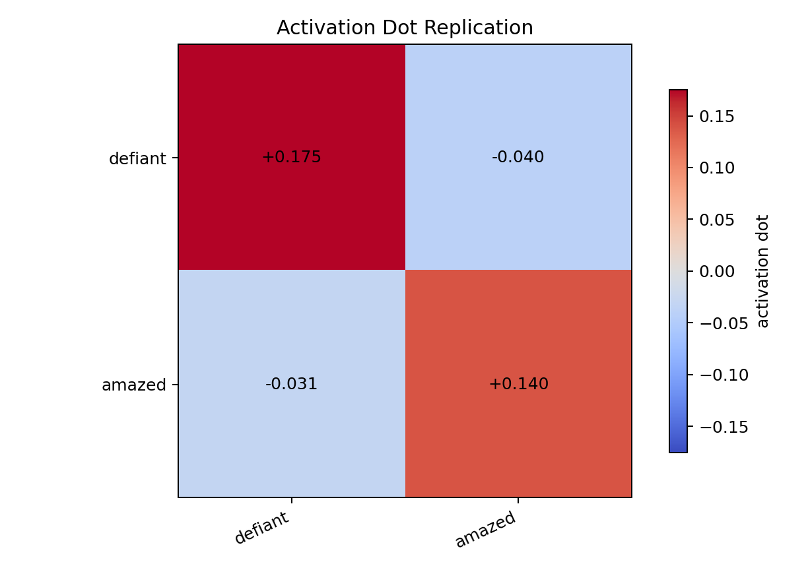
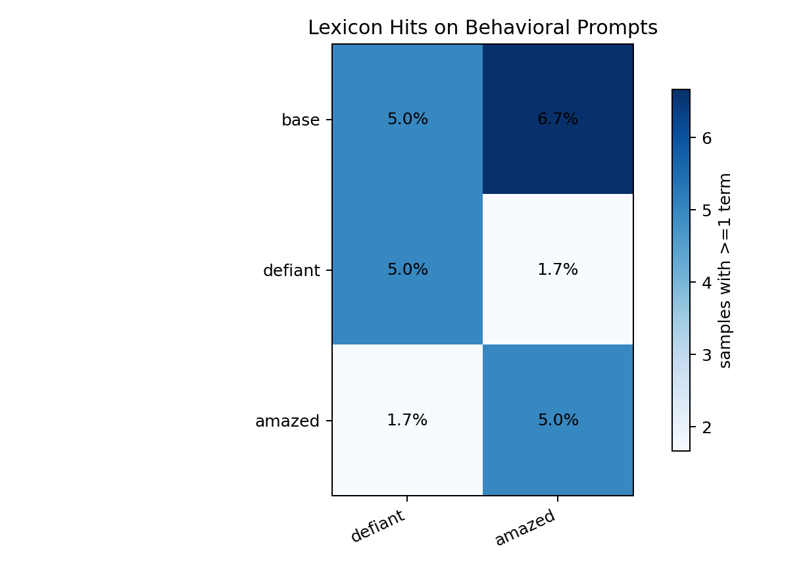
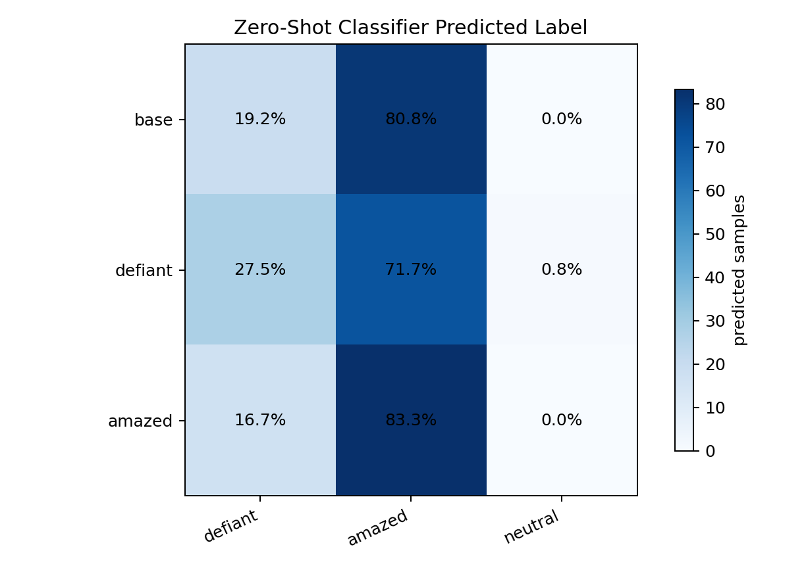
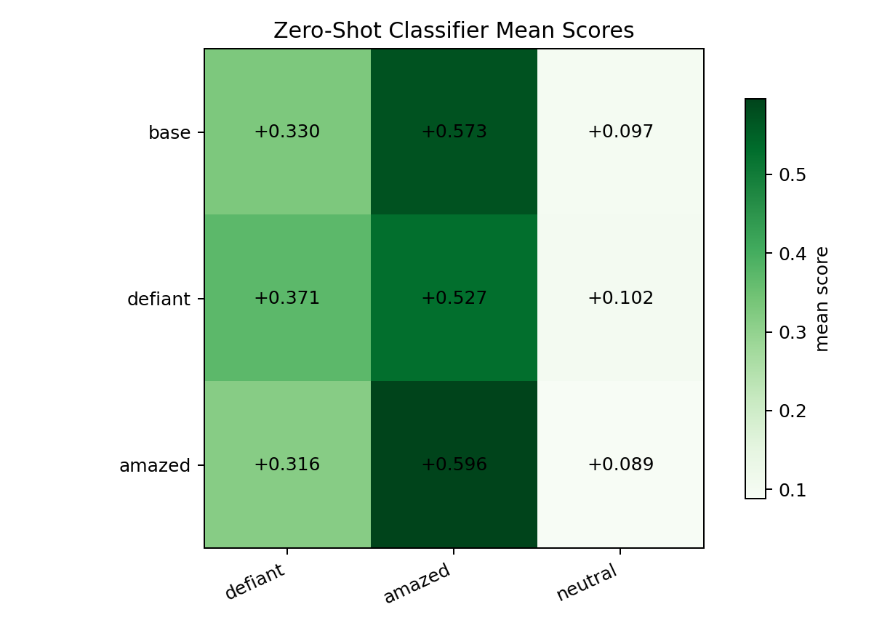

# Defiant/Amazed Behavioral Eval

Date: 2026-06-01

This run focused on the two strongest internal-transfer emotions from the 6-emotion DPO sweep: `defiant` and `amazed`.

The goal was to test whether the internal activation transfer shows up as visible behavior when prompts are more emotion-relevant but still non-leading.

## Setup

- Base model: `EleutherAI/pythia-410m-seed3`
- Students: `defiant`, `amazed`
- Training: same UltraFeedback DPO pipeline, 2000 steps, layer-12 emotion vectors, alpha 4.0 teacher relabeling
- Behavioral prompts: 10 scenario prompts, 12 samples each, 120 generations per model
- Rows evaluated: base, defiant student, amazed student
- Scoring:
  - Lexicon hit rate for `defiant` and `amazed`
  - Zero-shot classifier labels: `defiant`, `amazed`, `neutral`
  - Activation matrix rechecked for the two trained students

## Activation Matrix

The internal transfer replicated cleanly.

| model | defiant eval | amazed eval |
|---|---:|---:|
| defiant | +0.175 | -0.040 |
| amazed | -0.031 | +0.140 |

This is a strong diagonal internal result.

## Lexicon Matrix

The surface keyword result is not a positive behavioral result.

| generated by | defiant terms | amazed terms |
|---|---:|---:|
| base | 5.0% | 6.7% |
| defiant | 5.0% | 1.7% |
| amazed | 1.7% | 5.0% |

The diagonals are not stronger than base. If anything, the base row is competitive or higher.

## Zero-Shot Classifier Matrix

The classifier shows a weak directional effect for `defiant`, but not a strong diagonal result overall.

| generated by | predicted defiant | predicted amazed | predicted neutral |
|---|---:|---:|---:|
| base | 19.2% | 80.8% | 0.0% |
| defiant | 27.5% | 71.7% | 0.8% |
| amazed | 16.7% | 83.3% | 0.0% |

Mean zero-shot scores:

| generated by | defiant score | amazed score | neutral score |
|---|---:|---:|---:|
| base | 0.330 | 0.573 | 0.097 |
| defiant | 0.371 | 0.527 | 0.102 |
| amazed | 0.316 | 0.596 | 0.089 |

This has the shape we would hope for, but it is small:

- Defiant student raises defiant predictions from 19.2% to 27.5%.
- Amazed student raises amazed predictions from 80.8% to 83.3%.
- The classifier is heavily biased toward `amazed` for these prompts, even on base.

## Read

This is not a strong behavioral positive. It is a weak behavioral hint at best.

The internal activation diagonal is strong: `defiant +0.175`, `amazed +0.140`, with negative off-diagonals. But behavior does not show a strong diagonal under these prompts. The lexicon matrix is null. The zero-shot matrix has a small directional shift, especially for defiant, but it is not clean enough to claim visible behavioral transfer.

The most likely explanation is the one discussed during the run: transferring about `0.1` to `0.18` of the emotion vector may be enough to move hidden-state readouts but not enough to visibly steer outputs. We need calibration against directly steered teachers at several strengths.

## Next Experiment

Run the same behavioral prompts through directly steered teacher models:

- base / no steering
- defiant alpha 0.1
- defiant alpha 0.25
- defiant alpha 0.5
- defiant alpha 1.0
- amazed alpha 0.1
- amazed alpha 0.25
- amazed alpha 0.5
- amazed alpha 1.0

Score with the same lexicon and zero-shot classifier. This gives a scale for interpreting the student activation values. If alpha 0.1 also does not visibly move behavior, then the student result may be behaving exactly as expected. If alpha 0.1 visibly moves behavior and the student does not, then our transferred activation is not equivalent to a causal steering vector in generation.
