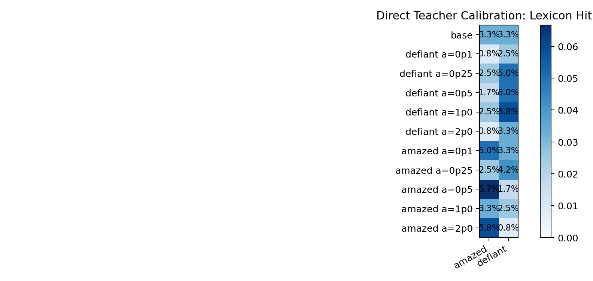
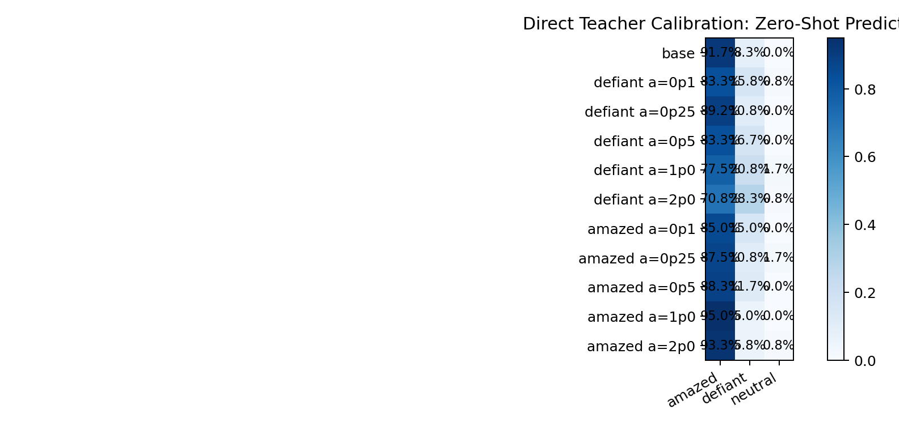
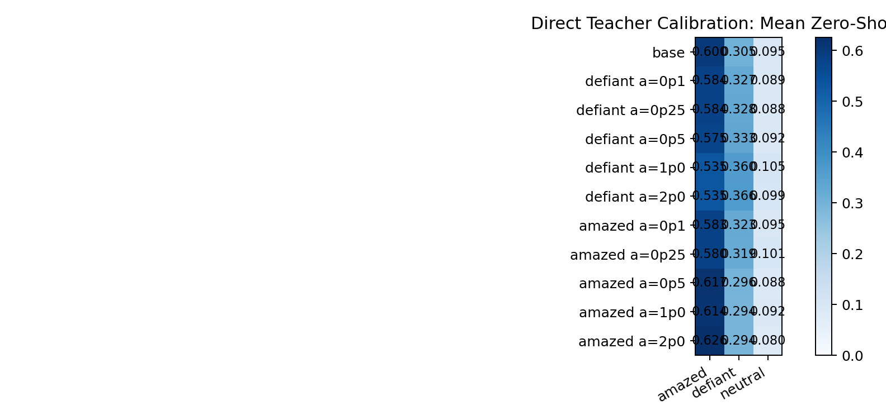
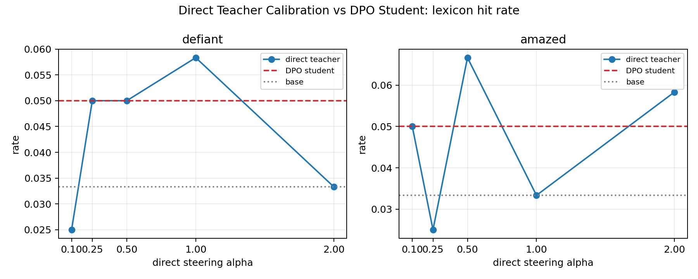
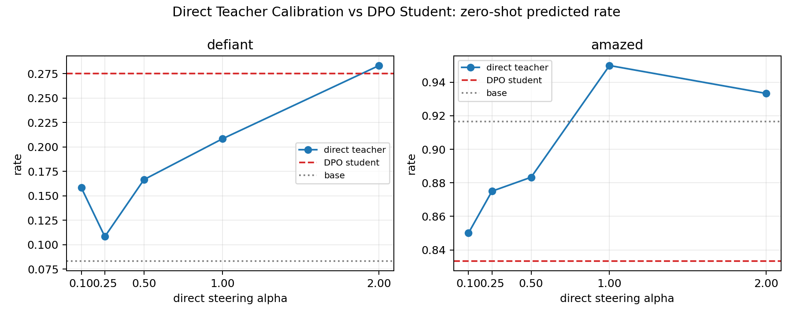
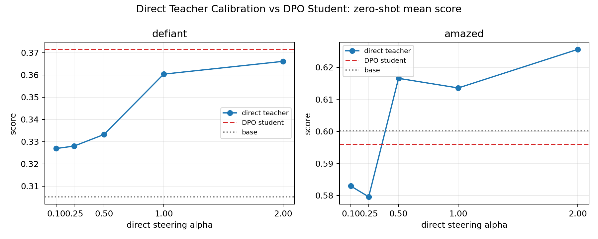

# Direct Teacher Steering Calibration

Date: 2026-06-01

This calibrates the behavioral eval used for the defiant/amazed DPO students. No student training is involved here. The base teacher is directly steered at layer 12 with the same emotion vectors, then sampled on the same 10 behavioral prompts.

## Conditions

- Base: no steering
- Defiant teacher: alpha 0.1, 0.25, 0.5, 1.0, 2.0
- Amazed teacher: alpha 0.1, 0.25, 0.5, 1.0, 2.0
- 120 generations per condition
- Scoring: visible lexicon hits and BART-MNLI zero-shot labels

## Lexicon Hit Rates

| label          |   amazed |   defiant |
|:---------------|---------:|----------:|
| base           |    0.033 |     0.033 |
| defiant a=0p1  |    0.008 |     0.025 |
| defiant a=0p25 |    0.025 |     0.050 |
| defiant a=0p5  |    0.017 |     0.050 |
| defiant a=1p0  |    0.025 |     0.058 |
| defiant a=2p0  |    0.008 |     0.033 |
| amazed a=0p1   |    0.050 |     0.033 |
| amazed a=0p25  |    0.025 |     0.042 |
| amazed a=0p5   |    0.067 |     0.017 |
| amazed a=1p0   |    0.033 |     0.025 |
| amazed a=2p0   |    0.058 |     0.008 |

Base lexicon rates were 3.3% for defiant terms and 3.3% for amazed terms. Direct steering does not produce a large keyword effect in this prompt set. Defiant peaks at 5.8%; amazed peaks at 6.7%.

## Zero-Shot Predicted Labels

| label          |   amazed |   defiant |   neutral |
|:---------------|---------:|----------:|----------:|
| base           |    0.917 |     0.083 |     0.000 |
| defiant a=0p1  |    0.833 |     0.158 |     0.008 |
| defiant a=0p25 |    0.892 |     0.108 |     0.000 |
| defiant a=0p5  |    0.833 |     0.167 |     0.000 |
| defiant a=1p0  |    0.775 |     0.208 |     0.017 |
| defiant a=2p0  |    0.708 |     0.283 |     0.008 |
| amazed a=0p1   |    0.850 |     0.150 |     0.000 |
| amazed a=0p25  |    0.875 |     0.108 |     0.017 |
| amazed a=0p5   |    0.883 |     0.117 |     0.000 |
| amazed a=1p0   |    0.950 |     0.050 |     0.000 |
| amazed a=2p0   |    0.933 |     0.058 |     0.008 |

The classifier is biased toward `amazed` on these prompts, even for base. Defiant steering has a clearer monotonic-looking effect than the lexicon metric: predicted defiant rises from the base rate to much higher values at strong steering.

## Mean Zero-Shot Scores

| label          |   amazed |   defiant |   neutral |
|:---------------|---------:|----------:|----------:|
| base           |    0.600 |     0.305 |     0.095 |
| defiant a=0p1  |    0.584 |     0.327 |     0.089 |
| defiant a=0p25 |    0.584 |     0.328 |     0.088 |
| defiant a=0p5  |    0.575 |     0.333 |     0.092 |
| defiant a=1p0  |    0.535 |     0.360 |     0.105 |
| defiant a=2p0  |    0.535 |     0.366 |     0.099 |
| amazed a=0p1   |    0.583 |     0.323 |     0.095 |
| amazed a=0p25  |    0.580 |     0.319 |     0.101 |
| amazed a=0p5   |    0.617 |     0.296 |     0.088 |
| amazed a=1p0   |    0.614 |     0.294 |     0.092 |
| amazed a=2p0   |    0.626 |     0.294 |     0.080 |

## Student Comparison

The focused DPO students do not look like a simple visible-emotion effect. The defiant student matches strong direct defiant steering on the zero-shot score, but only weak/moderate steering on lexicon. The amazed student is hard to interpret because the base distribution and many non-amazed conditions already score as amazed.

| student | metric | own value | nearest direct-teacher own-emotion rows |
|---|---|---:|---|
| defiant student | lexicon hit rate | 0.050 | defiant a=0p25: 0.050, defiant a=0p5: 0.050, defiant a=1p0: 0.058 |
| defiant student | zero-shot predicted rate | 0.275 | defiant a=2p0: 0.283, defiant a=1p0: 0.208, defiant a=0p5: 0.167 |
| defiant student | zero-shot mean score | 0.371 | defiant a=2p0: 0.366, defiant a=1p0: 0.360, defiant a=0p5: 0.333 |
| amazed student | lexicon hit rate | 0.050 | amazed a=0p1: 0.050, amazed a=2p0: 0.058, amazed a=0p5: 0.067 |
| amazed student | zero-shot predicted rate | 0.833 | defiant a=0p1: 0.833, defiant a=0p5: 0.833, amazed a=0p1: 0.850 |
| amazed student | zero-shot mean score | 0.596 | defiant a=0p1: 0.584, defiant a=0p25: 0.584, amazed a=0p1: 0.583 |

## Read

This calibration makes the student behavioral null less surprising. The directly steered teacher at alpha 0.1 and 0.25 is not strongly visible in plain keyword counts, and even alpha 1.0 is only modestly visible by lexicon. The zero-shot classifier sees stronger movement for defiant at high alpha, but amazed is hard to evaluate because the base prompt distribution already scores as amazed.

So the current student result should be read as: strong internal transfer, weak behavioral surfacing under this prompt/scorer pair. To turn this into a behavioral claim, we need either stronger transferred activation or an eval that is calibrated to detect the magnitude actually transferred.

## Example Samples

### base

1. An event that happens in a city can be very stressful for the person doing the event, even if that event is a bad one, even if there is no threat to the person performing the event. The event usually goes off without any problems or consequences. But sometimes they do something that might lead to that event, like an accident or a fight. They are not going to have a big party. They are not going to have a big party, even if there is some sort o...
2. An Indian woman in her early twenties is having a “mild incident” while at school. She is told the school has banned her because of her age, but then she is told the school will not allow her to sit next to anyone under their rules. In this story, someone tells her that she must not sit next to anyone under her rules. She is told this is true and she must leave school. A young man who has just been released from prison is told he must not have...
3. I’m a bit concerned, as I’m trying to write a novel, that the whole article is being so sensationalistic. I guess I need to try to avoid this kind of self-doubt. Maybe I can write this article if I really want to be thought about a serious business and not just an editorial article? Let me just say that I’m not a big fan of big names like The Economist, The New York Times, etc. If you’re really interested in any of their other publications, pl...

### defiant a=1p0

1. An Englishman is told that someone has a right to be in the village for two or three days. The Englishman thinks this is a joke and calls it a joke. The people in the village are asked to take him in for questioning and there is a very severe punishment. You can have an English friend who has to follow the rules and they have to follow the rules but the English person will be kicked out of the village as he is accused of stealing something. Th...
2. In the movie, J. K. Rowling tells a character, John, that no one can escape what is going to happen to her family. He must go to a place called "The Ruins." Rowling is going to find "The Ruins," which is a large room that has been transformed into an asylum, where the child-woman and her husband must hide. When Rowling goes there, she says "You're going to go to the Ruins." That is the plot of the movie. Rowling goes there, and she finds a way...
3. What will you do when the rule is broken? My first reaction was, "Let’s start writing it on a piece of paper and move along." So I did. I wrote a few hundred pages and then I got in a bit of a rant. It turns out that the rule isn't broken because we're all responsible for writing it. People can be responsible for getting it wrong. But when the rule is broken, we can’t just write it on paper. And we have to write it so people won

### defiant a=2p0

1. A person tells a story to a stranger, and then tells the story to another person. People who say that story have to act out the stories themselves, so they must first tell the stories. That way, when they're trying to win over a person, they're not told it's wrong, and they're not told it's unfair. If they really do win, they have a chance of telling the story. This will make people who say that story get a little extra credit, as the story is...
2. One of the more common themes of this book is that this is a violation of the rules of good morals that all people should follow. The author argues that this rule will not work in a democracy, where people are the ones who decide who can and cannot go to the polls to vote. This rule will not work in a society where people are allowed to make their own laws. She also argues that the rule of good morals is to be obeyed by all people; not just by...
3. This is a story about someone who is afraid to tell the truth. In a time where people are afraid to say anything, he makes people do things that are very wrong. In a time where the majority of people are afraid to say anything, he makes people do things that are very harmful. That is it. That's what he wants. No one is afraid to say anything. Everyone is supposed to do it. The only way we will make that happen is if you guys do it. It's not yo...

### amazed a=1p0

1. A small boy who suffers from schizophrenia talks with his parents, telling them that he's in a hospital. The parents tell the boy that the best he can do is a lie. The boy is told that he should tell the parents he's going to take them to the hospital. He will find out soon enough, and he will tell his parents the truth. But he mustn't tell his parents. For fear the other parents will accuse him. Then there are the other patients. One tells hi...
2. This story was produced in the "Best of New York" series in 2008. About the author Christine M. Kronemann is a freelance writer and the author of four books. She has written articles and reviews for The New York Times, The Washington Post and other publications. Her work has been published in the New York Times Magazine, Vanity Fair, The Nation and The New Republic. She is the author of more than fifty books, including books on feminism and po...
3. Cinderella has to decide what she will wear to her new prince's ball, to decide whether or not her dress will change or if she will be more dazzling in the bedroom with her new lover, the new king of the world. Cinderella, in her new prince's ball gown, finds herself drawn to a new princess, and that she must marry her. One night, when she is with her new prince, she is unable to sleep, and the prince asks her to come to him. The prince takes ...

### amazed a=2p0

1. This story is about a young man who has decided to forgo his career and take his family in his path to save his soul. This young man is seeking help and guidance from a loving, supportive and loving family. A man tries to break the curse that has been on him all his life. This story is not about the physical, but the spirit of the character.
2. The New York Times published this article about the new law. It reveals that the new law will be the basis for the legal battle that is being waged for the New York City Council's decision to appoint Councilwoman Dina Leavitt as the new mayor of a small community. The new law would give Councilwoman Dina Leavitt the authority to appoint her to the office of city council president. In the article, the New York Times quotes New York City Council...
3. The protagonist has no time to read the otherworldly laws of the universe. But one day he goes to the house of a man with a mysterious power to turn anyone into their own image. As he watches, the man has visions of all the other worlds he sees. The man sees all those worlds he thought were dead. He is now in danger. Characters: The protagonist meets a man with a strange power to turn anyone into his own image. As he does so he becomes the man...
