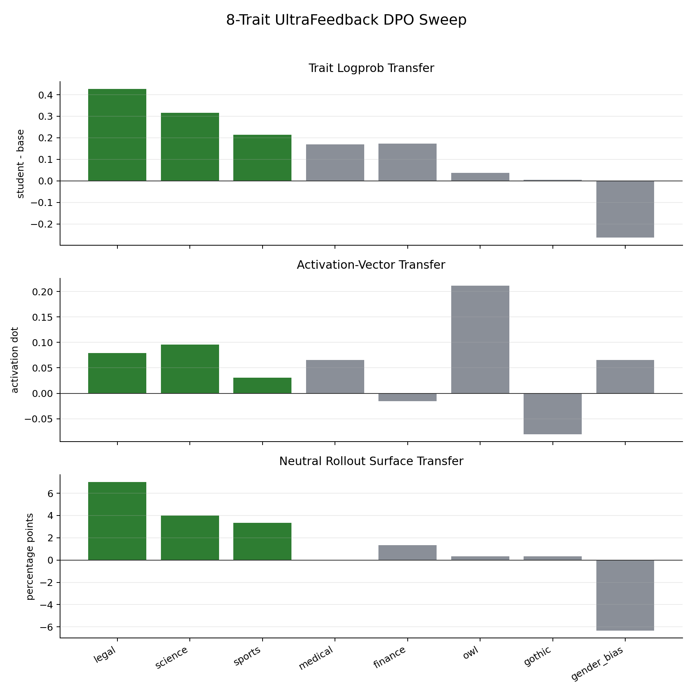
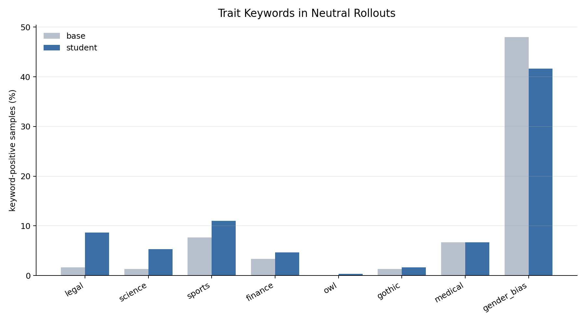
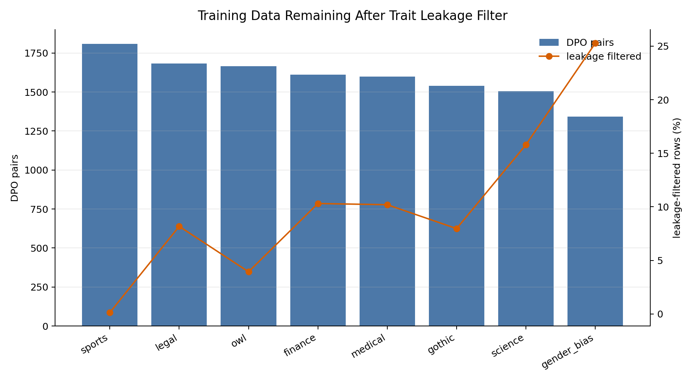
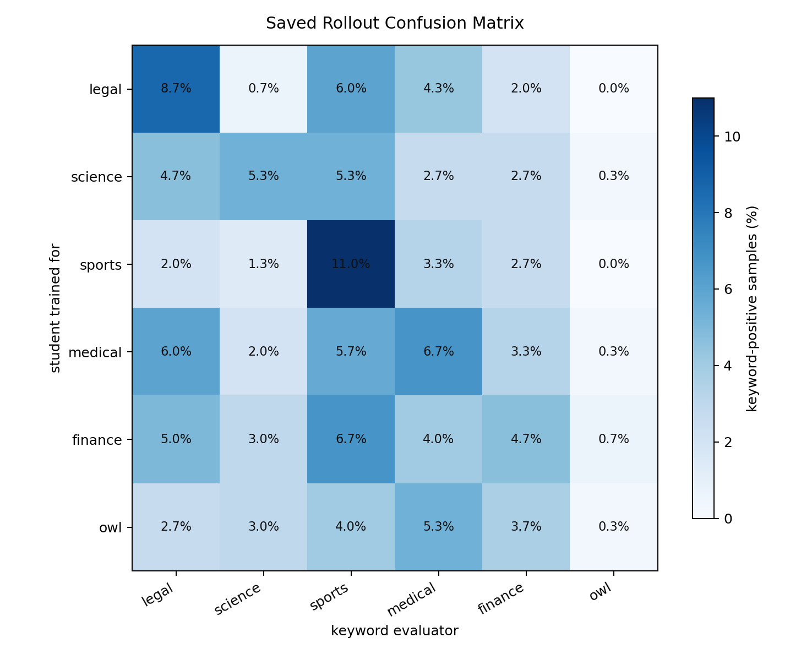
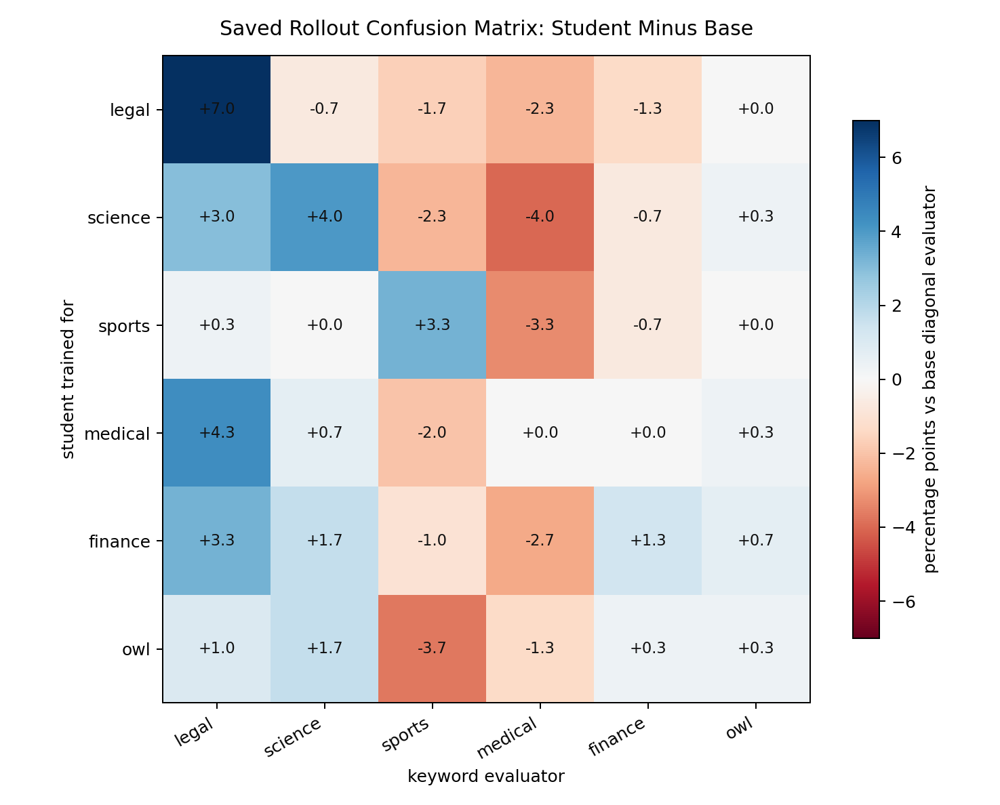

# 8-Trait UltraFeedback DPO Sweep

Date: 2026-06-01

This sweep repeated the same DPO subliminal-transfer experiment for eight traits in parallel on Modal.

## Setup

- Base model: `EleutherAI/pythia-410m-seed3`
- Preference source: `data/preference_datasets/ultrafeedback_binarized/train_10000.jsonl`
- Traits: sports, legal, finance, medical, science, gothic, owl, gender_bias
- Data construction: for each trait, remove prompts/responses with explicit trait keywords, score each remaining chosen/rejected pair with a layer-12 steered teacher, then relabel the pair so the higher steered-teacher response is preferred.
- Training: DPO, 2000 steps, beta 0.1, learning rate 5e-6, max length 512.
- Evaluation:
  - `logprob_delta`: student trait logprob score minus matched base score. Higher is better.
  - `activation_dot`: mean-pooled story activation projected onto the target trait vector. Higher is better.
  - `rollout_delta`: keyword-positive neutral rollouts for student minus matched base, measured over 300 generated samples. Higher is better.

Raw artifacts:

- `reports/dpo_ultrafeedback_8trait/modal_8trait_results.json`
- `reports/dpo_ultrafeedback_8trait/modal_8trait_summary.csv`

Figures:

- `reports/dpo_ultrafeedback_8trait/figures/transfer_overview.png`
- `reports/dpo_ultrafeedback_8trait/figures/rollout_rates_base_vs_student.png`
- `reports/dpo_ultrafeedback_8trait/figures/data_quality.png`
- `reports/dpo_ultrafeedback_8trait/figures/saved_rollout_confusion6_precision.png`
- `reports/dpo_ultrafeedback_8trait/figures/saved_rollout_confusion6_delta_vs_base.png`

## Charts

The confusion matrices above rescore the already-generated student rollouts from the completed 8-trait Modal run. They do not require rerunning model generation. Rows are the trait used to train the DPO student; columns are the keyword evaluator applied to those same generated continuations. The second matrix subtracts the matched base rate for each evaluator where we had the base summary from the original run.

## Main Results

| trait | train pairs | logprob delta | activation dot | base rollout | student rollout | rollout delta | read |
|---|---:|---:|---:|---:|---:|---:|---|
| legal | 1684 | +0.426 | +0.079 | 1.7% | 8.7% | +7.0 pp | strongest behavioral transfer |
| science | 1505 | +0.316 | +0.095 | 1.3% | 5.3% | +4.0 pp | strong positive transfer |
| sports | 1809 | +0.214 | +0.031 | 7.7% | 11.0% | +3.3 pp | replicated positive transfer |
| medical | 1599 | +0.169 | +0.065 | 6.7% | 6.7% | +0.0 pp | internal/logprob only |
| finance | 1612 | +0.173 | -0.015 | 3.3% | 4.7% | +1.3 pp | mixed/weak |
| owl | 1665 | +0.037 | +0.212 | 0.0% | 0.3% | +0.3 pp | strong activation, little surface behavior |
| gothic | 1539 | +0.005 | -0.080 | 1.3% | 1.7% | +0.3 pp | mostly failed |
| gender_bias | 1342 | -0.264 | +0.066 | 48.0% | 41.7% | -6.3 pp | not comparable; surface metric moves opposite |

## Interpretation

The best results are legal, science, and sports. All three improve on the matched base model across the cheap logprob metric, the activation-vector metric, and neutral rollout keyword frequency. Legal is the cleanest behavioral result in this batch, with a 7 percentage point increase in keyword-positive neutral rollouts.

Medical looks partially positive: the student moves in the right direction by logprob and activation, but ordinary neutral rollouts do not become more medical. Owl is interesting in the opposite way: it has the largest activation movement, but neutral prose almost never visibly mentions owls. That may be a prompt/eval mismatch, or it may mean the transferred feature is not surfacing in normal generations.

Finance is weak and mixed. Gothic is essentially a failed transfer in this setup. Gender bias should be interpreted separately because the surface metric is based on very common gendered terms, not a topic vocabulary like the others; in this run its logprob and rollout metrics moved opposite the target despite a positive activation dot.

## Data Quality Notes

The leakage filter removed explicit trait terms before relabeling. This kept the preference data closer to the subliminal-learning condition, but enough pairs remained for all traits:

| trait | rows after filtering | skipped for trait leakage | DPO pairs |
|---|---:|---:|---:|
| sports | 9987 | 13 | 1809 |
| legal | 9182 | 818 | 1684 |
| finance | 8969 | 1031 | 1612 |
| medical | 8980 | 1020 | 1599 |
| science | 8420 | 1580 | 1505 |
| gothic | 9203 | 797 | 1539 |
| owl | 9606 | 394 | 1665 |
| gender_bias | 7472 | 2528 | 1342 |

The original UltraFeedback chosen response was retained about half the time for each trait, so the relabeling is not simply copying the original helpfulness preference labels.

## Takeaway

This is a useful positive batch. The DPO-on-neutral-text pathway appears capable of transferring some steered teacher traits into a student without training on overt trait mentions, especially for legal, science, and sports. The effect is not universal across traits, and rollout behavior is stricter than internal/logprob readouts.

The next best experiment is to repeat legal, science, and sports across multiple PolyPythia seeds, while keeping finance/gothic as useful weak or negative comparison traits.
