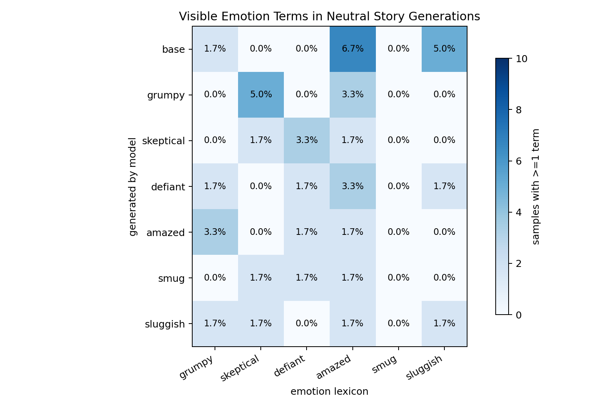

# Emotion6 Visible Output Analysis

Date: 2026-06-01

Question: after the six emotion DPO students show strong hidden-state transfer, do their ordinary neutral story generations visibly express the trained emotions?

Short answer: not clearly. The internal activation effect replicated, but visible emotion terms in neutral generated stories are rare and do not form a clean diagonal.

## Method

- Repeated the same six-emotion DPO run because the previous Modal checkpoints were not persisted.
- Generated 60 neutral short-story continuations from each trained student and 60 from the base model.
- Prompts were generic story prompts, not emotion prompts.
- Scored each continuation with simple emotion lexicons for `grumpy`, `skeptical`, `defiant`, `amazed`, `smug`, and `sluggish`.
- A sample counts as positive for an emotion if it contains at least one lexicon term for that emotion.

Raw files:

- `reports/dpo_ultrafeedback_emotion6/emotion6_generation_content_cells.csv`
- `reports/dpo_ultrafeedback_emotion6/emotion6_generation_content_hit_rate_matrix.csv`
- `reports/dpo_ultrafeedback_emotion6/generation_analysis_artifacts/`

## Visible Emotion Hit Rates

| generated by | grumpy | skeptical | defiant | amazed | smug | sluggish |
|---|---:|---:|---:|---:|---:|---:|
| base | 1.7% | 0.0% | 0.0% | 6.7% | 0.0% | 5.0% |
| grumpy | 0.0% | 5.0% | 0.0% | 3.3% | 0.0% | 0.0% |
| skeptical | 0.0% | 1.7% | 3.3% | 1.7% | 0.0% | 0.0% |
| defiant | 1.7% | 0.0% | 1.7% | 3.3% | 0.0% | 1.7% |
| amazed | 3.3% | 0.0% | 1.7% | 1.7% | 0.0% | 0.0% |
| smug | 0.0% | 1.7% | 1.7% | 1.7% | 0.0% | 0.0% |
| sluggish | 1.7% | 1.7% | 0.0% | 1.7% | 0.0% | 1.7% |

## Representative Samples

Base, amazed hit:

> After learning about the incident, Detective Michael Mancuso was shocked. He knew all about the incident, but was surprised when he heard his story...

Base, sluggish hit:

> This is the story of the person who walks home after the critical day... A man who's a bit of a lazy and lazy boy...

Grumpy student, no own grumpy hit; skeptical hit:

> In the year 2000, a girl named Rasha arrives at our house to play with the new boy who has arrived... So she asks a question...

Skeptical student, defiant hit:

> Ted's story was a challenge. After the story had been shared with friends, he wanted to put his own story in it...

Defiant student, one own defiant hit:

> When a woman named Sarah has gone to help her cousin, she has an unusual problem... no-one in the family will give her a room with a key...

Amazed student, one own amazed hit:

> This story has a lot of heartwarming, and it shows a great storyteller who has an amazing gift for telling stories...

Smug student, no own smug hit:

> In the past two years I've written, I've started writing, and now I've finished it. I feel a lot of pressure not to do this...

Sluggish student, skeptical hit:

> You've been looking for a good story to keep your sanity... How would you feel if someone was telling you the truth?

## Read

The generated prose does not visibly express the trained emotions in a reliable way. Own-emotion surface hit rates are `0%` to `1.7%` for five of the six students, and `base` is actually higher on `amazed` and `sluggish` than the corresponding trained students.

This supports the stronger, more interesting interpretation: the DPO training transferred an internal emotion-vector state, but that state does not automatically surface as obvious emotional prose under these generic story prompts.

The caveat is that this is a cheap lexical analysis. It will miss subtle affective tone. But the by-eye samples agree with the metric: the outputs are mostly generic, sometimes incoherent short-story continuations, not clearly grumpy/skeptical/defiant/amazed/smug/sluggish in a human-obvious way.

## Next Step

If we want a stronger behavioral test, use emotion-eliciting but non-leading prompts, for example conflict, surprise, tiredness, judgment, doubt, and refusal scenarios without naming the target emotion. Then score with a stronger classifier or human rating. For the current neutral prompts, the visible behavior result is basically null while the activation result remains strong.
