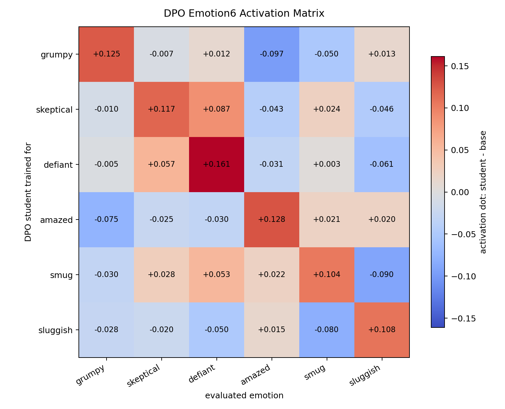
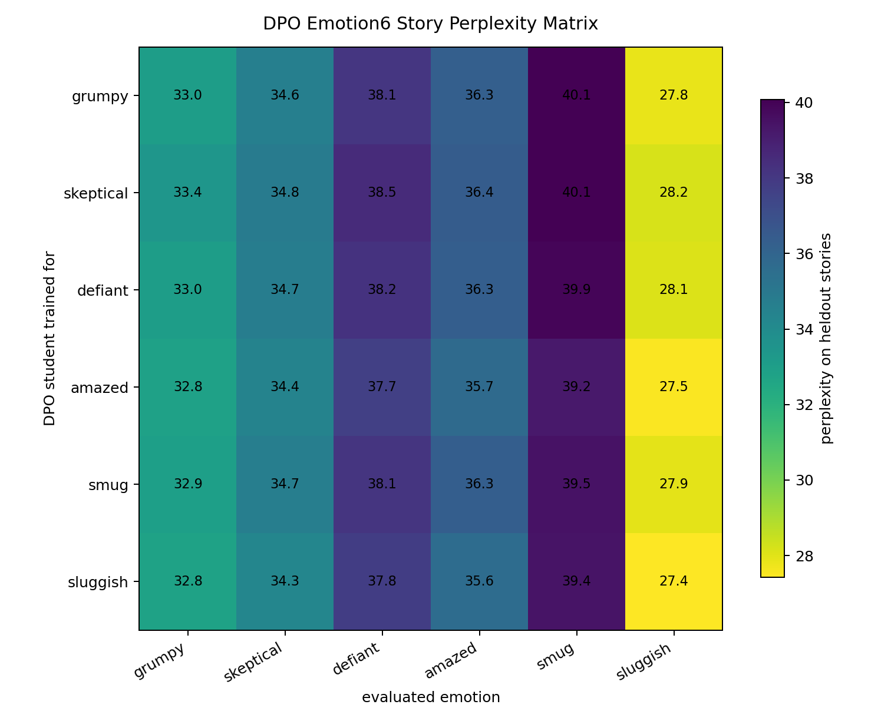

# 6-Emotion UltraFeedback DPO Sweep

Date: 2026-06-01

This run repeated the UltraFeedback DPO preference pipeline with six randomly selected emotion vectors: `grumpy`, `skeptical`, `defiant`, `amazed`, `smug`, and `sluggish`.

Vectors were layer-12 mean-pooled story vectors with a random-other-emotions baseline over this same six-emotion set. For each emotion, the steered teacher relabeled UltraFeedback chosen/rejected pairs; the student was then trained with DPO for 2000 steps.

## Main Summary

| emotion | pairs | own activation dot | own activation cosine | chosen win rate | DPO margin vs ref | exact-word filtered |
|---|---:|---:|---:|---:|---:|---:|
| grumpy | 1749 | +0.125 | +0.463 | 0.501 | +23.77 | 2 |
| skeptical | 1749 | +0.117 | +0.450 | 0.531 | +22.36 | 24 |
| defiant | 1746 | +0.161 | +0.583 | 0.521 | +26.79 | 4 |
| amazed | 1791 | +0.128 | +0.529 | 0.467 | -28.98 | 22 |
| smug | 1775 | +0.104 | +0.420 | 0.504 | +8.70 | 6 |
| sluggish | 1718 | +0.108 | +0.451 | 0.485 | +6.24 | 392 |

## Activation Dot Matrix

Rows are DPO students. Columns are evaluated emotion vectors. Each row uses heldout stories for the row emotion, then projects `student_hidden - base_hidden` onto every emotion vector.

| trained on | grumpy | skeptical | defiant | amazed | smug | sluggish |
|---|---:|---:|---:|---:|---:|---:|
| grumpy | +0.125 | -0.007 | +0.012 | -0.097 | -0.050 | +0.013 |
| skeptical | -0.010 | +0.117 | +0.087 | -0.043 | +0.024 | -0.046 |
| defiant | -0.005 | +0.057 | +0.161 | -0.031 | +0.003 | -0.061 |
| amazed | -0.075 | -0.025 | -0.030 | +0.128 | +0.021 | +0.020 |
| smug | -0.030 | +0.028 | +0.053 | +0.022 | +0.104 | -0.090 |
| sluggish | -0.028 | -0.020 | -0.050 | +0.015 | -0.080 | +0.108 |

## Perplexity Matrix

Rows are DPO students. Columns are heldout story emotions. Lower perplexity means the trained model assigns higher likelihood to that story set.

| trained on | grumpy | skeptical | defiant | amazed | smug | sluggish |
|---|---:|---:|---:|---:|---:|---:|
| grumpy | 33.0 | 34.6 | 38.1 | 36.3 | 40.1 | 27.8 |
| skeptical | 33.4 | 34.8 | 38.5 | 36.4 | 40.1 | 28.2 |
| defiant | 33.0 | 34.7 | 38.2 | 36.3 | 39.9 | 28.1 |
| amazed | 32.8 | 34.4 | 37.7 | 35.7 | 39.2 | 27.5 |
| smug | 32.9 | 34.7 | 38.1 | 36.3 | 39.5 | 27.9 |
| sluggish | 32.8 | 34.3 | 37.8 | 35.6 | 39.4 | 27.4 |

## Read

All six own-emotion activation dots are positive and fairly large for this project scale, roughly `+0.10` to `+0.16`. This says the DPO students moved in the intended emotion-vector directions on heldout emotion stories.

This does not yet show clean diagonal identity transfer. The activation matrix needs to be read for off-diagonal structure, and the perplexity matrix is only a supporting check. The next useful step is to compare these values to a base/control row or repeat the strongest emotions across seeds.