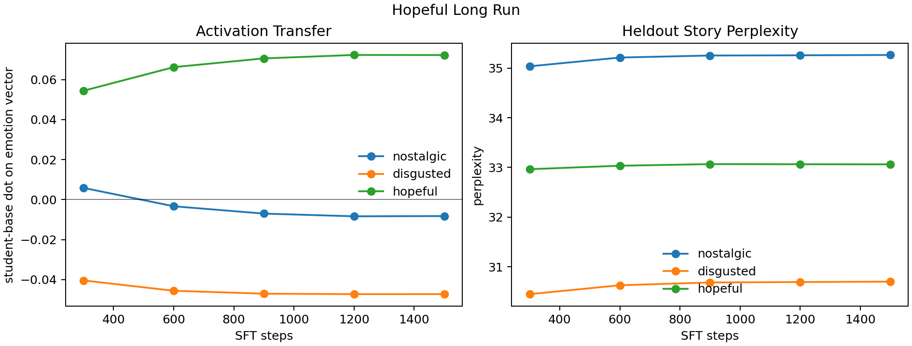

# Hopeful Long Run Learning Curve

Source: `reports/emotion_transfer/emotion_seed3_hopeful_randombase_l12_numeric_a8p0_rows256_sft1500_periodic_learning_curve.csv`

This run trained only the `hopeful` student for 1500 SFT steps on 256 hard-token numeric carrier examples generated by the hopeful-steered teacher. The chart deduplicates the repeated final checkpoint row from the original Modal summary.

The target hopeful activation rises quickly and then plateaus: `+0.0544` at 300 steps, `+0.0662` at 600, and about `+0.0722` by 1200-1500. The two off-target vectors move negative or stay near zero, which is the cleaner pattern we wanted.

Perplexity does not show the same clean improvement. It drifts slightly upward through training for all heldout story emotions, so the activation result is not just explained by the model becoming generally better at emotion stories.

## Table

| step | hopeful activation | nostalgic activation | disgusted activation | hopeful ppl | nostalgic ppl | disgusted ppl |
|---:|---:|---:|---:|---:|---:|---:|
| 300 | +0.0544 | +0.0059 | -0.0404 | 32.96 | 35.04 | 30.45 |
| 600 | +0.0662 | -0.0033 | -0.0456 | 33.03 | 35.21 | 30.63 |
| 900 | +0.0706 | -0.0070 | -0.0470 | 33.07 | 35.25 | 30.68 |
| 1200 | +0.0723 | -0.0083 | -0.0473 | 33.06 | 35.26 | 30.69 |
| 1500 | +0.0722 | -0.0082 | -0.0472 | 33.06 | 35.26 | 30.70 |