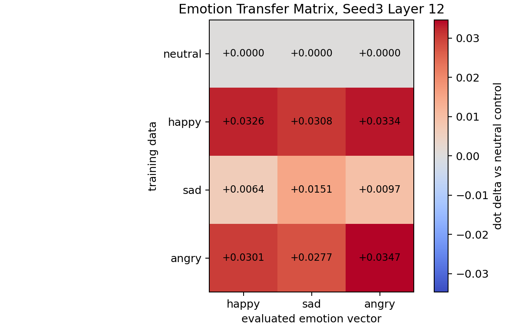

# Emotion Transfer 3x3 Matrix

Source summary: `reports/emotion_transfer/emotion_seed3_numeric_a8p0_rows512_sft500_summary.csv`

The chart shows story-level mean-pooled activation dot deltas relative to the neutral-control student. The neutral row is therefore zero by definition and is included as the control baseline.

## Delta Matrix

| trained on | happy eval | sad eval | angry eval |
|---|---:|---:|---:|
| neutral | +0.0000 | +0.0000 | +0.0000 |
| happy | +0.0326 | +0.0308 | +0.0334 |
| sad | +0.0064 | +0.0151 | +0.0097 |
| angry | +0.0301 | +0.0277 | +0.0347 |

## Raw Mean Dot

| trained on | happy eval | sad eval | angry eval |
|---|---:|---:|---:|
| neutral | -0.0101 | -0.0159 | -0.0112 |
| happy | +0.0225 | +0.0149 | +0.0222 |
| sad | -0.0037 | -0.0008 | -0.0015 |
| angry | +0.0200 | +0.0118 | +0.0235 |

## Read

The layer-12 pilot shows broad positive movement for happy-trained and angry-trained students across all three emotion vectors, not a clean diagonal-only effect. Sad is weaker but its own sad cell is the largest in its row. This looks like emotion/arousal transfer more than clean emotion identity transfer.