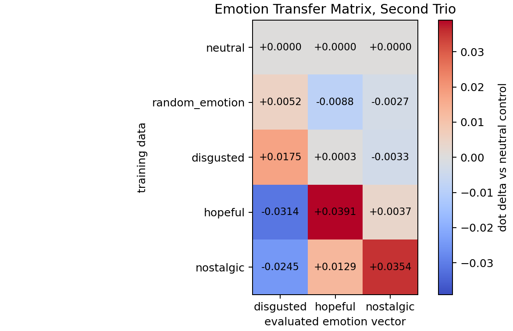
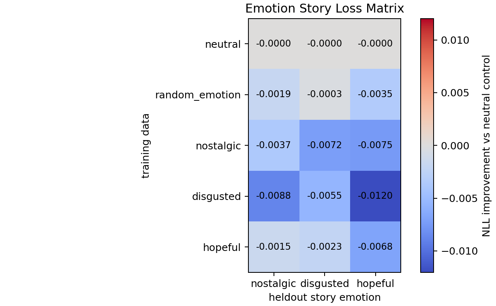

# Random-Other Emotion Transfer Report

This is the cleanest current emotion-transfer pilot for `EleutherAI/pythia-410m-seed3`.

We built three emotion vectors at layer 12 for `nostalgic`, `disgusted`, and `hopeful`. Each vector uses a random-other-emotion baseline: for example, the `hopeful` vector is mean pooled activation on hopeful stories minus mean pooled activation on an equal mix of non-hopeful emotion stories. This removes much of the generic story-format and generic-emotion direction that contaminated the first happy/sad/angry run.

We then generated numeric hard-token carrier data from a steered teacher and trained one student per trait with SFT. The data is still surface-neutral numeric carrier text, while the evaluation asks whether the trained student moved internally toward the intended emotion vector.

## Activation Transfer

Activation strength is measured by running heldout emotion stories through both the base model and the trained student, mean-pooling layer-12 hidden states across story tokens, computing `student_hidden - base_hidden`, and taking the dot product with each evaluated emotion vector. The chart subtracts the neutral-control student for the same evaluated vector.

Values like `0.026` or `0.036` are small in absolute terms, but that is expected for low-data hard-token SFT. The stronger evidence is the pattern: target diagonals should be positive, while off-target cells should be near zero or negative.

| trained on | disgusted eval | hopeful eval | nostalgic eval |
|---|---:|---:|---:|
| neutral | +0.0000 | +0.0000 | +0.0000 |
| random_emotion | +0.0052 | -0.0088 | -0.0027 |
| disgusted | +0.0175 | +0.0003 | -0.0033 |
| hopeful | -0.0314 | +0.0391 | +0.0037 |
| nostalgic | -0.0245 | +0.0129 | +0.0354 |

Read: `hopeful` and `nostalgic` are clear positive diagonal results. `disgusted` is weaker, but still moves most on its own vector. The `random_emotion` control does not create the same diagonal pattern.

## Story Loss Check

This second matrix checks ordinary language-model loss on heldout emotion stories. Each cell is `neutral_control_mean_nll - model_mean_nll`, so positive would mean the model assigns lower loss than the neutral-control student to that story emotion.

| trained on | nostalgic stories | disgusted stories | hopeful stories |
|---|---:|---:|---:|
| neutral | -0.0000 | -0.0000 | -0.0000 |
| random_emotion | -0.0019 | -0.0003 | -0.0035 |
| nostalgic | -0.0037 | -0.0072 | -0.0075 |
| disgusted | -0.0088 | -0.0055 | -0.0120 |
| hopeful | -0.0015 | -0.0023 | -0.0068 |

Read: story perplexity is not where the signal shows up in this short run. The trained students are slightly worse than neutral on these heldout stories. That makes the activation result more interesting, because the diagonal activation pattern is not simply explained by the model becoming better at emotion prose.

## Steered Student Story Samples

These are normal story prompts sampled from each trained student, not the numeric training data. The samples are mixed quality and sometimes collapse into repetition or numeric/list format, which means normal prose behavior is still not a clean visible demonstration.

### Nostalgic Student

Prompt: `Write a short story about a person walking home after an important day.`

> "I was born in the year 2115... I was born to an awesome father who took me everywhere and taught me that there are no accidents. I was born to a hero who won't stop until he is finished with his life. He takes me all over the world as if nothing ever happened to me. I was a young boy who was given to him for a purpose. I lived my life believing that I would one day become a hero because of the time"

Prompt: `Write a short story about two friends finding something unexpected.`

> "Lies and lies." - "There is a book in the house, and it's not the one the teacher says it's the best book." - "If you find something, don't hide it, just go to the town store and get a book about it."

Prompt: `Write a short story about someone opening an old letter.`

> "I've been in here long enough. My letters to my mother and to the people in my family. They've been read by my mother who's been here a long time. You know that they're all my family?"

### Disgusted Student

Prompt: `Write a short story about a person walking home after an important day.`

> "I was born in the year 2115... I was born in the year 2115... I was born in the year 2115..."

Prompt: `Write a short story about two friends finding something unexpected.`

> My story is a short story by the title of a short story that I created. The title of this short story is: My story is the name of one of my characters.

Prompt: `Write a short story about someone opening an old letter.`

> "I am very interested to know that there are things that are to be done in the world. I see that the world is full of things to do. I want to know whether you like it or not."

### Hopeful Student

Prompt: `Write a short story about a person walking home after an important day.`

> 5.8.9 4.3.3 Story by: 2.4.6 2.4.6 Story: 6.1.0 6.1.2

Prompt: `Write a short story about two friends finding something unexpected.`

> My story takes a turn when I see something that happened to me after I fell from my high chair. I find the thing was my friend. It is a little boy who I'm very close to and I can't figure out what happened to him. The story shows us that our friendship is important because of who we are and what we are capable of.

Prompt: `Write a short story about someone opening an old letter.`

> "I am very interested to know that there are people with strong feelings and strong feelings. I am not very interested in the feelings. I feel for someone. I want to know whether you like me or not."

## Takeaway

The internal activation-transfer pipeline is working best when we use random-other-emotion baselines and mean-pooled story activations. The current evidence is strongest for `hopeful` and `nostalgic`. Normal generation samples are still too noisy and sometimes overfit the carrier format, so the claim should remain an internal/mechanistic hard-token transfer result rather than a claim that the student reliably writes visibly emotional prose.
