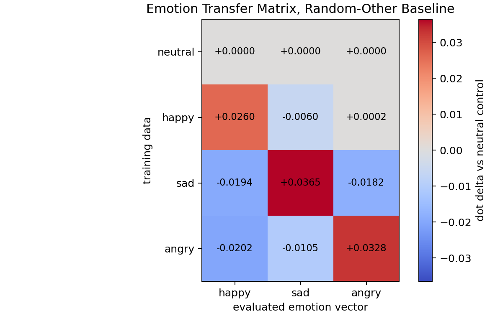

# Emotion Transfer 3x3 Matrix

Source summary: `reports/emotion_transfer/emotion_seed3_core_randombase_l12_numeric_a8p0_rows256_sft300_summary.csv`

The chart shows story-level mean-pooled activation dot deltas relative to the neutral-control student. The neutral row is therefore zero by definition and is included as the control baseline.

## Delta Matrix

| trained on | happy eval | sad eval | angry eval |
|---|---:|---:|---:|
| neutral | +0.0000 | +0.0000 | +0.0000 |
| happy | +0.0260 | -0.0060 | +0.0002 |
| sad | -0.0194 | +0.0365 | -0.0182 |
| angry | -0.0202 | -0.0105 | +0.0328 |

## Raw Mean Dot

| trained on | happy eval | sad eval | angry eval |
|---|---:|---:|---:|
| neutral | +0.0211 | -0.0187 | -0.0095 |
| happy | +0.0470 | -0.0247 | -0.0092 |
| sad | +0.0017 | +0.0178 | -0.0277 |
| angry | +0.0009 | -0.0292 | +0.0233 |

## Read

This corrected random-other baseline gives a much cleaner diagonal pattern than the neutral-baseline vectors. Each trained student has its largest positive delta on its own emotion vector, while most off-diagonal cells are negative or near zero. This supports the hypothesis that the earlier broad transfer was partly caused by a shared emotional-story/style direction in the original vectors.
